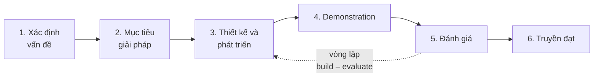
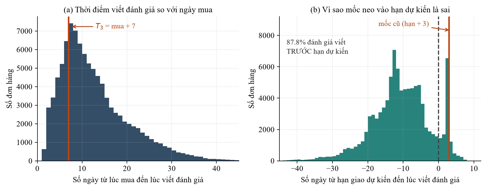
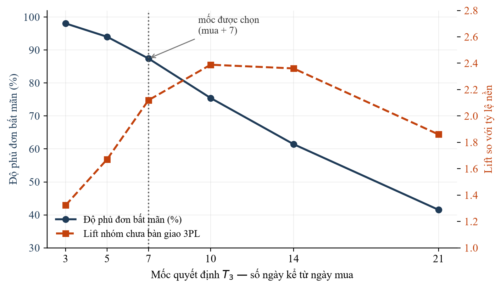
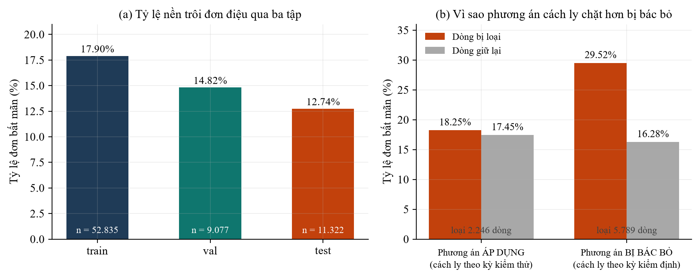
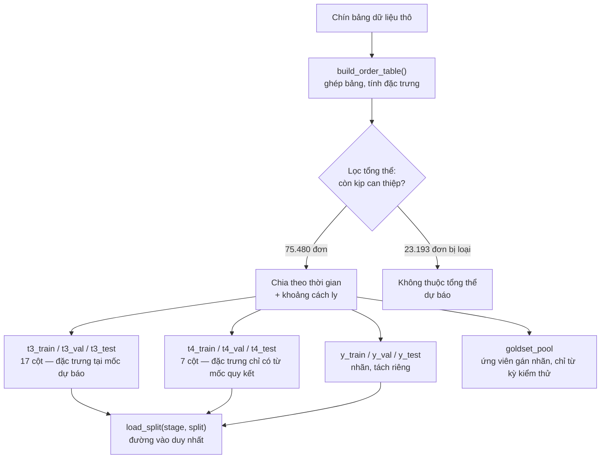
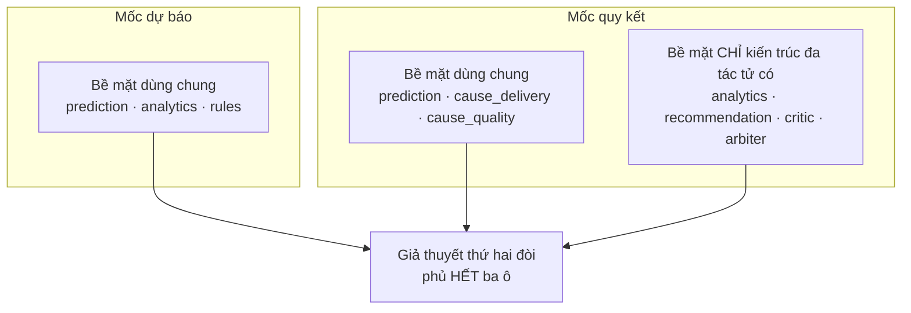

# CHƯƠNG 3 — PHƯƠNG PHÁP NGHIÊN CỨU

Chương này trình bày cách các nền tảng lý thuyết ở Chương 2 được chuyển thành một thiết kế nghiên cứu
cụ thể. Nội dung được tổ chức theo trình tự của một quyết định phương pháp: trước hết là quy trình
tổng thể và quy tắc phân biệt các loại mệnh đề, tiếp đến là những ràng buộc do dữ liệu áp đặt, rồi
mới tới các quyết định thiết kế mà những ràng buộc ấy cho phép, và cuối cùng là cách đo đạc cùng các
giả thuyết được khai báo trước khi tiến hành thí nghiệm.

---

## 3.1 Quy trình nghiên cứu

### 3.1.1 Áp dụng mô hình Design Science Research

Nghiên cứu tuân theo quy trình Design Science Research gồm sáu bước, từ xác định vấn đề tới truyền
đạt kết quả. Hình 3.1 mô tả quy trình cùng với vòng lặp giữa hai bước trung tâm, và Bảng 3.1 ánh xạ
từng bước sang hoạt động cụ thể trong luận văn.

**Hình 3.1.** Quy trình Design Science Research áp dụng trong luận văn. Đường nét đứt biểu diễn vòng
lặp xây dựng – đánh giá; nghiên cứu đã chạy vòng lặp này nhiều lần, và mỗi lần đều để lại dấu vết
trong nhật ký lỗi phương pháp.

**Bảng 3.1.** Ánh xạ sáu bước Design Science Research sang hoạt động và sản phẩm

| Bước | Hoạt động trong luận văn | Sản phẩm | Trình bày ở |
|---|---|---|---|
| 1. Xác định vấn đề | Khoảng trống: hành vi kiến trúc hỗ trợ quyết định dưới điều kiện lỗi chưa được đo | ba câu hỏi nghiên cứu | Chương 1, 2 |
| 2. Mục tiêu giải pháp | Ba mục tiêu cụ thể; khai báo trước ba giả thuyết | §3.7 | Chương 3 |
| 3. Thiết kế và phát triển | Ontology, kiến trúc, bốn nguyên lý thiết kế, prototype | A1, A2, A5 | Chương 4 |
| 4. Demonstration | Chạy trọn chu trình trên dữ liệu thật ở cả hai mốc quyết định | quyết định và nhật ký thông điệp | Chương 4, 5 |
| 5. Đánh giá | Chaos harness, so sánh bốn kiến trúc, bốn thí nghiệm ablation | A4, A6 | Chương 5 |
| 6. Truyền đạt | Luận văn; nhật ký lỗi phương pháp làm nguyên liệu phản tư | — | Chương 5, 6 |

### 3.1.2 Vòng lặp xây dựng – đánh giá và hệ quả của nó lên cách trình bày

Quy trình Design Science không tuyến tính: bước thiết kế và bước đánh giá tạo thành một vòng lặp, và
kết quả đánh giá thường buộc phải quay lại sửa thiết kế. Điều này có một hệ quả cần nêu rõ về mặt
trình bày, bởi nó ảnh hưởng tới cách đọc Chương 4.

**Thứ tự trong luận văn không phải thứ tự thời gian.** Bốn nguyên lý thiết kế ở Chương 4 được trình
bày ở dạng cuối cùng, nhưng nguyên lý thứ hai đã được sửa sau thực nghiệm — bản gốc bị bác bỏ và bản
sửa mạnh hơn. Lịch sử sửa đổi được ghi lại nguyên vẹn thay vì xóa đi, bởi trong Design Science, quá
trình tinh chỉnh nguyên lý theo bằng chứng chính là một phần của đóng góp chứ không phải một khiếm
khuyết cần che giấu.

### 3.1.3 Ranh giới giữa mệnh đề được phép sửa và mệnh đề không được phép sửa

Kỷ luật khai báo trước, đã bàn về mặt lý thuyết ở [§2.6.5](ch2-co-so-ly-thuyet.md), được cụ thể hóa
trong luận văn thành một quy tắc ba tầng áp dụng nhất quán từ đầu tới cuối. Quy tắc này phân biệt ba
loại mệnh đề theo cách chúng được kiểm chứng, và từ đó suy ra chúng có được phép sửa sau khi biết kết
quả hay không.

**Ràng buộc dữ liệu** được kiểm chứng bằng cách đọc lược đồ dữ liệu, không cần thí nghiệm. Nó là một
sự thật về dữ liệu, nên nó **được phép sửa** khi hiểu biết về dữ liệu thay đổi. Trong nghiên cứu này,
một ràng buộc đã được viết lại và một ràng buộc được bổ sung.

**Giả thuyết** được kiểm chứng bằng thí nghiệm, phải chứa bất định thật và phải có mốc phán quyết rõ.
Nó **không được phép sửa** sau khi thấy kết quả; ba giả thuyết của luận văn giữ nguyên văn, chỉ được
ghi thêm phán quyết.

**Nguyên lý thiết kế** được kiểm chứng bằng thí nghiệm ablation, và nó **được phép sửa** — bởi nó là
sản phẩm của nghiên cứu chứ không phải một dự đoán khai báo trước.

Quy tắc này không phải trang trí phương pháp luận. Nó đã được sử dụng để loại bỏ hai mệnh đề khỏi bộ
giả thuyết chính thức vì chúng không thỏa điều kiện *có mốc phán quyết rõ*, và chi tiết của việc loại
bỏ ấy được trình bày ở §3.7.4.

---

## 3.2 Dữ liệu và những ràng buộc mà nó áp đặt

### 3.2.1 Bộ dữ liệu

Nghiên cứu sử dụng bộ dữ liệu công khai *Brazilian E-Commerce Public Dataset by Olist*, gồm chín bảng
quan hệ mô tả các đơn hàng thương mại điện tử tại Brazil trong giai đoạn 2016 đến 2018. Bảng 3.2 liệt
kê các bảng dữ liệu và nội dung chính của chúng.

**Bảng 3.2.** Chín bảng của bộ dữ liệu và nội dung chính

| Bảng | Nội dung chính |
|---|---|
| `orders` | trạng thái đơn và bốn mốc thời gian: mua, bàn giao đơn vị vận chuyển, giao tới khách, hạn dự kiến |
| `order_reviews` | điểm từ một tới năm sao, tiêu đề, nội dung, thời điểm viết và thời điểm được trả lời |
| `order_items` | dòng hàng, giá, phí vận chuyển, hạn bàn giao mà người bán cam kết |
| `products` và bảng dịch nhóm hàng | thuộc tính sản phẩm và nhóm hàng |
| `sellers`, `customers`, `geolocation` | định danh và vị trí theo mã bưu chính |
| `order_payments` | phương thức thanh toán, số kỳ trả góp, giá trị |

Điểm đáng chú ý nhất trong Bảng 3.2 là bảng đầu tiên: nó chứa **bốn mốc thời gian** cho mỗi đơn hàng.
Chính sự tồn tại của bốn mốc này — và sự thiếu vắng mọi mốc thời gian khác — là thứ quyết định toàn bộ
thiết kế của nghiên cứu, như sẽ thấy ở §3.2.3 và §3.3.

### 3.2.2 Thống kê mô tả nền

Đơn vị phân tích của luận văn là **case đơn hàng**, không phải dòng đánh giá thô. Trong dữ liệu có 551
đơn mang nhiều hơn một bản ghi đánh giá; sau khi khử trùng lặp bằng cách giữ bản ghi sớm nhất theo một
quy tắc tất định, tổng thể còn 98.673 case. Bảng 3.3 trình bày thống kê mô tả theo cả hai đơn vị đếm
để tiện đối chiếu, trong đó cột case đơn hàng là cột được sử dụng trong toàn bộ luận văn.

**Bảng 3.3.** Thống kê mô tả nền theo hai đơn vị đếm

| Chỉ tiêu | Dòng thô | Case đơn hàng | Ngưỡng cảnh báo đặt trước |
|---|---|---|---|
| Tổng số đánh giá | 99.224 | **98.673** | — |
| Đánh giá bất mãn, từ một tới hai sao | 14.575 — 14,69% | **14.475 — 14,67%** | — |
| Có nội dung bình luận | 10.889 — 74,71% | **10.823 — 74,77%** | — |
| Không có nội dung bình luận | 3.686 — 25,29% | **3.652 — 25,23%** | trên 40% đáng lo; trên 50% phải xét lại phạm vi |

Cột cuối cùng của Bảng 3.3 ghi lại một ngưỡng cảnh báo được **đặt trước khi đo**. Rủi ro được lường
trước là nếu quá nhiều đơn hàng không có bình luận, thì tầng phân tích văn bản sẽ mất đối tượng và câu
hỏi về quy kết nguyên nhân phải thu hẹp phạm vi. Tỷ lệ đo được là 25,23%, nằm dưới ngưỡng, nên rủi ro
ấy được đóng lại. Việc đặt ngưỡng trước khi đo là một thực hành nhỏ nhưng có ý nghĩa: nếu ngưỡng được
đặt sau, nó sẽ luôn được chọn sao cho kết quả đạt yêu cầu.

### 3.2.3 Năm ràng buộc dữ liệu

Năm ràng buộc dưới đây tạo thành **biên của nghiên cứu**. Chúng được trình bày lần lượt, mỗi ràng buộc
kèm theo bằng chứng và hệ quả của nó, bởi mỗi ràng buộc đã loại bỏ hoặc định hình một phần đáng kể của
thiết kế nghiên cứu.

#### Ràng buộc thứ nhất — bộ dữ liệu không có biến treatment

Không trường dữ liệu nào ghi nhận hành động đã được áp dụng cho một đơn hàng, và không tồn tại kết quả
phản thực, tức thông tin về điều gì đã xảy ra nếu áp dụng một hành động khác.

Hệ quả là không mục tiêu hay câu hỏi nào được phép hỏi *hành động can thiệp có hiệu quả hay không*.
Nghiên cứu đánh giá **chất lượng khuyến nghị** — hệ thống có đề xuất đúng loại hành động cho đúng
nguyên nhân hay không — chứ không đánh giá **hiệu quả can thiệp**. Đây là ràng buộc chặt nhất trong
năm ràng buộc, và nó loại bỏ toàn bộ nhánh nghiên cứu về tối ưu hóa chính sách can thiệp, vốn là hướng
đi tự nhiên và hấp dẫn cho một bài toán như thế này.

#### Ràng buộc thứ hai — nhãn nguyên nhân không tồn tại sẵn trong dữ liệu

Dữ liệu có điểm đánh giá và có văn bản bình luận, nhưng không có trường nào cho biết nguyên nhân của
sự bất mãn.

Hệ quả là mọi câu hỏi về quy kết nguyên nhân **bắt buộc** phải đo trên một bộ nhãn chuẩn do con người
gán. Nhãn sinh bằng luật từ khóa chỉ được coi là tín hiệu huấn luyện có nhiễu, và không bao giờ được
dùng làm thước đo; nếu dùng, phép đo sẽ chỉ cho biết mô hình học thuộc luật từ khóa tới mức nào, chứ
không cho biết nó quy kết nguyên nhân đúng tới đâu.

Ràng buộc này được cưỡng chế trong hiện thực bằng **kiểu dữ liệu** chứ không bằng quy ước. Mỗi bộ nhãn
mang một thuộc tính nguồn gốc phân biệt nhãn do người gán độc lập với nhãn do công cụ sinh, và từ
thuộc tính ấy suy ra một cờ quyết định số liệu sinh từ bộ nhãn đó có được trích vào luận văn hay
không. Việc chuyển một quy ước thành một ràng buộc kiểu dữ liệu là cách duy nhất bảo đảm nó không bị
vi phạm do quên.

#### Ràng buộc thứ ba — kết cục giao hàng không dùng được để dự báo

Đặc trưng có sức phân biệt mạnh nhất trong bài toán này là độ trễ giao hàng thực tế và việc đơn hàng
có được giao hay không. Cả hai chỉ xác định được **sau khi** hàng đã tới. Vấn đề nằm ở chỗ khách hàng
không đợi tới lúc đó mới viết đánh giá: khoảng cách trung vị giữa thời điểm giao hàng và thời điểm
viết đánh giá là **6,2 giờ**, và **87,8%** số đánh giá được viết **trước** hạn giao dự kiến.

Hệ quả là mốc quyết định phải neo vào **ngày mua**, không neo vào sự kiện giao hàng. Tín hiệu mạnh
nhất khả dụng tại thời điểm ra quyết định là **tiến độ vận chuyển** — hàng đã rời kho người bán chưa,
còn bao nhiêu ngày tới hạn cam kết — chứ không phải kết cục giao hàng.

Phát biểu ban đầu của ràng buộc này là *"đặc trưng có sức phân biệt cao nhất chỉ xuất hiện sau khi
giao hàng"*. Phát biểu ấy đúng nhưng chưa đủ, bởi nó ngầm cho phép sử dụng kết cục giao hàng làm đặc
trưng dự báo miễn là chấp nhận đợi đủ lâu. Phát biểu sửa lại đóng khoảng hở đó.

#### Ràng buộc thứ tư — bằng chứng văn bản xuất hiện cùng lúc với nhãn

Nội dung bình luận được khách hàng viết cùng thời điểm với điểm đánh giá. Không tồn tại thời điểm nào
mà văn bản đã có trong khi điểm số thì chưa.

Hệ quả là chuỗi xử lý **bắt buộc** phải tách làm hai mốc quyết định: một mốc chỉ có đặc trưng dạng
bảng, và một mốc có thêm văn bản. Kèm theo đó, một đặc trưng dạng *"đơn hàng này có bình luận hay
không"* bị cấm vĩnh viễn ở giai đoạn dự báo, vì hai lý do cộng hưởng: nó chưa tồn tại tại thời điểm
đó, và nó tương quan mạnh với nhãn.

#### Ràng buộc thứ năm — không tồn tại quan sát nào về chất lượng trước khi đánh giá được viết

Toàn bộ trường thời gian trong chín bảng dữ liệu chỉ gồm sáu mốc: mua, bàn giao đơn vị vận chuyển,
giao tới khách, hạn dự kiến, viết đánh giá, và trả lời đánh giá. Không có bảng phiếu hỗ trợ, không có
bản ghi đổi trả, không có lịch sử liên hệ giữa khách hàng và người bán.

Hệ quả là việc quy kết nguyên nhân về **chất lượng sản phẩm** và **chất lượng phục vụ** là bất khả thi
ở mọi mốc trước khi đánh giá được viết — không phải vì mô hình yếu, mà vì **không có gì để quan sát**.
Chất lượng sản phẩm bộc lộ khi khách hàng mở hộp; chất lượng phục vụ bộc lộ khi khách hàng liên hệ với
người bán; và không sự kiện nào trong hai sự kiện đó được ghi lại trong dữ liệu.

Ràng buộc này giữ một vai trò khác với bốn ràng buộc trước. Bốn ràng buộc đầu **loại bỏ** các hướng
nghiên cứu; ràng buộc thứ năm **biện minh cho một quyết định thiết kế**. Cụ thể, nó khiến kiến trúc
hai mốc quyết định trở thành hệ quả bắt buộc của cấu trúc dữ liệu chứ không phải một lựa chọn tiện
lợi. Đáng chú ý là ràng buộc này được bổ sung muộn, và nó chỉ lộ ra khi nghiên cứu đặt câu hỏi *vì sao
chỉ có nguyên nhân giao hàng là dự báo được* rồi quay lại tra cứu lược đồ dữ liệu, thay vì tiếp tục
tinh chỉnh mô hình như phản xạ thông thường.

---

## 3.3 Hai mốc quyết định

### 3.3.1 Định nghĩa và phân công nhiệm vụ

Từ ràng buộc thứ tư và thứ năm, chuỗi xử lý được tách thành hai giai đoạn với hai mốc quyết định phân
biệt. Bảng 3.4 so sánh hai mốc theo bốn khía cạnh.

**Bảng 3.4.** Hai mốc quyết định và phân công nhiệm vụ

| Khía cạnh | Giai đoạn 1 — mốc dự báo | Giai đoạn 2 — mốc quy kết |
|---|---|---|
| Định nghĩa | **ngày mua cộng bảy ngày** | khi đánh giá một hoặc hai sao đã về |
| Nhiệm vụ | dự báo rủi ro bất mãn | quy kết nguyên nhân |
| Bằng chứng khả dụng | chỉ đặc trưng dạng bảng: tiến độ vận chuyển, giá và phí, người bán, nhóm hàng | toàn bộ đặc trưng dạng bảng, cộng văn bản với 74,77% số đơn |
| Hành động tương ứng | phục hồi dịch vụ **chủ động** | phân loại khiếu nại và phục hồi **phản ứng** |

### 3.3.2 Một mốc quyết định ràng buộc hai thứ, không phải một

Đây là điểm phương pháp quan trọng nhất của chương, và nó đáng được nhấn mạnh bởi nghiên cứu đã bỏ sót
nó **hai lần liên tiếp**.

Một mốc quyết định ràng buộc hai thứ khác nhau. Thứ nhất, nó xác định **đặc trưng nào tồn tại** tại
thời điểm đó. Thứ hai, nó xác định **đơn hàng nào đã tới được mốc đó** — tức đơn hàng nào còn thuộc
tổng thể mà hệ thống được phép ra quyết định.

Vế thứ nhất được cưỡng chế bằng một sổ đăng ký đặc trưng: mỗi đặc trưng khai báo mốc sớm nhất mà nó
tồn tại, và một bộ lọc theo mốc chỉ trả về những đặc trưng hợp lệ. Cơ chế này hoạt động đúng ngay từ
đầu.

Vế thứ hai ban đầu **không được cưỡng chế bởi bất kỳ cơ chế nào**, và hậu quả là hai lỗi liên tiếp,
cả hai đều thuộc loại lỗi im lặng — không ngoại lệ, không cảnh báo, chỉ là một con số đẹp hơn thực tế.

Lỗi thứ nhất là việc hiểu mốc dự báo như một **sự kiện** — *"sau khi giao xong"* — thay vì như một
**mốc thời gian**. Định nghĩa theo sự kiện khiến 2.841 đơn hàng chưa bao giờ được giao không có mốc
nào cả, và đó chính là nhóm có tỷ lệ bất mãn cao nhất, tới 77,9%. Khi nhóm này được đưa vào tập huấn
luyện với giá trị thiếu ở cột ngày giao, mô hình học được quy luật *"thiếu ngày giao nghĩa là rủi ro
cao"* — một quy luật đúng trên dữ liệu lịch sử nhưng không tồn tại tại thời điểm triển khai. Chỉ số
PR-AUC giảm từ 0,3993 xuống 0,2883 khi loại bỏ nhóm này, và mức chênh lệch ấy chính là phần mà mô hình
đã học được từ một mẫu hình giả.

Lỗi thứ hai tinh vi hơn và chỉ lộ ra sau khi lỗi thứ nhất đã được sửa. Bản sửa neo mốc quyết định vào
**hạn giao dự kiến cộng ba ngày**, một lựa chọn nghe hợp lý về mặt nghiệp vụ: đợi quá hạn ba ngày rồi
mới kết luận đơn hàng có vấn đề. Điều không ai đối chiếu là mốc ấy so với thời điểm khách hàng thực sự
viết đánh giá. Hình 3.2 cho thấy vấn đề.

**Hình 3.2.** Phân bố thời điểm khách hàng viết đánh giá. Bảng (a) tính theo số ngày kể từ lúc mua,
với vạch đỏ là mốc dự báo được chọn. Bảng (b) tính theo số ngày so với hạn giao dự kiến; vạch đứt là
hạn dự kiến và vạch đỏ là mốc cũ. Phần lớn khối lượng phân bố ở bảng (b) nằm **bên trái** vạch đỏ,
nghĩa là đánh giá đã được viết xong trước khi mốc cũ tới.

Với **97,6%** số đơn hàng, mốc cũ rơi vào thời điểm **sau** khi khách hàng đã viết đánh giá. Nói cách
khác, cái gọi là *dự báo* thực chất chạy sau chính kết cục mà nó dự báo. Con số PR-AUC đo được trên
cấu hình ấy không đo năng lực dự báo; nó đo khả năng đọc lại một kết cục đã có.

Bài học tổng quát rút ra từ hai lỗi này là một bất biến phải được cài vào hệ thống: **mốc quyết định
phải được đối chiếu trực tiếp với thời điểm của biến kết cục**, chứ không được biện minh bằng một lập
luận nghiệp vụ nghe hợp lý.

### 3.3.3 Lựa chọn mốc: đánh đổi giữa độ phủ và cường độ tín hiệu

Việc chọn số ngày cho mốc dự báo là một bài toán đánh đổi, và cả hai phía của phép đánh đổi đều đo
được. Đẩy mốc ra xa hơn thì có thêm thông tin về tiến độ vận chuyển, nên tín hiệu mạnh lên; nhưng đồng
thời càng nhiều khách hàng đã kịp viết đánh giá, nên số đơn còn can thiệp được giảm đi. Hình 3.3 trình
bày hai đại lượng này trên toàn dải, và Bảng 3.5 cho số liệu chi tiết.

**Hình 3.3.** Đánh đổi giữa độ phủ đơn bất mãn (trục trái) và cường độ tín hiệu đo bằng hệ số lift
của nhóm chưa bàn giao đơn vị vận chuyển (trục phải), theo mốc quyết định. Hai đường đi ngược chiều
nhau trong khoảng từ ba tới mười ngày.

**Bảng 3.5.** Số liệu đánh đổi theo mốc quyết định

| Mốc | Tổng thể | Độ phủ đơn bất mãn | Tỷ lệ nền | Lift nhóm chưa bàn giao |
|---|---|---|---|---|
| mua + 3 | 95.087 | 98,1% | 14,93% | 1,32 |
| mua + 5 | 87.166 | 94,0% | 15,61% | 1,67 |
| **mua + 7** | **75.480** | **87,4%** | **16,77%** | **2,12** |
| mua + 10 | 54.717 | 75,4% | 19,96% | **2,39** |
| mua + 14 | 34.163 | 61,5% | 26,04% | 2,36 |
| mua + 21 | 14.576 | 41,5% | 41,25% | 1,86 |

Cần nói rõ một điều mà Bảng 3.5 làm lộ ra: **mốc bảy ngày không phải mốc cho tín hiệu mạnh nhất**. Hệ
số lift còn tiếp tục tăng tới mốc mười ngày, đạt 2,39, rồi mới giảm. Nếu mục tiêu duy nhất là tối đa
hóa cường độ tín hiệu thì mốc mười ngày là lựa chọn đúng.

Mốc bảy ngày được chọn vì nó là mốc **cân bằng**. Đẩy sang mười ngày mua thêm 0,27 đơn vị lift nhưng
đánh mất mười hai điểm phần trăm độ phủ, tương đương khoảng 1.700 đơn hàng bất mãn không còn kịp can
thiệp. Với một hệ thống có mục tiêu là phục hồi dịch vụ, số đơn hàng tiếp cận được là đại lượng mang ý
nghĩa nghiệp vụ trực tiếp; một thứ hạng tốt hơn trên một tổng thể đã bị thu hẹp không bù lại được phần
đã mất. Mốc mười ngày được giữ lại như một phân tích độ nhạy, thực hiện bằng một lần thay đổi tham số
cấu hình.

Việc trình bày cả dải thay vì chỉ trình bày mốc được chọn là có chủ đích. Một bản trước của luận văn
biện minh cho mốc bảy ngày bằng phát biểu *"đây là mức tối ưu đo được, lift đạt đỉnh"*, và phát biểu
ấy sai theo cả hai vế khi đo lại trên toàn dải. Sai lầm đó được phân tích ở [§5.6](ch5-ket-qua-ban-luan.md).

### 3.3.4 Kiểm duyệt bên phải

Tại mốc dự báo, một tỷ lệ đáng kể đơn hàng chưa được giao. Cách xử lý đúng về mặt thống kê là **kiểm
duyệt bên phải**: chỉ ghi nhận những gì đã xảy ra tính đến mốc, và nói rõ trạng thái bằng một cột
riêng thay vì để giá trị thiếu.

Lý do phải dùng một cột trạng thái thay vì để trống là để mô hình không học được quy luật *"thiếu dữ
liệu nghĩa là xấu"* — một quy luật đúng trên dữ liệu lịch sử nhưng không tồn tại tại thời điểm triển
khai, đúng như đã xảy ra ở lỗi thứ nhất mô tả tại §3.3.2. Bảng 3.6 liệt kê bốn đặc trưng được thiết kế
theo nguyên tắc này.

**Bảng 3.6.** Bốn đặc trưng kiểm duyệt tại mốc dự báo

| Đặc trưng | Ý nghĩa |
|---|---|
| Trạng thái giao hàng | ba mức: đã giao trong bảy ngày; đã rời kho người bán nhưng chưa tới khách; chưa bàn giao đơn vị vận chuyển |
| Độ trễ quan sát được | độ trễ so với hạn dự kiến tính đến mốc; nếu chưa giao thì là khoảng cách từ hạn dự kiến tới mốc |
| Số ngày tới lúc bàn giao | thời gian từ lúc mua tới lúc bàn giao đơn vị vận chuyển, kiểm duyệt tại mốc |
| Thời gian còn lại đến hạn | số ngày còn lại tới hạn cam kết, tính tại mốc; giá trị âm nghĩa là đã quá hạn ngay lúc ra quyết định |

Ba đặc trưng kết cục — tổng thời gian giao hàng, độ trễ thực tế, và việc có trễ hẹn hay không — được
chuyển sang mốc thứ hai, nơi chúng hợp lệ cho nhiệm vụ quy kết nguyên nhân.

---

## 3.4 Thiết kế hệ phân loại nguyên nhân

### 3.4.1 Ba nguyên nhân và một nhãn không xác định

Hệ phân loại gồm ba nguyên nhân và một nhãn dự phòng. Nguyên nhân **giao hàng** bao gồm các sự cố
thuộc chuỗi vận chuyển: hàng chậm, thất lạc, khách phải tự đi lấy, hoặc phí vận chuyển không tương
xứng với dịch vụ thực nhận. Nguyên nhân **chất lượng sản phẩm** bao gồm sản phẩm không đúng mô tả, bị
hỏng, thiếu, hoặc không tương xứng với số tiền đã trả. Nguyên nhân **chất lượng phục vụ** bao gồm việc
người bán không phản hồi, xử lý yêu cầu kém, hoặc hứa mà không thực hiện. Nhãn **không xác định** dành
cho trường hợp bằng chứng không đủ để quy kết.

Đầu ra là **đa nhãn**: một đơn hàng có thể mang đồng thời nhiều nguyên nhân, và việc giữ đa nhãn thay
vì buộc chọn một nhãn là nội dung của nguyên lý thiết kế thứ hai, trình bày ở
[§4.5.2](ch4-thiet-ke-hien-thuc.md).

### 3.4.2 Vì sao nhãn về giá bị gỡ bỏ

Một nhãn thứ tư, về **giá**, tồn tại trong các bản thiết kế trước và đã bị gỡ bỏ. Quá trình đi tới
quyết định này đáng được trình bày chi tiết, bởi nó minh họa một điểm phương pháp: một lý do sai vẫn
có thể dẫn tới một hành động đúng, và khi đó hành động đúng không mang lại tri thức gì.

Lý do dễ thấy nhất để gỡ nhãn ấy là nó hiếm — chỉ có mười hai mẫu dương trên 250 dòng đã gán nhãn, và
tính toán cỡ mẫu cho thấy cần khoảng 896 dòng mới ước lượng được độ nhạy của nó với sai số chấp nhận
được. Nếu dừng ở lý do này, kết luận sẽ là *"nhãn quá hiếm nên tạm bỏ, sẽ xem lại khi có thêm dữ
liệu"*.

Lý do đúng nằm ở **logic của giao dịch**. Khách hàng đã xác nhận mua hàng, tức đã đồng ý với giá niêm
yết và phí vận chuyển hiển thị tại thời điểm thanh toán. Một lời phàn nàn *sau khi mua* vì vậy về
nguyên tắc không thể là về giá; nó luôn là về một cơ chế khác đã hỏng.

Lập luận này được kiểm chứng bằng cách đọc lại toàn bộ mười hai dòng. Kết quả cho thấy mười dòng thực
ra phàn nàn về **phí vận chuyển** — cụ thể là đã trả tiền vận chuyển nhưng vẫn phải tự ra bưu điện lấy
hàng — và hai dòng còn lại phàn nàn về **giá trị sản phẩm**, tức chất lượng không xứng với số tiền.
Không dòng nào phàn nàn về giá theo nghĩa đen.

Từ kiểm chứng ấy, một quy tắc định tuyến được chốt: phàn nàn về phí vận chuyển, kể cả yêu cầu hoàn phí
chung chung, thuộc nhóm giao hàng; phàn nàn dạng *"không đáng tiền"* hay *"chất lượng không tương
xứng"* thuộc nhóm chất lượng sản phẩm; còn yêu cầu hoàn phí không được phản hồi thuộc nhóm chất lượng
phục vụ. Quy tắc này là sản phẩm mà lý do *"nhãn quá hiếm"* không thể sinh ra.

---

## 3.5 Chia tập dữ liệu và ngăn rò rỉ

### 3.5.1 Chia theo thời gian thay vì chia ngẫu nhiên

Các đặc trưng thống kê theo người bán và theo nhóm hàng được học từ tập huấn luyện. Nếu chia ngẫu
nhiên, một đơn hàng tháng ba năm 2018 có thể nằm trong tập huấn luyện trong khi một đơn hàng tháng một
cùng năm nằm trong tập kiểm thử, và mô hình sẽ biết trước tương lai. Chia theo thời gian mô phỏng đúng
tình huống triển khai thực tế: học từ quá khứ, dự báo cho tương lai.

Nghiên cứu sử dụng ba tập chứ không phải hai. Tập huấn luyện dùng để huấn luyện mô hình và học thống
kê theo người bán; tập kiểm định dùng để **hiệu chuẩn** xác suất và chọn ngưỡng; tập kiểm thử chỉ dùng
để chấm điểm và không bao giờ được nhìn trong quá trình phát triển. Tập kiểm định riêng là bắt buộc
bởi nếu hiệu chuẩn trên tập kiểm thử thì kết quả sẽ lạc quan giả.

### 3.5.2 Số liệu chia tập và hiện tượng trôi tỷ lệ nền

Tổng thể tại mốc dự báo, tức những đơn hàng còn kịp can thiệp, gồm **75.480 đơn**, chiếm 76,5% của
98.673 đơn có đánh giá. Bảng 3.7 trình bày kết quả chia tập, và Hình 3.4 minh họa hai hiện tượng đáng
chú ý.

**Bảng 3.7.** Kết quả chia tập theo thời gian

| Tập | Số đơn | Ngày mua từ | Đến | Tỷ lệ bất mãn |
|---|---|---|---|---|
| Huấn luyện | 52.835 | 2016-09-04 | 2018-03-22 | **17,90%** |
| Kiểm định | 9.077 | 2018-03-22 | 2018-05-23 | **14,82%** |
| Kiểm thử | 11.322 | 2018-05-31 | 2018-08-23 | **12,74%** |

**Hình 3.4.** Bảng (a) cho thấy tỷ lệ đơn bất mãn giảm đơn điệu qua ba tập chia theo thời gian. Bảng
(b) so sánh tỷ lệ bất mãn của những dòng bị khoảng cách ly loại bỏ với những dòng được giữ lại.

Hiện tượng thứ nhất, thể hiện ở bảng (a) của Hình 3.4, là **tỷ lệ nền trôi đơn điệu giảm** qua ba giai
đoạn, từ 17,90% xuống 14,82% rồi 12,74%. Đây là dịch chuyển phân phối thật theo thời gian, không phải
hiện tượng do cách chia tập tạo ra. Nó có hai hệ quả cho luận văn: nó giải thích phần lớn khó khăn về
hiệu chuẩn xác suất được bàn ở [§5.3](ch5-ket-qua-ban-luan.md), và nó cung cấp cho bộ giám sát dịch
chuyển phân phối một nhiệm vụ có thật thay vì một nhiệm vụ nhân tạo.

### 3.5.3 Khoảng cách ly và một hệ quả không trung tính

Nhãn của một đơn hàng chỉ tồn tại vào lúc khách hàng viết đánh giá, tức muộn hơn lúc mua. Một đơn hàng
mua vào cuối kỳ huấn luyện nhưng có đánh giá đến vào giữa kỳ kiểm thử sẽ đưa thông tin của kỳ kiểm thử
vào quá trình huấn luyện.

Mô phỏng triển khai đúng đắn là: mô hình chấm điểm kỳ kiểm thử được coi như đã huấn luyện tại thời
điểm bắt đầu kỳ ấy, với mọi nhãn đã biết tính tới lúc đó. Điều kiện này áp cho cả tập huấn luyện lẫn
tập kiểm định, và kết quả là loại bỏ **một dòng** khỏi tập huấn luyện cùng **2.245 dòng** khỏi tập
kiểm định.

Một hệ quả của khoảng cách ly cần được nói rõ thay vì để lặng lẽ: những dòng bị loại **không phải là
mẫu ngẫu nhiên**. Người viết đánh giá muộn có tỷ lệ bất mãn cao hơn mức trung bình, nên mọi phương án
cách ly đều làm dịch chuyển tỷ lệ nền của tập huấn luyện ít nhiều. Câu hỏi thiết kế vì vậy không phải
*có nên cách ly hay không* mà là *cách ly tới mức nào*.

Bảng (b) của Hình 3.4 đặt hai phương án cạnh nhau và cho thấy vì sao câu hỏi ấy quan trọng. Với phương
án **được áp dụng**, 2.246 dòng bị loại có tỷ lệ bất mãn 18,25% so với 17,45% ở phần giữ lại — một
chênh lệch nhỏ, gần như không làm lệch phân phối. Với phương án **chặt hơn**, trong đó tập huấn luyện
được cách ly theo thời điểm bắt đầu kỳ kiểm định thay vì kỳ kiểm thử, 5.789 dòng bị loại có tỷ lệ bất
mãn **29,52%** so với **16,28%** ở phần giữ lại — tức nó cắt bỏ đúng nhóm khó nhất, và làm tỷ lệ nền
của tập huấn luyện lệch đáng kể.

Phương án chặt hơn bị bác bỏ, bởi cái giá vừa nêu **không mua được gì**. Một dòng huấn luyện có đánh
giá đến trong kỳ kiểm định không chứa thông tin nào về kỳ kiểm thử, mà kỳ kiểm thử mới là nơi mọi con
số công bố được đo. Cả bốn tỷ lệ trong Hình 3.4(b) được tính lại trực tiếp từ dữ liệu và hai tỷ lệ của
phương án được áp dụng còn được ghi vào tệp kê khai, để người đọc có thể tự đánh giá quyết định này
thay vì phải tin vào lập luận.

### 3.5.4 Tách dữ liệu thành tệp vật lý

Hai lỗi mô tả ở §3.3.2 có chung một nguyên nhân cấu trúc: ràng buộc được cưỡng chế **lúc chạy** chứ
không được cưỡng chế bởi chính hình dạng của dữ liệu. Cụ thể, một hàm dựng bảng sinh ra một bảng rộng
chứa mọi cột, và một bộ lọc theo mốc được áp khi mô hình đọc bảng ấy. Ai sử dụng thẳng bảng rộng thì
bỏ qua được bộ lọc, và không có gì báo lỗi.

Giải pháp áp dụng trong luận văn là **làm cho vi phạm trở nên không biểu đạt được**. Thay vì một bảng
rộng, dữ liệu được xuất thành các tệp riêng có lược đồ rời nhau. Hình 3.5 mô tả cấu trúc.

**Hình 3.5.** Cấu trúc tách dữ liệu thành tệp vật lý. Hai nhóm tệp đặc trưng giao nhau đúng một cột là
khóa đơn hàng; nhãn nằm ở nhóm tệp thứ ba; và hồ ứng viên gán nhãn chỉ được sinh từ kỳ kiểm thử.

Bảng 3.8 đối chiếu bốn rủi ro rò rỉ dưới hai cơ chế cưỡng chế, và cột bên phải cho thấy điểm khác biệt
về bản chất: một vi phạm không còn là lỗi im lặng mà trở thành một thao tác bất khả thi.

**Bảng 3.8.** So sánh hai cơ chế cưỡng chế ranh giới dữ liệu

| Rủi ro | Cưỡng chế lúc chạy | Tách tệp vật lý |
|---|---|---|
| Đặc trưng của mốc muộn lọt vào mô hình mốc sớm | lỗi **im lặng** | **không nạp được cột** |
| Điểm đánh giá bị dùng làm đặc trưng | phải nhớ cấm | nằm ở **tệp khác** |
| Huấn luyện trên tập kiểm thử | phải nhớ chia đúng | **tệp khác** |
| Gán nhãn nhầm tập | không phát hiện được | hồ ứng viên **chỉ sinh từ kỳ kiểm thử** |

Ba bất biến lược đồ được canh giữ bằng kiểm thử tự động: hai nhóm tệp đặc trưng giao nhau đúng một cột
khóa; không tệp đặc trưng nào chứa cột nhãn; và tập ứng viên gán nhãn là tập con của tệp đặc trưng kỳ
kiểm thử. Ngoài ra, hàm nạp dữ liệu — vốn là đường vào duy nhất cho mô hình — kiểm tra lược đồ **một
lần nữa lúc nạp**, phòng trường hợp tệp bị ghi đè bằng tay hoặc được sinh bởi một phiên bản mã cũ.

---

## 3.6 Thao tác hóa ba câu hỏi nghiên cứu

### 3.6.1 Câu hỏi chịu lỗi

Câu hỏi chịu lỗi có bốn vế, và mỗi vế được quy về một đại lượng đo được như trình bày ở Bảng 3.9.

**Bảng 3.9.** Thao tác hóa câu hỏi chịu lỗi

| Vế | Đại lượng |
|---|---|
| Hỏng âm thầm | tỷ lệ case có đầu ra khác lượt chạy khỏe mà hệ thống **không phát tín hiệu nào** |
| Phát hiện | có hay không phát cảnh báo; độ trễ phát hiện tính bằng số quan sát đã xử lý trước khi cảnh báo phát; tỷ lệ báo động giả trên lượt chạy khỏe |
| Mức suy giảm | phân bố của mức suy giảm trên toàn bộ quyết định |
| Chi phí | bề mặt hỏng tính bằng số thành phần có thể hỏng; thời gian xử lý tính bằng giây mỗi lô; quy mô mã nguồn, chỉ mang tính mô tả |

Hai quyết định đo lường trong Bảng 3.9 cần được giải thích, bởi cả hai đều là chỗ mà một thiết kế bất
cẩn sẽ cho kết quả sai lệch theo hướng có lợi cho kiến trúc đề xuất.

Quyết định thứ nhất liên quan tới **sự thật nền**. Tỷ lệ hỏng âm thầm được đo bằng cách so sánh đầu ra
dưới điều kiện lỗi với đầu ra của một **lượt chạy khỏe**, chứ không đo bằng cách hỏi hệ thống xem nó
có gặp lỗi hay không. Định nghĩa theo tự báo cáo mù hoàn toàn với lỗi Byzantine, bởi một thành phần
trả về hằng số không tự biết mình sai. Đây là bài học rút ra từ một lỗi phương pháp đã xảy ra trong
nghiên cứu và được ghi lại trong nhật ký.

Quyết định thứ hai liên quan tới **định nghĩa của tín hiệu cảnh báo**, và nó phải hỏi **cùng một câu**
với cả hai kiến trúc. Kiến trúc đa tác tử phát tín hiệu qua ba cơ chế: mức suy giảm lớn hơn không, cờ
yêu cầu con người xem lại, hoặc hành động chuyển giao cho con người. Kiến trúc đơn khối phát tín hiệu
qua một trường ghi lại các bước đã thất bại. Nếu chỉ đi tìm cơ chế của kiến trúc thứ nhất rồi kết luận
rằng kiến trúc thứ hai *"không có gì"*, thì đối chứng bị làm yếu bằng cách định nghĩa. Nghiên cứu đã
mắc đúng lỗi này và phát hiện muộn; phân tích đầy đủ ở [§5.6](ch5-ket-qua-ban-luan.md).

### 3.6.2 Câu hỏi thiết kế

Câu hỏi thiết kế nêu hai thuộc tính, và cả hai đều là tính từ. Một tính từ không đo được, nên mỗi
thuộc tính phải được quy về đại lượng cụ thể như ở Bảng 3.10.

**Bảng 3.10.** Thao tác hóa câu hỏi thiết kế

| Thuộc tính | Cách đo |
|---|---|
| Quyết định *truy vết được* | tỷ lệ decision trace tái lập được **hoàn toàn** từ nhật ký thông điệp; độ phân kỳ giữa trace dựng từ nhật ký và trace viết tay, chia theo loại sự kiện |
| Quyết định *trung thực về độ tin cậy* | mức suy giảm là trường **bắt buộc** của mọi quyết định; tỷ lệ quyết định tự động sinh khi mức suy giảm lớn hơn không phải bằng không, cưỡng chế bằng mã nguồn |

Loại bằng chứng cho câu hỏi này là **demonstration**, không phải kiểm định thống kê. Điều này cần được
nêu trước thay vì để người đọc tự nhận ra sự vắng mặt của các giá trị p. Câu hỏi thiết kế là một mệnh
đề **quy phạm** — nó nói kiến trúc *nên* được thiết kế thế nào — chứ không phải một mệnh đề về một
tổng thể thống kê. Đòi hỏi giá trị p cho một mệnh đề quy phạm là nhầm loại claim.

Thứ mà câu hỏi thiết kế phải có thay cho kiểm định thống kê gồm hai điều kiện: mỗi thuộc tính phải quy
về đại lượng quan sát được như ở Bảng 3.10, và mỗi nguyên lý thiết kế phải có một thí nghiệm ablation
cho biết chất lượng thay đổi ra sao khi gỡ bỏ cơ chế tương ứng.

### 3.6.3 Câu hỏi điều kiện kiểm soát

Câu hỏi điều kiện kiểm soát được đo ở cả hai mốc quyết định. Ở mốc dự báo, phép đo là một **kiểm định
tương đương** trên chỉ số PR-AUC với biên tương đương 0,01 được khai báo trước. Ở mốc quy kết, phép đo
là **số đơn hàng mà hai kiến trúc cho kết quả khác nhau**, cùng với macro-F1 đa nhãn trên bộ nhãn
chuẩn.

Việc chọn kiểm định tương đương thay vì kiểm định khác biệt là bắt buộc về mặt logic chứ không phải
một lựa chọn kỹ thuật. Giả thuyết cần chứng minh ở đây là *hai kiến trúc không khác nhau*, và một kiểm
định khác biệt không bác bỏ được giả thuyết vô hiệu **không phải** là bằng chứng cho sự tương đương —
nó chỉ là bằng chứng cho việc thiếu bằng chứng.

---

## 3.7 Giả thuyết khai báo trước

### 3.7.1 Ba giả thuyết

Ba giả thuyết dưới đây được khai báo trước khi tiến hành thí nghiệm và giữ nguyên văn cho tới khi phán
quyết.

**Giả thuyết thứ nhất — tương đương độ chính xác.** *Kiến trúc đa tác tử và các kiến trúc đối chứng
vận hành trên cùng năng lực nền nên tương đương về độ chính xác ở cả hai mốc quyết định — dự báo tại
mốc thứ nhất và quy kết tại mốc thứ hai.* Giả thuyết này thuộc câu hỏi điều kiện kiểm soát, và kỳ vọng
là **tương đương** — tức không có ưu thế, và đó chính là kết quả mong muốn.

**Giả thuyết thứ hai — hỏng âm thầm thấp hơn.** *Dưới tiêm lỗi có kiểm soát, kiến trúc đa tác tử đạt
tỷ lệ hỏng âm thầm thấp hơn đáng kể so với kiến trúc đơn khối — trên toàn bộ bề mặt hỏng của nó, ở cả
hai mốc quyết định, kể cả trên năm thành phần mà kiến trúc đơn khối không có.* Giả thuyết này thuộc vế
hỏng âm thầm của câu hỏi chịu lỗi, và kỳ vọng là **có ưu thế**.

**Giả thuyết thứ ba — phát hiện dịch chuyển sớm.** *Bộ giám sát phát hiện được dịch chuyển phân phối
trước khi chất lượng quyết định suy giảm.* Giả thuyết này thuộc vế phát hiện của câu hỏi chịu lỗi, và
kỳ vọng là **chưa biết**.

### 3.7.2 Vì sao giả thuyết thứ hai được phát biểu rộng

Giả thuyết thứ hai chứa hai mệnh đề phạm vi — *trên toàn bộ bề mặt hỏng* và *ở cả hai mốc quyết định*
— và cả hai được đưa vào **có chủ đích để làm nó khó thỏa mãn hơn**. Chỉ cần một trong các thành phần
riêng có không được cơ chế bảo vệ phủ, hoặc chỉ cần mốc thứ nhất cho kết quả khác mốc thứ hai, là giả
thuyết thất bại.

Cách phát biểu này thay thế một bản trước, trong đó cùng luận điểm được tách thành bốn mệnh đề riêng
biệt: kiến trúc đơn khối hỏng nhiều hơn, hỏng ở mốc thứ nhất, năm thành phần riêng có được phủ, và một
mệnh đề nữa về mức độ. Cả bốn chứng minh **cùng một luận điểm**, nên tách chúng ra là đếm một bằng
chứng nhiều lần, đồng thời làm bộ giả thuyết trông đông đảo hơn thực chất. Gộp lại thành một giả
thuyết với hai mệnh đề phạm vi vừa trung thực hơn về số lượng, vừa đặt ra một tiêu chuẩn khắt khe hơn.

### 3.7.3 Bộ giả thuyết mang rủi ro thật

Một bộ giả thuyết mà mọi thành phần đều được kỳ vọng đúng là một bộ giả thuyết không mang thông tin.
Bộ giả thuyết của luận văn không thuộc loại đó.

Giả thuyết thứ nhất kỳ vọng **không có ưu thế**, và nếu nó thất bại thì mọi so sánh khác trong luận
văn mất hiệu lực, bởi khác biệt quan sát được sẽ có thể quy cho độ chính xác nền thay vì cho kiến
trúc. Giả thuyết thứ ba hoàn toàn chưa biết trước. Giả thuyết thứ hai có thể thất bại một phần theo
đúng cách nó được phát biểu, và trên thực tế nó đã thất bại một phần. Không giả thuyết nào trong ba
được đặt ở vị trí chắc thắng.

### 3.7.4 Hai mệnh đề bị loại khỏi bộ giả thuyết

Một bản trước của nghiên cứu có **năm** giả thuyết. Hai trong số đó bị loại vì không thỏa điều kiện *có
mốc phán quyết rõ*, và quá trình loại bỏ minh họa quy tắc ba tầng nêu ở §3.1.3.

Mệnh đề thứ nhất bị loại là *"nguyên nhân về chất lượng và dịch vụ không quy kết được ở mốc sớm"*. Đây
thực chất là một **ràng buộc dữ liệu**: nó được kiểm chứng bằng cách đọc lược đồ, không cần thí
nghiệm. Nó được chuyển thành ràng buộc thứ năm ở §3.2.3.

Mệnh đề thứ hai bị loại là mệnh đề về chi phí, ban đầu phát biểu là *"kiến trúc đa tác tử chịu độ trễ
cao hơn kiến trúc đơn khối"*, sau đó được sửa thành *"cái giá nằm trong ngưỡng chấp nhận được"*. Bản
đầu đúng nhưng tầm thường — nó chắc chắn đúng theo cấu tạo. Bản sau thì **không có mốc phán quyết**:
bảy mươi bảy giây cho mỗi lô có phải là mức chấp nhận được không, và so với ba mươi giây thì sao?
Ngưỡng chưa từng được đặc tả, và đặt ngưỡng *sau khi* đã biết kết quả chính là chọn ngưỡng cho vừa với
số liệu. Mệnh đề này được chuyển thành **báo cáo mô tả** dưới vế chi phí của câu hỏi chịu lỗi, nơi
người đọc tự phán quyết theo bối cảnh vận hành của họ.

Việc đặt một mệnh đề vào đúng tầng — ràng buộc, giả thuyết, hay báo cáo mô tả — là một quyết định
phương pháp chứ không phải một vấn đề trình bày.

---

## 3.8 Thiết kế thí nghiệm chịu lỗi

### 3.8.1 Bốn hệ thống tham gia so sánh

Thí nghiệm so sánh bốn hệ thống. Kiến trúc **đa tác tử** là kiến trúc đề xuất. Kiến trúc **đơn khối
đầy đủ** là đối chứng chính: nó dùng cùng mô hình dự báo, cùng bộ phân loại nguyên nhân, cùng tập
luật, chỉ khác ở chỗ gọi tuần tự thay vì phối hợp qua giao thức. Hai hệ còn lại — một mô hình học máy
đơn lẻ và một hệ luật ngưỡng — chỉ tham gia phần mô tả phạm vi chức năng, không tham gia thí nghiệm
tiêm lỗi.

Điều kiện để phép so sánh có nghĩa là **đối chứng không bị làm yếu có chủ đích**. Điều kiện này từng bị
vi phạm trong nghiên cứu: bản đầu của kiến trúc đơn khối dùng đầu ra đơn nhãn với phép chọn nhãn có
điểm cao nhất, nên kiến trúc đa tác tử thắng **theo cấu tạo** ở nhóm đơn hàng có nhiều nguyên nhân
đồng thời. Một chiến thắng như vậy không nói lên điều gì về kiến trúc, và nó đã được sửa: đối chứng
hiện tại dùng đầu ra đa nhãn, cùng ngưỡng, và **cùng một đối tượng mô hình trong bộ nhớ** với kiến
trúc đề xuất.

### 3.8.2 Điểm tiêm lỗi

Bộ tiêm lỗi nhắm vào **thành phần logic**, không nhắm vào tác tử. Đây là điều kiện để cùng một kịch
bản lỗi áp được lên hai kiến trúc có cấu trúc hoàn toàn khác nhau: kiến trúc đa tác tử ánh xạ mỗi tác
tử sang một thành phần logic, còn kiến trúc đơn khối gọi cùng tên thành phần đó qua một lớp bọc chung.
Nếu bộ tiêm nhắm vào tác tử, kịch bản sẽ chỉ áp được lên một kiến trúc và phép so sánh mất cơ sở.

### 3.8.3 Năm nhóm lỗi và ba mức độ

Bảng 3.11 trình bày phân loại lỗi được sử dụng. Cột *có ném ngoại lệ* là cột quan trọng nhất, bởi như
sẽ thấy ở Chương 5, toàn bộ khác biệt giữa hai kiến trúc nằm dọc theo ranh giới ấy.

**Bảng 3.11.** Năm nhóm lỗi, ba mức độ, và hai thuộc tính phân loại

| Nhóm lỗi | Cách tiêm | Mức 1 tới mức 3 | Có ném ngoại lệ | Cơ chế bảo vệ được thiết kế riêng |
|---|---|---|---|---|
| Sập | thành phần ném lỗi tất định | 1, 2, 3 thành phần | có | có |
| Treo | trễ vượt hạn chót | 1, 2, 3 thành phần | có | có |
| Byzantine thô | ghi đè kết quả thành hằng số | 1, 2, 3 thành phần | **không** | có |
| Dịch chuyển phân phối | dịch phân phối đặc trưng ở tầng case | 5%, 10%, 20% độ lệch chuẩn | **không** | **không** |
| Lệch hệ thống | cộng một lượng vào điểm tin cậy | +0,05, +0,15, +0,30 | **không** | **không** |

Hai quyết định mô hình hóa trong Bảng 3.11 cần được giải thích.

**Dịch chuyển phân phối không được mô hình hóa như một bộ tiêm theo thành phần.** Nó là thuộc tính của
dòng dữ liệu đầu vào, không phải hành vi sai của một thành phần cụ thể. Mô hình hóa nó theo thành phần
sẽ sai về bản chất, và tệ hơn, nó sẽ khiến nhiễu loạn chỉ ảnh hưởng tới một kiến trúc. Vì vậy dịch
chuyển được áp ở **tầng case**, trước khi case đi vào hệ thống, nhờ đó nó tác động lên hai kiến trúc
giống hệt nhau theo cấu tạo.

**Độ trễ của nhóm treo được đặt bên trong phạm vi chờ**, nên nó sinh ra một sự kiện hết hạn thật với
tác vụ bị hủy, chứ không phải một mô phỏng. Bản đầu tiên của bộ tiêm đo độ trễ *sau khi* tác tử chạy
xong, và khi ấy một tác tử treo sẽ làm treo cả chuỗi xử lý vĩnh viễn — kịch bản này chính là thứ chứng
minh sự khác biệt giữa hai cách cài đặt.

### 3.8.4 Ba bề mặt hỏng và hai mốc

Giả thuyết thứ hai đòi hỏi phép đo trên *toàn bộ bề mặt hỏng* và ở *cả hai mốc*, nên một thang độ leo
duy nhất là không đủ. Hình 3.6 mô tả ma trận các ô cần phủ.

**Hình 3.6.** Ba ô của bề mặt hỏng mà giả thuyết thứ hai đòi hỏi phải phủ. Bản thiết kế thí nghiệm ban
đầu chỉ phủ ô ở giữa, nên giả thuyết chưa kiểm định được cho tới khi hai ô còn lại được bổ sung.

Một thành phần trong nhóm riêng có, bộ quản lý hồ sơ, bị **loại khỏi** thang độ leo. Lý do là nó không
nằm trong kế hoạch điều phối của bất kỳ giai đoạn nào, tức nó không bao giờ được gọi. Một thành phần
không được gọi thì không thể hỏng, và đếm nó vào bề mặt hỏng là đếm thừa. Phát hiện này chỉ lộ ra khi
đọc nhật ký thông điệp của một lượt chạy thật, chứ không lộ ra khi đọc sơ đồ kiến trúc.

### 3.8.5 Phân biệt kiểm tra đặc tả với kết quả thực nghiệm

Ranh giới này phải được giữ nguyên khi trình bày kết quả ở Chương 5, bởi việc xóa nhòa nó là cách dễ
nhất để một luận văn tự tô vẽ mà không nói sai câu nào.

Ba nhóm lỗi đầu trong Bảng 3.11 là những nhóm mà cơ chế bảo vệ **được thiết kế riêng để bắt**. Kết quả
đo trên ba nhóm ấy là **kiểm tra đặc tả**: nó xác nhận rằng cơ chế đã được cài đúng như thiết kế. Báo
cáo *"cơ chế bảo vệ bắt được lỗi sập"* như một phát hiện là tự lừa, bởi cơ chế được viết ra để bắt
đúng lỗi đó.

Hai nhóm cuối — dịch chuyển phân phối và lệch hệ thống — là những nhóm mà cơ chế bảo vệ **không** được
thiết kế riêng. Kết quả đo trên hai nhóm ấy mới là **kết quả thực nghiệm** theo nghĩa nghiêm ngặt. Bên
cạnh đó, tỷ lệ hỏng âm thầm của **kiến trúc đơn khối** cũng là kết quả thực nghiệm, bởi đối chứng
không bị dàn dựng để hỏng; còn tỷ lệ hỏng âm thầm của kiến trúc đa tác tử là kiểm tra đặc tả, vẫn được
báo cáo nhưng không được dùng làm luận cứ chính.

Đi kèm ranh giới này là một nguyên tắc thiết kế cho cơ chế bảo vệ: nó phải được viết theo **nguyên lý
tổng quát**, không được viết để bắt đúng một bộ tiêm cụ thể. Nếu một tầng bảo vệ biết trước rằng bộ
tiêm đặt giá trị 0,5 rồi đi kiểm tra xem kết quả có bằng 0,5 hay không, thì phép đo không đo được gì
— nó chỉ xác nhận rằng người viết đã cài đúng cái mình vừa nghĩ ra.

---

## 3.9 Thiết kế bộ nhãn chuẩn

### 3.9.1 Xác định cỡ mẫu

Cỡ mẫu 300 dòng được xác định từ ba ràng buộc đồng thời, chứ không phải chọn theo cảm tính hay theo
ngân sách thời gian.

Ràng buộc thứ nhất đến từ yêu cầu về độ tin cậy của hệ số đồng thuận Cohen. Hệ số này cần ít nhất
khoảng hai mươi lượt gán dương cho nhãn hiếm nhất mới cho một giá trị có nghĩa; với nhãn *không xác
định* chiếm khoảng 6,8%, cần khoảng 295 dòng. Ràng buộc thứ hai đến từ yêu cầu ước lượng độ nhạy của
từng nguyên nhân với sai số chấp nhận được. Ràng buộc thứ ba đến từ yêu cầu ước lượng riêng cho từng
tầng phân tầng, cần ít nhất 43 dòng mỗi tầng.

### 3.9.2 Ba điều kiện lấy mẫu

Ba điều kiện dưới đây đều **miễn phí nếu quyết định trước khi gán nhãn** và **không sửa được sau khi
đã gán xong**. Đó là lý do chúng được đặc tả cẩn thận ở giai đoạn thiết kế.

**Điều kiện thứ nhất là chỉ lấy mẫu từ kỳ kiểm thử.** Bộ nhãn của vòng trước có 199 trên 250 dòng nằm
trong kỳ huấn luyện, nên mô hình rủi ro là **trong mẫu** đối với chúng, và việc đánh giá chuỗi hai
tầng từ đầu tới cuối trên bộ nhãn ấy không hợp lệ. Điều kiện này được cưỡng chế bằng chính **nguồn dữ
liệu**: mẫu được rút từ một tệp chỉ chứa đơn hàng thuộc kỳ kiểm thử, và một bất biến được kiểm thử tự
động canh giữ quan hệ bao hàm ấy. Cách cưỡng chế này thay thế cho một bản trước, trong đó chương trình
lấy mẫu tự dựng lại phép chia tập — cách đó đúng nhưng không cưỡng chế được gì, bởi nó chỉ lặp lại một
phép tính chứ không đối chiếu với một nguồn độc lập.

**Điều kiện thứ hai là phân tầng theo trạng thái giao hàng, kèm trọng số.** Tại mốc mới, hồ ứng viên
phân bố rất lệch giữa ba tầng, nên lấy mẫu ngẫu nhiên đều sẽ cho khoảng bốn đơn ở tầng thưa nhất. Bảng
3.12 trình bày phân bổ được chọn.

**Bảng 3.12.** Phân tầng bộ nhãn chuẩn và trọng số tương ứng

| Tầng | Ý nghĩa | Số đơn có sẵn | Số đơn lấy | Trọng số |
|---|---|---|---|---|
| 0 | **giao nhanh mà khách vẫn bất mãn** | 45 | **45** (lấy trọn) | 1,00 |
| 1 | chưa tới tay khách, đã rời kho người bán | 768 | 185 | 4,15 |
| 2 | chưa tới tay khách, người bán chưa gửi | 295 | 70 | 4,21 |

Tầng thứ nhất trong Bảng 3.12 thưa nhất nhưng mang nhiều thông tin nhất. Khi hàng đến đúng hạn mà
khách vẫn chấm một hoặc hai sao, nguyên nhân gần như chắc chắn **không** phải giao hàng — đó chính là
nhóm nguyên nhân về chất lượng và dịch vụ mà ràng buộc thứ năm nói là không quan sát được trước mốc
thứ hai. Vì vậy tầng này được lấy trọn thay vì lấy theo tỷ lệ. Hiệu quả thiết kế của phương án phân
tầng đạt 0,915, tương đương cỡ mẫu hiệu dụng 275 trên 300.

**Điều kiện thứ ba là hai người gán độc lập, người gán trước và công cụ hỗ trợ chạy sau.** Vòng gán
nhãn trước thất bại vì hai tệp nhãn thực chất có **cùng một nguồn**: ghi chú trùng nhau tới 96,4%, độ
tự tin trùng 99,2%, và hệ số đồng thuận đạt 0,957 mà **không đo được gì** — giả định *hai người đo độc
lập*, vốn là giả định nền của hệ số này, đã sai ngay từ đầu. Một bước kiểm tra tính độc lập nay được
chạy **trước** khi tính hệ số đồng thuận, và khi áp thử lên cặp tệp của vòng trước, nó chặn đúng cặp
ấy.

### 3.9.3 Nghịch lý của hệ số đồng thuận

Một nhãn cực hiếm cho hệ số đồng thuận Cohen bằng không xác định hoặc thậm chí âm, dù mức đồng ý giữa
hai người gán gần như tuyệt đối. Đây là một tính chất đã biết của hệ số này, nhưng nó gây ra hậu quả
cụ thể trong nghiên cứu nên đáng được nêu.

Trong vòng gán nhãn đầu tiên, nhãn về giá — nay đã gỡ bỏ — có mức đồng ý 98,7% nhưng hệ số đồng thuận
bằng −0,006, bởi cả hai người gán cộng lại chỉ đánh dấu dương năm lần trên 798 lượt. Nếu đưa nhãn ấy
vào trung bình, nó kéo con số tổng từ 0,547 xuống 0,436, và nhãn ấy bị báo cáo nhầm thành *"nguyên
nhân bất đồng nhất"* trong khi thực tế hai người gần như luôn đồng ý.

Cách xử lý được áp dụng là: nhãn có dưới hai mươi lượt gán dương bị đánh dấu là không đáng tin và loại
khỏi trung bình, nhưng vẫn được **nêu riêng** trong báo cáo thay vì bị ẩn đi. Ẩn đi sẽ tạo ra một vấn
đề khác — người đọc không biết rằng có một nhãn không được đánh giá.

---

## 3.10 Bảo đảm tính tái lập

Tính tái lập được bảo đảm bằng năm cơ chế, trình bày ở Bảng 3.13. Điểm chung của cả năm là chúng
chuyển một yêu cầu về kỷ luật thành một ràng buộc trong mã nguồn.

**Bảng 3.13.** Năm cơ chế bảo đảm tính tái lập

| Cơ chế | Cài đặt |
|---|---|
| Seed toàn cục | mọi nguồn ngẫu nhiên nhận seed từ một nơi duy nhất, không tự khởi tạo |
| Cấm sinh định danh ngẫu nhiên | thay bằng hàm băm tất định trên một không gian tên cố định: cùng đầu vào cho cùng định danh |
| Không dùng đồng hồ hệ thống trong logic nghiệp vụ | mọi mốc thời gian lấy từ dữ liệu; hạn chót biểu diễn bằng **thời lượng**, không phải dấu thời gian tuyệt đối |
| Kiểm tra đầu ra | hai lượt chạy cùng cấu hình phải cho tệp quyết định trùng mã băm |
| Ghi vết dữ liệu | tệp kê khai ghi ranh giới ngày, số dòng, danh sách cột, tỷ lệ nền, và mã băm của từng tệp |

Việc đo độ trễ có sử dụng đồng hồ, nhưng kết quả đo ấy **không nằm trong tệp đầu ra chính tắc**, nên
nó không phá vỡ tính tất định của phép kiểm tra mã băm ở hàng thứ tư.

---

## 3.11 Kỷ luật kiểm thử: kiểm thử đột biến

Một bộ kiểm thử toàn màu xanh **không** chứng minh rằng phép đo đúng; nó có thể xanh vì phép đo không
hề chạy. Nghiên cứu đã gặp tình huống này bốn lần, mỗi lần theo một cơ chế khác nhau — một lần vì cỡ
mẫu quá nhỏ khiến chỉ số không được tính, một lần vì bài kiểm thử đọc tệp đã ghi thay vì gọi lại hàm
sinh dữ liệu, một lần vì một khẳng định là hằng đúng, và một lần vì ngưỡng đặt quá lỏng.

Từ đó, một kỷ luật bổ sung được áp dụng, có thể gọi là **đỏ trước xanh**. Với mỗi bất biến quan trọng,
một **đột biến** được tiêm vào mã nguồn nhằm tái lập đúng lỗi mà bất biến ấy canh giữ, và bài kiểm thử
tương ứng **phải chuyển sang đỏ**. Nếu nó vẫn xanh, bài kiểm thử là rỗng và phải viết lại.

**Bảng 3.14.** Kết quả kiểm thử đột biến trên ba nhóm bất biến

| Nhóm bất biến | Số đột biến | Kết quả |
|---|---|---|
| Mốc quyết định | 4 | 4 trên 4 bị bắt |
| Lược đồ tệp đặc trưng | 6 | 6 trên 6 bị bắt |
| Điều kiện lấy mẫu bộ nhãn chuẩn | 4 | 4 trên 4 bị bắt |

Một ví dụ cụ thể làm rõ cơ chế: đưa mốc dự báo về cách neo cũ — hạn giao dự kiến cộng ba ngày — phải
làm cho bài kiểm thử *"mốc dự báo nằm trước thời điểm khách viết đánh giá"* chuyển sang đỏ. Nếu bài
kiểm thử ấy vẫn xanh sau đột biến, nó không canh giữ điều gì cả, và sự hiện diện của nó trong bộ kiểm
thử chỉ tạo ra một cảm giác an toàn sai lệch.

---

## 3.12 Đạo đức nghiên cứu và xử lý dữ liệu

Bộ dữ liệu sử dụng trong nghiên cứu là dữ liệu **công khai**, do Olist phát hành cho mục đích nghiên
cứu, và đã được ẩn danh tại nguồn: mã khách hàng và mã người bán là mã thay thế, không truy ngược
được về cá nhân hay tổ chức cụ thể.

Thông tin vị trí địa lý chỉ được sử dụng ở mức **mã bưu chính rút gọn** để tính khoảng cách giữa người
bán và người mua, không sử dụng tọa độ chi tiết. Nội dung đánh giá là văn bản do người dùng viết công
khai trên nền tảng; luận văn trích dẫn nội dung này ở mức mô tả tổng hợp và không trích nguyên văn kèm
theo bất kỳ thông tin định danh nào.

Về bộ nhãn chuẩn, người gán nhãn làm việc trên văn bản đã ẩn danh, và nhãn phản ánh **nội dung phàn
nàn** chứ không phản ánh một đánh giá về cá nhân người bán. Sự phân biệt này có ý nghĩa thực tế: một
đơn hàng được gán nhãn *chất lượng phục vụ* không có nghĩa người bán bị đánh giá là kém, mà chỉ có
nghĩa lời phàn nàn của khách hàng thuộc về khía cạnh phục vụ.

---

## 3.13 Tóm tắt chương

Chương này đã trình bày quy trình nghiên cứu theo Design Science cùng với quy tắc ba tầng phân biệt
ràng buộc, giả thuyết và phát hiện — một quy tắc đã trực tiếp dẫn tới việc loại bỏ hai mệnh đề khỏi bộ
giả thuyết chính thức. Năm ràng buộc dữ liệu được trình bày kèm bằng chứng, trong đó ràng buộc thứ năm
đóng vai trò biện minh cho kiến trúc hai mốc quyết định thay vì loại bỏ một hướng nghiên cứu.

Về thiết kế, chương đã trình bày mốc dự báo đặt tại ngày mua cộng bảy ngày cùng lập luận đánh đổi giữa
độ phủ và cường độ tín hiệu, nguyên tắc rằng một mốc quyết định ràng buộc hai thứ chứ không phải một,
và cách cưỡng chế vế thứ hai bằng tách tệp vật lý sau khi cưỡng chế lúc chạy đã tỏ ra không đủ hai
lần.

Về đo đạc, ba câu hỏi nghiên cứu đã được thao tác hóa thành đại lượng quan sát được, trong đó định
nghĩa tín hiệu cảnh báo phải hỏi cùng một câu với cả hai kiến trúc. Ba giả thuyết được khai báo trước
và mang rủi ro thật. Thí nghiệm chịu lỗi gồm năm nhóm lỗi, ba mức độ, và ba bề mặt hỏng, với ranh
giới rõ ràng giữa kiểm tra đặc tả và kết quả thực nghiệm.

Chương 4 trình bày các artifact được thiết kế và hiện thực hóa theo phương pháp này.
