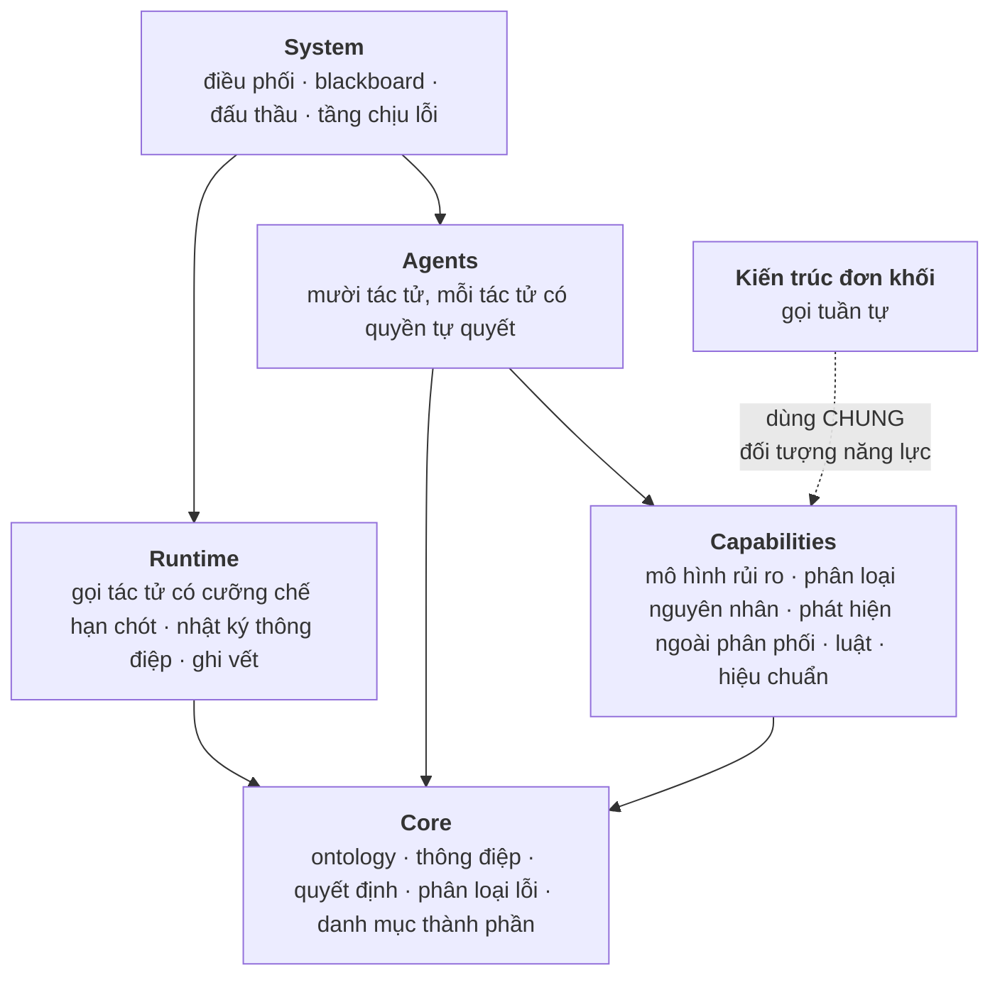
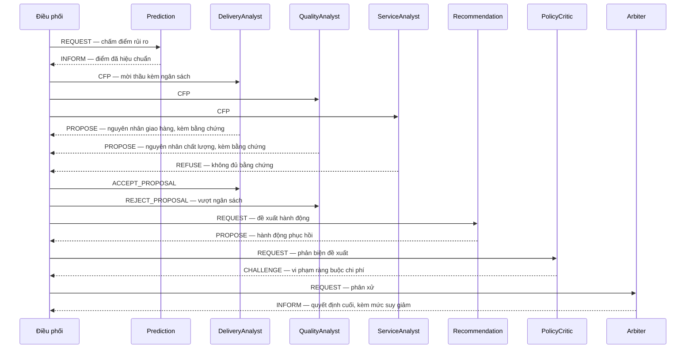
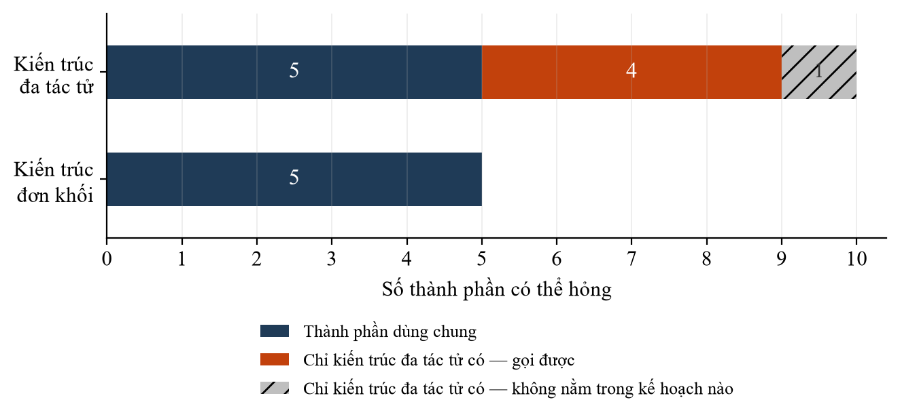
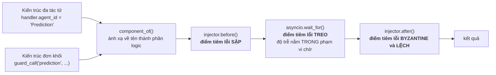

# CHƯƠNG 4 — THIẾT KẾ VÀ HIỆN THỰC HÓA ARTIFACT

Chương này trình bày sáu artifact được thiết kế và hiện thực hóa theo phương pháp đã nêu ở Chương 3.
Trình tự trình bày đi từ trong ra ngoài: trước hết là tập khái niệm chung giữa các tác tử, tiếp đến là
kiến trúc ghép chúng lại, rồi tới bốn nguyên lý thiết kế rút ra từ quá trình ấy, và cuối cùng là hai
artifact phục vụ việc đánh giá — bộ công cụ tiêm lỗi và các kiến trúc đối chứng.

Ba chỗ trong chương trình bày cả **lỗi thiết kế đã mắc phải và cách sửa**, thay vì chỉ trình bày bản
cuối cùng. Đây là lựa chọn có chủ đích: trong ba trường hợp ấy, chính quá trình phát hiện lỗi mới là
phần mang tri thức, còn bản cuối cùng nếu đứng một mình sẽ trông như một quyết định tùy tiện.

---

## 4.1 Tổng quan các artifact

Sáu artifact được phân loại theo bốn loại của Design Science Research, đã bàn ở
[§2.6.1](ch2-co-so-ly-thuyet.md). Bảng 4.1 liệt kê chúng cùng câu hỏi nghiên cứu mà mỗi artifact phục
vụ.

**Bảng 4.1.** Sáu artifact, loại và câu hỏi nghiên cứu tương ứng

| Mã | Artifact | Loại | Phục vụ câu hỏi |
|---|---|---|---|
| A1 | Ontology và giao thức giao tiếp | Construct | câu hỏi thiết kế |
| A2 | Kiến trúc tham chiếu và bốn nguyên lý thiết kế | Model | câu hỏi thiết kế |
| A3 | Bộ nhãn chuẩn do người gán | Instantiation | câu hỏi điều kiện kiểm soát |
| A4 | Bộ công cụ tiêm lỗi — phương pháp đánh giá chịu lỗi | **Method** | câu hỏi chịu lỗi |
| A5 | Prototype vận hành trên dữ liệu Olist | Instantiation | cả ba câu hỏi |
| A6 | Khung đánh giá và bốn kiến trúc đối chứng | Method và Instantiation | câu hỏi chịu lỗi, câu hỏi điều kiện kiểm soát |

Về quy mô, hiện thực gồm **88 tệp mã nguồn Python với 12.725 dòng**, kèm **4.420 dòng kiểm thử** tổ
chức thành **299 bài kiểm thử** hiện đều đang xanh. Các con số này được nêu để cho biết quy mô công
việc, không phải để làm chỉ số so sánh; lý do được giải thích ở §4.9.3.

---

## 4.2 Ontology và giao thức giao tiếp

### 4.2.1 Vì sao ontology là artifact chứ không phải chi tiết cài đặt

Trong một hệ đa tác tử, tập khái niệm chung giữa các tác tử **chính là** kiến trúc, bởi nó quyết định
điều gì có thể được biểu đạt và điều gì không. Một cơ chế không có cách biểu đạt trong ontology thì
không thể tồn tại trong hệ thống, dù người thiết kế có viết bao nhiêu dòng mã.

Điều này có hệ quả cụ thể với luận văn. Nếu ontology không có cách biểu diễn mệnh đề *"tôi không đủ cơ
sở để trả lời"*, thì nguyên lý *từ chối thay vì đoán* ở §4.5.3 không thể tồn tại. Tương tự, nếu thông
điệp không mang đủ thông tin về ý định, thì việc dựng lại chuỗi lập luận từ nhật ký ở §4.5.4 sẽ dừng ở
mức liệt kê các lời gọi hàm chứ không thành một lập luận.

### 4.2.2 Mười performative

Mỗi thông điệp trong hệ thống mang một performative — loại hành vi ngôn ngữ mà nó thực hiện. Bảng 4.2
liệt kê mười performative được sử dụng, nhóm theo vai trò.

**Bảng 4.2.** Mười performative và vai trò trong hệ thống

| Nhóm | Performative | Vai trò |
|---|---|---|
| Yêu cầu và thông báo | `REQUEST`, `INFORM` | điều phối viên giao việc; tác tử báo kết quả |
| Đấu thầu | `CFP`, `PROPOSE`, `ACCEPT_PROPOSAL`, `REJECT_PROPOSAL` | bốn pha của giao thức đấu thầu |
| Phản biện | `CHALLENGE` | tác tử phản biện chất vấn một đề xuất đã có |
| Từ chối | `REFUSE` | *"tôi không đủ bằng chứng để trả lời"* |
| Lỗi | `FAILURE`, `NOT_UNDERSTOOD` | thất bại thực thi; thông điệp sai lược đồ |

Hai performative trong Bảng 4.2 đáng được nhấn mạnh riêng vì chúng biểu diễn những hành vi mà một lời
gọi hàm thông thường không biểu diễn được nếu không quy ước thêm. Performative *phản biện* cho phép
một tác tử **phản đối một kết quả hợp lệ** của tác tử khác — nghĩa là hệ thống có thể chứa bất đồng
nội bộ và bất đồng ấy để lại dấu vết. Performative *từ chối* cho phép một tác tử **chủ động không trả
lời**; nếu thay bằng quy ước rằng giá trị rỗng có nghĩa là từ chối, thì bên nhận có thể quên kiểm tra
và diễn giải sự từ chối thành một câu trả lời hợp lệ.

Một chi tiết nhỏ nhưng có ý nghĩa với tính tái lập: thông điệp mang hạn chót dưới dạng **thời lượng**
chứ không phải dấu thời gian tuyệt đối. Nhờ vậy nội dung thông điệp không kéo đồng hồ hệ thống vào, và
hai lượt chạy cùng cấu hình cho kết quả trùng khớp tới từng byte, đúng theo yêu cầu ở
[§3.10](ch3-phuong-phap.md).

### 4.2.3 Đề xuất kèm bằng chứng

Khi một tác tử phân tích tham gia đấu thầu, nó phát một thông điệp đề xuất mang bốn trường: nguyên
nhân mà nó quy kết, độ tin cậy đã hiệu chuẩn, tập bằng chứng, và chi phí tính toán mà nó khai báo.

Ràng buộc quan trọng nhất trong bốn trường là **tập bằng chứng không được rỗng**, và ràng buộc này
được cưỡng chế ngay lúc khởi tạo đối tượng. Nó là cơ chế biến một điểm số thành một **lập luận có thể
kiểm tra lại** — điều kiện cho thuộc tính *truy vết được* trong câu hỏi thiết kế. Trường chi phí tính
toán không phải thông tin phụ trợ mà là đầu vào của bài toán phân bổ ngân sách ở §4.3.4.

### 4.2.4 Construct mức suy giảm

Đây là đóng góp construct chính của luận văn, và nó lấp khoảng trống thứ hai đã xác định ở
[§2.8](ch2-co-so-ly-thuyet.md).

Mức suy giảm là một thang bốn bậc gắn với mỗi quyết định, biểu diễn tình trạng năng lực của hệ thống
tại thời điểm sinh ra quyết định ấy. Bậc không nghĩa là hệ thống đủ năng lực; bậc một nghĩa là ít nhất
một thành phần đã chuyển sang phương án dự phòng; bậc hai nghĩa là quyết định dựa trên luật thay vì
dựa trên mô hình; bậc ba nghĩa là hệ thống bắt buộc chuyển giao cho con người.

Điểm phân biệt giữa construct này với khả năng giải thích cần được nêu rõ, bởi hai khái niệm dễ bị gộp
làm một. Một lời giải thích trả lời câu hỏi *quyết định này được rút ra như thế nào*; mức suy giảm trả
lời câu hỏi *hệ thống đang ở tình trạng nào khi rút ra quyết định ấy*. Một quyết định có thể có lời
giải thích đầy đủ và mạch lạc trong khi vẫn được sinh ra trên nền năng lực đã suy giảm, và lời giải
thích ấy sẽ không hề đề cập tới điều đó — bởi nó không có chỗ nào để đề cập.

### 4.2.5 Ba bất biến cưỡng chế lúc khởi tạo

Lớp biểu diễn quyết định kiểm tra ba điều kiện ngay trong hàm khởi tạo. Vi phạm bất kỳ điều kiện nào
làm chương trình dừng **tại chỗ tạo ra lỗi**, chứ không phải tại nơi hậu quả xuất hiện — một khác biệt
quan trọng khi gỡ lỗi, bởi khoảng cách giữa hai điểm ấy trong một hệ đa tác tử có thể rất xa. Bảng 4.3
liệt kê ba bất biến.

**Bảng 4.3.** Ba bất biến của lớp quyết định và điều mỗi bất biến chặn

| Bất biến | Điều nó chặn |
|---|---|
| Mức suy giảm **không có giá trị mặc định** | người viết mã buộc phải khai báo tình trạng năng lực; không thể bỏ sót do quên |
| Mức suy giảm lớn hơn không kéo theo cờ cần người xem lại | nguyên lý *suy giảm minh bạch* không thể bị vi phạm bằng cách bỏ sót |
| Từ hai nguyên nhân trở lên kéo theo cờ đa nguyên nhân | giữ nhất quán biểu diễn đa nhãn |

Bất biến thứ nhất đáng được giải thích thêm vì nó minh họa một nguyên tắc thiết kế được dùng nhiều lần
trong luận văn. Nếu trường mức suy giảm có giá trị mặc định bằng không, thì mọi quyết định sẽ mặc nhiên
mang nhãn *"hệ thống bình thường"* trừ khi người viết mã nhớ đặt lại — tức cơ chế an toàn phụ thuộc
vào trí nhớ, và trí nhớ thì hỏng theo thời gian và theo số lượng người tham gia. Bỏ giá trị mặc định
đảo ngược quan hệ ấy: mã nguồn **không chạy được** nếu thiếu khai báo. Nguyên tắc chung là biến một
quy ước cần nhớ thành một ràng buộc không thể bỏ qua.

---

## 4.3 Kiến trúc tham chiếu

### 4.3.1 Phân tầng và một ranh giới có ý nghĩa phương pháp

Kiến trúc được tổ chức thành năm tầng như mô tả ở Hình 4.1.



**Hình 4.1.** Kiến trúc năm tầng. Đường nét đứt thể hiện điểm mấu chốt về phương pháp: kiến trúc đối
chứng dùng **chung một đối tượng năng lực nền** với kiến trúc đề xuất, chứ không phải một bản sao.

Ranh giới giữa tầng năng lực và tầng tác tử là ranh giới quan trọng nhất về mặt phương pháp, và nó
được thiết kế như vậy có chủ đích. Tầng năng lực chứa các mô hình và bộ luật; tầng tác tử bọc chúng
lại và bổ sung quyền tự quyết, khả năng giao tiếp, và quyền từ chối. Nhờ tách bạch này, kiến trúc đối
chứng có thể gọi thẳng tầng năng lực mà bỏ qua tầng tác tử — và khi ấy hai kiến trúc dùng **cùng một
đối tượng trong bộ nhớ**, không phải hai bản sao có cùng tham số.

Nếu không có ranh giới này, giả thuyết về tương đương độ chính xác sẽ không kiểm chứng được, bởi hai
kiến trúc sẽ khác nhau ở cả kiến trúc lẫn mô hình, và mọi khác biệt quan sát được sẽ không quy được về
nguyên nhân nào.

### 4.3.2 Blackboard và điều kiện để truy vết được

Mọi tác tử đọc và ghi vào một không gian trạng thái dùng chung của phiên xử lý, thay vì truyền trạng
thái qua tham số giữa các lời gọi. Lựa chọn này cho một thuộc tính kiểm chứng được: decision trace tái
lập được trọn vẹn **chỉ từ nhật ký thông điệp**.

Lập luận cho tính tất yếu của lựa chọn này đã nêu ở [§2.1.4](ch2-co-so-ly-thuyet.md) và đáng nhắc lại
ở đây dưới dạng phản chứng: nếu trạng thái được truyền ngầm qua tham số, sẽ tồn tại những bước xử lý
không để lại dấu vết nào trong nhật ký, và khi đó tuyên bố về khả năng truy vết trở thành một tuyên bố
không kiểm tra được — không phải sai, mà là **không thể biết đúng hay sai**.

### 4.3.3 Kế hoạch điều phối ở dạng dữ liệu

Kế hoạch xử lý được biểu diễn bằng một cấu trúc dữ liệu chứ không bằng luồng điều khiển. Mỗi giai đoạn
là một dãy bước, mỗi bước khai báo tác tử được gọi, điều kiện để bước chạy, và nếu là bước đấu thầu
thì khai báo thêm hàm tính ngân sách.

```python
STAGE1_PLAN = (                      # giai đoạn dự báo
    Step("analytics",  agent="Analytics"),
    Step("prediction", agent="Prediction"),
    Step("rules",      agent="RuleAgent"),
)

STAGE2_PLAN = (                      # giai đoạn quy kết
    Step("analytics",    agent="Analytics"),
    Step("prediction",   agent="Prediction"),
    Step("contract_net", fanout="AnalystPool", budget=budget_for,
                         protocol="contract_net"),
    Step("recommend",  agent="Recommendation", on=lambda bb: bool(bb.causes)),
    Step("critique",   agent="PolicyCritic",   on=lambda bb: bb.proposal is not None),
    Step("arbitrate",  agent="Arbiter",
                       on=lambda bb: bb.critique is not None and bb.critique.challenged),
    Step("rules",      agent="RuleAgent"),
)
```

Hai lý do dẫn tới lựa chọn này. Thứ nhất, nó **chặn nguy cơ hình thành một máy trạng thái phức tạp
ngoài ý muốn**: một kế hoạch ở dạng dữ liệu không có chu trình và không có nhánh lồng nhau, bởi cấu
trúc dữ liệu không cho phép biểu diễn chúng. Thứ hai, kế hoạch **in ra được vào phụ lục luận văn như
một artifact kiểm tra được**, thay vì phải mô tả gián tiếp bằng lời.

Hệ quả thực tế là việc chuyển giữa hai mốc quyết định trở thành **một lần thay đổi cấu hình**, không
phải một nhánh mã nguồn. Đây là điều kiện để phân tích độ nhạy theo mốc thực hiện được, và cũng là
điều kiện để thí nghiệm chịu lỗi chạy được ở cả hai giai đoạn.

Một chi tiết trong kế hoạch giai đoạn hai cần giải thích, bởi nó là kết quả sửa một lỗi thiết kế.
Bước đấu thầu **không** có điều kiện *chỉ chạy khi rủi ro từ mức trung bình trở lên*. Ban đầu bước này
bị chặn sau một ngưỡng rủi ro dự báo, với lý do tiết kiệm chi phí tính toán. Nhưng tại mốc quy kết,
đơn hàng **đã có** đánh giá một hoặc hai sao — sự bất mãn là một **sự kiện đã xảy ra**, không còn là
thứ cần dự báo. Chặn việc quy kết nguyên nhân sau một dự báo có chỉ số PR-AUC khoảng 0,40 khiến 94,7%
số ca không bao giờ được phân tích, và câu hỏi điều kiện kiểm soát mất đối tượng nghiên cứu. Cổng rủi
ro được gỡ bỏ; ngân sách tính toán vẫn thay đổi theo mức rủi ro nên cơ chế phân bổ tài nguyên không
mất đi.

### 4.3.4 Giao thức đấu thầu có ràng buộc ngân sách

Giao thức đấu thầu gốc không có ràng buộc tài nguyên. Luận văn bổ sung một ngân sách tính toán, giải
bằng bài toán xếp ba lô vét cạn trên tối đa mười sáu tập con — đủ nhỏ để giải chính xác và tất định.
Hình 4.2 mô tả luồng thông điệp của một case ở giai đoạn quy kết, bao gồm cả pha đấu thầu.



**Hình 4.2.** Luồng thông điệp của một case ở giai đoạn quy kết. Ba sự kiện tô đậm ý nghĩa của kiến
trúc đa tác tử: một tác tử **từ chối** vì thiếu bằng chứng, một tác tử **thua thầu** vì vượt ngân
sách, và tác tử phản biện **chất vấn** đề xuất. Cả ba sự kiện này biến mất hoàn toàn nếu chỉ nhìn vào
quyết định cuối cùng — đó là nội dung của nguyên lý thứ tư ở §4.5.4.

Điểm thiết kế đáng chú ý nhất của cơ chế ngân sách là **ngân sách được đặt theo bội số của chi phí
chạy hết, không đặt bằng số tuyệt đối**. Ba mức tương ứng với ba mức rủi ro là 0,70 — 1,0 — 1,5 lần
chi phí chạy hết.

Cách đặt bằng số tuyệt đối đã gây ra một lỗi thiết kế đáng kể, và câu chuyện này minh họa vì sao lựa
chọn trên quan trọng. Ban đầu ba mức ngân sách được đặt là hai, hai mươi và một trăm hai mươi mili
giây. Khi bộ phân loại nguyên nhân được thay từ bản tạm sang bản huấn luyện thật, chi phí mỗi lời gọi
tăng từ khoảng 0,009 mili giây lên 1,3 mili giây. Mức ngân sách hai mili giây cho ca rủi ro thấp lập
tức trở nên **không đủ cho bất kỳ tác tử phân tích văn bản nào**. Hậu quả là cổng rủi ro vốn đã được
gỡ bỏ tường minh ở §4.3.3 lại **quay trở lại một cách ngầm** thông qua ngân sách: đơn hàng rủi ro thấp
không bao giờ được phân tích văn bản. Chỉ số macro-F1 của kiến trúc đề xuất tụt 0,14 xuống dưới đối
chứng — **vì một tham số chứ không phải vì kiến trúc**.

Đặt ngân sách theo bội số làm cho ràng buộc trở nên **diễn đạt được** và **tự điều chỉnh khi chi phí
thay đổi**. Mức thấp nhất được chọn để đủ cho tác tử phân tích giao hàng cùng **đúng một** tác tử phân
tích văn bản, nên giao thức đấu thầu vẫn thực sự phải phân bổ ở ca rủi ro thấp mà không loại hẳn phân
tích văn bản ra khỏi nhóm đó.

Bài học ấy lặp lại một lần nữa, ở một tầng khác, và lần này nó cho thấy giới hạn của chính cách đặt
theo bội số. Khi tác tử phân tích giao hàng được nối thêm nhánh bằng chứng văn bản, chi phí của nó
tăng từ 0,3 lên 1,6 mili giây, nên mẫu số của phép nhân tăng theo. Hệ số 0,6 khi đó cho 2,52 mili giây
— **không còn mua nổi một tác tử phân tích văn bản nào**, đúng trái với câu mô tả của chính tham số ấy.
Hệ số đúng suy ra từ chính ý định là 0,6905, làm tròn thành **0,70**. Một tham số tự điều chỉnh theo
**giá** vẫn không tự điều chỉnh theo **cơ cấu** chi phí.

### Ràng buộc ngân sách được tắt trong cấu hình báo cáo

Kết quả đo trên bộ nhãn chuẩn cho thấy ràng buộc ngân sách **làm giảm chất lượng quy kết** mà khoản
tiết kiệm tính toán không bù lại được ở quy mô của nghiên cứu này. Vì vậy cấu hình được báo cáo trong
Chương 5 **tắt ràng buộc ngân sách**, và cơ chế được giữ lại như một tham số cấu hình để chạy phân tích
độ nhạy. Số liệu của phép đánh đổi này nằm ở [§5.11](ch5-ket-qua-ban-luan.md).

Việc tắt có một cái giá phải nói thẳng thay vì để người đọc tự phát hiện. Khi không còn ràng buộc,
bài toán phân bổ suy biến thành một hàm hằng: mọi tác tử đủ điều kiện đều được gọi. Kéo theo đó,
performative `REJECT_PROPOSAL` **không bao giờ được phát**, và pha thăm dò của giao thức vẫn tiêu tốn
thông điệp nhưng **không quyết định điều gì**. Nói cách khác, ở cấu hình được báo cáo, phản biện *"đây
chỉ là một ensemble được gắn nhãn giao thức"* là **đúng ở chiều phân bổ tài nguyên** — và điều đó được
thừa nhận thay vì được che.

Việc chuyển ngân sách thành một công tắc cấu hình cũng làm lộ một cái bẫy trong cài đặt, và nó đáng
được ghi lại. Khi bước đấu thầu không còn khai báo hàm ngân sách, giá trị ngân sách còn lại giữ mặc
định **bằng không**, nên bài toán phân bổ đi vào nhánh *"không đủ tài nguyên"* và **từ chối toàn bộ**
tác tử. Kết quả là không case nào được quy kết nguyên nhân, trong khi giao thức vẫn chạy đủ hai pha
nên không có dấu hiệu bất thường nào. Bài học tổng quát: *"không khai báo ràng buộc"* và *"ràng buộc
bằng không"* là hai trạng thái **ngược nhau về ý nghĩa**, và để chúng chung một biểu diễn là mở đường
cho một lỗi im lặng. Lỗi này được một bất biến trên đầu ra bắt ngay lập tức.

### 4.3.5 Tầng chịu lỗi

Tầng chịu lỗi được cài đặt như một **lớp bọc** quanh đường gọi tác tử, không phải một nhánh trong mã
nguồn:

```python
layer = ReliabilityLayer(guards=default_chain(health), enabled=reliability)
invoke_fn = layer.wrap(raw_invoke)      # enabled=False trả về nguyên hàm gốc
```

Nhờ cách cài đặt này, thí nghiệm ablation cho nguyên lý *suy giảm minh bạch* chỉ là một lần thay đổi
tham số. Nếu ablation phải thực hiện bằng cách sửa mã nguồn, thứ được đo sẽ là *"hai nhánh mã khác
nhau"* chứ không phải *"có cơ chế và không có cơ chế"* — và khi đó kết quả ablation không nói lên điều
gì về cơ chế.

Tầng chịu lỗi gồm bốn lớp kiểm tra đầu ra, mỗi lớp bắt một loại lỗi khác nhau, như trình bày ở Bảng
4.4, cùng với một cây giám sát có cầu dao ngắt mạch theo từng thành phần.

**Bảng 4.4.** Bốn lớp kiểm tra đầu ra

| Lớp | Bắt loại lỗi nào | Nguyên lý hoạt động |
|---|---|---|
| Lược đồ | sai kiểu, ngoài miền giá trị, thiếu bằng chứng | lỗi cài đặt |
| Tỉnh táo | một đại lượng đáng lẽ biến thiên mà **đứng yên** trên cửa sổ trượt | mô hình chết |
| Hiệu chuẩn | phân phối lệch so với tham chiếu | dịch chuyển phân phối |
| Nhất quán | mâu thuẫn giữa kết quả của các tác tử | sai lệch nội bộ |

Nguyên tắc thiết kế quan trọng nhất của tầng này, và là điều kiện để kết quả đo có giá trị, là: **lớp
kiểm tra phải được viết theo nguyên lý tổng quát, không được viết để bắt đúng một bộ tiêm lỗi cụ thể**.
Nếu lớp kiểm tra biết trước rằng bộ tiêm đặt giá trị 0,5 rồi đi kiểm tra xem kết quả có bằng 0,5 hay
không, thì phép đo không đo được gì — nó chỉ xác nhận rằng người viết đã cài đúng cái mình vừa nghĩ
ra. Vì vậy lớp *tỉnh táo* không biết gì về hằng số nào cả; nó chỉ biết rằng một đại lượng đáng lẽ phải
biến thiên mà lại đứng yên là bất thường. Nhờ nguyên tắc này, tỷ lệ phát hiện trên nhóm lỗi tinh vi
mới là kết quả thực nghiệm chứ không phải kiểm tra đặc tả.

Ngưỡng của lớp kiểm tra hiệu chuẩn được **hiệu chuẩn trên một lượt chạy khỏe** thay vì lấy theo quy
ước công nghiệp. Lý do đã nêu ở [§2.5.5](ch2-co-so-ly-thuyet.md): bộ dữ liệu trải dài từ 2016 tới 2018
nên bản thân nó đã chứa dịch chuyển thời gian đáng kể, và lấy ngưỡng quy ước 0,25 cho **93,7% báo động
giả** trên một lượt chạy hoàn toàn bình thường. Ngưỡng được sử dụng là 1,0, xác định bằng cách đo trên
lượt chạy khỏe rồi đối chiếu với lượt chạy có tiêm lỗi.

---

## 4.4 Mười tác tử và bề mặt hỏng

### 4.4.1 Danh sách tác tử

Kiến trúc gồm mười tác tử, mỗi tác tử ánh xạ tới một thành phần logic. Bảng 4.5 liệt kê chúng cùng với
thông tin thành phần đó có tồn tại ở kiến trúc đối chứng hay không.

**Bảng 4.5.** Mười tác tử và sự hiện diện ở kiến trúc đối chứng

| Tác tử | Thành phần logic | Có ở kiến trúc đơn khối |
|---|---|---|
| Prediction | dự báo rủi ro | có |
| DeliveryAnalyst | quy kết nguyên nhân giao hàng | có |
| QualityAnalyst | quy kết nguyên nhân chất lượng | có |
| ServiceAnalyst | quy kết nguyên nhân dịch vụ | có |
| RuleAgent | chốt hành động theo luật | có |
| Analytics | tổng hợp bối cảnh | **không** |
| Recommendation | sinh đề xuất hành động | **không** |
| PolicyCritic | phản biện đề xuất | **không** |
| Arbiter | phân xử khi có bất đồng | **không** |
| CaseManager | quản lý hồ sơ | **không** |

### 4.4.2 Bề mặt hỏng — cách đo chi phí kiến trúc

Từ Bảng 4.5 rút ra một đại lượng mà luận văn chọn làm **thước đo chi phí chính** của kiến trúc: số
thành phần có thể hỏng. Hình 4.3 trình bày đại lượng này cho hai kiến trúc.



**Hình 4.3.** Bề mặt hỏng của hai kiến trúc. Kiến trúc đa tác tử có mười thành phần có thể hỏng so với
năm của kiến trúc đơn khối; trong năm thành phần tăng thêm, một thành phần không nằm trong kế hoạch
điều phối của bất kỳ giai đoạn nào nên thực tế không hỏng được.

Việc chọn bề mặt hỏng làm thước đo chính, thay cho độ trễ hoặc số dòng mã, cần được biện minh. Mili
giây và dòng mã đo **quy mô công việc**; số thành phần có thể hỏng đo **rủi ro đã tạo thêm**. Với một
câu hỏi nghiên cứu về khả năng chịu lỗi, đại lượng thứ hai mới là đại lượng liên quan. Hai đại lượng
kia vẫn được báo cáo, nhưng ở vai trò khác, như sẽ nêu ở §4.9.3.

Từ Hình 4.3 rút ra một nhận định phải nói thẳng, và nó sẽ được kiểm chứng ở Chương 5:

> Một phần khả năng chịu lỗi của kiến trúc đa tác tử tồn tại để quản lý chính rủi ro mà kiến trúc đó
> tạo ra.

Nhận định này không phải một lời phê phán kiến trúc mà là một mệnh đề kiểm chứng được, và giả thuyết
thứ hai chính là phép thử cho nó. Nếu cơ chế bảo vệ phủ được cả năm thành phần tăng thêm thì cái giá
là chấp nhận được; nếu không, tuyên bố về khả năng chịu lỗi phải thu hẹp lại.

Một chi tiết trong Hình 4.3 đáng được giải thích: trong năm thành phần riêng có, thành phần quản lý hồ
sơ **không nằm trong kế hoạch điều phối của bất kỳ giai đoạn nào**, tức nó không bao giờ được gọi. Một
thành phần không được gọi thì không thể hỏng, nên bề mặt hỏng **gọi được** của kiến trúc đề xuất là
bốn chứ không phải năm. Phát hiện này chỉ lộ ra khi đọc nhật ký thông điệp của một lượt chạy thật —
sơ đồ kiến trúc vẫn vẽ thành phần ấy như mọi thành phần khác, và danh sách tác tử trong mã nguồn cũng
vậy.

---

## 4.5 Bốn nguyên lý thiết kế

Bốn nguyên lý dưới đây được phát biểu theo cấu trúc ba vế của Gregor, Chandra Kuk và Hevner (2020) đã
nêu ở [§2.6.3](ch2-co-so-ly-thuyet.md). Mỗi nguyên lý gắn với một cơ chế cưỡng chế trong mã nguồn và
một thí nghiệm ablation, bởi một nguyên lý không kiểm chứng được thì không phải là đóng góp mà chỉ là
một ý kiến.

### 4.5.1 Nguyên lý thứ nhất — suy giảm minh bạch

> ***Để*** hệ hỗ trợ quyết định giữ được lòng tin của nhà quản lý khi thành phần gặp lỗi, ***hãy*** gắn
> mức suy giảm vào từng quyết định và bắt buộc con người xem lại khi mức lớn hơn không, ***bởi vì*** một
> quyết định tự động sinh ra trên nền năng lực đã suy giảm gây hại hơn là không có quyết định.

Cơ chế cưỡng chế gồm ba lớp: mức suy giảm là trường bắt buộc của mọi quyết định, bộ luật gắn cờ cần
người xem lại khi mức lớn hơn không, và tám bài kiểm thử canh giữ các bất biến này. Thí nghiệm ablation
là tắt lớp kiểm tra đầu ra cùng thang suy giảm rồi chạy lại toàn bộ thí nghiệm tiêm lỗi. Chỉ số chứng
minh là tỷ lệ hỏng âm thầm đối chiếu với kiến trúc đơn khối, cùng phân bố mức suy giảm.

Vế *bởi vì* của nguyên lý này lấy trực tiếp từ đặc thù của hệ hỗ trợ quyết định đã phân tích ở
[§2.2.2](ch2-co-so-ly-thuyet.md): một hệ tự động hóa được tối ưu cho việc luôn có câu trả lời, còn một
hệ hỗ trợ được tối ưu cho việc người dùng biết khi nào nên tin câu trả lời.

### 4.5.2 Nguyên lý thứ hai — đa nhãn, và cạnh tranh chỉ khi thẩm quyền chồng lấn

> ***Để*** không đánh mất thông tin về các nguyên nhân đồng thời, ***hãy*** giữ đầu ra **đa nhãn** và
> cấm mọi phép chọn một nhãn; ***và chỉ khi*** các tác tử có **thẩm quyền chồng lấn** trên cùng một
> phần bằng chứng thì cơ chế đấu thầu cạnh tranh mới sinh thêm thông tin, ***bởi vì*** khi các tác tử
> phân chia không gian nhãn và dùng chung một năng lực nền cùng một ngưỡng, tập đề xuất vượt ngưỡng
> **bằng đúng** đầu ra của một bộ phân loại đa nhãn.

Cơ chế cưỡng chế gồm đầu ra đa nhãn, lệnh cấm sử dụng phép chọn giá trị lớn nhất trong mã nguồn, giao
thức đấu thầu hai pha, và một chỉ số đo độ phân tán của tập đề xuất. Thí nghiệm ablation là so sánh
với kiến trúc đơn khối **đa nhãn** dùng chung năng lực nền và chung ngưỡng. Chỉ số chứng minh là
macro-F1 trên bộ nhãn chuẩn, và quan trọng hơn, **số đơn hàng mà hai kiến trúc cho kết quả khác nhau**.

#### Nguyên lý này đã được sửa sau thực nghiệm

Bản gốc của nguyên lý phát biểu rằng *hãy để nhiều tác tử chuyên biệt đấu thầu kèm bằng chứng **thay
vì** dùng một bộ phân loại đa lớp, bởi vì độ đồng thuận giữa các đề xuất mang thông tin mà phép chọn
một nhãn làm mất*.

Thực nghiệm bác bỏ vế so sánh trong phát biểu ấy. Trên 250 đơn hàng có nhãn, ở mức ngân sách đủ, hai
kiến trúc cho kết quả **giống hệt nhau trên từng đơn — không một đơn nào khác biệt**. Truy ngược lại
thì kết quả ấy *phải* xảy ra: các tác tử phân tích sở hữu những nguyên nhân **rời nhau**, dùng **chung**
một bộ phân loại, và bộ phân xử nhận **mọi** đề xuất vượt **cùng** một ngưỡng. Ghép lại, cơ chế đa tác
tử **bằng đúng về mặt đại số** với một bộ phân loại đa nhãn. Không dữ liệu nào có thể tách được hai
phép toán bằng nhau, nên đây không phải một kết quả có thể cải thiện bằng cách thu thập thêm dữ liệu.

Bản gốc gộp hai mệnh đề khác nhau vào một câu, và việc tách chúng ra cho thấy phần nào đúng phần nào
sai. Mệnh đề *đa nhãn tốt hơn chọn một nhãn* vẫn đúng và vẫn được giữ — đây là phần thực chất. Mệnh đề
*đấu thầu tốt hơn bộ phân loại* bị bác bỏ trong điều kiện thẩm quyền không chồng lấn.

Bản sửa bổ sung một **điều kiện biên**, và nó mạnh hơn bản gốc chứ không yếu hơn. Một mệnh đề khẳng
định chung chung — *đấu thầu tốt hơn* — không có giá trị dự đoán vì nó không nói khi nào; một mệnh đề
có điều kiện kiểm chứng được — *đấu thầu chỉ sinh thêm thông tin khi thẩm quyền chồng lấn* — cho người
đọc một tiêu chí để quyết định có nên dùng cơ chế ấy trong hệ thống của họ hay không.

Việc sửa nguyên lý sau thực nghiệm **không** vi phạm kỷ luật khai báo trước, bởi nguyên lý thiết kế là
sản phẩm của nghiên cứu chứ không phải một dự đoán khai báo trước; lập luận đầy đủ ở
[§3.1.3](ch3-phuong-phap.md).

### 4.5.3 Nguyên lý thứ ba — từ chối thay vì đoán

> ***Để*** tránh những quyết định tự tin nhưng sai trên dữ liệu ngoài phân phối hoặc thiếu bằng chứng,
> ***hãy*** cấp cho tác tử quyền phát tín hiệu từ chối, ***bởi vì*** chi phí chuyển giao cho con người
> thấp hơn nhiều so với chi phí của một hành động sai.

Cơ chế cưỡng chế gồm performative từ chối trong ontology, một bộ phát hiện dữ liệu ngoài phân phối, và
kiến trúc hai tầng phân biệt đơn hàng có bình luận với đơn hàng không có. Thí nghiệm ablation là **cấm
phát tín hiệu từ chối**, buộc tác tử luôn trả lời — thực hiện bằng một tham số cấu hình. Chỉ số chứng
minh là tỷ lệ quy kết sai trên những đơn hàng mà người gán nhãn để trống, cùng tỷ lệ nhãn không xác
định.

Một lưu ý về đo lường cần được nêu vì nó ảnh hưởng tới cách đọc kết quả ở Chương 5: chỉ số macro-F1
**phạt việc từ chối**. Một tác tử phát tín hiệu từ chối bị tính là không trả lời đúng, nên nguyên lý
này tự trừ điểm chính nó nếu hiệu năng chỉ được đo bằng macro-F1. Đây là lý do luận văn bổ sung đường
cong rủi ro theo độ phủ, cho phép so sánh hai hệ ở cùng một mức độ phủ.

### 4.5.4 Nguyên lý thứ tư — nguồn gốc từ giao tiếp

> ***Để*** decision trace luôn trung thực với hành vi thực tế của hệ thống, ***hãy*** dựng trace từ
> nhật ký thông điệp thật thay vì viết tay, ***bởi vì*** một trace viết tay có thể phân kỳ với những gì
> hệ thống thực sự đã làm.

Cơ chế cưỡng chế là bộ giải thích **chỉ đọc nhật ký thông điệp** và không nhận bất kỳ tham số nào từ
bên ngoài — một ràng buộc ở mức chữ ký hàm chứ không phải một quy ước. Thí nghiệm ablation là dựng
trace theo cách viết tay rồi **đo độ phân kỳ** so với trace dựng từ nhật ký.

Hai cách dựng trace khác nhau ở chỗ nào cần được nói rõ, bởi cách thứ hai không phải một hình nộm được
dựng lên để đánh đổ. Cách dựng từ nhật ký đọc mọi thông điệp thật sự đã đi qua hệ thống: mỗi đề xuất
bị từ chối, mỗi lần một tác tử phát tín hiệu từ chối, mỗi lần lớp kiểm tra can thiệp, mỗi lần tác tử
phản biện chất vấn. Cách viết tay đọc quyết định cuối cùng rồi kể lại rằng hệ thống dự báo rủi ro ở
mức nào, quy kết nguyên nhân gì, và đề xuất hành động nào. Cách thứ hai chính là dạng trace mà phần
lớn hệ thống trong thực tế có.

Điểm mấu chốt nằm ở chỗ đối tượng quyết định chỉ giữ **kết cục**. Mọi thứ bị loại bỏ trên đường đi đều
biến mất khỏi nó: tác tử nào đã từ chối và vì lý do gì, tác tử nào thua thầu vì vượt ngân sách, đề
xuất nào không vượt ngưỡng, lớp kiểm tra nào đã chặn. Ba trong số các sự kiện này xuất hiện trong Hình
4.2 và không sự kiện nào trong đó xuất hiện ở quyết định cuối.

> Trace viết tay **không sai ở những gì nó nói — nó thiếu ở những gì nó không thể nói**. Và trong một
> hệ hỗ trợ quyết định, câu hỏi *vì sao không chọn phương án kia* thường đáng giá ngang câu hỏi *vì sao
> chọn phương án này*.

Chỉ số độ phân kỳ được chia **theo loại sự kiện** chứ không gộp thành một con số, bởi một con số gộp
sẽ giấu mất thông tin quan trọng nhất là loại sự kiện nào bị mất.

---

## 4.6 Bộ công cụ tiêm lỗi

### 4.6.1 Điểm tiêm lỗi

Bộ tiêm nhắm vào **thành phần logic**, không nhắm vào tác tử, và Hình 4.4 cho thấy vì sao điều này khả
thi: cả hai kiến trúc đều đi qua một điểm gọi chung, tại đó tên tác tử được ánh xạ về tên thành phần
logic trước khi bộ tiêm được kích hoạt.



**Hình 4.4.** Ba điểm tiêm lỗi trong đường gọi chung. Việc hai kiến trúc cùng đi qua bước ánh xạ tên
thành phần là điều kiện để cùng một kịch bản lỗi áp được lên cả hai.

Nếu bộ tiêm nhắm vào tác tử thay vì thành phần logic, kịch bản lỗi sẽ chỉ áp được lên kiến trúc đa tác
tử, và toàn bộ phép so sánh mất cơ sở — kiến trúc đối chứng sẽ không bao giờ hỏng, không phải vì nó
bền hơn mà vì nó không bị tiêm.

### 4.6.2 Hai quyết định mô hình hóa

Danh mục năm nhóm lỗi đã trình bày ở [§3.8.3](ch3-phuong-phap.md). Ở đây nêu hai quyết định mô hình
hóa cùng lý do, bởi cả hai đều là chỗ mà một cài đặt thiếu cẩn thận sẽ cho kết quả sai lệch.

**Dịch chuyển phân phối không được mô hình hóa như một bộ tiêm theo thành phần.** Nó là thuộc tính của
dòng dữ liệu đầu vào, không phải hành vi sai của một thành phần. Mô hình hóa nó theo thành phần vừa
sai về bản chất, vừa khiến nhiễu loạn chỉ ảnh hưởng tới một kiến trúc. Vì vậy nó được áp ở tầng case,
trước khi case đi vào hệ thống, và nhờ đó nó tác động lên hai kiến trúc giống hệt nhau theo cấu tạo.

**Độ trễ của nhóm treo được đặt bên trong phạm vi chờ**, như thấy ở Hình 4.4, nên nó sinh ra một sự
kiện hết hạn thật với tác vụ bị hủy. Bản đầu tiên của bộ tiêm đo độ trễ *sau khi* tác tử chạy xong, và
khi ấy một tác tử treo sẽ làm treo cả chuỗi xử lý vĩnh viễn thay vì kích hoạt cơ chế hết hạn — tức
kịch bản không đo được điều nó định đo.

### 4.6.3 Bộ tiêm Byzantine theo từng thành phần

Bộ tiêm Byzantine dạng đơn giản ghi đè một trường có tên cố định trong kết quả. Cách này hoạt động với
thành phần dự báo, nhưng với năm thành phần riêng có của kiến trúc đề xuất thì nó **không tiêm được
gì**: chúng phát ra những trường hoàn toàn khác, và hàm ghi đè khi gặp trường không tồn tại thì trả về
nguyên kết quả.

Bộ tiêm theo từng thành phần đầu độc **đúng trường mà mỗi thành phần thực sự phát ra**, với danh sách
trường đọc từ nhật ký thông điệp của một lượt chạy khỏe chứ không đoán từ tên lớp. Bảng 4.6 trình bày
ánh xạ này.

**Bảng 4.6.** Trường bị đầu độc ở từng thành phần riêng có

| Thành phần | Trường bị đầu độc | Giá trị thay thế |
|---|---|---|
| Tổng hợp bối cảnh | bối cảnh | rỗng |
| Sinh đề xuất | đề xuất hành động | đề xuất *không hành động* |
| **Phản biện** | **cờ chất vấn** | **sai** |
| Phân xử | bên được nghiêng về | luôn nghiêng về đề xuất |

Trường hợp ở hàng thứ ba của Bảng 4.6 là nguy hiểm nhất trong bốn trường hợp. Khi cờ chất vấn bị đặt
thành sai, **bộ phản biện im lặng chấp thuận mọi đề xuất**: đầu ra vẫn đúng lược đồ, vẫn có vẻ hợp lý,
và không có gì cho thấy lớp kiểm soát đã ngừng kiểm soát. Đây đúng là định nghĩa của lỗi Byzantine, và
nó khác hẳn với việc ghi đè một giá trị số bằng một hằng số thô — loại lỗi sau ít nhất còn để lại dấu
vết thống kê.

### 4.6.4 Định nghĩa hỏng âm thầm

Chỉ số trung tâm của luận văn được định nghĩa qua ba bước. Trước hết, một lượt chạy khỏe được thực
hiện và khóa quyết định của từng case được chụp lại; khóa gồm hành động được đề xuất, tập nguyên nhân
được quy kết, và mức rủi ro. Tiếp đó, dưới mỗi kịch bản lỗi, một case được coi là **đổi đầu ra** nếu
khóa của nó khác với khóa ở lượt chạy khỏe. Cuối cùng, một case được tính là **hỏng âm thầm** nếu nó
đổi đầu ra **và** hệ thống không phát tín hiệu nào.

Khóa quyết định **cố ý không chứa** mức suy giảm và cờ chuyển giao cho con người. Lý do là nó phải đo
*nội dung của quyết định*, tách rời khỏi *việc có cảnh báo hay không*; nếu gộp hai thứ vào một khóa,
hai vế của phép đo sẽ không còn độc lập và chỉ số mất ý nghĩa.

Định nghĩa của *tín hiệu cảnh báo* phải hỏi **cùng một câu** với cả hai kiến trúc, và đây là điểm mà
nghiên cứu đã mắc lỗi rồi phải sửa. Kiến trúc đa tác tử phát tín hiệu qua ba cơ chế: mức suy giảm lớn
hơn không, cờ cần người xem lại, hoặc hành động chuyển giao cho con người. Kiến trúc đơn khối phát tín
hiệu qua một trường ghi lại các bước đã thất bại. Phân tích đầy đủ về lỗi này và tác động của nó lên
kết quả nằm ở [§5.6](ch5-ket-qua-ban-luan.md).

Cuối cùng, sự thật nền lấy từ **lượt chạy khỏe** chứ không lấy từ tự báo cáo của hệ thống. Định nghĩa
theo tự báo cáo mù hoàn toàn với lỗi Byzantine, bởi một thành phần trả về hằng số không tự biết mình
sai — và chính loại lỗi ấy là loại mà nghiên cứu quan tâm nhất.

---

## 4.7 Bốn kiến trúc đối chứng

Thí nghiệm so sánh bốn hệ thống với vai trò khác nhau, như trình bày ở Bảng 4.7.

**Bảng 4.7.** Bốn hệ thống tham gia so sánh

| Hệ thống | Vai trò | Đặc điểm |
|---|---|---|
| Kiến trúc đa tác tử | kiến trúc đề xuất | mười tác tử, blackboard, đấu thầu có ngân sách, tầng chịu lỗi |
| Kiến trúc đơn khối đầy đủ | **đối chứng chính** | **cùng** mô hình dự báo, **cùng** bộ phân loại, **cùng** luật, gọi tuần tự, đa nhãn, **cùng** ngưỡng |
| Mô hình học máy đơn lẻ | mô tả phạm vi | chỉ có dự báo, không quy kết nguyên nhân |
| Hệ luật ngưỡng | mô tả phạm vi | chỉ có luật, không có mô hình học |

Điều kiện để phép so sánh có nghĩa là **đối chứng không bị làm yếu có chủ đích**, và điều kiện này từng
bị vi phạm trong nghiên cứu. Bản đầu của kiến trúc đơn khối dùng đầu ra đơn nhãn với phép chọn nhãn có
điểm cao nhất, nên kiến trúc đa tác tử thắng **theo cấu tạo** ở nhóm đơn hàng có nhiều nguyên nhân
đồng thời: đối chứng chỉ được phép trả về một nhãn trong khi thực tế cần nhiều nhãn. Một chiến thắng
như vậy không nói lên điều gì về kiến trúc, và nó đã được sửa.

Hai hệ ở cuối Bảng 4.7 **không** tham gia thí nghiệm tiêm lỗi. Chúng chỉ mô tả khác biệt về **phạm vi
chức năng** giữa các cách tiếp cận, và luận văn nêu rõ điều này thay vì đặt chúng vào bảng so sánh
hiệu năng như thể chúng là đối thủ ngang hàng. Đặt một hệ luật ngưỡng vào bảng so sánh macro-F1 rồi
tuyên bố kiến trúc đề xuất vượt trội là một cách trình bày dễ gây hiểu lầm, bởi hai hệ không giải cùng
một bài toán.

---

## 4.8 Prototype và quy trình dữ liệu

### 4.8.1 Chín tệp đặc trưng có lược đồ rời nhau

Nguyên tắc thiết kế của quy trình dữ liệu là **làm cho vi phạm trở nên không biểu đạt được**, thay vì
dựa vào kỷ luật lúc chạy. Lý do và bằng chứng đã trình bày ở [§3.5.4](ch3-phuong-phap.md).

Dữ liệu được xuất thành chín tệp đặc trưng và nhãn, cùng một hồ ứng viên gán nhãn và một tệp kê khai.
Nhóm tệp đặc trưng tại mốc dự báo có mười bảy cột; nhóm tệp đặc trưng chỉ có từ mốc quy kết có bảy
cột; hai nhóm giao nhau **đúng một cột** là khóa đơn hàng. Nhãn nằm ở nhóm tệp thứ ba, và hồ ứng viên
gán nhãn chỉ được sinh từ kỳ kiểm thử.

Hàm nạp dữ liệu là **đường vào duy nhất** cho mô hình, và nó kiểm tra lược đồ **một lần nữa lúc nạp**.
Việc kiểm tra hai lần — một lần lúc xuất, một lần lúc nạp — là có chủ đích: tệp trên đĩa có thể bị ghi
đè bằng tay hoặc được sinh bởi một phiên bản mã cũ, và khi đó lớp kiểm tra lúc xuất đã không còn tác
dụng.

### 4.8.2 Sổ đăng ký đặc trưng

Mỗi đặc trưng khai báo **mốc sớm nhất mà nó tồn tại**, và danh sách đặc trưng bị cấm vĩnh viễn được
kiểm tra ngay lúc khai báo — cố khai báo một đặc trưng nằm trong danh sách cấm sẽ làm chương trình ném
lỗi. Bảng 4.8 trình bày các đặc trưng theo mốc.

**Bảng 4.8.** Đặc trưng theo mốc quyết định

| Mốc | Đặc trưng |
|---|---|
| Lúc đặt hàng | giá, phí vận chuyển, tỷ lệ phí trên tổng, số dòng hàng, số người bán, nhóm hàng, hạn bàn giao cam kết, khoảng cách người bán tới người mua, **số đơn trước đó của người bán**, thông tin thanh toán |
| Mốc dự báo | trạng thái giao hàng tại mốc, độ trễ quan sát được, số ngày tới lúc bàn giao, **thời gian còn lại đến hạn cam kết** |
| Mốc quy kết | tổng thời gian giao hàng, độ trễ thực tế, có trễ hẹn hay không, **văn bản bình luận** |
| **Cấm vĩnh viễn** | độ trễ viết đánh giá, cờ có bình luận, điểm đánh giá |

Đặc trưng *số đơn trước đó của người bán* trong Bảng 4.8 được đếm **lũy tiến theo thời gian**, không
đếm trên toàn tập. Cách đếm trên toàn tập — vốn phổ biến trong các hiện thực tham chiếu đã khảo sát ở
[§2.7](ch2-co-so-ly-thuyet.md) — sử dụng đơn hàng tương lai để dự báo đơn hàng hiện tại, và nó thổi
phồng chỉ số chính thêm 0,005. Mức thổi phồng ấy nhỏ nhưng đáng ghi lại, bởi nó minh họa rằng rò rỉ
thời gian không phải lúc nào cũng gây ra sai lệch lớn và dễ thấy.

### 4.8.3 Hai đầu ra chính tắc

Mỗi lượt chạy sinh ra hai tệp đầu ra chính tắc. Tệp thứ nhất chứa các quyết định, mỗi dòng một quyết
định đầy đủ bao gồm mức suy giảm và cờ cần người xem lại. Tệp thứ hai chứa **toàn bộ** thông điệp đã
đi qua hệ thống.

Tệp thứ hai là hiện thân của nguyên lý *nguồn gốc từ giao tiếp*: nếu một sự kiện không có trong nhật
ký này thì nó không tồn tại đối với bộ giải thích. Ràng buộc ấy nghiêm ngặt hơn vẻ ngoài của nó — nó
có nghĩa là mọi cơ chế muốn xuất hiện trong lời giải thích đều buộc phải giao tiếp qua thông điệp, kể
cả khi một lời gọi hàm trực tiếp sẽ đơn giản hơn.

---

## 4.9 Ba điều cần lưu ý khi đọc chương này

### 4.9.1 Kiến trúc được trình bày ở dạng cuối cùng, không theo trình tự phát triển

Như đã nêu ở [§3.1.2](ch3-phuong-phap.md), thứ tự trình bày không phải thứ tự thời gian. Ba chỗ trong
chương này trình bày cả lỗi thiết kế và cách sửa — cách đặt ngân sách ở §4.3.4, việc gỡ cổng rủi ro ở
§4.3.3, và việc sửa nguyên lý thứ hai ở §4.5.2 — bởi ở cả ba trường hợp, bản cuối cùng nếu đứng một
mình sẽ trông như một quyết định tùy tiện. Những chỗ còn lại được trình bày trực tiếp ở dạng cuối.

### 4.9.2 Một số quyết định thiết kế chỉ có thể biện minh bằng kết quả ở Chương 5

Ba mệnh đề trong chương này là **dự đoán** chứ chưa phải kết luận: rằng cơ chế bảo vệ phủ được bề mặt
hỏng, rằng thang suy giảm ngăn được hỏng âm thầm, và rằng bốn nguyên lý thiết kế đứng vững dưới thí
nghiệm ablation. Cả ba được kiểm chứng ở Chương 5, và **một trong ba đã thất bại một phần**.

### 4.9.3 Quy mô mã nguồn được nêu để mô tả, không để so sánh

Con số 10.752 dòng mã ở §4.1 được nêu để người đọc hình dung quy mô công việc. Nó **không** được dùng
làm chỉ số so sánh kiến trúc, bởi số dòng mã phụ thuộc vào văn phong, mật độ chú thích và mức độ tách
hàm nhiều hơn là phụ thuộc vào thiết kế. Trong các bản trước, con số này từng được đặt cạnh số dòng mã
của kiến trúc đối chứng như một thước đo chi phí; cách trình bày ấy đã bị thay bằng bề mặt hỏng ở
§4.4.2 vì lý do đã nêu ở đó.

---

## 4.10 Tóm tắt chương

Chương này đã trình bày sáu artifact. Ontology cung cấp mười performative, trong đó hai performative
biểu diễn những hành vi mà lời gọi hàm thông thường không biểu diễn được, cùng với construct **mức suy
giảm** — đóng góp khái niệm chính, lấp khoảng trống về biểu diễn độ tin cậy tại thời điểm ra quyết
định.

Kiến trúc năm tầng có một ranh giới mang ý nghĩa phương pháp giữa tầng năng lực và tầng tác tử, cho
phép hai kiến trúc dùng chung một đối tượng năng lực nền và nhờ đó giả thuyết về tương đương độ chính
xác trở nên kiểm chứng được. Kế hoạch điều phối ở dạng dữ liệu biến việc đổi mốc quyết định thành một
lần thay đổi cấu hình. Giao thức đấu thầu đặt ngân sách theo bội số thay vì số tuyệt đối, sau khi cách
đặt cũ đã khiến một cổng rủi ro đã gỡ quay trở lại một cách ngầm. Tầng chịu lỗi là một lớp bọc bật tắt
được bằng tham số, và các lớp kiểm tra của nó được viết theo nguyên lý tổng quát.

Bốn nguyên lý thiết kế, mỗi nguyên lý có cơ chế cưỡng chế và thí nghiệm ablation, tạo thành đóng góp
lý thuyết của nghiên cứu. Nguyên lý thứ hai đã được sửa sau thực nghiệm, và bản sửa mạnh hơn vì nó nêu
được điều kiện biên.

Bộ công cụ tiêm lỗi tiêm ở mức thành phần logic để cùng một kịch bản áp được lên hai kiến trúc, với
một bộ tiêm Byzantine đầu độc đúng trường mà từng thành phần thực sự phát ra. Bốn kiến trúc đối chứng
được thiết kế sao cho đối chứng chính không bị làm yếu, và prototype tổ chức dữ liệu thành các tệp có
lược đồ rời nhau với một đường vào duy nhất.

Chương 5 trình bày kết quả thu được khi đánh giá các artifact này.
