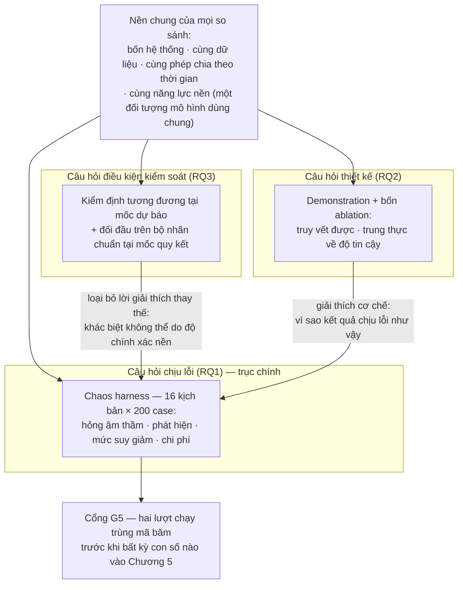
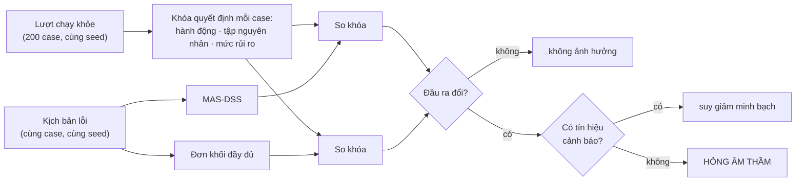

# CHƯƠNG 4 — PHƯƠNG PHÁP ĐÁNH GIÁ

> **Ghi chú điều phối — không thuộc nội dung luận văn.** Bản thảo viết ngày 17/08/2026 theo yêu cầu
> tách "Phương pháp đánh giá" thành một chương riêng, biên tập lại từ ba nguồn chuẩn:
> [ch3-phuong-phap.md](ch3-phuong-phap.md) §3.6–§3.11, [evaluation-handbook.md](../evaluation-handbook.md),
> và [research-questions-objectives.md](../research-questions-objectives.md) §3 + §7. **Chưa tích hợp
> vào bộ đánh số hiện hành**: tệp [ch4-thiet-ke-hien-thuc.md](ch4-thiet-ke-hien-thuc.md) đang giữ số
> "Chương 4", nên nếu dùng bản này làm Chương 4 thì hai chương sau phải đánh số lại, và các bảng
> "Bảng 4.x" ở hai tệp sẽ trùng số cho tới khi chốt phương án. Mọi con số trong bản này đối chiếu được
> về sổ tay đánh giá, bản cập nhật 15/08/2026.

Chương này trình bày phương pháp đánh giá của nghiên cứu: mỗi câu hỏi nghiên cứu được trả lời bằng
đại lượng nào, đo trên dữ liệu nào, bằng thí nghiệm nào, và phán quyết theo tiêu chí nào. Nguyên tắc
tổ chức của chương là **đi ngược từ câu hỏi về phép đo**: không phép đo nào được đưa vào chỉ vì nó dễ
tính hoặc quen thuộc; mỗi phép đo phải chỉ ra được nó phục vụ vế nào của câu hỏi nào, và ngược lại,
mỗi vế của mỗi câu hỏi phải có ít nhất một phép đo phụ trách. Chương chỉ mô tả *cách đo* và *tiêu chí
phán quyết* — các con số đo được trình bày ở Chương 5; những giá trị xuất hiện trong chương này là
tham số thiết kế, ngưỡng khai báo trước, hoặc chất lượng của chính dụng cụ đo.

---

## 4.1 Nguyên tắc đánh giá và ma trận truy vết

### 4.1.1 Đánh giá bám trực tiếp vào mục tiêu và câu hỏi nghiên cứu

Ba mục tiêu cụ thể của luận văn ánh xạ một–một với ba câu hỏi nghiên cứu (Chương 1, mục 1.2 và 1.4),
và phương pháp đánh giá được thiết kế để bảo toàn ánh xạ đó cho tới tận từng bảng số liệu. Bảng 4.1
trình bày ma trận truy vết: đọc theo hàng, mỗi mục tiêu dẫn tới một câu hỏi, câu hỏi dẫn tới giả
thuyết (nếu có), giả thuyết dẫn tới thí nghiệm, thí nghiệm dẫn tới chỉ số chính và tiêu chí phán
quyết. Ma trận này là hợp đồng của toàn bộ phần đánh giá: một chỉ số không xuất hiện trong ma trận
thì không được dùng làm luận cứ, và một ô của ma trận không có chỉ số phụ trách thì câu hỏi tương ứng
chưa được trả lời.

**Bảng 4.1.** Ma trận truy vết từ mục tiêu nghiên cứu tới phép đo và tiêu chí phán quyết

| Mục tiêu | Câu hỏi | Giả thuyết | Thí nghiệm / phép đo | Chỉ số chính | Tiêu chí phán quyết |
|---|---|---|---|---|---|
| **MT1** — phương pháp đánh giá chịu lỗi | **RQ1** — câu hỏi chịu lỗi *(trục chính)* | H2, H3 | Chaos harness: 5 nhóm lỗi × 3 mức, cùng kịch bản trên hai kiến trúc, ở cả hai mốc quyết định | tỷ lệ hỏng âm thầm; độ trễ phát hiện; tỷ lệ báo động giả; chi phí (bề mặt hỏng, thời gian, quy mô mã) | H2: hỏng âm thầm thấp hơn rõ rệt trên bề mặt dùng chung, ở cả hai mốc · H3: phát hiện drift trước khi chất lượng suy giảm |
| **MT2** — kiến trúc và bốn nguyên lý thiết kế | **RQ2** — câu hỏi thiết kế | — *(demonstration)* | Chạy end-to-end; đối chiếu trace; bốn thí nghiệm ablation, mỗi nguyên lý một | tỷ lệ trace tái lập được; độ phân kỳ trace; ràng buộc mức suy giảm; chênh lệch chỉ số khi gỡ từng cơ chế | mỗi nguyên lý có cơ chế cưỡng chế trong mã nguồn **và** một ablation cho thấy hệ quả khi gỡ bỏ |
| **MT3** — prototype và điều kiện so sánh không thiên lệch | **RQ3** — câu hỏi điều kiện kiểm soát | H1 | Kiểm định tương đương tại mốc dự báo; đối đầu trên bộ nhãn chuẩn tại mốc quy kết | PR-AUC (dự báo); macro-F1 đa nhãn và số đơn cho kết quả khác nhau (quy kết) | H1: tương đương trong biên ±0,01 khai báo trước — và tương đương **là kết quả mong muốn** |

Thứ tự trình bày trong ma trận theo trọng số đóng góp, nhưng thứ tự **logic** của phép đánh giá thì
ngược lại: điều kiện kiểm soát phải được xác lập trước. Nếu kiến trúc đề xuất và kiến trúc đối chứng
khác nhau về độ chính xác nền, thì mọi khác biệt quan sát được ở thí nghiệm chịu lỗi đều có thể quy
cho chất lượng mô hình thay vì cho cách tổ chức kiến trúc, và câu hỏi chịu lỗi mất cơ sở nhân quả.
Hình 4.1 mô tả quan hệ đó: câu hỏi điều kiện kiểm soát loại bỏ lời giải thích thay thế cho câu hỏi
chịu lỗi, còn câu hỏi thiết kế cung cấp lời giải thích cơ chế cho kết quả của nó.

**Hình 4.1.** Cấu trúc của phương pháp đánh giá. Ba câu hỏi không được đánh giá độc lập mà theo một
quan hệ phân công: câu hỏi điều kiện kiểm soát xác lập nền, câu hỏi chịu lỗi mang đóng góp chính, câu
hỏi thiết kế giải thích cơ chế. Không con số nào đi vào chương kết quả trước khi qua cổng tái lập.

### 4.1.2 Ba ranh giới chi phối mọi con số

Trước khi đi vào từng câu hỏi, ba ranh giới áp dụng chung cho toàn bộ phần đánh giá cần được nêu, bởi
chúng quyết định một con số *có được trích* và *được trích với tư cách gì*.

**Ranh giới thứ nhất là nguồn gốc nhãn.** Mọi chỉ số quy kết nguyên nhân chỉ có hiệu lực khi tính
trên bộ nhãn do hai người gán độc lập (nguồn gốc `human_independent`). Ràng buộc này không phải quy
ước mà được cưỡng chế bằng kiểu dữ liệu: trường nguồn gốc (`Provenance`) không có giá trị mặc định,
và cờ `citable` lan truyền từ bộ nhãn qua từng bảng kết quả tới từng cột trong tệp xuất. Một bộ nhãn
tạm do mô hình hỗ trợ gán sẽ tự động lật mọi bảng sang `citable = False`, và phép thử ngược cho cơ
chế này — truyền nhãn tạm vào rồi xác nhận cờ lật — là một bài kiểm thử bắt buộc.

**Ranh giới thứ hai là kiểm tra đặc tả đối lập với kết quả thực nghiệm.** Một số phép đo xác nhận
rằng một cơ chế đã được cài đúng như thiết kế; chúng vẫn được báo cáo nhưng không được dùng làm luận
cứ chính, bởi cơ chế được viết ra để vượt qua đúng phép đo đó. Ranh giới này được vật chất hóa bằng
cột `designed_for` trong tệp kết quả chịu lỗi: nhóm lỗi mà cơ chế bảo vệ được thiết kế riêng để bắt
cho kết quả thuộc loại kiểm tra đặc tả; nhóm lỗi không được thiết kế riêng mới cho kết quả thực
nghiệm theo nghĩa nghiêm ngặt. Cách phân loại chi tiết nằm ở mục 4.3.4.

**Ranh giới thứ ba là mô tả đối lập với kiểm định.** Toàn bộ phần đánh giá chỉ chứa **một** phép kiểm
định khẳng định duy nhất — so sánh macro-F1 giữa hai kiến trúc trên bộ nhãn chuẩn. Mọi bảng còn lại,
kể cả các lát cắt theo nhóm đơn hàng, là thống kê mô tả. Phân biệt này quyết định câu hỏi hiệu chỉnh
đa kiểm định: vì chỉ có một kiểm định khẳng định, không áp dụng hiệu chỉnh Holm hay Bonferroni, và
lựa chọn đó được khai báo tại đây thay vì để người đọc tự suy đoán.

---

## 4.2 Bốn hệ thống tham gia so sánh và điều kiện so sánh công bằng

Phép đánh giá so sánh bốn hệ thống chạy trên cùng dữ liệu và cùng phép chia tập theo thời gian, trình
bày ở Bảng 4.2. Hai hệ đầu chỉ tham gia phần mô tả phạm vi chức năng; hai hệ sau là hai vế của mọi
phép so sánh có ý nghĩa trong luận văn.

**Bảng 4.2.** Bốn hệ thống tham gia so sánh và vai trò của từng hệ

| Hệ thống | Mô tả | Vai trò trong đánh giá |
|---|---|---|
| Báo cáo kiểu MIS | thống kê mô tả theo ngưỡng, không dự báo | mốc phạm vi chức năng |
| Mô hình học máy đơn lẻ | một mô hình dự báo, không quy kết, không hành động | mốc phạm vi chức năng |
| **Đơn khối đầy đủ** (Monolithic-Complete) | đủ chức năng dự báo – quy kết – hành động, gọi tuần tự | **đối chứng chính** của mọi thí nghiệm |
| **MAS-DSS** | kiến trúc đa tác tử đề xuất | artifact được đánh giá |

Điều kiện để phép so sánh có nghĩa là **đối chứng không bị làm yếu**, và điều kiện này được cưỡng chế
ở ba tầng chứ không phó mặc cho thiện chí. Thứ nhất, hai kiến trúc dùng **chung một đối tượng mô
hình trong bộ nhớ** — cùng mô hình dự báo, cùng bộ phân loại nguyên nhân, cùng tập luật — và sự dùng
chung được kiểm bằng phép so sánh định danh đối tượng, không phải bằng so sánh giá trị. Thứ hai, đối
chứng dùng đầu ra **đa nhãn** với cùng ngưỡng quyết định; một bài kiểm tra quét cây cú pháp của mã
nguồn cấm phép chọn một nhãn tốt nhất (`argmax`), bởi một đối chứng đơn nhãn sẽ thua kiến trúc đề
xuất theo cấu tạo ở nhóm đơn hàng nhiều nguyên nhân — bài học từ chính một bản cài đặt trước của
nghiên cứu. Thứ ba, cùng một kịch bản lỗi được áp lên cả hai kiến trúc qua cùng một bộ tiêm (mục
4.3.3).

Một quyết định cấu hình phải được khai báo minh bạch tại đây vì nó ảnh hưởng tới cách đọc mọi kết
quả phối hợp: trong cấu hình dùng để báo cáo, **ràng buộc ngân sách tính toán của giao thức đấu thầu
được tắt**. Lý do là phép đo trên bộ nhãn chuẩn cho thấy ràng buộc này cắt đúng các phiên cần nhiều
tác tử tham gia nhất, làm suy giảm chất lượng quy kết trong khi khoản tiết kiệm thời gian không đáng
kể. Hệ quả trung thực của quyết định này: pha khai báo năng lực của giao thức đấu thầu vẫn chạy
nhưng không còn quyết định phân bổ tài nguyên nào, và phản biện *"kiến trúc này thực chất là một
ensemble được gắn nhãn giao thức"* đúng ở chiều phân bổ tài nguyên trong cấu hình báo cáo. Điều đó
được nêu tại đây và nhắc lại ở phần giới hạn (mục 4.8), thay vì để người đọc tự phát hiện.

---

## 4.3 Phương pháp đánh giá câu hỏi chịu lỗi

### 4.3.1 Thao tác hóa bốn vế của câu hỏi

Câu hỏi chịu lỗi (RQ1) có bốn vế — hỏng âm thầm, phát hiện, mức suy giảm, chi phí — và mỗi vế được
quy về đại lượng đo được như ở Bảng 4.3. Nguyên tắc chung cho cả bốn vế: đại lượng phải quan sát được
từ bên ngoài hệ thống, không dựa vào việc hệ thống tự báo cáo về mình.

**Bảng 4.3.** Thao tác hóa bốn vế của câu hỏi chịu lỗi

| Vế | Đại lượng đo | Loại bằng chứng |
|---|---|---|
| (a) hỏng âm thầm | tỷ lệ case có đầu ra khác lượt chạy khỏe mà hệ thống không phát tín hiệu nào | thực nghiệm với đối chứng; kiểm tra đặc tả với kiến trúc đề xuất trên nhóm lỗi được thiết kế riêng |
| (b) phát hiện | có hay không phát cảnh báo; độ trễ phát hiện tính bằng số quan sát trước khi cảnh báo phát; tỷ lệ báo động giả trên lượt chạy khỏe | thực nghiệm |
| (c) mức suy giảm | phân bố mức suy giảm gắn trên toàn bộ quyết định dưới từng kịch bản | mô tả |
| (d) chi phí | bề mặt hỏng (số thành phần có thể hỏng); thời gian xử lý mỗi case và mỗi lô; quy mô mã nguồn của tầng chịu lỗi và tầng phối hợp | mô tả — không có ngưỡng phán quyết khai báo trước |

Vế chi phí cố ý được đặt ở tầng báo cáo mô tả chứ không ở tầng giả thuyết. Một bản trước của nghiên
cứu từng phát biểu *"cái giá nằm trong ngưỡng chấp nhận được"* như một giả thuyết, và mệnh đề ấy bị
loại vì ngưỡng chấp nhận được chưa từng được đặc tả — đặt ngưỡng sau khi đã biết kết quả là chọn
ngưỡng cho vừa số liệu. Chi phí vì vậy được báo cáo đầy đủ để người đọc tự phán quyết theo bối cảnh
vận hành của họ.

### 4.3.2 Định nghĩa hỏng âm thầm và tính đối xứng của tín hiệu cảnh báo

Hỏng âm thầm là khái niệm trung tâm của câu hỏi chịu lỗi, nên định nghĩa của nó phải chặt ở cả hai
đầu: *sự thật nền* lấy từ đâu, và *tín hiệu cảnh báo* được nhận diện thế nào. Định nghĩa gồm ba bước.
Trước hết, hệ thống chạy một **lượt khỏe** trên cùng 200 case, và khóa quyết định của từng case —
gồm hành động, tập nguyên nhân, mức rủi ro — được chụp lại làm sự thật nền. Tiếp theo, dưới mỗi kịch
bản lỗi, một case được tính là **đổi đầu ra** nếu khóa quyết định của nó khác lượt chạy khỏe. Cuối
cùng, case là **hỏng âm thầm** nếu nó đổi đầu ra *và* hệ thống không phát bất kỳ tín hiệu cảnh báo
nào. Hình 4.2 mô tả quy trình này.

**Hình 4.2.** Ba bước xác định hỏng âm thầm. Sự thật nền là lượt chạy khỏe chứ không phải lời tự báo
cáo của hệ thống; cùng một cây phân loại áp cho cả hai kiến trúc.

Hai chi tiết của định nghĩa cần được biện minh, bởi cả hai đều là chỗ một thiết kế bất cẩn sẽ nghiêng
kết quả về phía kiến trúc đề xuất. Thứ nhất, sự thật nền lấy từ lượt chạy khỏe chứ không từ tự báo
cáo, vì định nghĩa theo tự báo cáo mù hoàn toàn với lỗi Byzantine — một thành phần trả về hằng số
không tự biết mình sai. Thứ hai, khóa quyết định **cố ý không chứa** mức suy giảm và cờ chuyển giao
cho con người: nó phải đo *nội dung quyết định* tách rời khỏi *việc có cảnh báo hay không*, nếu không
hai khái niệm "đổi đầu ra" và "có cảnh báo" sẽ trộn vào nhau và tỷ lệ hỏng âm thầm mất nghĩa.

Tín hiệu cảnh báo phải được nhận diện bằng **cùng một câu hỏi** cho cả hai kiến trúc, theo Bảng 4.4.
Nếu chỉ đi tìm cơ chế cảnh báo của kiến trúc đề xuất rồi kết luận rằng đối chứng "không có gì", đối
chứng bị làm yếu bằng định nghĩa. Nghiên cứu đã mắc đúng lỗi này ở một bản đo trước — đầu ra bị đổi
của đơn khối bị tính là hỏng âm thầm kể cả khi nó đã ghi nhận bước thất bại vào trường
`failed_steps` — và sai lệch nghiêng về phía có lợi cho artifact của chính nghiên cứu; phân tích đầy
đủ nằm ở phần phản tư phương pháp của Chương 5.

**Bảng 4.4.** Tín hiệu cảnh báo được nhận diện đối xứng giữa hai kiến trúc

| Kiến trúc | Kênh phát tín hiệu được tính là cảnh báo |
|---|---|
| MAS-DSS | mức suy giảm lớn hơn không (`degradation_level > 0`); cờ yêu cầu con người xem lại (`needs_human_review`); hành động chuyển giao (`escalate_to_human`) |
| Đơn khối đầy đủ | trường ghi các bước đã thất bại (`failed_steps`) khác rỗng |

### 4.3.3 Giao thức tiêm lỗi: năm nhóm, ba mức, mười sáu kịch bản

Thí nghiệm chịu lỗi gồm **16 kịch bản**: năm nhóm lỗi, mỗi nhóm ba mức độ, cộng một lượt chạy khỏe
làm nền; mỗi kịch bản chạy trên 200 case với cùng seed, ở **cả hai mốc quyết định**. Bảng 4.5 trình
bày phân loại. Hai cột cuối là hai thuộc tính phân loại quan trọng nhất: cột *có ném ngoại lệ* phân
chia lỗi mà một khối `try/except` thông thường bắt được với lỗi trả về giá trị hợp lệ nhưng sai; cột
*được thiết kế riêng* đánh dấu ranh giới giữa kiểm tra đặc tả và kết quả thực nghiệm đã nêu ở mục
4.1.2.

**Bảng 4.5.** Năm nhóm lỗi, ba mức độ và hai thuộc tính phân loại

| Nhóm lỗi | Cách tiêm | Ba mức độ | Có ném ngoại lệ | Cơ chế bảo vệ được thiết kế riêng |
|---|---|---|---|---|
| Sập (crash) | thành phần ném lỗi tất định | 1, 2, 3 thành phần | có | có |
| Treo (hang) | trễ vượt hạn chót, sinh sự kiện hết hạn thật | 1, 2, 3 thành phần | có | có |
| Byzantine thô | ghi đè kết quả thành hằng số | 1, 2, 3 thành phần | **không** | có |
| Dịch chuyển phân phối (drift) | dịch phân phối đặc trưng ở tầng case | 5%, 10%, 20% độ lệch chuẩn | **không** | **không** |
| Lệch hệ thống (bias) | cộng một lượng vào điểm tin cậy | +0,05; +0,15; +0,30 | **không** | **không** |

Ba quyết định thiết kế của giao thức cần được giải thích. Thứ nhất, bộ tiêm nhắm vào **thành phần
logic**, không nhắm vào tác tử: kiến trúc đa tác tử ánh xạ mỗi tác tử sang một thành phần logic, còn
kiến trúc đơn khối gọi cùng thành phần đó qua một lớp bọc chung, nhờ vậy cùng một kịch bản áp được
lên hai kiến trúc có cấu trúc hoàn toàn khác nhau — điều kiện tồn tại của phép so sánh. Thứ hai,
dịch chuyển phân phối được áp ở **tầng case**, trước khi case đi vào hệ thống, vì nó là thuộc tính
của dòng dữ liệu chứ không phải hành vi sai của một thành phần; mô hình hóa nó theo thành phần sẽ
khiến nhiễu loạn chỉ chạm tới một kiến trúc. Thứ ba, độ trễ của nhóm treo được đặt **bên trong phạm
vi chờ**, sinh ra một sự kiện hết hạn thật với tác vụ bị hủy, chứ không phải một phép mô phỏng độ
trễ sau khi tác tử đã chạy xong.

Điều kiện để mọi con số của thí nghiệm có nghĩa là **lượt chạy khỏe phải sạch**: không suy giảm nào
được gắn, không cơ chế bảo vệ nào can thiệp, và tỷ lệ báo động giả bằng không. Một bộ giám sát kêu
liên tục thì tỷ lệ phát hiện cao không chứng minh điều gì, nên ba số này được kiểm và báo cáo trước
mọi bảng kết quả chịu lỗi.

### 4.3.4 Phạm vi bề mặt hỏng và hồ sơ sửa đổi giả thuyết thứ hai

Giả thuyết thứ hai — hỏng âm thầm thấp hơn — được khai báo trước thí nghiệm với phát biểu nguyên
văn: *"Dưới tiêm lỗi có kiểm soát, MAS-DSS đạt tỷ lệ hỏng âm thầm thấp hơn đáng kể so với kiến trúc
đơn khối — trên toàn bộ bề mặt hỏng của nó, ở cả hai mốc quyết định, kể cả năm thành phần mà kiến
trúc đơn khối không có."* Hai mệnh đề phạm vi trong phát biểu này được đưa vào có chủ đích để giả
thuyết khó thỏa mãn hơn.

Ngày 14/08/2026, **sau khi đã chạy thí nghiệm**, phạm vi của giả thuyết được thu hẹp về **bề mặt
thành phần dùng chung**: mệnh đề *"trên toàn bộ bề mặt hỏng"* và vế về các thành phần riêng có bị
gỡ. Vì sửa một giả thuyết sau khi thấy kết quả là thao tác mang rủi ro phương pháp (HARKing), việc
sửa được thực hiện kèm hồ sơ đầy đủ thay vì lặng lẽ, và ba điều sau phải được nói rõ. Một, căn cứ
của việc thu hẹp là một sự thật về artifact kiểm chứng được bằng đọc mã nguồn: tầng giám sát chỉ
đăng ký cơ chế bảo vệ cho các thành phần dùng chung, chưa bao giờ được thiết kế để phủ bốn thành
phần riêng có của kiến trúc đa tác tử (thành phần thứ năm — bộ quản lý hồ sơ — không nằm trong kế
hoạch điều phối nào nên không thể hỏng, và đếm nó vào bề mặt hỏng là đếm thừa). Hai, phát biểu gốc
**đã từng được đo** trước khi thu hẹp và **thất bại** ở nhóm thành phần riêng có; artifact tương ứng
được chuyển vào khu vực ngoài phạm vi kèm lý do, không bị xóa. Ba, bản sửa **dễ thỏa mãn hơn** bản
gốc, và chương kết quả phải nói đúng như vậy thay vì trình bày giả thuyết như một phép thử khắt khe
đã vượt qua. Mệnh đề phạm vi còn lại — *ở cả hai mốc quyết định* — vẫn được giữ và vẫn ràng buộc
thật: chỉ cần mốc dự báo cho kết quả khác mốc quy kết là giả thuyết thất bại.

### 4.3.5 Đo chi phí: quy tắc cùng cơ sở đo

Vế chi phí của câu hỏi chịu lỗi dùng ba đại lượng. **Bề mặt hỏng** — số thành phần có thể hỏng — là
thước đo chính, vì mili giây và dòng mã đo quy mô công việc, còn số thành phần có thể hỏng đo đúng
thứ câu hỏi quan tâm: rủi ro đã tạo thêm. **Thời gian xử lý** được đo bằng đồng hồ tường cho *cả
hai* kiến trúc trong cùng một tiến trình, và được báo cáo dưới dạng khoảng qua nhiều lượt đo thay vì
một con số, vì phép đo bằng đồng hồ không tất định. **Quy mô mã nguồn** của tầng chịu lỗi và tầng
phối hợp chỉ mang tính mô tả.

Quy tắc chi phối phép đo thời gian là **hai vế của một phép so sánh phải đo trên cùng một cơ sở**.
Quy tắc này được rút ra từ một lỗi đo có thật của nghiên cứu: một bản trước lấy tổng thời lượng các
lời gọi năng lực cho kiến trúc đề xuất (bỏ qua phần điều phối và toàn bộ phần ghi nhật ký) nhưng lấy
thời gian đồng hồ của cả vòng lặp cho đối chứng — hai sai lệch cùng có lợi cho kiến trúc đề xuất, và
con số công bố sai hơn một bậc độ lớn. Bản hiện hành đo đồng hồ tường cho cả hai vế trong cùng tiến
trình, phần chi phí ghi nhật ký được phân rã riêng để người đọc thấy phần nào thuộc kiến trúc và
phần nào thuộc lựa chọn độ bền nhật ký, và hai bài kiểm thử canh giữ việc hai vế không bao giờ tách
cơ sở đo lần nữa.

---

## 4.4 Phương pháp đánh giá câu hỏi thiết kế

### 4.4.1 Loại bằng chứng: demonstration

Câu hỏi thiết kế (RQ2) là một mệnh đề quy phạm — nó nói kiến trúc *nên* được thiết kế thế nào — chứ
không phải một mệnh đề về tổng thể thống kê, nên loại bằng chứng phù hợp là **demonstration**: chứng
minh bằng một hiện thực vận hành được, kèm các thí nghiệm gỡ bỏ cơ chế. Sự vắng mặt của giá trị p ở
phần này là có chủ đích và được khai báo trước; đòi hỏi kiểm định thống kê cho một mệnh đề quy phạm
là nhầm loại tuyên bố.

Để demonstration không rơi xuống mức mô tả, hai điều kiện được đặt ra. Thứ nhất, hai thuộc tính nêu
trong câu hỏi — *truy vết được* và *trung thực về độ tin cậy* — phải được quy về đại lượng quan sát
được (mục 4.4.2). Thứ hai, mỗi nguyên lý thiết kế phải có một thí nghiệm ablation cho biết chất
lượng thay đổi ra sao khi cơ chế tương ứng bị gỡ bỏ (mục 4.4.3); nguyên lý nào không có ablation thì
chỉ là một phát biểu, không phải một nguyên lý đã kiểm chứng.

### 4.4.2 Thao tác hóa hai thuộc tính

Hai thuộc tính trong câu hỏi thiết kế đều là tính từ, và một tính từ thì không đo được. Bảng 4.6
trình bày cách quy mỗi thuộc tính về đại lượng cụ thể.

**Bảng 4.6.** Thao tác hóa hai thuộc tính của câu hỏi thiết kế

| Thuộc tính | Đại lượng đo | Cách cưỡng chế |
|---|---|---|
| Quyết định *truy vết được* | tỷ lệ decision trace tái lập được **hoàn toàn** chỉ từ nhật ký thông điệp; độ phân kỳ giữa trace dựng từ nhật ký và trace viết tay từ đối tượng quyết định, phân rã theo loại sự kiện | cổng G4: một bài kiểm thử dựng lại trace chỉ từ nhật ký, không dùng bất kỳ trạng thái nào ngoài nhật ký |
| Quyết định *trung thực về độ tin cậy* | mức suy giảm là trường **bắt buộc** của mọi quyết định; tỷ lệ quyết định tự động được sinh khi mức suy giảm lớn hơn không phải bằng **0** | trường không có giá trị mặc định trong kiểu dữ liệu; bất biến "suy giảm kéo theo yêu cầu con người xem lại" kiểm lúc khởi tạo đối tượng |

Chỉ số độ phân kỳ ở hàng thứ nhất cần một lời giải thích về hướng đo. Phép đối chiếu không hỏi trace
viết tay có *sai* hay không — nó thường đúng ở những gì nó nói — mà hỏi nó **thiếu** những loại sự
kiện nào mà nhật ký giao tiếp có: lời từ chối kèm lý do, bản khai năng lực, kết quả trao thầu, phản
bác của tác tử phản biện. Độ phân kỳ vì vậy đo phần thông tin chỉ tồn tại khi nguồn gốc quyết định
được lấy từ giao tiếp, tức đo đúng giá trị gia tăng mà nguyên lý thứ tư tuyên bố.

### 4.4.3 Bốn thí nghiệm ablation cho bốn nguyên lý

Mỗi nguyên lý thiết kế được gắn với một cơ chế cưỡng chế trong mã nguồn và một thí nghiệm ablation:
gỡ đúng cơ chế đó, giữ nguyên mọi thứ khác, đo lại chỉ số phụ trách. Bảng 4.7 trình bày thiết kế của
bốn thí nghiệm; kết quả trình bày ở Chương 5.

**Bảng 4.7.** Thiết kế bốn thí nghiệm ablation

| Nguyên lý | Cơ chế bị gỡ trong ablation | Chỉ số phụ trách | Câu hỏi ablation trả lời |
|---|---|---|---|
| DP1 — suy giảm minh bạch | toàn bộ tầng chịu lỗi | hỏng âm thầm dưới lỗi Byzantine | thiếu thang suy giảm thì bao nhiêu quyết định đổi mà không ai biết? |
| DP2 — đa nhãn, cạnh tranh khi thẩm quyền chồng lấn | so với đối chứng đa nhãn cùng năng lực | số đơn hai kiến trúc cho kết quả khác nhau | cơ chế đấu thầu có tạo khác biệt đầu ra không? *(vai trò điều kiện kiểm soát)* |
| DP3 — từ chối thay vì đoán | quyền từ chối (`REFUSE`) bị cấm, buộc trả lời mọi case | tỷ lệ quy kết sai trên nhóm đơn mà người gán bỏ trống; precision từng nhãn | ép hệ thống đoán thì cái giá là gì? |
| DP4 — nguồn gốc từ giao tiếp | trace dựng từ đối tượng quyết định thay vì từ nhật ký | độ phân kỳ giữa hai cách dựng trace | bỏ nhật ký giao tiếp thì mất bao nhiêu phần lịch sử quyết định? |

Riêng thí nghiệm cho nguyên lý thứ ba cần một chỉ số đi kèm để phép đánh giá không tự mâu thuẫn:
macro-F1 thuần phạt việc từ chối trả lời, nên một hệ thống biết im lặng đúng lúc sẽ thua theo cấu
tạo nếu chỉ đo bằng macro-F1. Vì vậy nhóm chỉ số **selective prediction** — độ phủ, chất lượng trên
phần đã trả lời, và đặc biệt *tỷ lệ quy kết sai trên nhóm đơn mà chính người gán cũng bỏ trống* —
được đưa vào như điều kiện để quyền từ chối được đánh giá công bằng (chi tiết ở mục 4.5.3).

---

## 4.5 Phương pháp đánh giá câu hỏi điều kiện kiểm soát

### 4.5.1 Logic của kiểm định tương đương

Câu hỏi điều kiện kiểm soát (RQ3) đòi chứng minh *hai kiến trúc không khác nhau về độ chính xác*, và
mệnh đề đó quyết định loại kiểm định. Một kiểm định khác biệt không bác bỏ được giả thuyết vô hiệu
**không phải** bằng chứng cho sự tương đương — nó chỉ là bằng chứng cho việc thiếu bằng chứng. Vì
vậy tại mốc dự báo, phép đo là **kiểm định tương đương** (TOST — two one-sided tests, hai kiểm định
một phía) trên chỉ số PR-AUC với biên tương đương **±0,01 khai báo trước** khi chạy thí nghiệm; tại
mốc quy kết, phép đo là **số đơn hàng hai kiến trúc cho kết quả khác nhau** trên bộ nhãn chuẩn, kèm
kiểm định McNemar và khoảng tin cậy bootstrap cho chênh lệch macro-F1.

Đi trước cả hai phép kiểm định là một phép kiểm tra cấu trúc: xác nhận hai kiến trúc thực sự dùng
chung năng lực nền bằng so sánh từng phần tử của hai dãy điểm với dung sai 10⁻¹². Khi hai dãy giống
hệt nhau, kiểm định tương đương trở thành hình thức — công cụ tự đánh dấu trường hợp này là
`identical = True` kèm ghi chú *tautology*, và kết quả phải được báo cáo đúng tư cách của nó: một
**kiểm tra đặc tả** xác nhận điều kiện kiểm soát đã được thiết lập đúng, không phải một phát hiện
thực nghiệm.

### 4.5.2 Chỉ số tại mốc dự báo

Chỉ số chính tại mốc dự báo là **PR-AUC** — diện tích dưới đường precision–recall. Lựa chọn này bắt
nguồn từ cấu trúc dữ liệu: lớp dương (đơn bất mãn) chỉ chiếm 12,74% kỳ kiểm thử, và trên dữ liệu mất
cân bằng như vậy ROC-AUC lạc quan giả vì nó thưởng cho việc xếp hạng đúng phần âm vốn đã áp đảo;
ROC-AUC vẫn được báo cáo nhưng ở vai phụ. Cùng lý do đó, **accuracy không được dùng làm chỉ số
chính**: với tỷ lệ nền 12,74%, một mô hình đoán *tất cả hài lòng* đạt accuracy 87,26% mà không can
thiệp vào đơn nào — một hệ phục hồi dịch vụ không can thiệp vào ai thì không có giá trị nào, dù
accuracy đẹp. Bảng 4.8 tổng hợp bộ chỉ số.

**Bảng 4.8.** Bộ chỉ số tại mốc dự báo

| Nhóm | Chỉ số | Vai trò |
|---|---|---|
| Xếp hạng | **PR-AUC** kèm khoảng tin cậy bootstrap; lift so với tỷ lệ nền | **chính** |
| Xếp hạng | ROC-AUC | phụ |
| Xếp hạng theo ngân sách can thiệp | precision tại 0,5% và 1% đơn rủi ro nhất | phụ, gắn với bối cảnh vận hành |
| Hiệu chuẩn | ECE (10 bin đều); Brier; **Brier skill so với hằng số bằng tỷ lệ nền** | bắt buộc — xem giải thích dưới |
| Điểm vận hành | precision, recall, F1 tại ngưỡng suy từ tập kiểm định | mô tả |
| Độ nhạy định nghĩa nhãn | lặp lại toàn bộ với ngưỡng nhãn `≤ 3` thay cho `≤ 2` | kiểm tính vững của kết luận |

Hai quy tắc đo lường của nhóm hiệu chuẩn cần nêu rõ. Thứ nhất, Brier phải được đặt cạnh **mốc hằng
số** — một dự báo luôn trả về tỷ lệ nền — vì chỉ số Brier đứng một mình không cho biết mô hình có
thắng nổi phương án tầm thường hay không; chênh lệch này (Brier skill) là con số được báo cáo. Thứ
hai, hiệu chuẩn được khớp trên tập kiểm định và **chỉ được đánh giá trên kỳ kiểm thử**; số đo trên
chính tập đã khớp mang cờ `in_sample` chèn thẳng vào tên chỉ số để không thể trích nhầm — đo ECE
trên tập đã hiệu chuẩn cho giá trị gần không một cách giả tạo, và nghiên cứu đã từng mắc lỗi này.

### 4.5.3 Chỉ số tại mốc quy kết

Chỉ số chính tại mốc quy kết là **macro-F1 đa nhãn** tính trên ba nguyên nhân — giao hàng, chất
lượng, phục vụ — và **không tính nhãn không xác định**. Loại nhãn này khỏi trung bình là một quyết
định có căn cứ: *không xác định* là hệ quả của việc không quy kết được, không phải một nguyên nhân
thứ tư, và đưa nó vào macro-F1 sẽ thưởng cho hệ thống nào im lặng nhiều nhất. Bên cạnh con số gộp,
hai nhóm chỉ số bổ trợ là bắt buộc.

**Cắt lớp theo nhóm đơn hàng.** Macro-F1 gộp che mất đúng hai tình huống khó mà câu hỏi nghiên cứu
nêu đích danh, nên kết quả phải được cắt theo: nhóm đa nguyên nhân đối chiếu nhóm đơn nguyên nhân,
và tầng có văn bản đối chiếu tầng không văn bản. Với tầng không văn bản, phạm vi đề tài đã đặt nhóm
này ra ngoài (mục 4.8), và ô tương ứng để trống thay vì điền một con số không có nghĩa.

**Selective prediction.** Như đã nêu ở mục 4.4.3, macro-F1 thuần phạt quyền từ chối, nên bộ chỉ số
được bổ sung: độ phủ (tỷ lệ case hệ thống trả lời), chất lượng trên phần đã trả lời, chênh lệch giữa
hai con số đó (cái giá của im lặng), và tỷ lệ quy kết sai trên nhóm đơn mà người gán bỏ trống — chỉ
số cuối đo trực tiếp câu hỏi *im lặng có đúng lúc không*. Đường cong risk–coverage được dựng bằng
cách sắp case theo **độ tin cậy giảm dần**; cả hai kiến trúc buộc phải cung cấp cột độ tin cậy, và
thiếu cột này là lỗi dừng chương trình chứ không phải cảnh báo — quy tắc này thay cho một bản cài
đặt trước trong đó đường cong bị cắt theo thứ tự dòng, tức một phép cắt ngẫu nhiên đội lốt selective
prediction.

**Phép kiểm định duy nhất.** So sánh khẳng định giữa hai kiến trúc dùng ba đại lượng: số ô bất đồng
trên bảng 300 đơn × 3 nhãn, kiểm định McNemar dạng nhị thức chính xác (không dùng xấp xỉ
chi-bình-phương, vì số ô bất đồng có thể rất nhỏ), và khoảng tin cậy bootstrap 95% cho chênh lệch
macro-F1 với phép lấy mẫu lại **theo đơn, theo cặp** — hai hệ chấm trên cùng đơn hàng nên phải được
lấy mẫu cùng nhau, nếu không phương sai của chênh lệch bị ước lượng sai.

### 4.5.4 Bộ nhãn chuẩn với tư cách dụng cụ đo

Mọi chỉ số ở mục 4.5.3 chỉ có nghĩa khi thước đo — bộ nhãn chuẩn — đáng tin, nên chất lượng của
chính dụng cụ đo thuộc về phương pháp đánh giá và được trình bày tại đây. Thiết kế lấy mẫu (cỡ mẫu
300, phân tầng theo trạng thái giao hàng kèm trọng số, chỉ rút từ kỳ kiểm thử) đã trình bày ở Chương
3; mục này nêu bốn điều kiện biến bộ nhãn thành một dụng cụ đo hợp lệ và chất lượng đo được của nó.

Thứ nhất, **tính độc lập giữa hai người gán được kiểm trước khi tính hệ số đồng thuận**. Hệ số Cohen
κ giả định hai phép đo độc lập; một vòng gán trước của nghiên cứu vi phạm giả định này (hai tệp nhãn
trùng ghi chú 96,4%) và cho κ = 0,957 mà không đo được gì. Bước kiểm độc lập nay chạy trước, và ở
vòng chính thức tỷ lệ hàng nhãn trùng khớp là 77,7% — đủ khác biệt để giả định độc lập đứng vững.
Thứ hai, **κ được tính theo từng nhãn với quy tắc cỡ mẫu tối thiểu**: nhãn có dưới 20 lượt gán dương
bị đánh dấu không đáng tin và loại khỏi trung bình nhưng vẫn nêu riêng, vì một nhãn cực hiếm cho κ
gần không hoặc âm ngay cả khi mức đồng ý gần tuyệt đối. Ở vòng chính thức, cả bốn nhãn đủ lượt gán
dương, và κ trung bình đạt **0,784** — vượt ngưỡng 0,6 của cổng chất lượng G2. Thứ ba, **quy tắc hợp
nhất hai bản gán là phép hợp (OR)**, dựa trên phân tích bất đồng: phần lớn bất đồng là một người
thấy bằng chứng người kia bỏ sót, chỉ 3,0% là xung đột thật sự về cách hiểu; hệ quả phải khai báo là
với các dòng xung đột thật, phép hợp gán cả hai nhãn mâu thuẫn, và điều này được nêu ở giới hạn hiệu
lực. Thứ tư, **văn bản của bộ nhãn chuẩn bị loại khỏi dữ liệu huấn luyện** của bộ phân loại nguyên
nhân bằng danh sách loại trừ cưỡng chế trong mã nguồn, và hàm đánh giá quy kết **từ chối nhãn yếu**
bằng ngoại lệ — hai chốt chặn cùng phá vòng tròn *sinh nhãn → huấn luyện → đánh giá bằng chính nhãn
đó* mà ràng buộc dữ liệu thứ hai đã cảnh báo.

### 4.5.5 Tầng hành động: đánh giá tập luật trong ranh giới của dữ liệu

Chuỗi ra quyết định của hệ thống kết thúc ở đề xuất hành động phục hồi dịch vụ, nên phương pháp đánh
giá phải phủ tới tầng luật — nhưng trong đúng ranh giới mà dữ liệu cho phép. Ràng buộc dữ liệu thứ
nhất (không có biến can thiệp) quy định: phép đánh giá đo **chất lượng khuyến nghị** — hệ thống có
đề xuất đúng loại hành động cho đúng nhóm đơn hay không — chứ **không đo hiệu quả can thiệp**, vì bộ
dữ liệu không ghi nhận hành động nào từng được áp dụng và không tồn tại kết cục phản thực. Mọi phát
biểu dạng *"hành động này giảm bất mãn X%"* đều vượt quá dữ liệu và không xuất hiện trong luận văn.

Trong ranh giới đó, mỗi luật được báo cáo bằng ba đại lượng — độ phủ, precision, và **lift** so với
tỷ lệ nền — và thuộc tính được kiểm là **tính đơn điệu của thang hành động**: mức can thiệp đắt hơn
phải có lift cao hơn, vì một mức can thiệp tốn kém mà không chọn lọc hơn mức rẻ thì không có lý do
tồn tại. Đây là báo cáo mô tả, không phải kiểm định giả thuyết.

---

## 4.6 Bộ máy thống kê

Toàn bộ tham số thống kê được khai báo tập trung ở Bảng 4.9 thay vì rải trong từng mục, để người đọc
kiểm được rằng không tham số nào được chọn sau khi thấy kết quả.

**Bảng 4.9.** Tham số thống kê dùng trong toàn bộ phần đánh giá

| Thành phần | Giá trị và quy ước |
|---|---|
| Bootstrap | B = 1.000, phương pháp percentile, α = 0,05 (khoảng tin cậy 95%) |
| Seed | 20260809, đặt từ một nơi duy nhất cho mọi nguồn ngẫu nhiên |
| Kiểm định tương đương (TOST) | biên ±0,01 khai báo trước; khoảng tin cậy 90% hai phía theo phân phối t |
| McNemar | dạng nhị thức chính xác, không dùng xấp xỉ chi-bình-phương |
| Bootstrap chênh lệch macro-F1 | lấy mẫu lại theo đơn, theo cặp; ghi số lần lặp hiệu dụng |
| Cỡ mẫu tối thiểu | κ: 20 lượt gán dương mỗi nhãn · hiệu chuẩn: 15 quan sát dương mỗi bin · giám sát dịch chuyển (PSI): 100 quan sát |
| Hiệu chỉnh đa kiểm định | không áp dụng — chỉ có một kiểm định khẳng định duy nhất (mục 4.1.2) |

Một chi tiết cài đặt có ảnh hưởng thống kê phải khai báo: hàm tính khoảng tin cậy bootstrap cho các
chỉ số dự báo **bỏ qua** (không thay thế) những mẫu bootstrap chỉ chứa một lớp, nên số lần lặp hiệu
dụng có thể nhỏ hơn 1.000; riêng phép bootstrap cho chênh lệch macro-F1 ghi lại số lần lặp hiệu dụng
để loại trừ mối nghi này.

---

## 4.7 Cổng chất lượng và tính tái lập

Phương pháp đánh giá được bảo vệ bằng sáu cổng chất lượng: mỗi cổng là một điều kiện phải đạt trước
khi nhóm số liệu tương ứng được phép đi vào chương kết quả, và mỗi cổng có tiêu chí kiểm được bằng
lệnh thay vì bằng nhận định. Bảng 4.10 liệt kê sáu cổng cùng hành vi khi cổng không đạt — cột này
quan trọng ngang cột tiêu chí, vì một cổng không có hệ quả khi trượt thì không phải cổng.

**Bảng 4.10.** Sáu cổng chất lượng của phương pháp đánh giá

| Cổng | Vị trí trong quy trình | Tiêu chí | Nếu không đạt |
|---|---|---|---|
| M0 | trước mọi thiết kế | thống kê khả thi của dữ liệu (tỷ lệ bất mãn, tỷ lệ có văn bản) nằm trong vùng dự kiến | xét lại phạm vi câu hỏi quy kết |
| G1 | sau tầng dữ liệu | thống kê mô tả trên tập đã dựng khớp bảng M0 trong sai số 1% | dừng, tìm lỗi ghép bảng trước khi đi tiếp |
| G2 | sau vòng gán nhãn | tính độc lập giữa hai người gán được xác nhận **và** κ ≥ 0,6 | sửa codebook và gán lại — vấn đề nằm ở định nghĩa nguyên nhân, không ở người gán |
| G3 | sau huấn luyện mô hình | mô hình rủi ro đủ tốt để có ý nghĩa nghiệp vụ | xử lý ngay — mọi tầng phía sau đứng trên nó |
| G4 | sau tầng phối hợp | decision trace dựng lại được **hoàn toàn** chỉ từ nhật ký thông điệp | sửa ngay — đây là bằng chứng của câu hỏi thiết kế, không phải chi tiết cài đặt |
| G5 | sau thí nghiệm chịu lỗi | hai lượt chạy cùng cấu hình cho tệp quyết định **trùng mã băm** | không con số chịu lỗi nào được vào luận văn |

Cổng G5 đáng dừng lại một đoạn vì nó là cổng nghiêm ngặt nhất: tiêu chí không phải "kết quả tương
tự" mà là **tái lập từng byte**. Điều kiện này khả thi nhờ các cơ chế tất định đã trình bày ở Chương
3 (seed tập trung, định danh băm tất định, không dùng đồng hồ hệ thống trong logic nghiệp vụ), và nó
loại trừ cả một lớp lỗi mà so sánh xấp xỉ sẽ bỏ lọt — hai lượt chạy "gần giống nhau" có thể che một
nguồn bất định chưa kiểm soát. Phép đo thời gian là ngoại lệ có chủ đích: nó dùng đồng hồ nên không
tất định, và vì vậy được để ngoài tệp đầu ra chính tắc để không phá vỡ phép kiểm mã băm.

Bên dưới các cổng là một lớp chốt chặn cưỡng chế bằng mã nguồn, mỗi chốt canh một lỗi phương pháp cụ
thể mà nghiên cứu đã mắc hoặc suýt mắc: hàm đánh giá quy kết từ chối nhãn yếu (chặn vòng tròn tự
tham chiếu); chuỗi nguồn gốc – `citable` (chặn số đo trên nhãn tạm lọt vào chương kết quả); cờ
`in_sample` (chặn ECE đo trên tập đã hiệu chuẩn); cờ `is_placeholder` (chặn bản tạm được báo cáo như
bản thật); cột `designed_for` (chặn kiểm tra đặc tả đội lốt phát hiện thực nghiệm); và bài kiểm thử
chặn mọi đường nạp dữ liệu vòng qua điểm vào duy nhất có khoảng cách ly. Kỷ luật kiểm thử đột biến —
mỗi bất biến phải được chứng minh là *đỏ vì đúng lý do* trước khi được tin — áp dụng cho các chốt
này như đã trình bày ở Chương 3, mục 3.11.

---

## 4.8 Giới hạn của phương pháp đánh giá

Phương pháp trình bày trong chương này có những ranh giới phải nêu trước khi đọc kết quả, và chúng
thuộc về *thiết kế đánh giá* chứ không phải về kết quả đo — phần giới hạn hiệu lực đầy đủ nằm ở
Chương 5.

Thứ nhất, **đánh giá đo chất lượng khuyến nghị, không đo hiệu quả can thiệp** (mục 4.5.5): kết luận
dạng "hệ thống đề xuất đúng hành động cho đúng nhóm đơn" là mức tuyên bố cao nhất mà dữ liệu cho
phép. Thứ hai, **tình huống đơn hàng không có văn bản nằm ngoài phạm vi**: phương pháp không kiểm
định được năng lực quy kết ở nhóm này, và ô tương ứng trong các bảng để trống. Thứ ba, **giả thuyết
về hỏng âm thầm đã bị thu hẹp phạm vi sau khi thấy kết quả** với hồ sơ sửa đổi đầy đủ (mục 4.3.4);
tuyên bố chịu lỗi của luận văn chỉ áp cho bề mặt thành phần dùng chung. Thứ tư, **ràng buộc ngân
sách của giao thức đấu thầu tắt trong cấu hình báo cáo** (mục 4.2), nên phần phân bổ tài nguyên của
giao thức không được kiểm chứng trong cấu hình chính. Thứ năm, **tầng văn bản dùng TF-IDF thay vì
mô hình ngôn ngữ theo kế hoạch**, khiến chi phí tính toán của các tác tử văn bản thấp hơn thiết kế
khoảng một bậc và ràng buộc ngân sách — ngay cả khi bật — yếu hơn dự kiến. Thứ sáu, **độ phủ giám
sát chưa trọn bề mặt dùng chung** (hai bộ phân loại nguyên nhân chưa có guard đăng ký), và điểm đấu
thầu của các tác tử là điểm thô chưa qua hiệu chuẩn — năng lực hiệu chuẩn bid tồn tại trong mã nguồn
nhưng chưa được nối vào đường chạy chính, nên phương pháp không tuyên bố điều đó. Cuối cùng, trong
năm ràng buộc dữ liệu, chỉ hai ràng buộc về nhãn và văn bản được cưỡng chế bằng mã nguồn; ràng buộc
về biến can thiệp và về kết cục giao hàng chỉ tồn tại dưới dạng quy ước được ghi chép — không có gì
trong mã nguồn ngăn một phiên bản tương lai phát biểu về hiệu quả can thiệp.

Một bất đối xứng đo lường trong thí nghiệm chịu lỗi cũng cần nêu trước: ở nhóm lỗi treo, kiến trúc
đơn khối không có hạn chót nên chỉ chạy chậm hơn rồi cho cùng kết quả, trong khi kiến trúc đề xuất
hết hạn và suy giảm. Trong thí nghiệm, độ trễ tiêm vào là hữu hạn nên đơn khối luôn hoàn thành;
trong vận hành thật, một thành phần treo vô hạn sẽ làm treo cả chuỗi. Phép đo vì vậy **không nắm bắt
được thiệt hại thật** của đơn khối ở nhóm này, và kết quả nhóm treo phải được đọc kèm chú thích đó.

---

## 4.9 Tóm tắt chương

Chương này đã trình bày phương pháp đánh giá được thiết kế ngược từ ba câu hỏi nghiên cứu: ma trận
truy vết bảo đảm mỗi vế của mỗi câu hỏi có phép đo phụ trách, và ba ranh giới — nguồn gốc nhãn, kiểm
tra đặc tả đối lập kết quả thực nghiệm, mô tả đối lập kiểm định — chi phối tư cách của từng con số.

Câu hỏi chịu lỗi được đánh giá bằng một giao thức tiêm lỗi gồm năm nhóm lỗi ở ba mức độ trên 200
case, với định nghĩa hỏng âm thầm ba bước lấy sự thật nền từ lượt chạy khỏe và nhận diện tín hiệu
cảnh báo đối xứng giữa hai kiến trúc; chi phí được báo cáo mô tả theo quy tắc cùng cơ sở đo. Câu hỏi
thiết kế được đánh giá bằng demonstration: hai thuộc tính quy về đại lượng quan sát được, và bốn
nguyên lý mỗi nguyên lý một thí nghiệm ablation. Câu hỏi điều kiện kiểm soát được đánh giá bằng kiểm
định tương đương với biên khai báo trước tại mốc dự báo và phép đối đầu trên bộ nhãn chuẩn tại mốc
quy kết, trong đó bộ nhãn được xác lập tư cách dụng cụ đo bằng kiểm tra độc lập, hệ số đồng thuận
theo nhãn, và các chốt chặn phá vòng tròn tự tham chiếu.

Sáu cổng chất lượng — từ khả thi dữ liệu tới tái lập từng byte — quyết định nhóm số liệu nào được
phép đi vào chương kết quả, và các giới hạn của chính phương pháp được khai báo trước khi bất kỳ con
số nào được đọc. Chương 5 trình bày kết quả đo được theo đúng khuôn khổ này.
