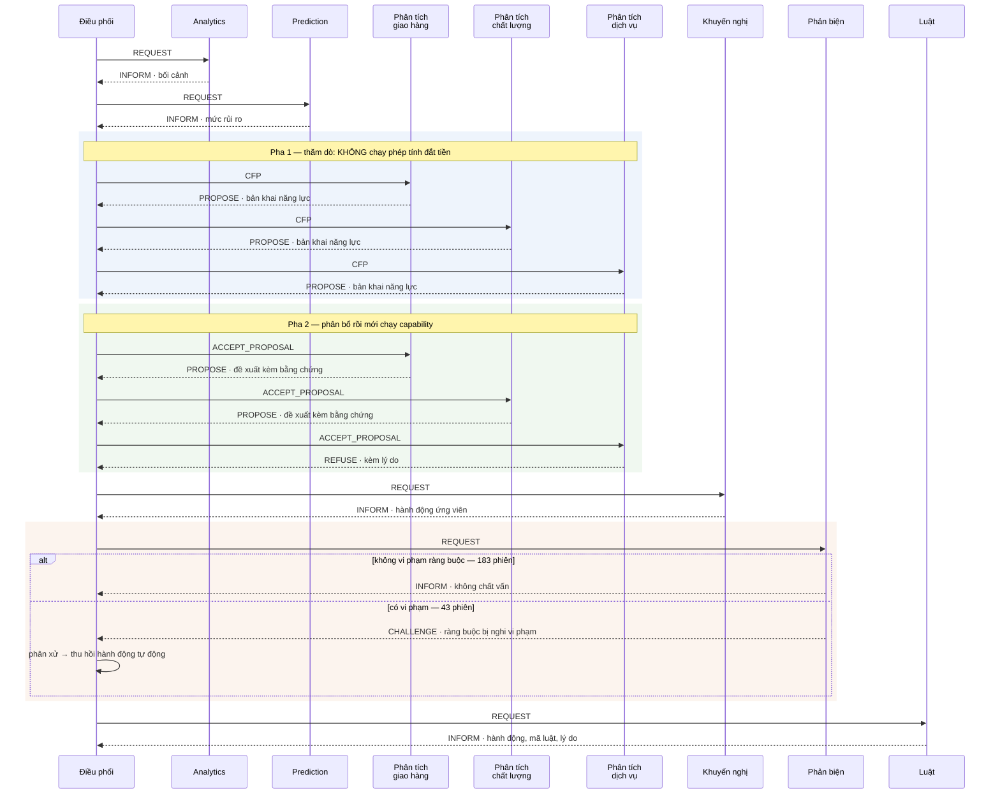

# CHƯƠNG 5 — KẾT QUẢ VÀ BÀN LUẬN

Chương này trình bày kết quả đo được và bàn luận ý nghĩa của chúng. Trình tự đi theo chuỗi quyết định
mà hệ thống thực hiện — bối cảnh dữ liệu, dự báo tại mốc thứ nhất, quy kết nguyên nhân tại mốc thứ hai,
tập luật sinh hành động, rồi quy trình phối hợp giữa các tác tử — trước khi chuyển sang trục chính của
luận văn là khả năng chịu lỗi, và khép lại bằng chi phí, các thí nghiệm ablation, phản tư phương pháp
và giới hạn hiệu lực.

**Một quy ước phải nêu trước.** Mỗi bảng trong chương được gán một trong hai nhãn. **Kết quả thực
nghiệm** là số liệu mà nghiên cứu không biết trước và cơ chế được đo không được thiết kế riêng để tạo
ra. **Kiểm tra đặc tả** là số liệu xác nhận rằng một cơ chế đã được cài đúng như thiết kế — nó vẫn được
báo cáo, nhưng **không được dùng làm luận cứ chính**. Việc xóa nhòa ranh giới này là cách dễ nhất để
một luận văn tự tô vẽ mà không nói sai câu nào, nên nó được giữ nguyên trong từng bảng.

Mọi con số trong chương truy được về một tệp trong `data/v3/` và tái lập được bằng một lệnh; ánh xạ đầy
đủ nằm ở [00-muc-luc.md](00-muc-luc.md) §2, còn định nghĩa từng chỉ số nằm ở
[evaluation-handbook.md](../evaluation-handbook.md).

---

## 5.1 Bối cảnh số liệu

### 5.1.1 Tổng thể và phép chia tập

Bảng 5.1 nhắc lại quy mô của hai tổng thể mà chương này làm việc trên đó. Sự bất đối xứng giữa hai cột
là hệ quả trực tiếp của việc một mốc quyết định ràng buộc **hai** thứ chứ không phải một, như đã lập
luận ở [§3.3.2](ch3-phuong-phap.md).

**Bảng 5.1.** Hai tổng thể và phép chia tập theo thời gian

| | Mốc dự báo | Mốc quy kết |
|---|---|---|
| Điều kiện thuộc tổng thể | đơn **còn kịp can thiệp** tại ngày mua + 7 | đơn **đã có đánh giá một hoặc hai sao** |
| Quy mô | 75.480 đơn *(76,5%)* | 98.673 đơn |
| Huấn luyện / kiểm định / kiểm thử | 52.835 / 9.077 / 11.322 | 63.986 / 13.383 / 18.952 |
| Tỷ lệ nền theo ba tập | 17,90% → 14,82% → **12,74%** | — |

Tỷ lệ nền **trôi đơn điệu giảm** qua ba tập chia theo thời gian. Đây là dịch chuyển phân phối thật, và
nó có hai hệ quả cho chương này: nó giải thích phần lớn khó khăn về hiệu chuẩn xác suất ở §5.3, và nó
cung cấp cho bộ giám sát dịch chuyển một nhiệm vụ có thật thay vì một nhiệm vụ nhân tạo.

### 5.1.2 Bộ nhãn chuẩn và độ đồng thuận

Bảng 5.2 trình bày kết quả vòng gán nhãn cuối. Cột quan trọng nhất là cột đầu tiên, bởi nó là điều kiện
để hệ số đồng thuận có nghĩa.

**Bảng 5.2.** Bộ nhãn chuẩn — quy mô, tính độc lập và độ đồng thuận · *(kết quả thực nghiệm)*

| Chỉ tiêu | Giá trị |
|---|---|
| **Tính độc lập** — tỷ lệ hàng nhãn trùng khớp | **77,7%** *(vòng trước: 96,4%, đã bị chặn)* |
| Cỡ mẫu | 300 đơn, chỉ từ kỳ kiểm thử |
| **Cohen's κ trung bình** | **0,784** |
| κ theo từng nhãn | giao hàng 0,774 · chất lượng 0,873 · phục vụ 0,801 · không xác định 0,688 |
| Số nhãn đủ lượt gán dương để tin cậy | **4 trên 4** |
| Trùng với vòng gán trước | **0 đơn** |
| Bất đồng | 67 trên 300 *(22,3%)* |
| — trong đó **xung đột thật** | **3,0%** *(2 dòng)* |

Kiểm tra tính độc lập được chạy **trước** khi tính hệ số đồng thuận, và thứ tự này là bắt buộc. Vòng
gán nhãn trước đạt κ = 0,957 nhưng **không đo được gì**: hai tệp nhãn thực chất có cùng một nguồn, nên
giả định *hai người đo độc lập* — vốn là giả định nền của hệ số này — đã sai ngay từ đầu. Khi áp thử
phép kiểm tra độc lập lên cặp tệp của vòng ấy, nó chặn đúng cặp đó.

Quy tắc hợp nhất hai bản gán là **phép hợp**: một nhãn được giữ nếu **ít nhất một** người gán nó. Căn
cứ là 97% số bất đồng thuộc dạng *một người thấy thứ người kia không thấy* — đúng chế độ hỏng mà
codebook cảnh báo — chứ không phải mâu thuẫn thực sự. Cái giá phải nêu: với **hai dòng** xung đột thật,
phép hợp gán **cả hai nhãn mâu thuẫn**.

Hệ số đồng thuận đạt **0,784** vượt ngưỡng 0,6 của cổng kiểm tra thứ hai, và cả bốn nhãn đều có đủ lượt
gán dương nên không nhãn nào rơi vào nghịch lý của hệ số này. Ở vòng đầu tiên, nhãn về giá — nay đã gỡ
bỏ — có mức đồng ý 98,7% nhưng hệ số bằng **−0,006**, bởi cả hai người gán cộng lại chỉ đánh dấu dương
năm lần trên 798 lượt.

---

## 5.2 Kết quả dự báo tại mốc thứ nhất

### 5.2.1 Năng lực xếp hạng

Bảng 5.3 trình bày kết quả trên tập kiểm thử. Chỉ số chính là PR-AUC chứ không phải ROC-AUC, bởi lớp
dương chỉ chiếm 12,74% và ROC-AUC lạc quan giả trên dữ liệu mất cân bằng — nó thưởng cho việc xếp hạng
đúng phần âm vốn đã áp đảo.

**Bảng 5.3.** Năng lực dự báo tại mốc thứ nhất, 11.322 đơn kỳ kiểm thử · *(kết quả thực nghiệm)*

| Chỉ số | Giá trị | Khoảng tin cậy 95% |
|---|---|---|
| **PR-AUC** *(chính)* | **0,2381** | [0,2187 ; 0,2578] |
| ROC-AUC *(phụ)* | 0,6522 | [0,6374 ; 0,6667] |
| Tỷ lệ nền | 0,1274 | — |
| **Lift so với nền** | **1,87×** | — |

Khoảng tin cậy dựng bằng bootstrap phi tham số, 1.000 lần lặp lại, hạt giống cố định. Việc báo cáo một
con số trần không kèm khoảng tin cậy sẽ che mất cỡ mẫu: cùng một giá trị PR-AUC trên 300 case và trên
11.322 case là hai mức chắc chắn rất khác nhau.

### 5.2.2 ⚠️ Vì sao độ chính xác thô không được dùng làm chỉ số chính

Bảng 5.4 đặt ba điểm vận hành cạnh một mốc tầm thường, và nó làm lộ ra một vấn đề mà nhiều báo cáo về
bài toán mất cân bằng lớp bỏ qua.

**Bảng 5.4.** Độ chính xác thô đối chiếu với mốc tầm thường · *(kết quả thực nghiệm)*

| Ngưỡng quyết định | Độ chính xác | Precision | Recall | Tỷ lệ can thiệp |
|---|---|---|---|---|
| 0,160 — điểm vận hành | 0,6902 | 0,2060 | **0,5021** | 31,04% |
| 0,194 — tối ưu theo chi phí | 0,7591 | 0,2335 | 0,3904 | 21,29% |
| 0,5 — mặc định | **0,8744** | 0,7000 | **0,0243** | 0,44% |
| **Đoán tất cả đều hài lòng** | **0,8726** | — | 0,0000 | 0% |

Điểm vận hành đạt độ chính xác **thấp hơn** mốc tầm thường. Ngưỡng mặc định 0,5 vượt mốc ấy đúng 0,0018
điểm, nhưng đổi lại nó **bỏ sót 97,6%** số đơn hàng bất mãn. Một hệ thống phục hồi dịch vụ không tiếp
cận được ai thì không mang lại giá trị nào, dù chỉ số độ chính xác của nó nhìn rất đẹp.

Đây là lý do luận văn đặt PR-AUC và lift ở vị trí trung tâm, và là lý do ngưỡng quyết định được chọn
theo **chi phí kỳ vọng** chứ không theo giá trị mặc định.

### 5.2.3 Chất lượng ở phần đầu bảng xếp hạng

Với một hệ thống phục hồi dịch vụ, đại lượng có ý nghĩa vận hành trực tiếp không phải năng lực xếp hạng
trên toàn bộ tổng thể mà là **độ chính xác ở phần đầu danh sách** — nơi nguồn lực can thiệp thực sự
được rót vào. Thang rủi ro ba mức được suy ra từ tập kiểm định tại thời điểm huấn luyện, với hai ngưỡng
**0,160** và **0,3103**, và được lưu ngay trong mô hình thay vì đặt cứng trong mã điều phối.

### 5.2.4 Điều kiện kiểm soát

Giả thuyết thứ nhất khai báo trước rằng kiến trúc đa tác tử và các kiến trúc đối chứng **tương đương**
về độ chính xác. Bảng 5.5 trình bày phán quyết.

**Bảng 5.5.** Điều kiện kiểm soát tại mốc thứ nhất · *(**kiểm tra đặc tả**)*

| Phép đo | Kết quả |
|---|---|
| Chênh lệch điểm dự báo, so sánh từng bit | **+0,000000** |
| Kiểm định tương đương, biên ±0,01 khai báo trước | **tương đương** |
| Ghi chú tự động của phép kiểm định | *"hai dãy số giống hệt nhau — kiểm định trở nên tautology"* |

Kết quả này **không phải một phát hiện thực nghiệm**, và trình bày nó như vậy sẽ là tự lừa. Hai kiến
trúc dùng **chung một đối tượng** mô hình trong bộ nhớ, nên chênh lệch bằng không là tất yếu theo cấu
tạo. Giá trị của phép đo nằm ở chỗ khác: nếu nó **thất bại** thì có lỗi trong hiện thực, và mọi so sánh
khác trong chương này mất hiệu lực.

Việc chọn **kiểm định tương đương** thay vì kiểm định khác biệt là bắt buộc về mặt logic. Mệnh đề cần
chứng minh ở đây là *hai kiến trúc không khác nhau*, mà việc không bác bỏ được giả thuyết vô hiệu
**không phải** bằng chứng cho sự tương đương — nó chỉ là bằng chứng cho việc thiếu bằng chứng.

### 5.2.5 Tóm tắt thiết kế mô hình

Mọi con số ở §5.2 và §5.3 đến từ một cấu hình mô hình duy nhất, và cấu hình ấy cần được nêu để kết quả
diễn giải được. Đặc tả đầy đủ — công thức từng đặc trưng, toàn bộ siêu tham số, quy trình tái lập bằng
bốn lệnh — nằm ở **Phụ lục A**; mục này chỉ tóm tắt bốn quyết định thiết kế ảnh hưởng trực tiếp tới cách
đọc kết quả.

**Thứ nhất, đầu vào gồm mười sáu đặc trưng**, chia hai nhóm: mười hai đặc trưng biết ngay lúc đặt hàng,
và bốn đặc trưng mô tả tiến độ vận chuyển **đã kiểm duyệt tại mốc**. Nhóm thứ hai ghi lại *điều đã biết
chắc tính đến mốc* thay vì để trống, kèm một cột trạng thái riêng — nếu để trống, mô hình sẽ học quy
luật *"thiếu dữ liệu nghĩa là rủi ro cao"*, đúng trên dữ liệu lịch sử nhưng không tồn tại lúc triển
khai.

**Thứ hai, thuật toán nền là cây tăng cường gradient, và nó chưa được tinh chỉnh siêu tham số.** Chỉ ba
siêu tham số học máy được đặt tường minh; phần còn lại để mặc định, không tìm kiếm lưới, không dừng sớm.
Biện minh: mô hình là **năng lực nền dùng chung** cho cả ba kiến trúc được so sánh, nên nó đóng vai
**điều kiện kiểm soát** chứ không phải đối tượng tối ưu hóa — nếu một kiến trúc có mô hình tốt hơn thì
mọi khác biệt quan sát được ở §5.8 sẽ không quy được cho cách tổ chức. Biện minh ấy giải thích vì sao
việc tinh chỉnh **không cần thiết cho câu hỏi nghiên cứu**, chứ không nói rằng con số hiện tại là con số
tốt nhất đạt được.

**Thứ ba, mất cân bằng lớp không được xử lý ở tầng bộ học** mà ở hạ nguồn, bằng ngưỡng quyết định tối ưu
theo chi phí với tỷ lệ bỏ sót trên can thiệp thừa là **năm trên một**. Tỷ lệ này là một **giả định
nghiệp vụ đặt tay**, không suy ra từ dữ liệu — bộ dữ liệu không chứa chi phí thật của một lần can thiệp
hay một lần bỏ sót. Thang rủi ro và toàn bộ thang hành động ở §5.5 phụ thuộc trực tiếp vào giả định này.

**Thứ tư, thang rủi ro ba mức được suy ra từ tập kiểm định** tại thời điểm huấn luyện và lưu ngay trong
mô hình, thay vì đặt cứng hai hằng số trong mã điều phối. Ranh giới thấp là ngưỡng tối ưu chi phí nói
trên; ranh giới cao là phân vị 95 của điểm đã hiệu chuẩn. Việc lưu thang **trong** mô hình là điều kiện
để ba kiến trúc dùng chung một thang, và do đó là điều kiện để Bảng 5.5 có nghĩa.

---

## 5.3 Hiệu chuẩn xác suất và hiện tượng trôi tỷ lệ nền

Mục này được [§3.5.2](ch3-phuong-phap.md) dẫn tới, bởi hiện tượng trôi tỷ lệ nền quan sát được ở phép
chia tập có hệ quả trực tiếp lên chất lượng hiệu chuẩn.

**Bảng 5.6.** Hiệu chuẩn trên tập kiểm thử · *(kết quả thực nghiệm)*

| Chỉ số | Trước hiệu chuẩn | Sau hiệu chuẩn isotonic |
|---|---|---|
| Sai số hiệu chuẩn kỳ vọng | 0,0696 | **0,028** |
| Brier | 0,1136 | 0,1075 |
| Brier của hằng số bằng tỷ lệ nền | 0,1111 | — |
| **Brier skill** | **−0,0217** | **+0,0328** |

Hàng cuối cùng là hàng đáng chú ý nhất, và nó chỉ lộ ra khi đặt mô hình cạnh một hằng số. **Điểm dự báo
thô thua một hằng số bằng tỷ lệ nền.** Nếu chỉ báo cáo Brier thô, con số 0,1136 trông hoàn toàn bình
thường và không ai phát hiện ra vấn đề.

Hệ quả thiết kế: **hiệu chuẩn isotonic là bắt buộc chứ không phải tùy chọn**. Một phiên bản sau tái sử
dụng mô hình này mà bỏ qua bước hiệu chuẩn sẽ sinh ra xác suất không dùng được, và điều đó không hiện
ra ở bất kỳ chỉ số xếp hạng nào — cả PR-AUC lẫn ROC-AUC đều bất biến với phép biến đổi đơn điệu.

Một chi tiết về kỷ luật đo lường cần nêu: các chỉ số hiệu chuẩn trên **tập kiểm định** mang nhãn *đo
trong mẫu — không dùng để báo cáo*, bởi hiệu chuẩn rồi đo trên chính tập đã học sẽ cho sai số bằng
không một cách giả tạo. Nhãn này được chèn thẳng vào tên chỉ số trong tệp kết quả nên không thể trích
nhầm.

**Bảng 5.7.** Độ nhạy theo ngưỡng định nghĩa nhãn · *(kết quả thực nghiệm)*

| Ngưỡng nhãn | Tỷ lệ dương | PR-AUC | ROC-AUC |
|---|---|---|---|
| một hoặc hai sao *(dùng trong luận văn)* | 0,1274 | 0,2381 | 0,6522 |
| từ ba sao trở xuống | 0,2024 | 0,3150 | 0,6283 |

Kết luận **không đảo chiều** giữa hai định nghĩa. PR-AUC tăng cùng tỷ lệ nền đúng như kỳ vọng lý
thuyết, và thứ hạng giữa hai kiến trúc không thay đổi.

---

## 5.4 Kết quả phân loại nguyên nhân tại mốc thứ hai

### 5.4.1 Phương pháp phân loại

Tại mốc thứ hai, đánh giá của khách hàng đã về nên bằng chứng văn bản khả dụng. Chuỗi phân loại gồm ba
bước. Trước hết, bộ phân loại nguyên nhân chấm điểm độc lập cho từng nguyên nhân trên phần văn bản.
Tiếp đó, tín hiệu giao hàng **hợp nhất hai nguồn bằng chứng** — độ trễ chuẩn hóa theo nhóm hàng, và
nhánh văn bản của chính bộ phân loại — rồi lấy giá trị cao hơn. Cuối cùng, mọi nguyên nhân có độ tin
cậy vượt ngưỡng đều được giữ; **không có phép chọn một nhãn duy nhất** ở bất kỳ đâu trong chuỗi.

Việc hợp nhất hai nguồn cho nguyên nhân giao hàng là một quyết định thiết kế đáng nêu lý do. Bộ phân
loại văn bản đạt chất lượng cao hơn hẳn nhánh cấu trúc trên nhóm này, nhưng nhánh cấu trúc là **nguồn
bằng chứng duy nhất không phụ thuộc văn bản**. Nếu cả ba tác tử phân tích cùng đọc một bộ phân loại,
thì khi bộ phân loại ấy hỏng, **cả ba hỏng cùng lúc** — đúng loại tương quan lỗi mà câu hỏi chịu lỗi
quan tâm trực tiếp.

### 5.4.2 Kết quả

**Bảng 5.8.** Chất lượng quy kết nguyên nhân trên 300 đơn của bộ nhãn chuẩn · *(kết quả thực nghiệm)*

| Nguyên nhân | Số dương thật | Số dương dự đoán | Precision | Recall | F1 |
|---|---|---|---|---|---|
| Giao hàng | 142 | 173 | 0,6647 | 0,8099 | **0,7302** |
| Chất lượng sản phẩm | 88 | 50 | 0,9200 | 0,5227 | **0,6667** |
| Chất lượng phục vụ | 84 | 52 | 0,8654 | 0,5357 | **0,6618** |
| **macro-F1** | | | | | **0,6862** |

Hai kiến trúc cho **kết quả trùng khớp đến từng chữ số** trên cả ba nguyên nhân, nên Bảng 5.8 trình bày
một cột chung. Ý nghĩa của sự trùng khớp này được bàn ở §5.4.4.

Hình dạng của bảng đáng được đọc kỹ. Nguyên nhân giao hàng có **recall cao, precision thấp**; hai nguyên
nhân còn lại thì ngược lại — **precision rất cao, recall trung bình**. Đó là hệ quả trực tiếp của việc
giao hàng có hai nguồn bằng chứng còn hai nguyên nhân kia chỉ có văn bản: nguồn cấu trúc mở rộng vùng
phủ nhưng đưa thêm dương tính giả, còn bằng chứng văn bản khi đã xuất hiện thì rất đáng tin.

Macro-F1 tính trên **ba** nguyên nhân, **không tính** nhãn *không xác định*. Nhãn ấy là **hệ quả** của
việc không quy kết được chứ không phải một nguyên nhân thứ tư; đưa nó vào trung bình sẽ thưởng cho hệ
thống nào im lặng nhiều nhất.

### 5.4.3 Cắt lớp

**Bảng 5.9.** Chất lượng quy kết theo lát cắt · *(kết quả thực nghiệm)*

| Lát cắt | n | macro-F1 | Tỷ lệ không quy kết được |
|---|---|---|---|
| Toàn bộ | 300 | 0,6862 | 24,67% |
| **Đa nguyên nhân** | 71 | **0,7353** | 7,04% |
| Đơn nguyên nhân | 229 | 0,6432 | 30,13% |
| Có bằng chứng văn bản | 300 | 0,6862 | 24,67% |
| *Không có bằng chứng văn bản* | — | **ngoài phạm vi** | — |

Nhóm đa nguyên nhân — vốn được nêu là tình huống khó — lại cho kết quả **tốt hơn** nhóm đơn nguyên
nhân. Cách đọc hợp lý là những đơn hàng có nhiều nguyên nhân đồng thời thường có văn bản dài hơn và
nhiều tín hiệu hơn, nên chúng dễ quy kết hơn chứ không khó hơn. Đây là một kết quả đi ngược dự đoán ban
đầu và được ghi lại nguyên trạng.

Nhóm đơn hàng **không có bằng chứng văn bản** nằm ngoài phạm vi đề tài, nên tình huống khó thứ hai của
câu hỏi điều kiện kiểm soát **không được kiểm định**. Đây là một giới hạn về phạm vi, không phải một
kết quả, và nó được nêu lại ở §5.12.

### 5.4.4 Hai kiến trúc cho kết quả giống hệt nhau

**Bảng 5.10.** Đối đầu hai kiến trúc trên bộ nhãn chuẩn · *(**kiểm tra đặc tả**)*

| Phép đo | Kết quả |
|---|---|
| Số ô bất đồng | **0** trên 900 *(300 đơn × 3 nguyên nhân)* |
| Kiểm định McNemar, nhị thức chính xác | **không áp dụng được** — không có ô nào bất đồng |
| Chênh lệch macro-F1 | **0,000000** |
| Khoảng tin cậy 95% bootstrap cho chênh lệch | [0,000000 ; 0,000000] |

Đây là một **đẳng thức đại số, không phải một kết quả thống kê**, và sự phân biệt ấy quyết định cách
diễn giải. Ba tác tử phân tích sở hữu ba nguyên nhân **rời nhau**, cùng đọc một bộ phân loại, và bộ
phân xử nhận **mọi** đề xuất vượt **cùng một** ngưỡng. Ghép ba điều kiện ấy lại thì kiến trúc đa tác tử
quy về đúng phát biểu *"chấm ba nhãn bằng một bộ phân loại chung, giữ nhãn vượt ngưỡng"* — chính là
định nghĩa của kiến trúc đối chứng. **Không cỡ mẫu nào phá được đẳng thức này.**

Điều đáng nói là ở các bản đo trước, hai kiến trúc **có** khác nhau, và kiến trúc đa tác tử **kém hơn**
0,10 điểm macro-F1. Khác biệt ấy đến hoàn toàn từ **ràng buộc ngân sách tính toán**, không từ cơ chế
đấu thầu; phân tích đầy đủ ở §5.11. Sau khi ràng buộc ấy được gỡ khỏi cấu hình báo cáo, hai kiến trúc
trở lại trùng khít.

**Hệ quả cho luận điểm của luận văn.** Phản biện *"đây thực chất chỉ là một ensemble được gắn nhãn giao
thức"* được trả lời bằng cách **thừa nhận nó đúng ở chiều độ chính xác**. Một luận văn khẳng định ngược
lại mà không đo được sẽ yếu hơn nhiều. Giá trị của kiến trúc đa tác tử được định vị lại chính xác: nó
không mua độ chính xác, nó mua **khả năng chịu lỗi** và **tính truy vết**, với một cái giá đo được.

Và điều kiện kiểm soát vẫn làm đúng việc của nó: vì kiến trúc đa tác tử **không** chính xác hơn, mọi
khác biệt quan sát được ở §5.8 **không thể** quy cho năng lực nền tốt hơn.

### 5.4.5 Chất lượng ở cùng mức độ phủ

Macro-F1 thuần túy **phạt việc từ chối trả lời**. Nếu chỉ báo cáo chỉ số này, một hệ thống biết im lặng
khi thiếu bằng chứng sẽ thua **theo cấu tạo**, trong khi im lặng mới là hành vi đúng về mặt tri thức
luận. Bảng 5.11 vì vậy báo cáo độ chính xác **cùng với** độ phủ.

**Bảng 5.11.** Chất lượng có tính tới độ phủ · *(kết quả thực nghiệm)*

| Chỉ số | Giá trị |
|---|---|
| Độ phủ — tỷ lệ đơn được quy kết ít nhất một nguyên nhân | 0,7533 |
| macro-F1 trên phần đã trả lời | 0,7550 |
| macro-F1 trên toàn bộ | 0,6862 |
| **Giá của việc im lặng** | 0,0688 |
| **Tỷ lệ quy kết sai khi người gán để trống** | **0,5000** |

Hàng cuối cùng là chỉ số trung tâm của nguyên lý *từ chối thay vì đoán*, và giá trị 0,5 nghĩa là: trong
số những đơn mà **cả hai người gán nhãn đều không quy kết được nguyên nhân nào**, hệ thống vẫn đưa ra
một quy kết ở một nửa số trường hợp. Con số này chưa tốt, và nó là mốc đối chiếu cho thí nghiệm ablation
ở §5.10.

---

## 5.5 Tập luật hỗ trợ quyết định

Hai mục trước đo **hai khâu đầu** của chuỗi quyết định. Mục này đo khâu thứ ba: từ kết quả đã phân
loại, hệ thống đề xuất hành động gì.

### 5.5.1 Cấu trúc tập luật

Tập luật gồm ba nhóm. **Luật cưỡng chế** không thể bị vượt qua: hệ thống đang suy giảm thì mọi quyết
định tự động bị thu hồi, và không quy kết được nguyên nhân tại mốc thứ hai thì bắt buộc chuyển giao cho
con người. **Luật thường** ánh xạ tổ hợp nguyên nhân và mức rủi ro sang hành động. **Hành động mặc
định** áp dụng khi không luật nào khớp.

**Bảng 5.12.** Ánh xạ nguyên nhân sang hành động tại mốc quy kết

| Điều kiện | Hành động | Chi phí |
|---|---|---|
| mức suy giảm > 0 *(cưỡng chế)* | chuyển giao cho con người | 0 |
| không quy kết được nguyên nhân *(cưỡng chế)* | chuyển giao cho con người | 0 |
| nhiều nguyên nhân **và** rủi ro cao | gọi lại trong 24 giờ | 8 |
| chất lượng sản phẩm | đề nghị đổi trả | 40 |
| giao hàng **và** rủi ro cao | xin lỗi chủ động kèm phiếu giảm giá | 15 |
| giao hàng | mở phiếu chăm sóc trước | 5 |
| chất lượng phục vụ | gọi lại trong 24 giờ | 8 |

Hành động được gắn **chi phí tương đối**, và chi phí ấy được một ràng buộc kiểm soát: hành động không
được vượt quá 35% giá trị đơn hàng. Ràng buộc này là nơi bộ phản biện chất vấn đề xuất của tác tử
khuyến nghị.

### 5.5.2 Luật nào thực sự khớp tại mốc quy kết

**Bảng 5.13.** Phân bố luật khớp trên 300 đơn của bộ nhãn chuẩn · *(kết quả thực nghiệm)*

| Luật khớp | Hành động | Nhóm nguyên nhân | Số đơn | Tỷ lệ |
|---|---|---|---|---|
| giao hàng — mặc định | mở phiếu chăm sóc trước | giao hàng | 108 | 36,00% |
| **không quy kết được** *(cưỡng chế)* | **chuyển giao cho con người** | — | **74** | **24,67%** |
| chất lượng sản phẩm | đề nghị đổi trả | chất lượng | 33 | 11,00% |
| giao hàng — rủi ro cao | xin lỗi kèm phiếu giảm giá | giao hàng | 22 | 7,33% |
| giao hàng — mặc định | mở phiếu chăm sóc trước | giao hàng + phục vụ | 20 | 6,67% |
| chất lượng phục vụ | gọi lại trong 24 giờ | phục vụ | 17 | 5,67% |
| chất lượng sản phẩm | đề nghị đổi trả | giao hàng + chất lượng | 10 | 3,33% |
| nhiều nguyên nhân — rủi ro cao | gọi lại trong 24 giờ | giao hàng + phục vụ | 9 | 3,00% |
| *(bốn tổ hợp còn lại)* | | | 7 | 2,33% |

Dòng thứ hai là dòng đáng chú ý nhất: **gần một phần tư số đơn được chuyển giao cho con người** vì hệ
thống không quy kết được nguyên nhân. Đó không phải một khiếm khuyết mà là hành vi được thiết kế — luật
cưỡng chế thứ hai cấm hệ thống đoán bừa khi thiếu bằng chứng.

Bảng cũng cho thấy một tính chất của tập luật: **luật đầu tiên khớp sẽ thắng**, nên thứ tự khai báo mang
ý nghĩa. Đơn hàng mang đồng thời nguyên nhân giao hàng và chất lượng rơi vào luật *chất lượng sản phẩm*
với hành động đổi trả, bởi hỏng sản phẩm là sự cố nặng hơn và hành động đổi trả bao hàm được cả hai.

### 5.5.3 Thang hành động tại mốc dự báo

Tại mốc thứ nhất chưa có bằng chứng văn bản nên chưa quy kết được nguyên nhân; tập luật ở đây làm việc
trên **tiến độ vận chuyển**, **mức rủi ro dự báo** và **giá trị đơn hàng**. Bảng 5.14 đo hiệu quả của
thang này trên toàn bộ 11.322 đơn kỳ kiểm thử.

**Bảng 5.14.** Thang hành động tại mốc dự báo · *(kết quả thực nghiệm)*

| Luật khớp | Hành động | Số đơn | Độ phủ | Bắt đúng | Precision | **Lift** |
|---|---|---|---|---|---|---|
| quá hạn **và** rủi ro cao | xin lỗi kèm phiếu giảm giá | 29 | 0,26% | 16 | 0,5517 | **4,332** |
| sắp quá hạn **và** rủi ro cao | xin lỗi kèm phiếu giảm giá | 54 | 0,48% | 23 | 0,4259 | **3,344** |
| rủi ro cao | mở phiếu chăm sóc trước | 821 | 7,25% | 240 | 0,2923 | 2,295 |
| sắp quá hạn | mở phiếu chăm sóc trước | 142 | 1,25% | 40 | 0,2817 | 2,212 |
| quá hạn | gọi lại trong 24 giờ | 122 | 1,08% | 34 | 0,2787 | 2,188 |
| rủi ro trung bình | mở phiếu chăm sóc trước | 2.414 | 21,32% | 384 | 0,1591 | 1,249 |
| không can thiệp | — | 7.740 | 68,36% | 705 | 0,0911 | 0,715 |

Cột lift là cột phải đọc trước. Thang này **đơn điệu tăng theo mức độ can thiệp**: hành động đắt nhất
được rót vào nhóm có tỷ lệ bất mãn cao gấp **4,33 lần** tỷ lệ nền, còn nhóm không can thiệp có tỷ lệ
thấp hơn nền. Đó là tính chất phải kiểm — một mức can thiệp tốn kém hơn mà lift không cao hơn thì nó
không chọn lọc được gì và tập luật chỉ là trang trí.

Tổng hợp lại, hệ thống can thiệp vào **31,64%** số đơn và tiếp cận được **51,11%** số đơn hàng thực sự
bất mãn.

### 5.5.4 ⚠️ Giới hạn của mọi con số trong mục này

Bảng 5.13 và 5.14 đo **chất lượng khuyến nghị** — hệ thống có đề xuất đúng loại hành động cho đúng nhóm
đơn hàng hay không. Chúng **không đo hiệu quả can thiệp**.

Ràng buộc dữ liệu thứ nhất đã nêu ở [§3.2.3](ch3-phuong-phap.md): bộ dữ liệu không có biến ghi nhận
hành động đã áp dụng, và không tồn tại kết cục phản thực. Mọi phát biểu dạng *"hành động này làm giảm
tỷ lệ bất mãn X phần trăm"* đều **vượt quá dữ liệu**, và luận văn không đưa ra phát biểu nào như vậy.

---

## 5.6 Phản tư phương pháp

Mục này được [§3.3.3](ch3-phuong-phap.md), [§3.6.1](ch3-phuong-phap.md),
[§4.3.3](ch4-thiet-ke-hien-thuc.md) và [§4.6.4](ch4-thiet-ke-hien-thuc.md) dẫn tới. Nó trình bày các
lỗi phương pháp đã xảy ra trong quá trình nghiên cứu, bởi trong Design Science, quá trình tinh chỉnh
theo bằng chứng là **một phần của đóng góp** chứ không phải một khiếm khuyết cần che giấu.

Nghiên cứu ghi nhận **47 lỗi phương pháp** và **4 lỗi kiểm thử** trong nhật ký. Mục này chọn ra năm
lỗi có giá trị chuyển giao cao nhất, tức những lỗi mà một nghiên cứu khác trong cùng dạng bài toán rất
dễ mắc lại.

### 5.6.1 Mốc quyết định định nghĩa sai hai lần liên tiếp

Cả hai lần đều thuộc loại **lỗi im lặng**: không ngoại lệ, không cảnh báo, chỉ là một con số đẹp hơn
thực tế.

Lần thứ nhất, mốc dự báo được hiểu như một **sự kiện** — *sau khi giao xong* — thay vì như một **mốc
thời gian**. Định nghĩa theo sự kiện khiến 2.841 đơn hàng chưa bao giờ được giao không có mốc nào cả,
và đó chính là nhóm có tỷ lệ bất mãn cao nhất, tới 77,9%. Khi nhóm này vào tập huấn luyện với giá trị
thiếu ở cột ngày giao, mô hình học được quy luật *"thiếu ngày giao nghĩa là rủi ro cao"* — đúng trên dữ
liệu lịch sử nhưng không tồn tại tại thời điểm triển khai.

Lần thứ hai tinh vi hơn và chỉ lộ ra sau khi lần thứ nhất đã được sửa. Bản sửa neo mốc vào **hạn giao
dự kiến cộng ba ngày**, nghe hợp lý về mặt nghiệp vụ. Điều không ai đối chiếu là mốc ấy so với thời
điểm khách hàng thực sự viết đánh giá: với **97,6%** số đơn hàng, mốc ấy rơi vào **sau** khi đánh giá
đã được viết. Cái gọi là *dự báo* thực chất chạy sau chính kết cục mà nó dự báo.

**Bài học chuyển giao được:** mốc quyết định phải được **đối chiếu trực tiếp với thời điểm của biến kết
cục**, không được biện minh bằng một lập luận nghiệp vụ nghe hợp lý.

### 5.6.2 Tín hiệu cảnh báo phải hỏi cùng một câu với cả hai kiến trúc

Phép đếm hỏng âm thầm ban đầu coi **mọi** đầu ra bị đổi của kiến trúc đơn khối là *âm thầm*, với lý do
*"kiến trúc ấy không có trường biểu diễn mức suy giảm"*. Lý do đó sai: nó **có** trường ghi lại các
bước đã thất bại, và trường ấy được điền đầy đủ mỗi khi một bước ném ngoại lệ.

Sai lệch không nhỏ và nó nghiêng về phía **có lợi cho artifact của chính nghiên cứu**: dưới nhóm lỗi
sập, **100%** số ca đổi đầu ra của kiến trúc đơn khối đều có cờ này, nên con số *"đơn khối hỏng âm thầm
16 đến 38%"* thực ra là **0,0%**.

Sau khi sửa, ưu thế của kiến trúc đa tác tử **không biến mất mà trở nên đúng chỗ hơn**: nó nằm ở nhóm
lỗi **không ném ngoại lệ**, tức đúng nhóm mà `try/except` không giúp được gì và thang suy giảm mới có
tác dụng.

### 5.6.3 Nhiễu loạn phải tới được **đại lượng mà cả hai kiến trúc dùng để ra quyết định**

Đây là lỗi được phát hiện muộn nhất và nó chạm vào **trục chính** của luận văn.

Tác tử dự báo phát ra hai trường: điểm rủi ro thô và mức rủi ro đã suy ra từ điểm ấy. Quyết định đọc
**mức**, còn bộ tiêm lỗi Byzantine đầu độc **điểm**. Với kiến trúc đơn khối thì không có vấn đề gì —
lớp bọc ở đó ôm một hàm trả về một con số trần, nên phép đầu độc thay luôn cả giá trị mà quyết định sử
dụng. Với kiến trúc đa tác tử, phép đầu độc chỉ chạm vào một trường mà **quyết định không đọc tới**.

Bằng chứng đo được, trên 200 case, kịch bản Byzantine mức 2, tầng chịu lỗi **tắt**:

| | Phân bố mức rủi ro |
|---|---|
| Đa tác tử — đường khỏe | 122 / 50 / 28 |
| Đa tác tử — **dưới lỗi** | 122 / 50 / 28 — **y hệt** |
| Đơn khối — dưới lỗi | 200 ca đều ở mức cao — hỏng toàn bộ |

Nghĩa là con số *"kiến trúc đa tác tử hỏng âm thầm 0,0%"* ở nhóm Byzantine **không đo khả năng chịu
lỗi** — nó phản ánh **chỗ đặt bộ tiêm**. Sau khi sửa, con số thật là **5,0%**, và ở nhóm lệch hệ thống
là **8,5 đến 21,0%** thay vì 0,0%. Ưu thế so với đối chứng vẫn còn và vẫn lớn, nhưng tuyên bố *"miễn
nhiễm"* thì không đứng được.

**Đây là bản lặp lại thứ ba của cùng một cơ chế.** Trước đó đã có: bộ tiêm không chạm được thành phần
*(đầu độc một trường mà thành phần không phát ra)*, và đối chứng bị thiệt trong phép đếm *(§5.6.2)*.
Cả ba đều nghiêng về phía có lợi cho artifact, và **không lỗi nào làm chương trình đổ**.

**Bài học chuyển giao được:** một phép so sánh giữa hai kiến trúc phải kiểm rằng nhiễu loạn tới được
**đúng đại lượng mà cả hai dùng để ra quyết định**. Chạm vào cùng một *thành phần* là chưa đủ — hai
kiến trúc có thể tiêu thụ hai trường khác nhau của cùng một thành phần.

Phép kiểm phát hiện ra nó cũng đáng nêu, vì nó rẻ và có thể áp dụng ở bất kỳ đâu: **tắt cơ chế bảo vệ
rồi chạy lại cùng kịch bản lỗi**. Một lỗi thật không thể để đầu ra y nguyên khi không còn gì bảo vệ; số
`0` xuất hiện ở đó là dấu hiệu của một phép thử rỗng, không phải của một hệ thống bền.

### 5.6.4 "Không khai báo ràng buộc" khác hẳn "ràng buộc bằng không"

Khi ràng buộc ngân sách được gỡ khỏi cấu hình báo cáo, bước đấu thầu không còn khai báo hàm ngân sách,
nên giá trị ngân sách còn lại giữ **mặc định bằng không** và bài toán phân bổ đi vào nhánh *không đủ tài
nguyên*: **từ chối toàn bộ** tác tử phân tích. Kết quả là **không case nào** được quy kết nguyên nhân,
trong khi giao thức vẫn chạy đủ hai pha nên không có dấu hiệu bất thường nào trên màn hình.

Lỗi bị bắt ngay bởi một **bất biến trên đầu ra** — *phải có ít nhất 20% số case đi qua phiên đấu thầu*
— vốn được viết ra để canh một lỗi hoàn toàn khác. Đó là lập luận thực nghiệm cho việc kiểm tra bất
biến trên **kết quả cuối** chứ không chỉ trên từng đơn vị: một bất biến đủ tổng quát sẽ bắt được cả
những lỗi mà người viết nó chưa hình dung.

### 5.6.5 Hai vế của một phép so sánh được đo bằng hai cơ sở khác nhau

Lỗi này được phát hiện muộn nhất, khi đối chiếu chéo các bảng của chính chương này, và nó **làm đổi một
kết luận đã công bố**.

Hàng *"thời gian xử lý mỗi case"* so kiến trúc đa tác tử với kiến trúc đơn khối. Vế thứ nhất lấy **tổng
thời lượng các span đã đo**, tức chỉ phần nằm bên trong các lời gọi năng lực. Vế thứ hai lấy **đồng hồ
treo tường của một vòng lặp** — mà vòng lặp ấy chạy **ba** kiến trúc đối chứng cùng phần tuần tự hóa kết
quả. Không vế nào đo sai thứ nó tuyên bố đo; cái sai là **đặt hai đại lượng khác cơ sở cạnh nhau trong
một phép so sánh**.

Hai sai lệch ngược chiều nhau nhưng **cùng nghiêng về phía có lợi cho artifact**: vế đa tác tử bị hạ
thấp, vế đối chứng bị nâng cao. Chênh lệch công bố là **+1,3%**; đo lại đúng cách trên bốn lượt chạy,
chênh lệch thật là **12,5 đến 17,9 lần**. Số liệu và phần phân rã nằm ở §5.9.2.

Cùng lúc đó, một lỗi anh em lộ ra: bảng số liệu phối hợp được tính từ một lượt chạy **còn bật ràng buộc
ngân sách**, trong khi cấu hình được báo cáo đã **tắt** ràng buộc ấy. Hai bảng cạnh nhau trong cùng một
chương mô tả **hai cấu hình khác nhau**, và mâu thuẫn chỉ lộ ra khi một con số của bảng này được đem
đối chiếu với nhật ký thông điệp của bảng kia.

**Bài học chuyển giao được:** một phép so sánh giữa hai kiến trúc phải khai báo **cơ sở đo** và **lượt
chạy nguồn** của từng vế, và hai điều ấy phải trùng nhau. Đây là dạng lỗi mà kiểm thử đơn vị không bắt
được — cả hai hàm đều đúng — nên nó chỉ lộ ra qua **đối chiếu chéo giữa các artifact**.

### 5.6.6 Năm lỗi này nói gì về thiết kế đánh giá

Điểm chung của cả năm: **không lỗi nào làm chương trình đổ**, và cả năm đều sinh ra một con số *có vẻ
hợp lý*. **Bốn trong năm** nghiêng về phía có lợi cho artifact của chính nghiên cứu — và đó không phải
trùng hợp, mà là điều phải chờ đợi khi người thiết kế artifact cũng là người đo nó: những lựa chọn
không được phát biểu tường minh sẽ trôi về phía mà tác giả đang mong đợi, một cách vô thức.

Hệ quả cho thực hành gồm hai vế. Vế thứ nhất: **bộ kiểm thử phải bao gồm những phép thử nhằm chứng minh
phép đo là sai**, không chỉ những phép thử nhằm chứng minh hệ thống là đúng. Kỷ luật *đỏ trước xanh* —
tiêm một đột biến vào mã nguồn rồi kiểm tra bài kiểm thử tương ứng có chuyển sang đỏ hay không — là hiện
thực cụ thể của nguyên tắc ấy, và nó đã trực tiếp phát hiện ra lỗi ở §5.6.3.

Vế thứ hai, rút ra từ §5.6.5: kiểm thử đơn vị **không đủ**. Lỗi thứ năm không nằm trong bất kỳ hàm nào
— mọi hàm đều tính đúng thứ nó tuyên bố tính — mà nằm ở **quan hệ giữa hai artifact**. Dạng lỗi ấy chỉ
lộ ra khi từng con số trong báo cáo được truy ngược về tệp nguồn và **lượt chạy** đã sinh ra nó. Bước
đối chiếu chéo ấy vì vậy là một phần bắt buộc của quy trình, không phải một bước rà soát tùy chọn.

---

## 5.7 Quy trình phối hợp giữa các tác tử — bằng chứng kỹ thuật

Sáu mục trước báo cáo **kết quả**. Mục này báo cáo **cơ chế**, và nó được viết theo một tiêu chuẩn khác:
mỗi khẳng định phải kèm một cách kiểm chứng mà người đọc thực hiện được. Trình tự trình bày là sơ đồ
giao tiếp, cấu trúc thông điệp, một phiên xử lý thật, quy trình tái hiện, rồi các ràng buộc kỹ thuật
làm cho kết quả tái hiện được.

### 5.7.1 Sơ đồ giao tiếp giữa các tác tử

Hình 5.1 mô tả trình tự trao đổi thông điệp trong một phiên xử lý tại mốc quy kết. Ba khối tô đậm là ba
điểm mà kiến trúc đa tác tử khác biệt so với một quy trình tuần tự.



**Hình 5.1.** Trình tự trao đổi thông điệp tại mốc quy kết. Mọi tác tử chỉ trao đổi với bộ điều phối;
**không tồn tại kênh ngang** giữa hai tác tử. Ràng buộc tô-pô này là điều kiện để nhật ký thông điệp là
bản ghi **đầy đủ** — nếu có kênh ngang, những trao đổi trên kênh ấy sẽ không xuất hiện trong nhật ký và
trace sẽ khuyết một cách im lặng.

Hai pha của giao thức đấu thầu tách biệt có chủ đích. Pha thăm dò chỉ hỏi mỗi tác tử *"anh kỳ vọng đóng
góp được gì, và giá bao nhiêu"*, và câu trả lời là một **ước lượng tiên nghiệm rẻ** — không tác tử nào
chạy bộ phân loại của mình ở pha này. Chỉ những tác tử được trao thầu mới thực sự chạy. Việc tách hai
pha là điều kiện để cơ chế phân bổ tài nguyên có ý nghĩa; nó cũng được một kiểm thử canh giữ, đếm số
lần capability được gọi ở pha một và khẳng định con số đó bằng không.

### 5.7.2 Cấu trúc thông điệp

Thông điệp là **đối tượng bất biến**: đã gửi thì không sửa. Bảng 5.15 liệt kê các trường của phong bì
thông điệp, và cột cuối là cột quyết định tính truy vết.

**Bảng 5.15.** Các trường của phong bì thông điệp

| Trường | Kiểu | Vai trò | Ghi vào nhật ký |
|---|---|---|---|
| `msg_id` | định danh | khóa chính, **sinh tất định** | có |
| `conversation_id` | định danh | gom mọi thông điệp của **cùng một case** | có |
| `trace_id` | định danh | gom theo lượt chạy, dùng cho đo độ trễ | có |
| `in_reply_to` | định danh · rỗng được | cha trong cây hội thoại — nguồn để tính độ sâu | có |
| `sender` · `receiver` | chuỗi | định danh tác tử | có |
| `performative` | liệt kê **10 giá trị** | **hành vi giao tiếp** | có |
| `ontology` | chuỗi | **loại nội dung** — phân biệt hai vai của cùng một performative | có |
| `seq` | số nguyên | thứ tự trong phiên, bảo đảm đọc lại đúng trình tự | có |
| **`content`** | JSON | dữ liệu **ngữ nghĩa** — thứ **duy nhất** bộ dựng trace đọc | **có** |
| **`payload`** | tham chiếu | con trỏ tới đối tượng case trong bộ nhớ | **không bao giờ** |

Hai hàng cuối là cặp đối lập quan trọng nhất. Trường ngữ nghĩa bắt buộc tuần tự hóa được sang JSON và
được ghi vào nhật ký; trường tham chiếu tồn tại để tác tử khỏi phải tra cứu ngược dữ liệu, và **vì nó
không được ghi nên nó không thể trở thành một kênh thông tin ngầm**. Một tác tử cần điều gì đó để giải
thích quyết định của mình thì **buộc** phải đưa điều đó vào trường ngữ nghĩa — bởi không còn chỗ nào
khác. Sự tách bạch này biến một quy ước thành một ràng buộc, và nó được kiểm thử canh giữ bằng cách quét
tệp nhật ký thật để khẳng định trường tham chiếu không xuất hiện.

Dưới đây là nội dung ngữ nghĩa thật của ba thông điệp, trích nguyên trạng từ nhật ký của một phiên:

```json
// seq=2 · INFORM · ontology=context — Analytics báo bối cảnh
{"context": {"category": "musical_instruments", "days_to_deadline": 12.28,
             "delivery_state": 1.0, "is_late": false, "order_value": 1644.76, "tier": "A"}}

// seq=4 · PROPOSE · ontology=declaration — bản khai năng lực ở pha thăm dò
{"declaration": {"agent_id": "DeliveryAnalyst", "cost_ms": 1.6,
                 "expected_confidence": 0.600433, "has_evidence": true, "reason": ""}}

// seq=7 · PROPOSE · ontology=bid — đề xuất thật, kèm bằng chứng
{"cause": "delivery", "confidence": 0.573548, "cost_ms": 1.6,
 "evidence": [{"kind": "text_span", "detail": "'ainda não'", "value": 0.5978},
              {"kind": "text_span", "detail": "'ainda'",     "value": 0.2297}]}
```

Ba mẫu này minh họa một điểm thiết kế: **cùng một performative mang hai vai khác nhau**, phân biệt bằng
trường loại nội dung. Thông điệp `seq=4` và `seq=7` đều là `PROPOSE`, nhưng cái đầu là *bản khai năng
lực* còn cái sau là *đề xuất thật kèm bằng chứng*. Bộ dựng trace và tầng kiểm tra đầu ra đều khóa theo
**loại nội dung** chứ không theo performative; khóa theo performative sẽ chặn nhầm toàn bộ bản khai và
làm sập phiên đấu thầu.

Mọi đề xuất đều **bắt buộc mang bằng chứng**. Đây không phải quy ước mà là bất biến được kiểm thử canh
giữ trên tệp đầu ra thật: một đề xuất không có bằng chứng bị tầng kiểm tra chặn lại.

### 5.7.3 Mười performative, và bao nhiêu thực sự được dùng

Ontology khai báo **mười** performative. Một câu hỏi kiểm chứng tự nhiên là: có bao nhiêu trong số đó
thực sự xuất hiện? Bảng 5.16 trả lời bằng cách đếm trên nhật ký thật.

**Bảng 5.16.** Tần suất xuất hiện của mười performative · *(kết quả thực nghiệm)*

| Performative | Xuất hiện ở đường khỏe | Xuất hiện dưới tiêm lỗi | Vai trò |
|---|---|---|---|
| `REQUEST` · `INFORM` | có | có | gọi bước và trả kết quả |
| `CFP` · `PROPOSE` | có | có | hai pha của giao thức đấu thầu |
| `ACCEPT_PROPOSAL` | có | có | trao thầu |
| `REFUSE` | có | có | tác tử từ chối kèm lý do |
| `CHALLENGE` | có | có | phản biện chất vấn đề xuất |
| **`REJECT_PROPOSAL`** | **không** | **có** — 1.200 lần | loại một tác tử khỏi phiên |
| `FAILURE` · `NOT_UNDERSTOOD` | **không** | **không** | dự phòng, chưa dùng tới |

Hai hàng cuối cần được diễn giải chứ không chỉ báo cáo.

**Performative loại đề xuất không chết, nó đổi vai.** Ở đường khỏe nó không xuất hiện, và §5.7.6 giải
thích vì sao. Nhưng dưới tiêm lỗi nó xuất hiện **1.200 lần**, tập trung ở đúng bốn kịch bản — sập và
treo ở mức hai và ba. Cơ chế: khi một tác tử phân tích hỏng **ngay trong pha thăm dò**, bản khai của nó
không bao giờ tới nơi; vòng trao thầu duyệt theo **danh sách tác tử** chứ không theo danh sách bản khai,
nên tác tử vắng mặt nhận thông điệp loại. Nói cách khác, kênh loại-đề-xuất chuyển vai từ *"thua thầu tài
nguyên"* sang *"không khai báo được"* — và ở vai thứ hai nó mang một tín hiệu chẩn đoán có thật.

**Hai performative còn lại chưa bao giờ được dùng** trên toàn bộ mười sáu kịch bản. Chúng được khai báo
trong ontology theo tinh thần của chuẩn giao tiếp tác tử nhưng chưa có đường mã nguồn nào phát ra chúng.
Điều này được báo cáo nguyên trạng: **hai phần mười ontology hiện là dự phòng chưa dùng**, và một hiện
thực đầy đủ hơn sẽ dùng chúng cho lỗi kỹ thuật và cho thông điệp không diễn giải được.

### 5.7.4 Một phiên xử lý trọn vẹn

Bảng 5.17 trình bày nhật ký của một case thật, trích nguyên trạng. Case này được chọn vì nó chứa **hai**
lời từ chối ở hai tầng khác nhau, nên nó minh họa được nhiều cơ chế hơn một case thông thường.

**Bảng 5.17.** Nhật ký thông điệp của một case tại mốc quy kết — case `029c5454…`

| Bước | Thông điệp |
|---|---|
| 1 | Điều phối → Analytics `[REQUEST]` · Analytics → Điều phối `[INFORM]` bối cảnh |
| 2 | Điều phối → Prediction `[REQUEST]` |
| 3 | **Prediction → Điều phối `[REFUSE]`** — *"đặc trưng nằm ngoài phân phối huấn luyện"* |
| 4 | Điều phối → **ba tác tử phân tích** `[CFP]` — pha thăm dò |
| 5 | Ba tác tử → Điều phối `[PROPOSE]` **bản khai**: kỳ vọng 0,600 giá 1,6 ms · 0,500 giá 1,3 ms · 0,500 giá 1,3 ms |
| 6 | Điều phối → ba tác tử `[ACCEPT_PROPOSAL]` — pha phân bổ |
| 7 | Giao hàng → Điều phối `[PROPOSE]` đề xuất `delivery` độ tin cậy 0,574 |
| 8 | Chất lượng → Điều phối `[PROPOSE]` đề xuất `quality` độ tin cậy 0,724 |
| 9 | **Dịch vụ → Điều phối `[REFUSE]`** — *"văn bản không có tín hiệu dịch vụ"* |
| 10 | Điều phối → Khuyến nghị `[REQUEST]` · → `[INFORM]` hành động ứng viên `return_replacement_offer` |
| 11 | Điều phối → Phản biện `[REQUEST]` · → `[INFORM]` không chất vấn, không ràng buộc bị vi phạm |
| 12 | Điều phối → Luật `[REQUEST]` · → `[INFORM]` `return_replacement_offer`, luật `quality_defect` |

Toàn bộ phiên gồm **hai mươi hai** dòng nhật ký. Hai sự kiện mang ý nghĩa đặc thù của kiến trúc nằm ở
bước 5 và bước 9: một **bản khai năng lực phát ra trước khi bất kỳ phép tính đắt tiền nào được chạy**,
và **hai lời từ chối kèm lý do** ở hai tầng khác nhau — bộ dự báo từ chối vì đặc trưng nằm ngoài phân
phối huấn luyện, tác tử phân tích dịch vụ từ chối vì văn bản không mang tín hiệu thuộc thẩm quyền của
nó. Cả hai loại sự kiện này biến mất hoàn toàn nếu chỉ quan sát quyết định cuối — đó là nội dung định
lượng của §5.10.4.

**Một điểm phải nêu, vì nó đọc ra ngay khi đối chiếu hai artifact.** Thông điệp cuối cùng trong nhật ký
mang hành động `return_replacement_offer`, nhưng hành động ghi trong tệp quyết định là **`escalate_to_
human`**. Đây không phải mâu thuẫn mà là một **phép biến đổi có thật xảy ra sau thông điệp cuối**: bước
dựng quyết định kiểm tra ba bất biến, và một trong ba — *không có ước lượng rủi ro thì không được quyết
định tự động* — kích hoạt vì bộ dự báo đã từ chối ở bước 3. Bất biến ấy được cưỡng chế ngay trong hàm
khởi tạo của đối tượng quyết định nên nó không thể bị bỏ sót.

Hệ quả cho tính truy vết cần phát biểu chính xác: **lý do** của việc chuyển giao truy được — nó nằm ở
bước 3 của trace và được nhắc lại trong trường ghi chú của tệp quyết định — nhưng **bản thân phép biến
đổi thì không phải một thông điệp**. Nói cách khác, nhật ký thông điệp là bản ghi đầy đủ của *quá trình
phối hợp*, chứ không phải của *toàn bộ đường đi tới hành động cuối*; mắt xích cuối cùng nằm ở tầng dựng
quyết định và phải đọc từ tệp quyết định. Đây là một giới hạn có thật của khẳng định ở §5.7.6, và nó
được nêu lại ở §5.12.

### 5.7.5 Quy trình tái hiện trace

Mục này trình bày cách một người đọc kiểm chứng lại Bảng 5.17 từ artifact, không cần đọc mã nguồn.

**Bước thứ nhất — xác định phiên hội thoại.** Tệp quyết định là một dòng JSON cho mỗi case, trong đó
`case_id` chính là mã đơn hàng và `conversation_id` nằm sẵn cùng dòng. Không cần bảng tra trung gian.

**Bước thứ hai — dựng trace.** Bộ dựng trace nhận **đúng một tham số dữ liệu** là mã phiên hội thoại, và
trả về cây hội thoại đã tính sẵn độ sâu:

```python
from masdss.runtime.message_log import MessageLog
from masdss.system.explain import Explainer

log = MessageLog("data/v3/runs/goldset_v3/messages.sqlite")
print(Explainer(log).build("e91a8507-7168-5693-965a-750f9a8eebc7").render())
log.close()
```

Đầu ra là đúng nội dung Bảng 5.17, ở dạng cây thụt đầu dòng theo quan hệ trả lời.

**Bước thứ ba — truy vấn trực tiếp khi cần lọc.** Nhật ký là một cơ sở dữ liệu quan hệ chuẩn với lược đồ
ở Bảng 5.15, nên nó truy vấn được bằng ngôn ngữ truy vấn thông thường mà không cần thư viện của hệ
thống. Ví dụ, đếm số lời từ chối theo từng tác tử là một câu truy vấn nhóm đơn giản.

Một lượt chạy sinh ra bốn artifact, liệt kê ở Bảng 5.18, và ba trong bốn đủ để tái hiện toàn bộ nội dung
mục này.

**Bảng 5.18.** Artifact của một lượt chạy và vai trò trong việc tái hiện

| Artifact | Nội dung | Tất định |
|---|---|---|
| tệp quyết định | quyết định cuối của từng case — **đầu ra chính tắc** | **có** |
| nhật ký thông điệp | toàn bộ thông điệp — nguồn sự thật để dựng trace | **có** |
| báo cáo độ tin cậy | guard, ngắt mạch, phạm vi giám sát, số liệu đấu thầu | **có** |
| bản ghi độ trễ | thời gian từng lời gọi | **không** — dùng đồng hồ |

Chỉ artifact cuối cùng không tất định, và đó là lý do nó **không nằm trong** phép đối chiếu mã băm ở
§5.8.1: số đo thời gian phụ thuộc máy chạy, nên đưa nó vào phép kiểm tái lập sẽ làm cổng đó luôn đỏ vì
một lý do không liên quan tới tính đúng đắn.

### 5.7.6 Bốn ràng buộc kỹ thuật làm cho trace tái hiện được

Khẳng định cần chứng minh là: **quá trình phối hợp của mỗi case dựng lại được hoàn toàn từ nhật ký,
không phụ thuộc bất kỳ tham số nào nằm ngoài nhật ký.** Phạm vi của khẳng định dừng ở *quá trình phối
hợp*, đúng theo giới hạn vừa nêu ở §5.7.4. Khẳng định ấy đúng khi và chỉ khi bốn điều kiện ở Bảng 5.19
cùng đúng. Cách phân rã này xuất phát từ việc liệt kê **các cách mà khẳng định có thể sai**, và mỗi điều
kiện đóng đúng một cách sai.

**Bảng 5.19.** Bốn ràng buộc kỹ thuật, tầng cưỡng chế và kiểm thử canh giữ

| Điều kiện | Khẳng định sai khi | Cưỡng chế ở tầng | Kiểm thử canh |
|---|---|---|---|
| **Đầy đủ** | có tương tác không đi qua nhật ký | **kiến trúc** — tô-pô hình sao, không kênh ngang | ⚠️ **không có** |
| **Bất biến** | bản ghi bị sửa hoặc xóa sau khi ghi | **cơ sở dữ liệu** — ràng buộc kích hoạt chặn cập nhật và xóa | có |
| **Tự đủ** | phải có dữ liệu ngoài nhật ký mới diễn giải được | **giao diện** — chữ ký một tham số; và **cấu trúc thông điệp** — trường tham chiếu không được ghi | có *(hai kiểm thử)* |
| **Định địa chỉ ổn định** | không tra được đúng phiên giữa hai lượt chạy | **sinh định danh** — cấm sinh ngẫu nhiên toàn mã nguồn | có |

Ba nhận xét về bảng này.

**Thứ nhất, ràng buộc bất biến đặt ở tầng cơ sở dữ liệu chứ không ở tầng ứng dụng.** Lệnh cập nhật và
lệnh xóa bị chặn bằng ràng buộc kích hoạt, nên chúng bị từ chối trên **mọi đường vào** — bao gồm một câu
lệnh viết tay bởi người vận hành, hoặc một mô-đun tương lai không biết về ràng buộc này. Đặt ràng buộc ở
tầng ứng dụng chỉ bảo vệ được những lối vào mà tác giả đã lường trước.

**Thứ hai, ràng buộc tự đủ cần hai thành phần vì chúng hỏng theo hai cách khác nhau.** Gỡ ràng buộc chữ
ký hàm thì trace có thể được dựng từ nguồn khác và **phân kỳ** với hành vi thật. Gỡ sự tách bạch hai
trường nội dung thì nhật ký vẫn là nguồn duy nhất, nhưng nó **không còn đủ** — thông tin cần thiết trôi
sang một kênh không được ghi. Ràng buộc chữ ký hàm được canh bằng một kiểm thử dùng cơ chế nội quan của
ngôn ngữ, khẳng định danh sách tham số **đúng bằng** hai phần tử; đây là dạng kiểm thử hiếm gặp và nó
tồn tại vì thứ cần bảo vệ là **hình dạng của giao diện**, không phải hành vi của nó.

**Thứ ba, và đây là điểm phải nêu chứ không được để ngầm: điều kiện đầu tiên không có kiểm thử tự động
canh giữ.** Ba điều kiện còn lại đều có; điều kiện *đầy đủ* thì được bảo đảm bởi một ràng buộc kiến trúc
— hệ thống đơn giản là không cung cấp kênh trao đổi ngang — chứ không bởi một cơ chế phát hiện vi phạm.
Hệ quả thực tế: nếu một phiên bản sau bổ sung kênh trao đổi trực tiếp giữa hai tác tử vì lý do hiệu
năng, tính truy vết sẽ suy giảm mà **không có gì báo**. Đây là điểm yếu nghiêm trọng nhất trong cơ chế
được trình bày ở mục này, và nó được nêu lại ở §5.12.

Ngoài bốn ràng buộc trên, hai chi tiết nhỏ hơn cùng phục vụ tính tái hiện. Trường hạn chót của thông
điệp được biểu diễn bằng **thời lượng** thay vì dấu thời gian tuyệt đối, bởi dấu thời gian tuyệt đối kéo
đồng hồ hệ thống vào nội dung thông điệp và khiến hai lượt chạy sinh ra hai tệp khác nhau. Và trường thứ
tự trong phiên bảo đảm việc đọc lại cho đúng trình tự ngay cả khi thứ tự dòng trong tệp thay đổi.

### 5.7.7 Số liệu phối hợp trên toàn bộ tổng thể

Bảng 5.20 báo cáo chi phí và lợi ích của việc phối hợp **cạnh nhau**. Việc báo cáo đồng thời là bắt buộc
theo thiết kế của chỉ số: một tầng phối hợp luôn tiêu tốn thông điệp, nên con số chi phí đứng một mình
không diễn giải được.

**Bảng 5.20.** Cái giá và lợi ích của việc phối hợp · *(kết quả thực nghiệm)*

| Cái giá | Giá trị | | Lợi ích | Giá trị |
|---|---|---|---|---|
| Thông điệp mỗi case | 21,16 | | Bản khai mỗi case *(pha 1)* | 3,00 |
| Độ sâu cây hội thoại | 1,0 | | Đề xuất thật mỗi case *(pha 2)* | 1,30 |
| Thời gian trong các lời gọi năng lực | 12,33 ms | | **Lời từ chối mỗi case** | **1,94** |
| | | | Entropy đề xuất *(case có ≥ 2 đề xuất)* | 0,8753 |
| | | | Tỷ lệ đa nguyên nhân | 33,67% |

Con số **1,94 lời từ chối mỗi case** là con số đáng chú ý nhất trong bảng. Nó nghĩa là trung bình, gần
hai trong ba tác tử phân tích **nói rõ rằng mình không có bằng chứng** thay vì đưa ra một phỏng đoán.
Với một hệ hỗ trợ quyết định, đó là thông tin có giá trị vận hành trực tiếp — nó cho người xử lý biết
*hệ thống đã cân nhắc điều gì và loại bỏ điều gì*. Cộng lại, 1,94 lời từ chối và 1,30 đề xuất thật đúng
bằng 3,00 bản khai: **mỗi tác tử được trao thầu đều trả lời, bằng một trong hai cách**.

⚠️ **Hàng thứ ba của cột cái giá không phải chi phí toàn phần.** Nó là tổng thời gian nằm **bên trong**
các lời gọi năng lực, tức một **chặn dưới**; nó bỏ qua phần điều phối và phần ghi nhật ký. Chi phí toàn
phần đo bằng đồng hồ treo tường được báo cáo riêng ở §5.9, và nó **lớn hơn con số này gần mười lần**.
Việc tách bạch hai đại lượng là bắt buộc — nhầm chặn dưới thành chi phí toàn phần chính là sai sót đã
xảy ra ở bản trước của chương này.

Ngược lại, **độ sâu cây hội thoại bằng 1,0 là hằng số theo cấu tạo**, không phải một phép đo. Tô-pô hình
sao khiến mọi hội thoại chỉ có một tầng trả lời. Đại lượng này được báo cáo để đầy đủ nhưng **không**
được dùng làm luận cứ ở bất kỳ đâu trong luận văn.

### 5.7.8 ⚠️ Điều phải nói thẳng về cơ chế đấu thầu

Trong cấu hình được báo cáo, **ràng buộc ngân sách tính toán đã bị tắt**; lý do và số liệu của phép đánh
đổi nằm ở §5.11.3. Hệ quả đọc trực tiếp từ tệp báo cáo độ tin cậy:

| Chỉ tiêu | Giá trị |
|---|---|
| Bản khai mỗi phiên | 3,00 |
| **Số tác tử thắng thầu mỗi phiên** | **3,00** |
| **Tỷ lệ bị loại** | **0,0%** |
| **Tỷ lệ phiên mà ngân sách thực sự ràng buộc** | **0,0%** |

Nghĩa là **bài toán phân bổ suy biến thành một hàm hằng**: mọi tác tử đủ điều kiện đều được gọi. Kéo
theo đó, **pha thăm dò tiêu tốn sáu trên 21,16 thông điệp mỗi case mà không quyết định điều gì**,
và performative loại-đề-xuất không xuất hiện ở đường khỏe — tuy nó **vẫn xuất hiện dưới tiêm lỗi**, với
một vai khác, như đã trình bày ở §5.7.3.

Phản biện rằng kiến trúc này *thực chất chỉ là một ensemble được gắn nhãn giao thức* vì vậy **đúng ở
chiều phân bổ tài nguyên**, và luận văn thừa nhận điều đó thay vì che.

Nhưng phản biện ấy **không đúng ở chiều giải thích**, và lập luận đối lại kiểm chứng được bằng chính
Bảng 5.28. Hai thứ mà giao thức đấu thầu vẫn mang lại trong cấu hình này — **bản khai năng lực phát ra
trước khi chạy phép tính đắt tiền** *(900 sự kiện)* và **quyền từ chối kèm lý do** *(526 sự kiện)* — đều
nằm gọn trong nhóm sự kiện mà một trace thông thường không biểu diễn được. Nói cách khác, ở cấu hình
được báo cáo, thứ mà cơ chế đấu thầu đóng góp **không phải hiệu quả phân bổ, mà là khả năng giải
thích**.

---

## 5.8 Khả năng chịu lỗi — trục chính của luận văn

### 5.8.1 Điều kiện để mọi con số dưới đây có nghĩa

**Bảng 5.21.** Đường chạy khỏe — tỷ lệ báo động giả · *(kết quả thực nghiệm)*

| Chỉ tiêu | Giá trị |
|---|---|
| Tỷ lệ case có mức suy giảm lớn hơn không | **0,0%** |
| Số lần cơ chế bảo vệ chặn | **0** |
| Bộ giám sát có phát cảnh báo không | **không** |
| Tái lập từng byte giữa hai lượt chạy | **đạt** — mã băm trùng khớp |

Một bộ giám sát kêu suốt ngày thì tỷ lệ phát hiện cao của nó không chứng minh điều gì. Tỷ lệ báo động
giả bằng **không** trên 200 case là điều kiện để các con số ở §5.8.2 đọc được.

Hàng cuối cùng là cổng kiểm tra thứ năm. Nó là điều kiện bắt buộc đã khai báo trước: **không con số
chịu lỗi nào được đưa vào luận văn cho tới khi hai lượt chạy cùng cấu hình sinh ra tệp quyết định trùng
mã băm**. Cổng này đã đạt.

### 5.8.2 Kết quả trên bề mặt thành phần dùng chung

**Bảng 5.22.** Hỏng âm thầm dưới năm nhóm lỗi, 200 case mỗi kịch bản

| Nhóm lỗi | Ném ngoại lệ | Thiết kế để bắt | Đầu ra đổi *(MAS)* | **MAS hỏng âm thầm** | **Đơn khối hỏng âm thầm** | Phát hiện |
|---|---|---|---|---|---|---|
| Sập, 3 mức | ✔ | có | 57,5 → 79,5% | **0,0%** | **0,0%** | không |
| Treo, 3 mức | ✔ | có | 57,5 → 79,5% | **0,0%** | **0,0%** | không |
| **Byzantine thô**, 3 mức | ✘ | có | 58,0% | **5,0%** | **84,5 → 99,0%** | sau **20** quan sát |
| **Dịch chuyển phân phối**, 3 mức | ✘ | **không** | 3,5 → 7,5% | 2,5 → 5,0% | 3,5 → 6,5% | **không** |
| **Lệch hệ thống**, 3 mức | ✘ | **không** | 33,0 → 59,5% | **8,5 → 21,0%** | 25,0 → 84,5% | sau **100** quan sát |

Ba nhóm đầu là **kiểm tra đặc tả** cho phía kiến trúc đa tác tử — cơ chế bảo vệ được viết ra để bắt
đúng chúng. Hai nhóm cuối, và **toàn bộ cột kiến trúc đơn khối**, là **kết quả thực nghiệm**: đối chứng
không bị dàn dựng để hỏng, và bộ giám sát không được thiết kế riêng cho hai nhóm cuối.

### 5.8.3 Bốn điều đọc đúng từ Bảng 5.22

**Thứ nhất — ưu thế nằm trọn ở nhóm lỗi không ném ngoại lệ.** Với lỗi sập và treo, **cả hai kiến trúc
đều đạt 0,0%**. Một khối `try/except` là đủ, và kiến trúc đa tác tử không mang lại gì thêm. Chênh lệch
chỉ xuất hiện ở Byzantine và lệch hệ thống — tức nhóm lỗi **trả về giá trị hợp lệ nhưng sai**, đúng
nhóm mà việc bắt ngoại lệ không giúp được gì và thang suy giảm mới có tác dụng.

Đây là phát biểu đúng về đóng góp của luận văn, và nó **hẹp hơn** phát biểu *"kiến trúc đa tác tử chịu
lỗi tốt hơn"*.

**Thứ hai — kiến trúc đa tác tử giảm hỏng âm thầm chứ không miễn nhiễm.** Con số **5,0%** ở nhóm
Byzantine và **8,5 đến 21,0%** ở nhóm lệch hệ thống là con số thật sau khi sửa lỗi mô tả ở §5.6.3.
Trước khi sửa, cả hai đều hiện ra là 0,0%, và con số ấy phản ánh chỗ đặt bộ tiêm chứ không phản ánh
kiến trúc. Việc thay *"miễn nhiễm"* bằng *"giảm đáng kể"* là điều chỉnh bắt buộc, không phải một cách
nói khiêm tốn.

**Thứ ba — cột "đầu ra đổi" tách hai thứ mà một chỉ số gộp sẽ trộn lẫn.** Ở nhóm lỗi sập mức 3, **79,5%**
số quyết định thay đổi so với đường khỏe, nhưng hỏng âm thầm là **0,0%**: hệ thống bị ảnh hưởng rất
nặng mà **cảnh báo ở đủ mọi ca**. Đó chính là điều mà nguyên lý *suy giảm minh bạch* tuyên bố — không
phải *"lỗi không ảnh hưởng"* mà là *"lỗi không đi qua mà không ai biết"*.

**Thứ tư — dịch chuyển phân phối là điểm mù của cả hai kiến trúc.** Bộ giám sát **không phát hiện** ở
cả ba mức, và tỷ lệ hỏng âm thầm của hai kiến trúc gần như nhau *(2,5–5,0% so với 3,5–6,5%)*. Giả
thuyết thứ ba bị **bác bỏ**, và đây là một giới hạn thật chứ không phải một chi tiết kỹ thuật: nhóm lỗi
này chính là nhóm **có thật nhất** trong vận hành, bởi tỷ lệ nền đã được đo là trôi đơn điệu qua ba kỳ
*(§5.1.1)*.

### 5.8.4 Một bất đối xứng cần nêu rõ ở nhóm lỗi treo

Ở nhóm lỗi treo, kiến trúc đơn khối có **0,0%** đầu ra bị đổi, trong khi kiến trúc đa tác tử đổi tới
**79,5%**. Cách đọc đúng không phải *"đơn khối chịu lỗi treo tốt hơn"*.

Kiến trúc đa tác tử có **hạn chót** ở mỗi lời gọi, nên độ trễ vượt ngưỡng sinh ra một sự kiện hết hạn
thật với tác vụ bị hủy, và quyết định bị suy giảm — có cảnh báo. Kiến trúc đơn khối **không có hạn
chót**, nên nó chỉ đơn giản chạy chậm hơn và cho ra cùng một kết quả. Trong thí nghiệm này độ trễ tiêm
vào là hữu hạn nên nó hoàn thành được; trong vận hành thật, một thành phần treo vô hạn sẽ làm treo cả
chuỗi xử lý vĩnh viễn.

Nói cách khác, ở nhóm này **phép đo không nắm bắt được thiệt hại thật của kiến trúc đơn khối**, và con
số 0,0% của nó là một hiện vật của thiết kế thí nghiệm. Điều này được nêu ở đây thay vì để người đọc tự
phát hiện.

### 5.8.5 Phán quyết cho hai giả thuyết

**Bảng 5.23.** Phán quyết giả thuyết thuộc câu hỏi chịu lỗi

| Giả thuyết | Phán quyết | Căn cứ |
|---|---|---|
| **H2** *(bản sửa 14/08)* — hỏng âm thầm thấp hơn trên **bề mặt dùng chung**, cả hai mốc | ✅ **được ủng hộ** ở nhóm lỗi không ném ngoại lệ; ⚪ **không khác biệt** ở nhóm ném ngoại lệ | Bảng 5.22 |
| **H3** — phát hiện dịch chuyển **trước khi** chất lượng suy giảm | ❌ **bác bỏ** | không phát hiện ở cả ba mức |

⚠️ **Phát biểu của H2 đã được thu hẹp sau khi thấy kết quả**, và điều đó phải được nói rõ. Bản gốc đòi
hỏi kết quả trên **toàn bộ bề mặt hỏng**, bao gồm bốn thành phần mà kiến trúc đơn khối không có. Vế ấy
được đặt **ngoài phạm vi** của luận văn, với căn cứ là tầng bảo vệ chưa bao giờ đăng ký cơ chế giám sát
cho bốn thành phần đó — một sự thật về artifact, kiểm chứng được bằng cách đọc mã nguồn.

Hệ quả phải chấp nhận: **bản sửa dễ thỏa mãn hơn bản gốc**. Nó không còn là một phép thử mang rủi ro
ngang mức đã khai báo ban đầu. Phát biểu gốc được giữ nguyên văn kèm hồ sơ sửa đổi tại
[research-questions-objectives.md §3](../research-questions-objectives.md), và tuyên bố về khả năng
chịu lỗi trong luận văn **chỉ áp cho bề mặt thành phần dùng chung**.

---

## 5.9 Chi phí của bảo đảm

Khả năng chịu lỗi không miễn phí. Việc công bố cái giá là điều kiện để các kết luận ở §5.8 giữ được độ
tin cậy.

### 5.9.1 Ba thước đo chi phí

**Bảng 5.24.** Chi phí của kiến trúc đa tác tử · *(kết quả thực nghiệm)*

| Hạng mục | Đa tác tử | Đơn khối |
|---|---|---|
| **Bề mặt hỏng — số thành phần có thể hỏng** | **10** | **5** |
| — trong đó dùng chung | 5 | 5 |
| — riêng có | 5 | 0 |
| **Thời gian xử lý mỗi case** *(đồng hồ treo tường)* | **114,6 ms** | **9,2 ms** |
| — khoảng qua bốn lượt đo | 115 – 130 ms | 6,8 – 9,2 ms |
| — trong đó: ghi nhật ký thông điệp | ~65,7 ms | 0 |
| — trong đó: bên trong các lời gọi năng lực | 12,3 ms | — |
| **Tỷ số** | **12,5 – 17,9 lần** | — |
| Thời gian mỗi lô 75.480 đơn | 144 phút | 11,6 phút |
| Số tác tử · loại thông điệp · tầng phải hiểu | 10 · 10 · 5 | 0 · 0 · 2 |
| Dòng mã tầng chịu lỗi | **447** *(6 mô-đun)* | 0 |
| Dòng mã tầng phối hợp | **671** *(9 mô-đun)* | 0 |

**Bề mặt hỏng được chọn làm thước đo chi phí chính**, và lựa chọn ấy cần biện minh. Mili giây và dòng
mã đo **quy mô công việc**; số thành phần có thể hỏng đo **rủi ro đã tạo thêm**. Với một luận văn có
trục chính là khả năng chịu lỗi, đại lượng thứ hai mới là đại lượng cùng đơn vị với lợi ích được tuyên
bố: kiến trúc đa tác tử **nhân đôi** số thứ có thể hỏng để đổi lấy khả năng phát hiện khi chúng hỏng.

### 5.9.2 Về hàng thời gian xử lý — một đính chính

Bản trước của chương này báo cáo *"10,96 so với 10,82 ms mỗi case, chênh +10,5 giây mỗi lô"* và lập luận
rằng chênh lệch ấy không có ý nghĩa vận hành. **Con số đó sai, và lập luận dựa trên nó phải rút lại.**

Sai sót nằm ở chỗ hai vế được đo bằng **hai cơ sở khác nhau**. Vế đa tác tử lấy **tổng thời lượng các
span đã đo**, tức chỉ phần nằm *bên trong* các lời gọi năng lực — bỏ qua tầng điều phối và bỏ qua toàn
bộ phần ghi nhật ký. Vế đơn khối lấy **đồng hồ treo tường của một vòng lặp**, mà vòng lặp ấy chạy **ba**
kiến trúc đối chứng và cả phần tuần tự hóa kết quả. Hai sai lệch ngược chiều nhau nhưng **cùng có lợi
cho kiến trúc đa tác tử**: một bên bị hạ thấp, một bên bị nâng cao.

Đo lại bằng đồng hồ treo tường cho **cả hai vế**, trên cùng tập case và trong cùng tiến trình, cho kết
quả ở bảng trên: kiến trúc đa tác tử chậm hơn **hơn một bậc độ lớn**, không phải 1,3%. Tỷ số dao động
12,5 – 17,9 lần qua bốn lượt đo; **bậc độ lớn thì ổn định, giá trị điểm thì không** — đây là đại lượng
duy nhất trong chương phụ thuộc đồng hồ, nên nó được báo cáo dưới dạng khoảng chứ không dưới dạng một
con số.

Chi phí ấy cần được **phân rã** thay vì quy hết cho kiến trúc, vì hai thành phần của nó có bản chất
khác nhau:

| Thành phần | Độ lớn | Bản chất |
|---|---|---|
| Ghi nhật ký thông điệp | **~65,7 ms/case** *(≈53%)* | **hiện thực**, không phải kiến trúc |
| Điều phối + công việc của tác tử | ~49 ms/case | **kiến trúc** |

Thành phần thứ nhất đến từ việc nhật ký gọi `commit` **sau mỗi thông điệp**: 21,16 thông điệp mỗi case
tương ứng 6.348 lần ghi bền vững cho 300 case. Một phép đo vi mô tách riêng cho thấy 6.348 lần
`commit` tốn 19,7 giây, trong khi gộp thành một lần chỉ tốn 23 mili giây — **chênh gần một nghìn lần**.
Nghĩa là hơn nửa chi phí của kiến trúc đa tác tử **mua bằng độ bền của nhật ký, không mua bằng việc có
nhiều tác tử**.

Lựa chọn `commit` từng thông điệp **được giữ nguyên**, và lý do phải nêu rõ vì nó là một đánh đổi có
chủ đích: các thí nghiệm chịu lỗi ở §5.8 tiêm lỗi **sập tiến trình**, và một nhật ký gộp ghi sẽ mất
những thông điệp chưa kịp ghi bền vững — đúng những thông điệp cần nhất để dựng lại chuyện đã xảy ra.
Tối ưu điểm này sẽ làm suy yếu chính bằng chứng mà §5.8 dựa vào. Ngay cả khi bỏ hẳn phần ghi nhật ký,
kiến trúc đa tác tử vẫn chậm hơn khoảng **năm lần**.

**Đính chính này thay đổi một kết luận, và điều đó phải nói thẳng.** Mệnh đề *"cái giá về thời gian
không có ý nghĩa vận hành"* **không còn đứng vững**: 144 phút so với 11,6 phút cho một lô 75.480 đơn là
một chênh lệch mà bất kỳ người vận hành nào cũng phải cân nhắc. Điều còn đứng vững là khuôn khổ phán
quyết: mệnh đề về chi phí **đã bị gỡ khỏi bộ giả thuyết từ đầu** vì nó không có mốc phán quyết —
*"nằm trong ngưỡng chấp nhận được"* không kiểm định được khi ngưỡng chưa từng được đặc tả, và đặt ngưỡng
sau khi biết kết quả chính là chọn ngưỡng cho vừa với số liệu. Nó là **báo cáo mô tả**, nơi người đọc tự
phán quyết theo bối cảnh vận hành của họ — và nay họ phán quyết trên một con số đúng.

Ba tình tiết giảm nhẹ, nêu để đầy đủ chứ không để bào chữa: khối lượng công việc là **xử lý theo lô
ngoại tuyến**, không phải phục vụ trực tuyến, nên 144 phút cho toàn bộ tổng thể vẫn nằm trong một cửa
sổ chạy đêm; hệ thống chạy **đơn tiến trình** và tầng điều phối là bất đồng bộ nên song song hóa được
mà không đổi kiến trúc; và phần lớn chi phí là **vào–ra đĩa**, không phải tính toán.

⚠️ Số đo thời gian dùng đồng hồ hệ thống nên **không tất định** và không so sánh được giữa hai máy khác
nhau. Nó không nằm trong tệp đầu ra chính tắc, nên không phá vỡ cổng kiểm tra tái lập ở §5.8.1.

---

## 5.10 Bốn thí nghiệm ablation cho bốn nguyên lý thiết kế

Tiêu chí hoàn thành của mục tiêu thứ hai đòi mỗi nguyên lý phải có **một cơ chế cưỡng chế trong mã
nguồn** *và* **một thí nghiệm ablation**, để nguyên lý được **kiểm chứng** chứ không chỉ được **phát
biểu**. Mục này trình bày bốn thí nghiệm ấy.

**Bảng 5.25.** Bốn đường ablation · *(kết quả thực nghiệm)*

| Nguyên lý | Cơ chế bị gỡ | Chỉ số | Có cơ chế | Gỡ cơ chế |
|---|---|---|---|---|
| **Suy giảm minh bạch** | tầng chịu lỗi | hỏng âm thầm dưới Byzantine | **5,0%** | **34,0%** |
| **Đa nhãn, cạnh tranh khi thẩm quyền chồng lấn** | so với đối chứng đa nhãn | số ô bất đồng | 0 | 0 |
| **Từ chối thay vì đoán** | performative từ chối | quy kết sai khi người gán để trống | **0,5000** | **1,0000** |
| **Nguồn gốc từ giao tiếp** | trace dựng từ quyết định cuối | độ phân kỳ | 0,0 | **0,4061** |

### 5.10.1 Suy giảm minh bạch

**Bảng 5.26.** Tắt tầng chịu lỗi rồi chạy lại cùng kịch bản lỗi Byzantine, 200 case

| Tầng chịu lỗi | Quyết định đổi | Hỏng âm thầm | Tỷ lệ | Guard chặn | Case bị suy giảm |
|---|---|---|---|---|---|
| **Bật** | 116 | 10 | **5,0%** | 8 | 174 |
| **Tắt** | 125 | 68 | **34,0%** | 0 | 0 |

Số quyết định bị đổi gần như nhau ở hai cấu hình *(116 so với 125)*, nên phép so sánh là công bằng:
lỗi tới được cả hai cấu hình ở mức tương đương. Điều khác biệt là **cái gì xảy ra sau đó** — tầng chịu
lỗi chuyển **34,0%** hỏng âm thầm xuống còn **5,0%**, tức nó chặn được khoảng bảy phần mười số ca lẽ ra
đã đi qua mà không ai biết.

Đây cũng chính là phép thử đã phát hiện ra lỗi ở §5.6.3: ở bản đo trước khi sửa, cột *quyết định đổi* ở
hàng **tắt** bằng **0**, và một lỗi thật không thể để đầu ra y nguyên khi không còn gì bảo vệ.

### 5.10.2 Đa nhãn, và cạnh tranh chỉ khi thẩm quyền chồng lấn

Ablation của nguyên lý này chính là phép đối đầu ở §5.4.4: **0 ô bất đồng trên 900**. Kết quả là **âm**
đối với vế cạnh tranh, và nó đã dẫn tới việc **sửa lại chính nguyên lý** — một thao tác hợp lệ trong
Design Science, bởi nguyên lý thiết kế là **sản phẩm** của nghiên cứu chứ không phải một dự đoán khai
báo trước.

Bản gốc gộp hai mệnh đề: *(a)* việc buộc chọn một nhãn duy nhất làm mất thông tin đồng thời — **đúng,
giữ nguyên**; và *(b)* cơ chế đấu thầu tốt hơn một bộ phân loại **đa nhãn** — **bị bác bỏ**. Bản sửa
nêu đúng điều kiện biên: **các tác tử phải tranh chấp cùng một phần bằng chứng, chứ không phân chia
nó**. Khi mỗi tác tử độc quyền một nhãn, dùng chung một mô hình nền và chung một ngưỡng, thì tập hợp
các đề xuất vượt ngưỡng **bằng đúng** đầu ra của bộ phân loại đa nhãn.

Đây là **tri thức thiết kế rút ra từ một kết quả âm**, và nó chuyển giao được sang bài toán khác: bản
gốc là một khẳng định không điều kiện nên nó sai; bản sửa có điều kiện nên nó dùng được.

### 5.10.3 Từ chối thay vì đoán

**Bảng 5.27.** Cấm quyền từ chối, đo trên bộ nhãn chuẩn · *(kết quả thực nghiệm)*

| | Có quyền từ chối | Cấm từ chối |
|---|---|---|
| Độ phủ | 0,7533 | **1,0000** |
| **macro-F1 toàn bộ** | **0,6862** | **0,4827** |
| Giao hàng — precision / recall | 0,6647 / 0,8099 | 0,5190 / 0,8662 |
| Chất lượng — precision / recall | **0,9200** / 0,5227 | **0,2697** / 0,8182 |
| Phục vụ — precision / recall | **0,8654** / 0,5357 | **0,2574** / 0,8333 |
| **Quy kết sai khi người gán để trống** | 0,5000 | **1,0000** |
| Lát đa nguyên nhân | 0,7353 | 0,7355 |

Ép trả lời làm **độ phủ tăng gấp rưỡi** và **recall tăng ở cả ba nguyên nhân**, nhưng **precision sụp
đổ** — nguyên nhân chất lượng rơi từ 0,92 xuống 0,27. Tổng hợp lại, macro-F1 **giảm 0,20 điểm**, và tỷ
lệ quy kết sai trên nhóm mà con người cũng không quy kết được lên **100%**.

Nguyên lý được ủng hộ. Nhưng cần ghi lại một điều: ở các bản đo trước, thí nghiệm này cho một **kết quả
ngược chiều** — ép trả lời làm lát đa nguyên nhân **tốt lên** đáng kể, và điều đó từng được báo cáo như
cái giá thật của nguyên lý. Sau khi ràng buộc ngân sách được gỡ, lát ấy **đứng yên** *(0,7353 so với
0,7355)*. Vậy kết quả ngược chiều kia là **hệ quả của ràng buộc ngân sách**, không phải của quyền từ
chối — một ví dụ nữa cho thấy một tham số chưa hiệu chỉnh có thể bị đọc nhầm thành một tính chất của
kiến trúc.

### 5.10.4 Nguồn gốc từ giao tiếp

Nguyên lý này được kiểm chứng bằng cách dựng trace theo hai cách trên cùng một lượt chạy, rồi đo phần
mà cách thứ hai không biểu diễn được.

**Bảng 5.28.** Sự kiện trong nhật ký, phân theo khả năng biểu diễn · *(kết quả thực nghiệm)*

| Loại sự kiện | Số lần | Trace viết tay biểu diễn được | Ý nghĩa bị mất |
|---|---|---|---|
| Hồ sơ case, lời gọi thầu, đề xuất, dự báo, bối cảnh, quyết định | 3.795 | ✔ | — |
| **Bản khai năng lực** | 900 | ✘ | tác tử tự khai kỳ vọng và giá trước khi chạy |
| **Kết quả phân bổ** | 900 | ✘ | ai thắng, ai thua thầu |
| **Lời từ chối** | 526 | ✘ | tác tử từ chối — **và lý do** |
| **Phán quyết của bộ phản biện** *(43 chất vấn + 183 thông qua)* | 226 | ✘ | ràng buộc nào bị nghi vi phạm — **và đã rà mà không thấy vi phạm** |
| **Phân xử** | 43 | ✘ | vì sao quyết định tự động bị thu hồi |
| **Tổng** | **6.390** | 3.795 biểu diễn được | **độ phân kỳ 40,61%** |

Ví dụ cụ thể làm rõ ý nghĩa của con số này. Với case đã trình bày ở Bảng 5.17, trace dựng từ nhật ký gồm
**hai mươi hai dòng** ghi lại toàn bộ diễn tiến, trong khi trace viết tay từ quyết định cuối gồm đúng
**ba dòng**:

> *dự báo rủi ro = 0 · quy kết nguyên nhân: giao hàng, chất lượng · hành động: chuyển giao cho con người*

Trace viết tay **không sai ở những gì nó nói — nó thiếu ở những gì nó không thể nói.** Nó không có cách
biểu diễn nào cho việc bộ dự báo đã **từ chối vì đặc trưng nằm ngoài phân phối**, cũng như cho việc tác
tử phân tích dịch vụ đã **từ chối kèm lý do**. Tệ hơn, dòng đầu của nó — *rủi ro = 0* — **gây hiểu
nhầm**: giá trị ấy là mức mặc định được điền vào chỗ trống do lời từ chối để lại, chứ không phải một ước
lượng mà hệ thống đưa ra. Chỉ nhật ký mới phân biệt được hai điều đó.

Ở 43 phiên khác, thứ bị mất là một loại sự kiện khác: bộ phản biện **chất vấn** đề xuất và hành động tự
động bị thu hồi. Với một hệ hỗ trợ quyết định, câu hỏi *"vì sao hệ thống KHÔNG chọn Y"* thường đáng giá
ngang câu hỏi *"vì sao nó chọn X"*.

---

## 5.11 Phân tích độ nhạy

### 5.11.1 Mốc quyết định thứ nhất

Việc chọn số ngày cho mốc dự báo là một bài toán đánh đổi mà cả hai phía đều đo được, và số liệu đầy đủ
đã trình bày ở [Bảng 3.5](ch3-phuong-phap.md). Điểm cần nhắc lại ở đây: **mốc bảy ngày không phải mốc
cho tín hiệu mạnh nhất**. Hệ số lift còn tăng tới mốc mười ngày rồi mới giảm. Mốc bảy ngày được chọn vì
nó cân bằng — đẩy sang mười ngày mua thêm 0,27 đơn vị lift nhưng đánh mất mười hai điểm phần trăm độ
phủ, tương đương khoảng 1.700 đơn hàng bất mãn không còn kịp can thiệp.

Một bản trước của luận văn biện minh cho mốc bảy ngày bằng phát biểu *"đây là mức tối ưu đo được, lift
đạt đỉnh"*, và phát biểu ấy **sai theo cả hai vế** khi đo lại trên toàn dải.

### 5.11.2 Ngưỡng định nghĩa nhãn và ngưỡng quyết định

Độ nhạy theo ngưỡng nhãn đã trình bày ở Bảng 5.7: kết luận **không đảo chiều**. Ngưỡng quyết định được
chọn theo chi phí kỳ vọng cho **0,194**, khác hẳn giá trị mặc định 0,5; hệ quả của việc dùng giá trị
mặc định đã trình bày ở Bảng 5.4.

### 5.11.3 Ràng buộc ngân sách tính toán — tri thức thiết kế từ một tham số bị tắt

Cấu hình được báo cáo **tắt** ràng buộc ngân sách. Mục này trả lời câu hỏi mà một người phản biện chắc
chắn sẽ đặt ra: *vì sao xây một cơ chế phân bổ tài nguyên rồi không dùng nó?*

**Bảng 5.29.** Cái giá của việc phân bổ tính toán theo mức rủi ro · *(kết quả thực nghiệm)*

| Tầng rủi ro | Số case | Tác tử được chạy | macro-F1 **có** ngân sách | macro-F1 **không** | Chênh lệch |
|---|---|---|---|---|---|
| Thấp | 152 | 2,00 | 0,5725 | 0,6667 | **−0,0942** |
| Trung bình | 80 | 3,00 | 0,6933 | 0,6933 | **0,0000** |
| Cao | 43 | 3,00 | 0,7579 | 0,7579 | **0,0000** |
| Không xác định được rủi ro | 25 | 2,00 | 0,6818 | 0,8000 | **−0,1182** |
| **Toàn bộ** | 300 | — | **0,5862** | **0,6862** | **−0,1000** |

Bảng này cho hai kết luận đi ngược nhau, và cả hai đều phải nêu.

**Kết luận thứ nhất — cơ chế hoạt động đúng như thiết kế.** Thiệt hại **nằm trọn** trong hai tầng bị
cắt tài nguyên; hai tầng được chạy đủ ba tác tử mất **đúng 0,0000**. Đó không phải điều hiển nhiên: một
cơ chế cắt bừa sẽ làm chất lượng của mọi tầng giảm theo. Cơ chế này cắt **đúng chỗ nó nhắm**, và thiệt
hại **không lan** sang nhóm giá trị cao.

**Kết luận thứ hai — ở quy mô này, cái giá không đáng.** Đổi lấy **−0,10 điểm macro-F1** là khoản tiết
kiệm **0,77 mili giây mỗi case**, tương đương khoảng **0,23 giây** trên toàn bộ 300 case. Với chi phí
thật của tầng phân tích văn bản ở mức hiện tại, ràng buộc ngân sách là một sự đánh đổi bất lợi.

Vì vậy cơ chế được **giữ trong mã nguồn như một tham số cấu hình** và **tắt trong cấu hình báo cáo**.
Phát biểu đúng cho tri thức thiết kế là:

> Cơ chế phân bổ dưới ràng buộc tài nguyên cho phép kiến trúc **chọn chỗ để hy sinh chất lượng**, và
> phép đo xác nhận sự hy sinh đó **nằm trọn trong nhóm được chọn**. Giá trị của nó không nằm ở khoản
> tiết kiệm — ở quy mô này khoản đó không có ý nghĩa vận hành — mà ở chỗ **sự đánh đổi trở nên tường
> minh và kiểm soát được bằng một tham số**.

**Một khiếm khuyết thiết kế được ghi nhận và cố ý không sửa.** Nhóm *không xác định được rủi ro* — tức
những case mà hệ thống **tự thừa nhận không đánh giá được** — bị xử lý như nhóm rủi ro thấp, nên nó bị
cắt tài nguyên và **mất nhiều nhất** *(−0,1182)*. Dưới bất định, mặc định an toàn lẽ ra phải là chi
**nhiều hơn**, không phải ít hơn; và cách xử lý hiện tại mâu thuẫn với chính nguyên lý *từ chối thay vì
đoán* — quyền từ chối tồn tại để tác tử nói *"tôi không đủ cơ sở"*, rồi hệ thống lại **phạt** đúng case
đó. Khiếm khuyết này nằm ngoài phạm vi đã thu gọn nên không được sửa, và nó được ghi lại ở đây thay vì
bỏ qua.

---

## 5.12 Giới hạn hiệu lực

### 5.12.1 Giới hạn về phạm vi

| Giới hạn | Hệ quả |
|---|---|
| **Nhóm đơn hàng không có bằng chứng văn bản** *(25,23% tổng thể)* nằm ngoài phạm vi | Tình huống khó thứ hai của câu hỏi điều kiện kiểm soát **không được kiểm định** |
| **Bốn thành phần riêng có** không nằm trong phạm vi thí nghiệm chịu lỗi | Tuyên bố chịu lỗi **chỉ áp cho bề mặt thành phần dùng chung**; phát biểu H2 đã bị thu hẹp sau khi thấy kết quả |
| **Ràng buộc ngân sách tắt** trong cấu hình báo cáo | Bài toán phân bổ suy biến thành hàm hằng; một performative không bao giờ được phát; pha thăm dò không quyết định gì |
| **Không có biến treatment** trong bộ dữ liệu | Luận văn đo **chất lượng khuyến nghị**, không đo **hiệu quả can thiệp** |
| **Nhánh đánh giá bởi chuyên gia** không thực hiện | Luận văn **không tuyên bố** về hiệu quả hỗ trợ quyết định so với hệ thống báo cáo truyền thống |

### 5.12.2 Giới hạn của hiện thực

| Giới hạn | Hệ quả |
|---|---|
| Bộ mã hóa văn bản là **TF-IDF**, không phải mô hình ngôn ngữ tiếng Bồ Đào Nha | Chi phí đo được của tác tử phân tích văn bản là 1,3 ms thay vì khoảng 45 ms, nên **ràng buộc ngân sách yếu hơn thiết kế** ngay cả khi được bật |
| **Bộ hiệu chuẩn độ tin cậy chưa được nối vào đường chạy chính** | Các tác tử khi đấu thầu vẫn phát **điểm thô**. Không được viết *"đề xuất đã được hiệu chuẩn"* ở bất kỳ đâu |
| **Phạm vi giám sát chưa đầy đủ** — hai trong bốn thành phần chưa nạp được phân phối tham chiếu | Kết quả về độ nhạy của bộ giám sát chỉ nói về phần bề mặt đã được phủ |
| **Hai mức suy giảm trung gian chưa cài** | Thang suy giảm nhảy thẳng từ mức thấp nhất sang mức cao nhất, nên phân bố mức suy giảm mất độ phân giải |

### 5.12.3 Giới hạn của phép đo

**Hai trong năm ràng buộc dữ liệu không có kiểm thử tự động nào canh giữ.** Ràng buộc về nhãn nguyên
nhân và ràng buộc về bằng chứng văn bản được cưỡng chế bằng kiểu dữ liệu và bằng kiểm thử; ba ràng buộc
còn lại — trong đó có ràng buộc **không tuyên bố nhân quả** — chỉ tồn tại dưới dạng chú thích rải rác
trong mã nguồn. Không được trình bày như thể cả năm đều được cưỡng chế bằng mã.

**Khoảng tin cậy dùng bootstrap percentile thuần**, không hiệu chỉnh độ chệch, nên có thể lệch với chỉ
số bị chệch mạnh ở tỷ lệ nền thấp như PR-AUC.

**Không áp dụng hiệu chỉnh đa kiểm định.** Lý do: sau khi hai kiến trúc cho kết quả trùng khít, trong
toàn bộ tầng đánh giá chỉ còn **một** phép kiểm định khẳng định, và nó cho một đẳng thức chứ không phải
một phép thử. Mọi bảng còn lại là **mô tả**. Quyết định này được ghi rõ thay vì để im lặng.

**Phép hợp hai bản gán nhãn giữ cả hai nhãn mâu thuẫn** ở hai dòng có xung đột thật, nên bộ nhãn chuẩn
chứa một lượng nhỏ mâu thuẫn nội tại đã biết.

### 5.12.4 Điều mà 47 lỗi phương pháp nói về độ tin cậy của chính chương này

Nghiên cứu ghi nhận 47 lỗi phương pháp, trong đó **năm** lỗi cùng thuộc một cơ chế — **phép đo không đo
thứ nó tuyên bố đo** — và **cả năm** đều nghiêng về phía có lợi cho artifact. Hai lỗi cuối trong năm lỗi
ấy được phát hiện ở **giai đoạn viết chương này**, không phải ở giai đoạn xây dựng, và một trong hai đã
**làm đổi một kết luận đã công bố** *(§5.6.5, §5.9.2)*.

Việc cả năm cùng nghiêng về một phía không phải trùng hợp thống kê. Khi người thiết kế artifact cũng là
người đo nó, mỗi lựa chọn không được phát biểu tường minh — cơ sở đo, lượt chạy nguồn, chỗ đặt bộ tiêm
lỗi — đều là một chỗ mà kỳ vọng của tác giả có thể len vào mà không ai nhận ra. Đây là một quan sát về
**cấu trúc động cơ của nghiên cứu Design Science**, không phải về sự bất cẩn cá biệt.

Cách đọc trung thực: con số 47 **không** chứng minh rằng không còn lỗi nào. Nó chứng minh rằng quy trình
kiểm chứng đủ nhạy để bắt được một số loại lỗi nhất định — những lỗi để lại dấu vết trên **đầu ra**, và
những lỗi lộ ra khi **đối chiếu chéo giữa các artifact** — chứ không phải những lỗi chỉ nằm trong lập
luận. Việc lỗi thứ 46 tồn tại suốt quá trình xây dựng mà chỉ lộ ra ở bước rà soát cuối cùng là bằng
chứng cụ thể cho giới hạn ấy, và nó nên được tính vào khi đọc mọi con số trong chương này.
