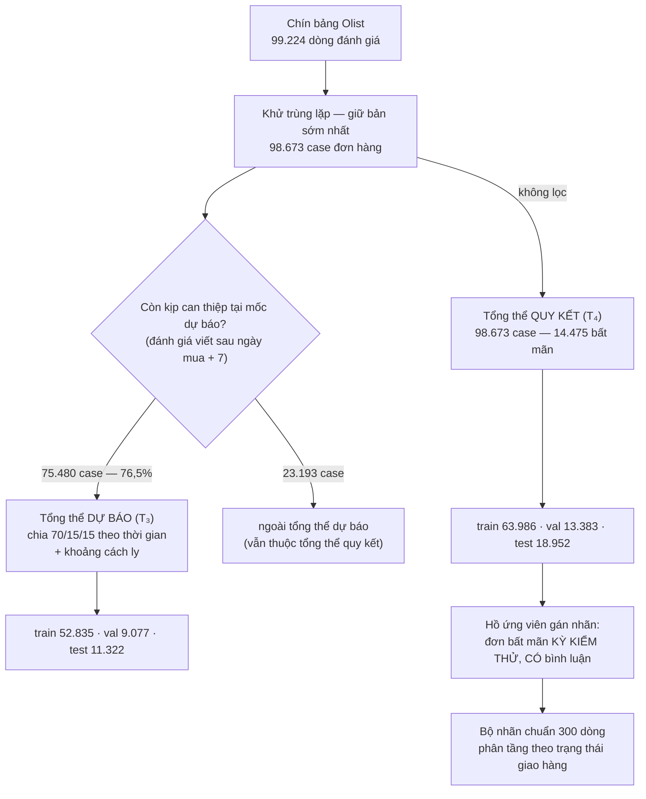

# PHỤ LỤC

---

# Phụ lục A — Thuật toán dự báo rủi ro tại mốc quyết định thứ nhất

## A.1 Phạm vi và cách đọc phụ lục này

Phụ lục này cung cấp **số liệu và công thức**; nó không lặp lại lập luận đã trình bày trong phần chính.
Người đọc muốn biết *vì sao* một quyết định thiết kế được đưa ra nên tra bảng dưới đây thay vì tìm câu
trả lời ở đây.

| Câu hỏi | Đọc ở |
|---|---|
| Vì sao mốc dự báo đặt tại ngày mua cộng bảy ngày | [§3.3](ch3-phuong-phap.md) |
| Vì sao chia tập theo thời gian và vì sao cần khoảng cách ly | [§3.5](ch3-phuong-phap.md) |
| Kết quả dự báo và cách diễn giải chúng | [§5.2–5.3](ch5-ket-qua-ban-luan.md) |
| Các lỗi phương pháp đã xảy ra trong quá trình xây dựng | [§5.6](ch5-ket-qua-ban-luan.md) |

Mọi con số trong phụ lục truy được về một tệp trong `data/v3/` và tái lập được bằng một lệnh; danh sách
đầy đủ nằm ở §A.9.

---

## A.2 Dữ liệu nguồn

### A.2.1 Chuỗi ghép bảng

Bộ dữ liệu gồm chín bảng quan hệ. Chuỗi ghép để dựng bảng đơn hàng như sau, và thứ tự phép nối là có ý
nghĩa: phép nối **inner** đầu tiên xác lập cỡ mẫu, mọi phép nối sau là **left** nên không làm mất dòng.

```
đánh giá (đã khử trùng lặp)
  ⨝ đơn hàng                inner   ← xác lập cỡ mẫu 98.673
  ⨝ dòng hàng (đã gộp)      left
  ⨝ đặc trưng người bán     left
  ⨝ đặc trưng thanh toán    left
  → tính đặc trưng theo mốc
```

### A.2.2 Khử trùng lặp đánh giá

Trong dữ liệu có **551 đơn hàng** mang nhiều hơn một bản ghi đánh giá. Quy tắc khử: sắp theo
`(mã đơn, thời điểm tạo, mã đánh giá)` rồi **giữ bản ghi sớm nhất**. Khóa phụ là mã đánh giá — nó tồn
tại để phá hòa một cách tất định khi hai bản ghi có cùng dấu thời gian.

Sau khử trùng lặp, đơn vị phân tích là **case đơn hàng** với tổng thể **98.673**.

### A.2.3 Không lọc theo trạng thái đơn

Bảng đơn hàng **không loại** đơn chưa hoàn tất. Có **2.841 đơn** *(2,88%)* chưa bao giờ được giao nhưng
vẫn có đánh giá, và tỷ lệ bất mãn của nhóm này là **77,9%** so với 12,8% ở nhóm đã giao.

Loại chúng đi là vứt bỏ đúng nhóm cần can thiệp nhất. Thay vào đó, trạng thái được mã hóa **tường minh**
qua đặc trưng `delivery_state` — xem §A.4.2.

### A.2.4 Nhãn

Nhãn nhị phân `is_dissatisfied` được định nghĩa là **điểm đánh giá từ hai sao trở xuống**. Ngưỡng ba
sao được dùng làm phân tích độ nhạy *([§5.3](ch5-ket-qua-ban-luan.md), Bảng 5.7)*, và kết luận không
đảo chiều giữa hai định nghĩa.

---

## A.3 Mốc quyết định thứ nhất và hai vế của nó

**Mốc dự báo được định nghĩa là ngày mua cộng bảy ngày**, một tham số cấu hình duy nhất.

Điểm cần nắm là một mốc quyết định ràng buộc **hai** thứ khác nhau, và hai vế được cưỡng chế bằng hai
cơ chế khác nhau.

**Bảng A.1.** Hai vế của ràng buộc mốc quyết định

| Vế | Câu hỏi nó trả lời | Cưỡng chế bởi | Kết quả |
|---|---|---|---|
| **Lược đồ** | đặc trưng nào **tồn tại** tại mốc | sổ đăng ký `available_at` + tách tệp vật lý | **16** đặc trưng |
| **Tổng thể** | đơn hàng nào **đã tới** mốc | điều kiện `thời điểm viết đánh giá > mốc` | **75.480 / 98.673** *(76,5%)* |

Vế thứ hai lọc bỏ những đơn mà khách hàng **đã viết đánh giá trước khi mốc tới**. Với những đơn ấy,
việc "dự báo" chỉ là đọc lại một kết cục đã xảy ra.

### A.3.1 Đánh đổi khi chọn mốc

Số liệu đầy đủ nằm ở [Bảng 3.5](ch3-phuong-phap.md). Điểm cần nhắc lại ở đây, vì nó dễ bị hiểu ngược:
**mốc bảy ngày không phải mốc cho tín hiệu mạnh nhất**. Hệ số lift còn tiếp tục tăng tới mốc mười ngày
*(2,39)* rồi mới giảm; tại mốc bảy ngày nó là **2,12**.

Mốc bảy ngày được chọn vì nó **cân bằng**: đẩy sang mười ngày mua thêm 0,27 đơn vị lift nhưng đánh mất
mười hai điểm phần trăm độ phủ, tương đương khoảng 1.700 đơn hàng bất mãn không còn kịp can thiệp.

---

## A.4 Danh mục đặc trưng

Feature set tại mốc dự báo gồm **16 đặc trưng**: mười hai đặc trưng biết ngay lúc đặt hàng, và bốn đặc
trưng mô tả tiến độ vận chuyển tính đến mốc.

### A.4.1 Mười hai đặc trưng biết ngay lúc đặt hàng

**Bảng A.2.** Đặc trưng nhóm thứ nhất

| Đặc trưng | Kiểu | Cách tính | Giá trị thiếu |
|---|---|---|---|
| `price` | số | tổng giá trị dòng hàng | giữ nguyên |
| `freight_value` | số | tổng phí vận chuyển | giữ nguyên |
| `freight_ratio` | số | `freight_value / (price + freight_value)` | mẫu số bằng 0 → thiếu |
| `n_items` | số | số dòng hàng trong đơn | giữ nguyên |
| `n_sellers` | số | số người bán khác nhau trong đơn | giữ nguyên |
| `category` | **hạng mục** | nhóm hàng của dòng hàng đầu tiên | điền `unknown` |
| `ships_in_days` | số | `hạn bàn giao cam kết − ngày mua` | giữ nguyên |
| `seller_distance_km` | số | khoảng cách vòng lớn giữa tâm mã bưu chính người bán và người mua, bán kính 6.371 km | giữ nguyên |
| `seller_prior_orders` | số | **số đơn trước đó** của người bán, đếm lũy tiến theo thời gian | 0 với đơn đầu tiên |
| `payment_installments` | số | số kỳ trả góp lớn nhất | giữ nguyên |
| `payment_sequences` | số | số lần thanh toán | giữ nguyên |
| `paid_by_credit_card` | luận lý | phương thức của giao dịch **có giá trị lớn nhất** là thẻ tín dụng | `False` |

Ba đặc trưng cần giải thích thêm.

**`seller_prior_orders` đếm lũy tiến theo thời gian, không phải đếm tổng.** Cách đếm tổng trên toàn bộ
dữ liệu sẽ dùng đơn hàng **tương lai** để dự báo đơn hàng hiện tại. Hai cách cho kết quả tương quan
**0,809**, và cách sai thổi phồng chỉ số PR-AUC thêm **0,005**. Phép sắp xếp trước khi đếm dùng thuật
toán ổn định với hai khóa phụ, nên kết quả tất định khi có trùng dấu thời gian.

**Khoảng cách người bán – người mua lấy trung vị làm tâm mã bưu chính**, không lấy trung bình. Trung vị
bền với những tọa độ ngoại lai vốn khá phổ biến trong dữ liệu định vị.

**Đơn có nhiều người bán được gộp theo trường hợp xấu nhất.** Nhóm này chiếm **1,3%** tổng thể. Quy
tắc: lấy khoảng cách **xa nhất**, hạn bàn giao **dài nhất**, và người bán **ít kinh nghiệm nhất**. Lấy
trung bình sẽ làm nhòe đúng tín hiệu rủi ro mà đặc trưng này tồn tại để nắm bắt.

### A.4.2 Bốn đặc trưng tiến độ vận chuyển — và kỹ thuật kiểm duyệt bên phải

Đây là mục kỹ thuật quan trọng nhất của phụ lục. Nó được trình bày theo trình tự ý tưởng trước, công
thức sau, bởi thuật ngữ *kiểm duyệt bên phải* vốn thuộc về phân tích sống còn và không phổ biến trong
văn liệu hệ hỗ trợ quyết định.

#### Bức ảnh chụp lúc ngày thứ bảy

Hãy hình dung đứng ở ngày thứ bảy sau khi khách đặt hàng và **chụp một bức ảnh** về tình trạng đơn
hàng. Thứ gì chưa xảy ra tính đến lúc bấm máy thì **không có trong bức ảnh** — không phải vì nó sẽ
không bao giờ xảy ra, mà vì tại thời điểm đó **ta chưa thấy được**.

Đó chính xác là tình huống của hệ thống khi ra quyết định. Nó phải quyết định **bây giờ**, với những gì
**đã quan sát được đến bây giờ**.

#### Vấn đề mà kỹ thuật này giải quyết

Đặc trưng có sức phân biệt mạnh nhất trong bài toán là **độ trễ giao hàng**. Nhưng với một đơn hàng
chưa được giao tại mốc, độ trễ ấy **chưa có giá trị**. Có hai cách xử lý hiển nhiên, và **cả hai đều
sai**:

**Cách sai thứ nhất — loại những đơn đó khỏi tập dữ liệu.** Tại mốc dự báo, **96,7%** số đơn trong tập
huấn luyện chưa được giao. Loại chúng đi thì còn lại 3,3%, và quan trọng hơn, đó chính là nhóm **ít rủi
ro nhất** — nhóm giao nhanh. Tập dữ liệu còn lại không đại diện cho tình huống mà hệ thống phải xử lý.

**Cách sai thứ hai — để trống giá trị.** Mô hình cây quyết định sẽ học được quy luật *"thiếu độ trễ
nghĩa là rủi ro cao"*, và quy luật ấy **đúng trên dữ liệu lịch sử**. Nhưng nó **không tồn tại lúc triển
khai**: khi hệ thống chạy thật, **mọi** đơn hàng đang chờ quyết định đều thiếu giá trị này. Mô hình sẽ
gán rủi ro cao cho tất cả, và mất hoàn toàn khả năng phân biệt.

#### Cách làm đúng — ghi lại chặn dưới, và nói rõ trạng thái

Nguyên tắc gồm hai phần:

1. **Ghi lại điều đã biết chắc tính đến mốc** thay vì để trống. Với đơn chưa giao, ta chưa biết nó sẽ
   trễ bao nhiêu, nhưng ta **biết chắc nó đã trễ ít nhất bao nhiêu**. Đó là một **chặn dưới** của giá
   trị thật.
2. **Nói rõ trạng thái bằng một cột riêng**, để mô hình phân biệt được *"đã giao và trễ hai ngày"* với
   *"chưa giao, và đã quá hạn hai ngày"* — hai tình huống rất khác nhau về mức rủi ro.

Ví dụ dẫn dắt: hàng chưa tới, hạn giao dự kiến là ngày thứ năm, hôm nay là ngày thứ bảy. Ta **chưa
biết** đơn này sẽ trễ bao nhiêu ngày, nhưng ta **biết chắc nó đã trễ ít nhất hai ngày**. Con số hai
được ghi lại, kèm ghi chú rằng nó là một chặn dưới chứ không phải giá trị cuối.

#### Ba đơn hàng thật minh họa

Bảng A.3 lấy ba đơn hàng thật từ tập huấn luyện, mỗi đơn một trạng thái.

**Bảng A.3.** Ba đơn hàng minh họa ba trạng thái tại mốc

| | Đơn thứ nhất | Đơn thứ hai | Đơn thứ ba |
|---|---|---|---|
| Ngày mua | 01/08/2018 | 27/07/2018 | 28/07/2018 |
| **Mốc quyết định** | 08/08/2018 | 03/08/2018 | 04/08/2018 |
| Hạn giao dự kiến | 08/08/2018 | 01/08/2018 | 03/08/2018 |
| Bàn giao vận chuyển | 06/08/2018 | 30/07/2018 | *chưa* |
| Giao tới khách | 08/08/2018 | *chưa tại mốc* | *chưa* |
| **`delivery_state`** | **0** — đã giao | **1** — đang vận chuyển | **2** — chưa bàn giao |
| `observed_delay_days` | **+0,77** | **+2,91** | **+1,78** |
| `days_to_deadline` | −0,88 | −2,91 | −1,78 |
| `observed_handover_days` | 4,77 | 2,68 | **7,00** — chặn tại biên |

Bảng A.4 cho thấy điều mà kiểm duyệt thực sự làm: nó ghi lại một **chặn dưới**, và chặn dưới ấy có thể
cách rất xa giá trị thật.

**Bảng A.4.** Giá trị ghi tại mốc đối chiếu với kết cục thật

| | Ghi tại mốc dự báo | Kết cục thật | Chênh lệch |
|---|---|---|---|
| Đơn thứ nhất | +0,77 ngày | +0,77 ngày | 0,00 — đã giao nên trùng |
| **Đơn thứ hai** | **+2,91 ngày** | **+7,05 ngày** | **+4,14** — chặn dưới thấp hơn hẳn |
| Đơn thứ ba | +1,78 ngày | *không bao giờ được giao* | — |

Đơn thứ hai là trường hợp điển hình. Tại mốc quyết định, hệ thống chỉ biết đơn này **đã quá hạn 2,91
ngày**; nó không biết — và không được phép biết — rằng cuối cùng đơn sẽ trễ 7,05 ngày. Nếu dùng con số
7,05 để huấn luyện, mô hình sẽ học từ thông tin chưa tồn tại tại thời điểm ra quyết định.

#### Công thức đầy đủ

```
mốc          = ngày_mua + 7 ngày
đã_giao      = giao_khách ≤ mốc           đã_bàn_giao = bàn_giao_3PL ≤ mốc

delivery_state         = 0 nếu đã_giao · 1 nếu đã_bàn_giao · 2 nếu còn lại
observed_delay_days    = giao_khách − hạn_dự_kiến    nếu đã_giao
                         mốc        − hạn_dự_kiến    nếu chưa      ← chặn tại mốc
days_to_deadline       = hạn_dự_kiến − mốc
observed_handover_days = bàn_giao_3PL − ngày_mua     nếu đã_bàn_giao
                         7,0                         nếu chưa      ← chặn tại biên
```

Điều kiện so sánh dùng **nhỏ hơn hoặc bằng mốc**, nên một sự kiện xảy ra sau mốc được coi như **chưa
xảy ra** — đúng nghĩa của bức ảnh chụp.

#### Ba đặc trưng kết cục bị hoãn sang mốc thứ hai

**Bảng A.5.** Đặc trưng kết cục đối chiếu với đặc trưng kiểm duyệt tương ứng

| Nếu dùng kết cục *(chỉ hợp lệ ở mốc thứ hai)* | Cái thực sự được ghi ở mốc thứ nhất |
|---|---|
| `delivery_delay_days` — độ trễ thật, biết sau khi giao | `observed_delay_days` — chặn dưới của nó |
| `carrier_handover_days` — thời gian bàn giao thật | `observed_handover_days` — chặn tại biên bảy ngày |
| `is_late` — có trễ hẹn hay không, biết sau khi giao | `delivery_state` — trạng thái quan sát được |

Ba đặc trưng bên trái đo **cùng hiện tượng** với ba đặc trưng bên phải, nhưng ở **thời điểm khác**.
Dùng chúng tại mốc dự báo là đưa thông tin tương lai vào mô hình.

#### Sức phân biệt của trạng thái giao hàng

**Bảng A.6.** Tỷ lệ bất mãn theo trạng thái tại mốc, tập huấn luyện

| `delivery_state` | Ý nghĩa | Số đơn | Tỷ lệ | Tỷ lệ bất mãn |
|---|---|---|---|---|
| 0 | đã giao trong bảy ngày | 1.756 | 3,3% | **7,74%** |
| 1 | đã rời kho, chưa tới khách | 43.872 | 83,0% | 15,16% |
| 2 | **chưa bàn giao đơn vị vận chuyển** | 7.207 | 13,6% | **37,10%** |

Tỷ lệ bất mãn **tăng đơn điệu** theo trạng thái, và nhóm cuối có tỷ lệ cao gấp gần **năm lần** nhóm
đầu. Đây là lý do `delivery_state` đứng đầu bảng độ quan trọng đặc trưng ở §A.7.

### A.4.3 Đặc trưng bị cấm và đặc trưng bị hoãn

**Bảng A.7.** Bảy đặc trưng bị cấm vĩnh viễn ở mọi mốc

| Đặc trưng | Lý do |
|---|---|
| `rating` · `is_dissatisfied` | **là nhãn**, không phải đặc trưng |
| `review_lag_days` | rò rỉ nhãn trực tiếp — chỉ tồn tại **sau khi** đánh giá đã viết |
| `has_comment` · `has_content` · `has_title` | sự hiện diện bình luận tương quan mạnh với nhãn: **76,6%** ở đánh giá một sao so với **31,2%** ở bốn sao; và tại mốc dự báo nó chưa tồn tại |
| `tier` | dẫn xuất trực tiếp từ `has_content` |

Danh sách này được cưỡng chế **ngay tại điểm khai báo**: mọi nỗ lực đăng ký một đặc trưng mang tên
trong danh sách sẽ làm chương trình dừng tại chỗ tạo ra lỗi, không phải ở nơi hậu quả xuất hiện.

Sáu đặc trưng khác **không bị cấm nhưng bị hoãn** sang mốc thứ hai: bốn đặc trưng kết cục giao hàng và
hai cột văn bản đánh giá.

#### ⚠️ Lớp phòng vệ thật nằm ở đâu

Điểm này cần nói rõ để tránh tạo ấn tượng sai về cơ chế.

Hàm lọc đặc trưng theo mốc **im lặng loại bỏ** cột không hợp lệ bằng phép lọc giao, chứ không ném lỗi.
Và ngoại lệ `LeakageError` tồn tại trong mã nguồn **trên thực tế không kích hoạt được** qua đường đi
bình thường, bởi điểm khai báo đã chặn tên bị cấm từ trước.

Vậy điều gì thực sự chặn rò rỉ? **Ba cơ chế, và không cơ chế nào trong số đó là kiểm tra lúc chạy:**

1. **Tách tệp vật lý** — tệp đặc trưng của mốc thứ nhất **không chứa** cột của mốc thứ hai. Một vi phạm
   không còn là lỗi im lặng mà trở thành thao tác *không nạp được cột*.
2. **Ghim danh sách cột tại lúc huấn luyện** — mô hình chỉ đọc đúng những cột nó đã học, kể cả khi được
   truyền một bảng rộng hơn.
3. **Ảnh chụp ma trận thiết kế** *(§A.4.5)* — biến hai cơ chế trên từ lập luận thành thứ mở ra xem được.

### A.4.4 Biến hạng mục và giá trị thiếu

Tại mốc dự báo có **đúng một** biến hạng mục là nhóm hàng. Nó được biểu diễn bằng kiểu hạng mục gốc của
thư viện xử lý dữ liệu, nên bộ học sử dụng **phép tách hạng mục nguyên bản** thay vì mã hóa one-hot.
Bảng mức được **ghim tại lúc huấn luyện** và sắp theo thứ tự từ điển; một mức chưa từng thấy ở tập kiểm
định hoặc kiểm thử trở thành **giá trị thiếu** thay vì bị lệch mã hóa.

Giá trị thiếu **được giữ nguyên**, không điền thay thế. Thuật toán xử lý chúng ở tầng gốc bằng cách học
hướng đi mặc định cho mỗi nút.

### A.4.5 Ảnh chụp ma trận thiết kế

Hai tệp sau chứa **đúng ma trận đã đi vào bộ học** và đúng ma trận đã dùng để hiệu chuẩn:

**Bảng A.8.** Ảnh chụp ma trận thiết kế

| Tệp | Số dòng | Số cột | sha256 *(16 ký tự đầu)* |
|---|---|---|---|
| `t3_design_train.parquet` | 52.835 | **16** | `363f2cd012e3f2a0` |
| `t3_design_val.parquet` | 9.077 | **16** | `e1b336a326d6afd8` |

Chỉ mục là mã đơn hàng — nó **không** được đưa vào mô hình, và việc để nó làm chỉ mục thay vì một cột
là có chủ đích: nếu nó là cột, chính phép kiểm dưới đây sẽ trở nên mơ hồ.

**Cách tự kiểm chứng không có rò rỉ:** mở một trong hai tệp, liệt kê tên cột, đối chiếu với sổ đăng ký
đặc trưng. **Không cột nào được mang mốc thứ hai.** Phép kiểm này mất khoảng ba mươi giây và không cần
đọc mã nguồn. Một kiểm thử tự động canh giữ đúng bất biến ấy.

---

## A.5 Chia tập, khoảng cách ly và tách tệp vật lý

### A.5.1 Chia theo thời gian

Phép chia dùng tỷ lệ **70/15/15** theo **phân vị số dòng** trên trường ngày mua, với mã đơn hàng làm
khóa phụ để phá hòa. **Không có nguồn ngẫu nhiên nào** trong toàn bộ quy trình chia.

Nghiên cứu dùng **ba tập chứ không phải hai**, và vai trò của từng tập là tách bạch:

| Tập | Vai trò | Được nhìn thấy khi nào |
|---|---|---|
| Huấn luyện | học mô hình và thống kê theo người bán | trong quá trình phát triển |
| **Kiểm định** | **hiệu chuẩn xác suất** và **suy thang rủi ro** | trong quá trình phát triển |
| Kiểm thử | **chỉ chấm điểm** | không bao giờ, cho tới khi báo cáo |

Hiệu chuẩn trên tập kiểm thử sẽ cho kết quả lạc quan giả — đó là lý do tập kiểm định tồn tại như một
tập riêng.

### A.5.2 Khoảng cách ly

Nhãn của một đơn hàng chỉ tồn tại vào lúc khách viết đánh giá, tức **muộn hơn** lúc mua. Một đơn mua
cuối kỳ huấn luyện nhưng có đánh giá đến giữa kỳ kiểm thử sẽ đưa thông tin của kỳ kiểm thử vào quá
trình huấn luyện.

Điều kiện cách ly: **thời điểm viết đánh giá phải sớm hơn ngày mua đầu tiên của kỳ kiểm thử**, tức
**31/05/2018**.

**Bảng A.9.** Số dòng bị loại bởi khoảng cách ly

| Tổng thể | Huấn luyện | Kiểm định | Tổng |
|---|---|---|---|
| Dự báo *(còn kịp can thiệp)* | 1 | 2.245 | **2.246** |
| Quy kết *(đầy đủ)* | 1 | 2.351 | **2.352** |

Hai con số khác nhau, và phụ lục ghi cả hai vì phép trừ kiểm chứng chỉ khớp khi dùng đúng con số của
đúng tổng thể. Chênh lệch **106 dòng** là những đơn không thuộc tổng thể dự báo nhưng thuộc tổng thể
quy kết, có đánh giá đến sau mốc cách ly.

**Một hệ quả không trung tính cần nêu rõ:** những dòng bị loại **không phải mẫu ngẫu nhiên**. Người
viết đánh giá muộn có tỷ lệ bất mãn cao hơn — **18,25%** ở phần bị loại so với **17,45%** ở phần giữ
lại. Chênh lệch này nhỏ, và đó chính là lý do phương án cách ly hiện tại được chọn thay vì một phương
án chặt hơn: phương án chặt hơn loại 5.789 dòng với tỷ lệ bất mãn **29,52%** so với 16,28%, tức nó cắt
bỏ đúng nhóm khó nhất mà **không mua được gì**.

### A.5.3 Kết quả chia tập

**Bảng A.10.** Ranh giới và quy mô ba tập

| Tập | Số đơn *(dự báo)* | Số đơn *(quy kết)* | Ngày mua từ | Đến | Tỷ lệ bất mãn |
|---|---|---|---|---|---|
| Huấn luyện | 52.835 | 63.986 | 04/09/2016 | 22/03/2018 | **17,90%** |
| Kiểm định | 9.077 | 13.383 | 22/03/2018 | 29/05/2018 | **14,82%** |
| Kiểm thử | 11.322 | 18.952 | 31/05/2018 | 17/10/2018 | **12,74%** |

Tỷ lệ bất mãn **giảm đơn điệu** qua ba kỳ. Đây là dịch chuyển phân phối thật theo thời gian, không phải
hiện tượng do cách chia tập tạo ra, và nó có hệ quả trực tiếp lên chất lượng hiệu chuẩn ở §A.6.2.

### A.5.4 Tách tệp vật lý

Chín tệp đặc trưng và nhãn được xuất với lược đồ rời nhau. Bất biến chống rò rỉ là **một chiều**: tệp
của mốc thứ nhất **không chứa** cột của mốc thứ hai.

**Bảng A.11.** Chín tệp, quy mô và mã băm

| Tệp | Số dòng | Số cột | sha256 *(16 ký tự đầu)* |
|---|---|---|---|
| `t3_train.parquet` | 52.835 | 17 | `fec6b5cd3037617d` |
| `t3_val.parquet` | 9.077 | 17 | `b8fc56d93961a545` |
| `t3_test.parquet` | 11.322 | 17 | `84ba0e15c18616d3` |
| `t4_train.parquet` | 63.986 | 23 | `12fe0067e3939345` |
| `t4_val.parquet` | 13.383 | 23 | `b224040c52b07ee6` |
| `t4_test.parquet` | 18.952 | 23 | `2ced570286c3e18b` |
| `y_train.parquet` | 63.986 | 9 | `799a71faa1d75ed2` |
| `y_val.parquet` | 13.383 | 9 | `11fd66fe726139d7` |
| `y_test.parquet` | 18.952 | 9 | `803416e4a88dc721` |

Tệp của mốc thứ nhất có **17 cột** = mã đơn hàng cộng 16 đặc trưng. Tệp nhãn mang tổng thể **đầy đủ**
vì nó phục vụ cả hai giai đoạn.

**Vì sao bất biến chỉ phát biểu một chiều.** Một bản trước phát biểu mạnh hơn — hai nhóm tệp có lược đồ
hoàn toàn rời nhau — nhưng điều đó buộc giai đoạn quy kết phải nối **inner** hai tệp, và tổng thể quy
kết bị kéo về theo tổng thể dự báo. Hậu quả: **12,6%** số đơn bất mãn biến mất khỏi tầng quy kết, đúng
nhóm được giao sớm mà khách vẫn không hài lòng.

---

## A.6 Thuật toán và tham số

### A.6.1 Bộ học và siêu tham số

Thuật toán nền là **cây tăng cường gradient** theo hiện thực LightGBM. Bảng A.12 trình bày **cả hai
trạng thái** — tham số được đặt tường minh và tham số để mặc định — bởi đây là cách trình bày trung
thực duy nhất: chỉ có **ba** siêu tham số học máy thực sự được chọn.

**Bảng A.12.** Siêu tham số của bộ học

| Đặt tường minh | Giá trị | Vai trò |
|---|---|---|
| `n_estimators` | 300 | số cây |
| `learning_rate` | 0,05 | tốc độ học |
| `num_leaves` | 31 | độ phức tạp mỗi cây |
| `random_state` | 20260809 | hạt giống, lấy từ một nguồn duy nhất |
| `n_jobs` | 1 | **đơn luồng — cơ chế tất định** |
| `deterministic` · `force_row_wise` | bật | khử biến thiên do song song |

| Để mặc định | Giá trị | Ghi chú |
|---|---|---|
| `min_child_samples` | 20 | |
| `reg_alpha` · `reg_lambda` | 0,0 | **không chính quy hóa** |
| `subsample` · `colsample_bytree` | 1,0 | **lấy mẫu con tắt** |
| `max_depth` | không giới hạn | chỉ bị chặn bởi `num_leaves` |
| `class_weight` · `scale_pos_weight` | không đặt | **mất cân bằng lớp không xử lý ở đây** |
| *dừng sớm* | **không dùng** | tập kiểm định chỉ dùng để hiệu chuẩn và suy ngưỡng |

**Hai điều phải nói thẳng.**

**Thứ nhất, mô hình chưa được tinh chỉnh siêu tham số.** Không tìm kiếm lưới, không tìm kiếm ngẫu
nhiên, không tối ưu Bayes, và không dừng sớm. Biện minh: mô hình dự báo là **năng lực nền dùng chung**
cho cả ba kiến trúc được so sánh, nên nó đóng vai trò **điều kiện kiểm soát** chứ không phải đối tượng
tối ưu hóa — nếu một kiến trúc có mô hình tốt hơn thì mọi khác biệt quan sát được sẽ không quy được cho
cách tổ chức. Nhưng biện minh ấy giải thích vì sao việc tinh chỉnh **không cần thiết cho câu hỏi
nghiên cứu**, chứ không nói rằng con số hiện tại là con số tốt nhất đạt được. Điều kiện để đưa một mô
hình đã tinh chỉnh vào hệ thống được đặc tả ở §A.11.

**Thứ hai, mất cân bằng lớp không được xử lý ở tầng bộ học.** Tỷ lệ dương dao động 12,74% đến 17,90%
tùy tập, và không có trọng số lớp, không lấy mẫu lại, không điều chỉnh tỷ lệ dương. Nó được xử lý **ở
hạ nguồn**, bằng ngưỡng quyết định tối ưu theo chi phí — xem §A.6.3.

### A.6.2 Hiệu chuẩn xác suất

Bộ hiệu chuẩn là **hồi quy đơn điệu**, khớp trên **tập kiểm định**. Lựa chọn phi tham số này phù hợp
khi chưa có giả thiết về dạng méo của xác suất đầu ra.

**Bảng A.13.** Chất lượng xác suất trên tập kiểm thử

| Chỉ số | Trước hiệu chuẩn | Sau hiệu chuẩn |
|---|---|---|
| Sai số hiệu chuẩn kỳ vọng | 0,0696 | **0,028** |
| Brier | 0,1136 | 0,1075 |
| Brier của hằng số bằng tỷ lệ nền | 0,1111 | — |
| **Brier skill** | **−0,0217** | **+0,0328** |

Hàng cuối là hàng quan trọng nhất, và nó **chỉ lộ ra khi đặt mô hình cạnh một hằng số**. Xác suất thô
**thua một hằng số bằng tỷ lệ nền**. Nếu chỉ báo cáo Brier thô, con số 0,1136 trông hoàn toàn bình
thường.

**Hệ quả thiết kế: hiệu chuẩn là bắt buộc chứ không phải tùy chọn.** Một phiên bản sau tái sử dụng mô
hình này mà bỏ qua bước hiệu chuẩn sẽ sinh ra xác suất không dùng được — và điều đó **không hiện ra ở
bất kỳ chỉ số xếp hạng nào**, bởi cả PR-AUC lẫn ROC-AUC đều bất biến với phép biến đổi đơn điệu.

Các chỉ số hiệu chuẩn đo trên **tập kiểm định** mang nhãn *đo trong mẫu — không dùng để báo cáo*, bởi
hiệu chuẩn rồi đo trên chính tập đã học sẽ cho sai số bằng không một cách giả tạo. Nhãn này được chèn
thẳng vào tên chỉ số trong tệp kết quả nên không thể trích nhầm.

### A.6.3 Thang rủi ro

Thang ba mức được **suy ra từ tập kiểm định** tại thời điểm huấn luyện và lưu ngay trong mô hình, chứ
không đặt cứng trong mã điều phối.

**Bảng A.14.** Hai ranh giới của thang rủi ro

| Ranh giới | Cách suy | Giá trị |
|---|---|---|
| Thấp / Trung bình | **ngưỡng tối ưu theo chi phí**, tỷ lệ bỏ sót trên can thiệp thừa là **5 trên 1**, vét cạn lưới độ phân giải 0,001 | **0,160** |
| Trung bình / Cao | **phân vị 95** của điểm đã hiệu chuẩn trên tập kiểm định | **0,3103** |

Một bất biến được kiểm ngay tại chỗ: hai ranh giới phải nằm trong khoảng đơn vị và ranh giới thấp phải
nhỏ hơn ranh giới cao; nếu suy biến, hệ thống trả về một thang dự phòng và điều đó được ghi nhận.

⚠️ **Tỷ lệ chi phí 5 trên 1 là một giả định nghiệp vụ do tác giả đặt**, không suy ra từ dữ liệu và
không kiểm chứng được bằng dữ liệu — bộ dữ liệu không chứa chi phí thật của một lần can thiệp hay một
lần bỏ sót. Nó được khai báo như một giả định và có thể tham số hóa. Thang rủi ro, tỷ lệ can thiệp, và
toàn bộ thang hành động ở [§5.5](ch5-ket-qua-ban-luan.md) đều phụ thuộc trực tiếp vào giả định này.

**Vì sao thang cố định trước đây sai.** Một bản trước dùng hai hằng số 0,40 và 0,70. Sau hiệu chuẩn,
điểm bám quanh tỷ lệ nền, nên băng thấp gom **97,52%** số case — thang mất hoàn toàn khả năng phân
biệt, và mọi case đều nhận cùng một mức ngân sách tính toán.

### A.6.4 Bộ phát hiện ngoài phân phối

Bộ phát hiện dùng **khoảng cách Mahalanobis** tới tâm tập huấn luyện trên mười lăm đặc trưng số. Ngưỡng
là **phân vị 99** của chính phân bố khoảng cách trên tập huấn luyện. Giá trị thiếu được điền bằng
**trung vị của tập huấn luyện**, ghim tại lúc khớp; ma trận hiệp phương sai được cộng một lượng nhỏ
trên đường chéo để luôn khả nghịch.

Lựa chọn này thay cho một bộ phát hiện dựa trên rừng ngẫu nhiên vì ba lý do: **tất định tuyệt đối**
*(không cần hạt giống)*, chi phí khoảng 0,1 mili giây nên không làm méo phép đo chi phí kiến trúc, và
giải thích được bằng một câu.

**Bảng A.15.** Tỷ lệ phát hiện

| Tập | Tỷ lệ phát hiện |
|---|---|
| Huấn luyện | 1,00% |
| Kiểm thử | 2,42% |
| Kiểm thử cộng nhiễu loạn 1 độ lệch chuẩn | **100%** |
| Kiểm thử cộng nhiễu loạn 2 độ lệch chuẩn | **100%** |
| Kiểm thử cộng nhiễu loạn 4 độ lệch chuẩn | **100%** |

Tỷ lệ trên tập huấn luyện đúng bằng mức mà ngưỡng phân vị 99 quy định; mức nhỉnh hơn ở tập kiểm thử là
một chỉ dấu định lượng của dịch chuyển phân phối đã nêu ở §A.5.3.

### A.6.5 Chín cơ chế bảo đảm tính tất định

**Bảng A.16.** Cơ chế tất định

| # | Cơ chế |
|---|---|
| 1 | Hạt giống lấy từ **một nguồn duy nhất**, gán cho mọi thư viện ngẫu nhiên |
| 2 | Bộ học chạy **đơn luồng** |
| 3 | Cờ tất định của bộ học được bật |
| 4 | Chiến lược xây histogram chọn cứng, không để thư viện tự dò theo phần cứng |
| 5 | Bảng mức hạng mục được **sắp thứ tự** trước khi ghim |
| 6 | Bộ hiệu chuẩn không có thành phần ngẫu nhiên |
| 7 | Lưới ứng viên ngưỡng đã khử trùng lặp và sắp thứ tự nên phá hòa tất định |
| 8 | Không dùng lấy mẫu con nên không cần hạt giống lấy mẫu |
| 9 | Cấm sinh định danh ngẫu nhiên trên toàn bộ mã nguồn, thay bằng hàm băm tất định |

---

## A.7 Độ quan trọng đặc trưng

Bảng A.17 báo cáo **hai** phép đo cạnh nhau. Lý do phải là hai chứ không phải một được giải thích ngay
sau bảng, và nó không phải một chi tiết kỹ thuật phụ.

**Bảng A.17.** Độ quan trọng đặc trưng, đo trên tập kiểm định *(9.077 đơn, PR-AUC gốc 0,2770)*

| Hạng | Đặc trưng | Mốc | Gain | Tỷ lệ gain | Số lần tách | **Permutation** | Độ lệch chuẩn |
|---|---|---|---|---|---|---|---|
| 1 | **`delivery_state`** | T₃ | 18.048 | **17,90%** | 112 | **0,04963** | 0,0039 |
| 2 | `n_items` | T₁ | 8.503 | 8,43% | 105 | 0,04322 | 0,0020 |
| 3 | `freight_value` | T₁ | 6.633 | 6,58% | 797 | 0,02161 | 0,0030 |
| 4 | `n_sellers` | T₁ | 1.191 | 1,18% | 53 | 0,02028 | 0,0008 |
| 5 | `observed_handover_days` | T₃ | 7.463 | 7,40% | 848 | 0,01910 | 0,0031 |
| 6 | `seller_prior_orders` | T₁ | 8.451 | 8,38% | 1.027 | 0,01771 | 0,0038 |
| 7 | `category` | T₁ | 10.442 | 10,36% | 1.001 | 0,01721 | 0,0020 |
| **8** | **`days_to_deadline`** | T₃ | 3.257 | 3,23% | 434 | **0,01245** | 0,0018 |
| **9** | **`observed_delay_days`** | T₃ | 5.384 | 5,34% | 709 | **0,01207** | 0,0021 |
| 10 | `seller_distance_km` | T₁ | 7.968 | 7,90% | 1.075 | 0,01171 | 0,0026 |
| 11 | `price` | T₁ | 6.431 | 6,38% | 807 | 0,01156 | 0,0020 |
| 12 | `ships_in_days` | T₁ | 7.286 | 7,23% | 909 | 0,01016 | 0,0027 |
| 13 | `freight_ratio` | T₁ | 7.635 | 7,57% | 778 | 0,00823 | 0,0030 |
| 14 | `payment_installments` | T₁ | 1.554 | 1,54% | 249 | 0,00350 | 0,0008 |
| 15 | `paid_by_credit_card` | T₁ | 347 | 0,34% | 51 | 0,00081 | 0,0008 |
| 16 | `payment_sequences` | T₁ | 231 | 0,23% | 45 | 0,00040 | 0,0005 |

Phép đo hoán vị lặp **hai mươi lần** cho mỗi đặc trưng, trên **điểm đã hiệu chuẩn** — tức chính đại
lượng mà hệ thống dùng để ra quyết định, không phải điểm thô của bộ học.

### A.7.1 Vì sao phải báo cáo hai phép đo

Hai đặc trưng của mốc thứ nhất — `observed_delay_days` và `days_to_deadline` — **cộng tuyến gần như
hoàn toàn**. Trên nhóm chưa được giao, chúng đúng bằng **cộng và trừ cùng một đại lượng**; nhóm ấy
chiếm **96,68%** tập huấn luyện. Tương quan trên toàn tập là **−0,9998**, và ngay trên nhóm đã giao nó
vẫn là **−0,9955**.

Với một cặp như vậy, **mọi** phép đo độ quan trọng đều hỏng — nhưng chúng hỏng theo **hai kiểu ngược
nhau**:

| Phép đo | Hỏng thế nào |
|---|---|
| **Gain và số lần tách** | **chia công lao tùy ý** giữa hai đặc trưng; cái nào được cây chọn trước thì ăn gần hết điểm |
| **Permutation** | **đánh giá thấp cả hai**; hoán vị một cái không làm giảm điểm vì cái còn lại vẫn mang nguyên thông tin đó |

Đặt cạnh nhau, hai phép **bộc lộ lẫn nhau**. Một đặc trưng có gain cao mà permutation gần bằng không là
dấu hiệu gần như chắc chắn của cộng tuyến, chứ không phải dấu hiệu nó vô dụng. Báo cáo một phép thôi sẽ
dẫn tới kết luận sai theo hướng này hoặc hướng kia.

Hai dòng số 8 và 9 trong Bảng A.17 minh họa đúng hiện tượng ấy: giá trị permutation của chúng gần bằng
nhau *(0,01245 và 0,01207)* và **đều thấp**, trong khi tổng gain của cả hai đạt 8,57% — công lao đã bị
chia đôi. **Không được đọc riêng lẻ hai dòng này.**

### A.7.2 Hai quan sát về cấu trúc thông tin tại mốc thứ nhất

**Trạng thái giao hàng thống trị cả hai phép đo.** Nó đứng đầu về gain *(17,90%)* và đứng đầu về
permutation với khoảng cách rõ rệt so với đặc trưng đứng sau. Điều này nhất quán với Bảng A.6: tỷ lệ
bất mãn tăng gần **năm lần** từ nhóm đã giao sang nhóm chưa bàn giao.

**Mốc thứ nhất chỉ bổ sung ba chiều thông tin mới, không phải bốn.** Đặc trưng `days_to_deadline` bằng
hạn giao dự kiến trừ ngày mua trừ bảy, mà cả hai mốc thời gian đều biết **ngay lúc đặt hàng**. Việc
khai báo nó thuộc mốc thứ nhất là **bảo thủ** — nó không gây rò rỉ — nhưng về mặt thông tin, nó thuộc
nhóm thứ nhất. Cộng thêm quan hệ cộng tuyến ở §A.7.1, phần thông tin **thực sự mới** mà mốc thứ nhất
mang lại là: trạng thái giao hàng, thời gian bàn giao quan sát được, và độ trễ quan sát được.

---

## A.8 Kết quả

Kết quả đầy đủ và phần bàn luận nằm ở [§5.2–5.3](ch5-ket-qua-ban-luan.md); mục này chỉ tóm tắt để phụ
lục đọc được độc lập.

**Bảng A.18.** Kết quả trên tập kiểm thử *(11.322 đơn)*

| Chỉ số | Giá trị | Khoảng tin cậy 95% |
|---|---|---|
| **PR-AUC** *(chính)* | **0,2381** | [0,2187 ; 0,2578] |
| ROC-AUC *(phụ)* | 0,6522 | [0,6374 ; 0,6667] |
| Tỷ lệ nền | 0,1274 | — |
| **Lift so với nền** | **1,87×** | — |

Khoảng tin cậy dựng bằng bootstrap phi tham số, 1.000 lần lặp, hạt giống cố định.

⚠️ **Độ chính xác thô không được dùng làm chỉ số chính**, và lý do được trình bày đầy đủ ở
[§5.2.2](ch5-ket-qua-ban-luan.md): tại điểm vận hành, độ chính xác là **69,02%** trong khi mốc tầm
thường *(đoán mọi đơn đều hài lòng)* đạt **87,26%**. Ngưỡng mặc định 0,5 vượt mốc tầm thường đúng
0,0018 điểm nhưng bỏ sót **97,6%** số đơn bất mãn.

---

## A.9 Quy trình tái lập

**Bảng A.19.** Bốn lệnh, từ dữ liệu thô đến kết quả

| Bước | Lệnh | Sinh ra |
|---|---|---|
| 1 | `python -m masdss.cli.export_features` | 9 tệp đặc trưng và nhãn cùng tệp kê khai |
| 2 | `python -m masdss.cli.train` | mô hình đã hiệu chuẩn · **2 ảnh chụp ma trận thiết kế** · 4 báo cáo |
| 3 | `python -m masdss.cli.run_evaluation` | chỉ số dự báo, điều kiện kiểm soát, chi phí |
| 4 | `python -m masdss.cli.feature_importance` | bảng độ quan trọng đặc trưng |

Đầu vào là chín tệp dữ liệu thô đặt trong thư mục dữ liệu gốc.

**Cách kiểm chứng kết quả tái lập đúng:** đối chiếu mã băm sha256 của các tệp sinh ra ở bước 1 và 2 với
Bảng A.11 và Bảng A.8. Toàn bộ chuỗi là **tất định** — cùng dữ liệu vào cho cùng mã băm ra.

⚠️ Số đo **thời gian xử lý** dùng đồng hồ hệ thống nên **không tất định** và không nằm trong phép đối
chiếu mã băm. Nó cũng không nằm trong tệp đầu ra chính tắc, nên không phá vỡ tính tái lập.

---

## A.10 Giới hạn khi diễn giải

**Bảng A.20.** Sáu giới hạn của tầng dự báo

| Giới hạn | Hệ quả |
|---|---|
| **Cộng tuyến** giữa hai đặc trưng tiến độ *(§A.7.1)* | Không đọc riêng lẻ độ quan trọng của từng cái; mốc thứ nhất chỉ bổ sung **ba** chiều thông tin mới |
| `observed_handover_days` **chặn tại biên bảy ngày** | **13,64%** số dòng nhận đúng giá trị 7,0, tạo một khối điểm dày đặc ở biên. Cây quyết định sẽ tách đúng tại đó, khiến đặc trưng này gần tương đương một biến chỉ báo trùng thông tin với trạng thái giao hàng |
| **Không tinh chỉnh siêu tham số** | PR-AUC là của một cấu hình mặc định, không phải cấu hình tốt nhất có thể — xem §A.11 |
| **Tỷ lệ chi phí 5 trên 1 là giả định đặt tay** | Thang rủi ro và toàn bộ thang hành động phụ thuộc trực tiếp vào nó, và nó không kiểm chứng được bằng dữ liệu hiện có |
| **Sức phân biệt khiêm tốn** | Điểm mạnh của tầng này nằm ở **kỷ luật đo lường** — đường đối chiếu hằng số, đánh dấu đo trong mẫu, khoảng cách ly — không nằm ở độ chính xác |
| Nhóm bị loại khỏi tổng thể dự báo **không ngẫu nhiên** | Nhóm ấy được giao sớm hơn trung bình 13,2 ngày và có văn bản nhiều hơn, nên tổng thể dự báo **lệch có hệ thống** so với tổng thể quy kết |

### A.10.1 Một vùng đặc trưng không có dữ liệu huấn luyện

Đặc trưng `days_to_deadline` **không bao giờ nhận giá trị âm** trong tập huấn luyện và tập kiểm định.

**Bảng A.21.** Phân bố `days_to_deadline` theo tập

| Tập | Số đơn đã quá hạn tại mốc | Tỷ lệ | Giá trị nhỏ nhất | Trung vị |
|---|---|---|---|---|
| Huấn luyện | **0** trên 52.835 | 0,00% | +0,01 | 18,13 |
| Kiểm định | **0** trên 9.077 | 0,00% | +0,00 | 17,16 |
| **Kiểm thử** | **159** trên 11.322 | **1,40%** | **−4,74** | 16,41 |

Nghĩa là tình huống *đơn hàng đã quá hạn giao ngay tại thời điểm ra quyết định* **hoàn toàn vắng mặt
trong dữ liệu huấn luyện** và chỉ xuất hiện ở kỳ kiểm thử. Nguyên nhân là hạn giao dự kiến được siết
chặt dần theo thời gian: trung vị giảm từ 18,13 xuống 16,41 ngày.

Hai hệ quả cần nêu:

1. **Mô hình chưa từng thấy vùng này.** Điểm rủi ro nó gán cho 159 đơn ấy là **ngoại suy**, không phải
   nội suy. Đây là một biểu hiện cụ thể và đo được của dịch chuyển phân phối đã nêu ở §A.5.3 — cùng
   hiện tượng khiến bộ phát hiện ngoài phân phối báo 2,42% ở tập kiểm thử so với 1,00% ở tập huấn luyện.
2. **Hai luật hành động phụ thuộc điều kiện này** *([§5.5](ch5-ket-qua-ban-luan.md), Bảng 5.14)*. Bản
   thân luật là luật ngưỡng nên không cần dữ liệu huấn luyện; nhưng vế *mức rủi ro cao* trong luật thứ
   nhất đến từ mô hình, và mô hình đang ngoại suy. Hệ số lift **4,332** của luật ấy đo trên **29 đơn** —
   cỡ mẫu nhỏ, trên một vùng không có dữ liệu nền.

---

## A.11 Giao thức thay thế mô hình dự báo

Việc tinh chỉnh siêu tham số và so sánh nhiều thuật toán được thực hiện ở một nhánh nghiên cứu riêng.
Mục này đặc tả **điều kiện để đưa một mô hình mới vào hệ thống** mà không phá các bảo đảm đã tuyên bố
trong luận văn.

### A.11.1 Giao thức ba bước

**Bảng A.22.** Vai trò của từng tập trong quy trình chọn mô hình

| Bước | Tập dùng | Việc | Điều **không** được làm |
|---|---|---|---|
| 1 | **Huấn luyện**, chia nội bộ **theo thời gian** | Tìm siêu tham số cho từng thuật toán | Không dùng chia ngẫu nhiên K phần — nó để phần sau huấn luyện cho phần trước |
| 2 | **Kiểm định** | Chọn thuật toán thắng | **Không tinh chỉnh ở đây.** Tập này đã gánh hai nhiệm vụ — hiệu chuẩn và suy thang rủi ro; thêm nhiệm vụ thứ ba sẽ cho ước lượng lạc quan |
| 3 | **Kiểm thử** | Chấm điểm **một lần duy nhất** | Không chọn lại sau khi đã thấy kết quả |

Chỉ số so sánh phải là **PR-AUC**, khớp với chỉ số chính đã công bố.

### A.11.2 Ba yêu cầu bắt buộc với mô hình thay thế

1. **Tất định** — cùng hạt giống cho cùng kết quả. Nếu dùng thư viện mới, phải kiểm điều này **trước**,
   bởi cổng kiểm tra tái lập của luận văn phụ thuộc trực tiếp vào nó.
2. **Phơi ra giao diện xác suất và nhận cùng ma trận thiết kế.** Nếu không, ba kiến trúc không thể dùng
   **chung một đối tượng** mô hình, và **giả thuyết về điều kiện kiểm soát mất hiệu lực** — kéo theo
   mọi so sánh kiến trúc trong Chương 5 mất cơ sở.
3. **Không tinh chỉnh trên tập kiểm thử** ở bất kỳ bước nào.

### A.11.3 Dây chuyền phải chạy lại khi thay

Đổi mô hình kéo theo đổi điểm rủi ro, đổi **thang rủi ro**, đổi hành động ở mốc thứ nhất, và cuối cùng
đổi mọi quyết định của hệ thống:

```
huấn luyện → đánh giá dự báo → bảng tập luật → quy kết nguyên nhân
           → tiêm lỗi → đóng lại cổng kiểm tra tái lập → bốn ablation
```

Kèm theo là cập nhật các mục §5.2, §5.3, §5.5, §5.8, §5.9 và §5.11 của Chương 5.

**Điều không thay đổi:** giả thuyết về điều kiện kiểm soát vẫn đứng vững nếu yêu cầu thứ hai được giữ;
và chất lượng quy kết nguyên nhân tại mốc thứ hai không đổi, bởi nó phụ thuộc bộ phân loại văn bản chứ
không phụ thuộc mô hình rủi ro.

---

# Phụ lục B — Kiến trúc phối hợp đa tác tử và cơ chế bảo đảm tính truy vết

## B.1 Luận điểm của phụ lục

Câu hỏi thiết kế của luận văn hỏi kiến trúc cần được xây dựng thế nào để chuỗi ra quyết định vẫn tạo ra
quyết định *truy vết được* và *trung thực về mức độ tin cậy*. Phụ lục này trình bày phần trả lời liên
quan tới vế thứ nhất, và luận điểm của nó có thể phát biểu gọn như sau:

> **Tính truy vết không đạt được bằng cách bổ sung một cơ chế ghi nhật ký, mà bằng cách làm cho trạng
> thái không truy vết được trở nên *không biểu đạt được*.** Điều này đòi hỏi bốn điều kiện độc lập,
> được cưỡng chế ở bốn tầng khác nhau của hệ thống; thiếu bất kỳ điều kiện nào thì ba điều kiện còn lại
> không đủ.

Luận điểm ấy được triển khai theo trình tự: §B.2 mô tả kiến trúc phối hợp để xác lập ngữ cảnh; §B.3
phân rã tính truy vết thành bốn điều kiện và chỉ ra cơ chế cưỡng chế cùng chế độ hỏng của từng điều
kiện; §B.4 tách **khả năng giải thích** ra khỏi **tính truy vết** và trình bày nó như một đại lượng
*đo được* thay vì một thuộc tính được tuyên bố; §B.5 nêu ranh giới hiệu lực.

**Loại bằng chứng.** Câu hỏi thiết kế là một mệnh đề **quy phạm** — nó phát biểu kiến trúc *nên* được
xây dựng thế nào — nên loại bằng chứng tương ứng là **demonstration**: một hiện thực vận hành được, có
cơ chế cưỡng chế và có thí nghiệm ablation, chứ không phải kiểm định thống kê. Đòi hỏi giá trị p cho
một mệnh đề quy phạm là nhầm loại claim, và lý do đầy đủ đã trình bày ở
[§3.6.2](ch3-phuong-phap.md).

---

## B.2 Kiến trúc phối hợp

### B.2.1 Bốn cơ chế điều phối

Tầng phối hợp gồm bốn cơ chế, mỗi cơ chế giải quyết một khía cạnh khác nhau của bài toán điều phối.
Bảng B.1 liệt kê chúng cùng vị trí hiện thực.

**Bảng B.1.** Bốn cơ chế điều phối và vai trò

| Cơ chế | Hiện thực tại | Vai trò |
|---|---|---|
| Định tuyến động theo trạng thái case | trường điều kiện của mỗi bước trong kế hoạch | bỏ qua bước không cần thiết cho case cụ thể |
| Giao thức đấu thầu hai pha có ràng buộc tài nguyên | mô-đun đấu thầu | phân bổ ngân sách tính toán giữa các tác tử phân tích |
| Bảng chung | mô-đun bảng chung | **một nguồn sự thật duy nhất** về trạng thái phiên |
| Cây giám sát | tầng chịu lỗi — **6 mô-đun, 447 dòng** | kiểm tra đầu ra · ngắt mạch · thang suy giảm · giám sát sức khỏe |

Cơ chế thứ ba đáng được nhấn mạnh vì nó là điều kiện cho phần còn lại của phụ lục: trạng thái phiên tồn
tại ở **đúng một nơi**, nên không có khả năng hai biểu diễn của cùng một tiến trình phân kỳ với nhau.

### B.2.2 Kế hoạch điều phối ở dạng dữ liệu

Kế hoạch điều phối được biểu diễn ở **dạng dữ liệu**, không phải mã điều khiển. Đây là một ràng buộc
thiết kế bắt buộc chứ không phải một lựa chọn phong cách, và nó phục vụ hai mục đích tách biệt.

Mục đích thứ nhất là **giảm rủi ro kỹ thuật**. Việc tự viết bộ điều phối mang theo nguy cơ hình thành
một máy trạng thái phức tạp khó kiểm chứng; ràng buộc *tuyến tính có điều kiện, không chu trình, không
nhánh lồng nhau* đóng khoảng hở đó ngay tại thiết kế. Giai đoạn quy kết gồm **bảy bước**, giai đoạn dự
báo gồm **ba bước** — cả hai đều nằm xa ngưỡng phức tạp mà một đồ thị thực sự trở nên cần thiết.

Mục đích thứ hai mang tính phương pháp: kế hoạch ở dạng dữ liệu **in ra được** như một artifact kiểm
tra được. Người đọc không phải suy ra trình tự điều phối từ mã nguồn; trình tự ấy là một giá trị đọc
được bằng mắt.

### B.2.3 Tô-pô hình sao là tiền đề, không phải chi tiết cài đặt

Mọi tác tử trao đổi với bộ điều phối; **không tác tử nào gọi trực tiếp tác tử khác**. Lựa chọn này
thường được trình bày như một quyết định về độ phức tạp, nhưng trong thiết kế này nó giữ một vai trò
mạnh hơn: nó là **điều kiện tiên quyết của tính đầy đủ** của nhật ký.

Lập luận rất ngắn. Nhật ký ghi lại các thông điệp đi qua bộ điều phối. Nếu tồn tại một kênh trao đổi
ngang giữa hai tác tử, những trao đổi trên kênh ấy **không xuất hiện trong nhật ký**, và một trace dựng
từ nhật ký sẽ khuyết đúng phần đó — khuyết một cách im lặng, không để lại dấu hiệu nào. Khi ấy mọi cơ
chế cưỡng chế ở §B.3 đều mất hiệu lực, bởi chúng bảo vệ tính toàn vẹn của một bản ghi vốn đã không đầy
đủ.

### B.2.4 Mười tác tử và bề mặt hỏng

Bảng B.2 phân nhóm mười tác tử theo tiêu chí có mặt ở kiến trúc đối chứng hay không. Phân nhóm này
không nhằm mô tả chức năng mà nhằm **định lượng chi phí kiến trúc**.

**Bảng B.2.** Phân nhóm tác tử theo sự hiện diện ở kiến trúc đối chứng

| Nhóm | Tác tử | Có ở kiến trúc đơn khối |
|---|---|---|
| Dùng chung *(5)* | dự báo · phân tích giao hàng · phân tích chất lượng · phân tích dịch vụ · áp dụng luật | có |
| Chỉ đa tác tử có *(5)* | tổng hợp bối cảnh · sinh đề xuất · phản biện · phân xử · quản lý hồ sơ | **không** |

Năm thành phần riêng có chính là đại lượng mà luận văn chọn làm **thước đo chi phí chính** của kiến
trúc: bề mặt hỏng **mười so với năm**. Lý do chọn đại lượng này thay cho độ trễ hoặc quy mô mã nguồn đã
trình bày ở [§5.9](ch5-ket-qua-ban-luan.md) — mili giây và dòng mã đo *quy mô công việc*, còn số thành
phần có thể hỏng đo *rủi ro đã tạo thêm*, tức đại lượng cùng đơn vị với lợi ích được tuyên bố.

Một chi tiết trong Bảng B.2 cần được nêu vì nó ảnh hưởng tới phép đếm: thành phần **quản lý hồ sơ**
không nằm trong kế hoạch điều phối của bất kỳ giai đoạn nào, nên nó không bao giờ được gọi. Một thành
phần không được gọi thì không thể hỏng, và việc đếm nó vào bề mặt hỏng là đếm thừa. Phát hiện này chỉ
lộ ra khi đọc nhật ký của một lượt chạy thật, không lộ ra khi đọc sơ đồ kiến trúc.

### B.2.5 Diễn tiến của một phiên xử lý

Bảng B.3 trình bày nhật ký thông điệp của một case thật tại mốc quy kết, trích nguyên trạng. Nó được
đưa vào đây để phần §B.4 có một đối tượng cụ thể để tham chiếu.

**Bảng B.3.** Nhật ký thông điệp của một case tại mốc quy kết

| Bước | Thông điệp |
|---|---|
| 1 | Điều phối → Tổng hợp bối cảnh *(yêu cầu)*; phản hồi mang bối cảnh case |
| 2 | Điều phối → Dự báo *(yêu cầu)*; phản hồi mang mức rủi ro và điểm rủi ro |
| 3 | Điều phối → **ba tác tử phân tích** *(lời gọi thầu)* — pha thăm dò |
| 4 | Ba tác tử → Điều phối *(đề xuất)* — **bản khai năng lực**: kỳ vọng 0,600 giá 1,6 ms · 0,500 giá 1,3 ms · 0,500 giá 1,3 ms |
| 5 | Điều phối → ba tác tử *(chấp nhận đề xuất)* — pha phân bổ |
| 6 | Phân tích giao hàng → Điều phối *(đề xuất)* — quy kết giao hàng, độ tin cậy 0,468 |
| 7 | Phân tích chất lượng → Điều phối *(đề xuất)* — quy kết chất lượng, độ tin cậy 0,214 |
| 8 | **Phân tích dịch vụ → Điều phối *(từ chối)*** — *"văn bản không có tín hiệu dịch vụ"* |
| 9 | Điều phối → Sinh đề xuất *(yêu cầu)*; phản hồi mang hành động ứng viên |
| 10 | Điều phối → Phản biện *(yêu cầu)*; phản hồi mang kết luận chất vấn và ràng buộc bị vi phạm |
| 11 | Điều phối → Áp dụng luật *(yêu cầu)*; phản hồi mang hành động, mã luật và lý do |

Toàn bộ phiên gồm **hai mươi hai dòng** nhật ký. Ba sự kiện mang ý nghĩa đặc thù của kiến trúc đa tác
tử nằm ở bước 4, bước 8 và bước 10: một **bản khai năng lực phát ra trước khi bất kỳ phép tính đắt tiền
nào được chạy**, một **lời từ chối kèm lý do**, và một **lần chất vấn của bộ phản biện**. Cả ba biến
mất hoàn toàn nếu chỉ quan sát quyết định cuối cùng — đó là nội dung của §B.4.

### B.2.6 Số đo phối hợp

Bảng B.4 báo cáo chi phí và lợi ích của việc phối hợp **cạnh nhau**. Việc báo cáo đồng thời là bắt buộc
theo thiết kế của chỉ số: một tầng phối hợp luôn tiêu tốn thông điệp, nên con số chi phí đứng một mình
không diễn giải được.

**Bảng B.4.** Chi phí và lợi ích của tầng phối hợp

| Cái giá | Giá trị | Lợi ích | Giá trị |
|---|---|---|---|
| Thông điệp mỗi case | 21,16 | Bản khai mỗi case *(pha thăm dò)* | 3,00 |
| Độ sâu cây hội thoại | 1,0 | Đề xuất thật mỗi case *(pha phân bổ)* | 1,30 |
| Thời gian **trong** các lời gọi năng lực | 12,33 ms | **Lời từ chối mỗi case** | **1,94** |
| | | Entropy đề xuất *(case có từ hai đề xuất)* | 0,8753 |
| | | Tỷ lệ đa nguyên nhân | 33,67% |

⚠️ Hàng thứ ba của cột cái giá là một **chặn dưới**, không phải chi phí toàn phần: nó chỉ tính phần
nằm bên trong các lời gọi năng lực, bỏ qua tầng điều phối và phần ghi nhật ký. Chi phí toàn phần đo
bằng đồng hồ treo tường nằm ở [§5.9.2](ch5-ket-qua-ban-luan.md) và lớn hơn con số này gần mười lần.

Con số đáng chú ý nhất là **1,94 lời từ chối mỗi case**. Nó có nghĩa: trung bình, gần hai trong ba tác
tử phân tích **nói rõ rằng mình không có bằng chứng** thay vì đưa ra một phỏng đoán. Với một hệ hỗ trợ
quyết định, đó là thông tin có giá trị vận hành trực tiếp, bởi nó cho người xử lý biết hệ thống đã cân
nhắc điều gì và đã loại bỏ điều gì.

---

## B.3 Bốn điều kiện của tính truy vết

Mệnh đề cần chứng minh là: **decision trace của mỗi case dựng lại được hoàn toàn từ nhật ký thông điệp,
không phụ thuộc bất kỳ tham số nào nằm ngoài nhật ký đó.**

Mệnh đề ấy đúng khi và chỉ khi bốn điều kiện dưới đây cùng đúng. Cách phân rã này không phải phân loại
sau khi làm xong: nó xuất phát từ việc liệt kê **các cách mà mệnh đề có thể sai**, và mỗi điều kiện
đóng đúng một cách sai.

**Bảng B.5.** Bốn điều kiện, cách chúng có thể bị vi phạm, và tầng cưỡng chế tương ứng

| Điều kiện | Vi phạm khi | Cưỡng chế ở tầng |
|---|---|---|
| **Đầy đủ** | tồn tại tương tác không đi qua nhật ký | **kiến trúc** — tô-pô hình sao |
| **Bất biến** | bản ghi bị sửa hoặc xóa sau khi ghi | **cơ sở dữ liệu** — ràng buộc kích hoạt |
| **Tự đủ** | phải có dữ liệu ngoài nhật ký mới diễn giải được | **chữ ký hàm** và **cấu trúc thông điệp** |
| **Định địa chỉ ổn định** | không tra được đúng phiên giữa hai lượt chạy | **sinh định danh** |

Bốn điều kiện độc lập với nhau theo nghĩa: thỏa ba điều kiện bất kỳ không kéo theo điều kiện thứ tư.
Bốn tiểu mục sau trình bày từng điều kiện theo cùng một cấu trúc — cơ chế, vị trí, kiểm thử canh giữ,
và chế độ hỏng nếu gỡ bỏ.

### B.3.1 Điều kiện đầy đủ

Điều kiện này được bảo đảm bởi **tô-pô hình sao**, đã lập luận ở §B.2.3. Nó là điều kiện duy nhất trong
bốn điều kiện **không** được cưỡng chế bằng một cơ chế chạy được, mà bằng một ràng buộc kiến trúc: hệ
thống đơn giản là không cung cấp kênh trao đổi ngang nào.

Cần nói rõ điểm này thay vì để nó ngầm định. Ba điều kiện còn lại có kiểm thử tự động canh giữ; điều
kiện đầy đủ thì không. Nếu một phiên bản sau bổ sung một kênh trao đổi trực tiếp giữa hai tác tử vì lý
do hiệu năng, **không có gì trong bộ kiểm thử hiện tại phát hiện ra**, và tính truy vết sẽ suy giảm
một cách im lặng. Đây là một điểm yếu đã biết của cơ chế cưỡng chế, và nó được nêu lại ở §B.5.

### B.3.2 Điều kiện bất biến

Nhật ký thông điệp được cưỡng chế **chỉ ghi thêm** ở tầng cơ sở dữ liệu. Hai ràng buộc kích hoạt chặn
lệnh cập nhật và lệnh xóa, phát sinh lỗi và hủy giao dịch.

Vị trí cưỡng chế là điểm cần chú ý. Ràng buộc đặt ở **tầng cơ sở dữ liệu** chứ không ở tầng ứng dụng,
nên nó chặn **mọi đường vào** — bao gồm một câu lệnh viết tay bởi người vận hành, hoặc một mô-đun tương
lai không biết về ràng buộc này. Đặt ràng buộc ở tầng ứng dụng chỉ bảo vệ được những lối vào mà tác giả
đã lường trước.

Kiểm thử canh giữ khẳng định cả hai lệnh đều bị từ chối trên một tệp nhật ký thật.

**Chế độ hỏng nếu gỡ bỏ:** một bản ghi sửa được thì không còn là bằng chứng. Sự khác biệt giữa *nhật ký
như một bản ghi lịch sử* và *nhật ký như một cấu trúc dữ liệu tiện dụng* nằm đúng ở ràng buộc này.

### B.3.3 Điều kiện tự đủ

Đây là điều kiện có cơ chế cưỡng chế đặc thù nhất, và nó gồm **hai** thành phần bổ trợ nhau.

#### Thành phần thứ nhất — ràng buộc chữ ký hàm

Hàm dựng trace nhận **đúng một tham số dữ liệu** là định danh phiên hội thoại. Nó không nhận case,
không nhận bảng chung, không nhận quyết định.

Ràng buộc này **chính là** nguyên lý thiết kế thứ tư, không phải một cách hiện thực nguyên lý ấy. Lập
luận: nếu hàm dựng trace chỉ đọc được nhật ký, thì trace **không thể** phân kỳ với hành vi thật, bởi
không tồn tại nguồn dữ liệu nào khác để phân kỳ về phía đó. Ngược lại, nếu hàm nhận thêm bất kỳ tham số
nào, một trace *có vẻ hợp lý* vẫn có thể được dựng lên từ dữ liệu ngoài nhật ký, và sự phân kỳ sẽ không
để lại dấu hiệu.

Kiểm thử canh giữ dùng cơ chế nội quan của ngôn ngữ để khẳng định danh sách tham số **đúng bằng** hai
phần tử — đối tượng và định danh phiên. Đây là dạng kiểm thử hiếm gặp, và nó tồn tại vì thứ cần bảo vệ
là **hình dạng của giao diện**, không phải hành vi của nó.

#### Thành phần thứ hai — tách nội dung ngữ nghĩa khỏi tham chiếu trong tiến trình

Mỗi thông điệp mang hai trường nội dung với vai trò tách bạch, trình bày ở Bảng B.6.

**Bảng B.6.** Hai trường nội dung của thông điệp

| Trường | Nội dung | Ghi vào nhật ký |
|---|---|---|
| Nội dung ngữ nghĩa | dữ liệu tuần tự hóa được, đủ để diễn giải thông điệp | **có** — và là thứ **duy nhất** hàm dựng trace đọc |
| Tham chiếu trong tiến trình | con trỏ tới đối tượng case trong bộ nhớ | **không bao giờ** |

Sự tách bạch này biến một quy ước thành một ràng buộc. Quy ước sẽ là: *"mọi thứ cần để dựng lại trace
nên được đặt vào trường ngữ nghĩa"*. Ràng buộc là: **trường tham chiếu không được ghi, nên nó không thể
trở thành một kênh thông tin ngầm.** Một tác tử cần điều gì đó để giải thích quyết định của mình thì
**buộc** phải đưa điều đó vào trường ngữ nghĩa — tức vào nhật ký — bởi không còn chỗ nào khác.

Kiểm thử canh giữ quét tệp nhật ký của một lượt chạy thật và khẳng định trường tham chiếu không xuất
hiện.

**Chế độ hỏng nếu gỡ bỏ.** Hai thành phần hỏng theo hai cách khác nhau, và đó là lý do cần cả hai. Gỡ
ràng buộc chữ ký hàm thì trace có thể được dựng từ nguồn khác. Gỡ sự tách bạch hai trường thì nhật ký
vẫn là nguồn duy nhất, nhưng nó **không còn đủ** — thông tin cần thiết trôi sang một kênh không được
ghi.

### B.3.4 Điều kiện định địa chỉ ổn định

Toàn bộ mã nguồn **không chứa lời gọi sinh định danh ngẫu nhiên nào**; định danh được sinh bằng hàm băm
tất định trên một không gian tên cố định, nên cùng đầu vào cho cùng định danh. Một kiểm thử quét toàn bộ
mã nguồn để canh giữ điều này.

Cùng lý do ấy, trường hạn chót của thông điệp được biểu diễn bằng **thời lượng** thay vì dấu thời gian
tuyệt đối. Dấu thời gian tuyệt đối kéo đồng hồ hệ thống vào nội dung thông điệp, khiến hai lượt chạy
sinh ra hai tệp khác nhau.

**Chế độ hỏng nếu gỡ bỏ.** Định danh phiên là khóa duy nhất để tra cứu trace. Nếu nó ngẫu nhiên, nhật
ký của từng lượt chạy vẫn đọc được và vẫn đầy đủ — nhưng **hai lượt chạy không đối chiếu được với
nhau**, và cổng kiểm tra tái lập sụp đổ. Điều kiện này vì vậy phục vụ đồng thời câu hỏi thiết kế và
điều kiện tái lập của toàn bộ nghiên cứu.

### B.3.5 Nghiệm thu

**Bảng B.7.** Cổng nghiệm thu cho tính truy vết

| | |
|---|---|
| Tiêu chí | decision trace dựng lại được **hoàn toàn từ nhật ký thông điệp**, không phụ thuộc tham số nào ngoài nhật ký |
| Phép kiểm | dựng trace **chỉ từ** định danh phiên trên một lượt chạy thật, khẳng định các tác tử chủ chốt đều xuất hiện |
| Trạng thái | **đạt** |

Cần phân biệt cổng này với bốn điều kiện ở trên. Bốn điều kiện là **cơ chế**; cổng là **phép nghiệm
thu** kiểm tra kết quả tổng hợp của chúng trên dữ liệu thật. Một cơ chế được cài đúng mà cổng vẫn đỏ
nghĩa là phân rã ở Bảng B.5 còn thiếu một điều kiện.

---

## B.4 Khả năng giải thích như một đại lượng đo được

### B.4.1 Vì sao đây là một thuộc tính khác với tính truy vết

Tính truy vết là thuộc tính **nhị phân và được cưỡng chế**: trace hoặc dựng lại được từ nhật ký, hoặc
không. Khả năng giải thích là thuộc tính **liên tục và phải đo**: cho một trace đầy đủ và trung thực,
nó nói được nhiều hơn một bản tóm tắt quyết định tới mức nào?

Hai thuộc tính không suy ra lẫn nhau. Một hệ thống có thể truy vết hoàn hảo mà nhật ký chỉ ghi đúng
quyết định cuối — khi ấy trace trung thực nhưng không giải thích được gì thêm. Vì vậy vế thứ hai đòi
một phép đo riêng, và phép đo ấy phải có dạng **ablation**: gỡ cơ chế, rồi đo cái mất.

### B.4.2 Thiết kế phép đo

Trên cùng một lượt chạy, decision trace được dựng theo **hai cách**:

- **Từ nhật ký** — đọc mọi thông điệp đã thực sự đi qua hệ thống.
- **Viết tay từ quyết định cuối** — cách mà một kỹ sư thông thường sẽ làm: đọc đối tượng quyết định rồi
  thuật lại. Đây không phải một rơm nhân tạo dựng lên để đánh bại; nó là dạng trace mà phần lớn hệ
  thống sản xuất thực sự có.

Chỉ số là **tỷ lệ sự kiện có trong nhật ký mà cách thứ hai không biểu diễn được**, chia theo **loại sự
kiện**. Việc chia theo loại là bắt buộc: một con số gộp sẽ che mất *loại thông tin nào* bị mất, mà đó
mới là phần mang ý nghĩa.

### B.4.3 Kết quả

**Bảng B.8.** Sự kiện trong nhật ký, phân theo khả năng biểu diễn — 300 hội thoại

| Loại sự kiện | Số lần | Trace viết tay biểu diễn được | Ý nghĩa bị mất |
|---|---|---|---|
| Hồ sơ case · lời gọi thầu · đề xuất · dự báo · bối cảnh · quyết định | 3.795 | có | — |
| **Bản khai năng lực** | 900 | **không** | tác tử tự khai kỳ vọng và giá **trước khi chạy** |
| **Kết quả phân bổ** | 900 | **không** | ai thắng, ai thua thầu |
| **Lời từ chối** | 526 | **không** | tác tử từ chối — **và lý do** |
| **Chất vấn của bộ phản biện** | 226 | **không** | ràng buộc nào bị nghi vi phạm |
| **Phân xử** | 43 | **không** | vì sao quyết định tự động bị thu hồi |
| **Tổng** | **6.390** | 3.795 biểu diễn được | **độ phân kỳ 40,61%** |

Đối chiếu cụ thể trên case đã trình bày ở Bảng B.3: trace dựng từ nhật ký gồm **hai mươi hai dòng**,
trong khi trace viết tay từ quyết định cuối gồm đúng **ba dòng** — mức rủi ro, nguyên nhân được quy
kết, và hành động được đề xuất.

### B.4.4 Phần bị mất không ngẫu nhiên

Đây là điểm mang ý nghĩa thiết kế, và nó không đọc được từ con số tổng.

Năm loại sự kiện không biểu diễn được **không phải một tập hợp tùy ý**. Chúng có chung một tính chất:
tất cả đều trả lời câu hỏi *vì sao hệ thống **không** chọn một phương án khác* — tác tử nào đã tự khai
là không đủ năng lực, tác tử nào bị loại khỏi phiên, tác tử nào từ chối và vì lý do gì, ràng buộc nào
bị nghi vi phạm, và vì sao một quyết định tự động bị thu hồi.

Trace viết tay **không sai ở những gì nó nói — nó thiếu ở những gì nó không thể nói.** Đối tượng quyết
định chỉ giữ **kết cục**; mọi thứ bị loại bỏ trên đường đi đều biến mất, và không có cách biểu diễn nào
cho chúng trong một bản tóm tắt kết cục.

Với một hệ **hỗ trợ quyết định** — nơi đầu ra là khuyến nghị cho một người xử lý chứ không phải một
hành động tự động — câu hỏi *"vì sao hệ thống không chọn phương án khác"* thường mang giá trị ngang câu
hỏi *"vì sao nó chọn phương án này"*. Đó là nội dung thực chất của nguyên lý thiết kế thứ tư, và
**40,61%** là cái giá đo được của việc bỏ nó.

---

## B.5 Ranh giới hiệu lực

Mục này nêu những điều mà kiến trúc **không** bảo đảm. Nó tồn tại vì một phụ lục chỉ trình bày ưu điểm
thì không kiểm chứng được.

### B.5.1 Giao thức đấu thầu không phân bổ gì trong cấu hình được báo cáo

Ràng buộc ngân sách tính toán đã được **tắt** trong cấu hình báo cáo; lý do và số liệu của phép đánh
đổi nằm ở [§5.11](ch5-ket-qua-ban-luan.md). Hệ quả đọc trực tiếp từ tệp báo cáo độ tin cậy được trình
bày ở Bảng B.9.

**Bảng B.9.** Trạng thái của giao thức đấu thầu trong cấu hình báo cáo

| Chỉ tiêu | Giá trị |
|---|---|
| Bản khai mỗi phiên | 3,00 |
| **Số tác tử thắng thầu mỗi phiên** | **3,00** |
| **Tỷ lệ bị loại** | **0,0%** |
| **Tỷ lệ phiên mà ngân sách thực sự ràng buộc** | **0,0%** |

Nghĩa là bài toán phân bổ **suy biến thành một hàm hằng**: mọi tác tử đủ điều kiện đều được gọi. Kéo
theo đó, pha thăm dò tiêu tốn **sáu trên 21,16** thông điệp mỗi case mà **không quyết định điều gì**.

Một đính chính cần thiết ở đây: bản trước phát biểu rằng performative dùng để **từ chối một đề xuất**
*"không bao giờ được phát"*. Phát biểu ấy **quá rộng**. Nó đúng trên đường khỏe, nhưng dưới tiêm lỗi
performative này vẫn được phát **1.200 lần**, tập trung ở đúng bốn kịch bản — sập và treo ở mức hai và
ba. Cơ chế như sau: khi một tác tử phân tích hỏng **ngay trong pha thăm dò**, bản khai của nó không
bao giờ tới nơi; vòng trao thầu lại duyệt theo **danh sách tác tử** chứ không theo danh sách bản khai,
nên tác tử vắng mặt vẫn nhận thông điệp từ chối. Kênh này vì vậy **đổi vai** thay vì chết: từ *"thua
thầu tài nguyên"* sang *"không khai báo được"*, và ở vai thứ hai nó mang một tín hiệu chẩn đoán có
thật.

Phản biện rằng kiến trúc này *thực chất chỉ là một ensemble được gắn nhãn giao thức* vì vậy **đúng ở
chiều phân bổ tài nguyên**, và luận văn thừa nhận điều đó thay vì che.

Nhưng phản biện ấy **không đúng ở chiều giải thích**, và lập luận đối lại có thể kiểm chứng bằng chính
Bảng B.8. Hai thứ mà giao thức đấu thầu vẫn mang lại trong cấu hình này — **bản khai năng lực phát ra
trước khi chạy phép tính đắt tiền** *(900 sự kiện)* và **quyền từ chối kèm lý do** *(526 sự kiện)* —
nằm gọn trong nhóm sự kiện mà trace thông thường không biểu diễn được. Nói cách khác, ở cấu hình được
báo cáo, thứ mà cơ chế đấu thầu đóng góp **không phải hiệu quả phân bổ, mà là khả năng giải thích**.

### B.5.2 Độ sâu cây hội thoại là hằng số theo cấu tạo

Tô-pô hình sao khiến mọi hội thoại chỉ có một tầng trả lời, nên độ sâu bằng **1,0** với mọi case. Đại
lượng này được báo cáo trong Bảng B.4 để đầy đủ, nhưng nó **không** nói gì về mức độ phối hợp và
**không** được dùng làm luận cứ ở bất kỳ đâu.

### B.5.3 Điều kiện đầy đủ không có kiểm thử tự động canh giữ

Như đã nêu ở §B.3.1, ba trong bốn điều kiện có kiểm thử canh giữ; **điều kiện đầy đủ thì không**. Nó
được bảo đảm bởi một ràng buộc kiến trúc — hệ thống không cung cấp kênh trao đổi ngang — chứ không bởi
một cơ chế phát hiện vi phạm.

Hệ quả thực tế: nếu một phiên bản sau bổ sung kênh trao đổi trực tiếp giữa hai tác tử, tính truy vết
suy giảm mà **không có gì báo**. Đây là điểm yếu nghiêm trọng nhất trong cơ chế cưỡng chế được trình
bày ở phụ lục này, và nó thuộc cùng một lớp với hai điểm yếu đã ghi nhận ở
**Phụ lục A §A.4.3**: một ràng buộc chỉ tồn tại dưới dạng quy ước thì
không phân biệt được với một ràng buộc đã bị vi phạm.

### B.5.4 Ba khiếm khuyết hiện thực còn mở

**Bảng B.10.** Khiếm khuyết ảnh hưởng tới cách diễn giải phụ lục này

| Khiếm khuyết | Hệ quả |
|---|---|
| Bộ hiệu chuẩn độ tin cậy **chưa được nối vào đường chạy chính** | Các tác tử khi đấu thầu vẫn phát **điểm thô**. Không được viết *"đề xuất đã được hiệu chuẩn"* ở bất kỳ đâu |
| Phạm vi giám sát **chưa đầy đủ** — hai trong bốn thành phần chưa nạp được phân phối tham chiếu | Kết quả về độ nhạy của bộ giám sát chỉ nói về phần bề mặt đã được phủ |
| Hai mức suy giảm trung gian **chưa cài** | Thang suy giảm nhảy thẳng từ mức thấp nhất sang mức cao nhất, nên phân bố mức suy giảm mất độ phân giải |

---

## B.6 Tổng hợp

**Bảng B.11.** Cơ chế, vị trí cưỡng chế, kiểm thử canh giữ và số đo

| # | Cơ chế | Tầng cưỡng chế | Có kiểm thử canh | Số đo |
|---|---|---|---|---|
| 1 | Tô-pô hình sao — tính **đầy đủ** | kiến trúc | **không** ⚠️ | — |
| 2 | Nhật ký chỉ ghi thêm — tính **bất biến** | cơ sở dữ liệu | có | — |
| 3 | Chữ ký một tham số — tính **tự đủ** *(a)* | giao diện | có | — |
| 4 | Tách nội dung ngữ nghĩa — tính **tự đủ** *(b)* | cấu trúc thông điệp | có | — |
| 5 | Định danh tất định — tính **định địa chỉ** | sinh định danh | có | cổng tái lập đạt |
| 6 | Cổng nghiệm thu tính truy vết | — | có | **đạt** |
| 7 | Độ phân kỳ trace *(ablation)* | — | — | **40,61%** |
| 8 | Chỉ số phối hợp | — | — | 21,16 thông điệp · **1,94 lời từ chối** · entropy 0,8753 |

Năm cơ chế đầu là **ràng buộc cưỡng chế**: chúng làm cho vi phạm trở nên *không biểu đạt được*, chứ
không phát cảnh báo khi bị vi phạm. Hai mục cuối là **phép đo**. Sự phân biệt này quan trọng khi đọc
kết quả: một ràng buộc cưỡng chế không có "kết quả" để báo cáo — nó hoặc đang có hiệu lực, hoặc đã bị
gỡ; còn một phép đo thì có giá trị và có thể thay đổi giữa các cấu hình.

Kết luận của phụ lục có thể phát biểu lại như sau. **Tính truy vết** trong kiến trúc này không nằm ở
một thành phần mà ở **bốn điều kiện độc lập được cưỡng chế tại bốn tầng khác nhau** — kiến trúc, cơ sở
dữ liệu, giao diện, và sinh định danh. Ba trong bốn có kiểm thử canh giữ; điều kiện thứ nhất thì không,
và đó là một điểm yếu đã được ghi nhận chứ không được bỏ qua.

**Khả năng giải thích** là một thuộc tính khác, và nó được **đo** chứ không được tuyên bố: một trace
dựng theo cách thông thường mất **40,61%** số sự kiện thật, và phần mất đi **không ngẫu nhiên** — nó
gồm đúng năm loại sự kiện trả lời câu hỏi *vì sao hệ thống không chọn phương án khác*.

---

# Phụ lục C — Dữ liệu

> **Ghi chú điều phối — không thuộc nội dung luận văn.** Bản thảo 17/08/2026, viết theo yêu cầu bổ
> sung một phụ lục dữ liệu *(người yêu cầu gọi là "Phụ lục 2"; bộ phụ lục hiện đánh chữ A/B nên bản
> này lấy chữ C — đổi tên là một thao tác một dòng)*. Nguồn: Chương 3 §3.2–§3.5, Phụ lục A §A.4–§A.5,
> `codebook.md` bản 3, và sổ tay đánh giá §7.

## C.1 Phạm vi và cách đọc phụ lục này

Phụ lục này là hồ sơ dữ liệu của luận văn: nó mô tả bộ dữ liệu và các thống kê khai phá ban đầu, đặc
trưng của giai đoạn dự báo cùng danh sách những gì bị loại và lý do, dữ liệu của giai đoạn quy kết,
và quy trình cùng quy tắc gán nhãn của bộ nhãn chuẩn. Giống Phụ lục A, nó cung cấp **số liệu và quy
tắc**, không lặp lại lập luận của phần chính; người đọc cần biết *vì sao* một quyết định được đưa ra
nên tra bảng dưới đây.

| Câu hỏi | Đọc ở |
|---|---|
| Vì sao chuỗi xử lý tách hai mốc quyết định | [§3.2.3, §3.3](ch3-phuong-phap.md) |
| Vì sao mốc dự báo đặt tại ngày mua cộng bảy ngày | [§3.3.3](ch3-phuong-phap.md) |
| Công thức từng đặc trưng và kỹ thuật kiểm duyệt bên phải | §A.4 |
| Vì sao chia tập theo thời gian, vì sao cần khoảng cách ly | [§3.5](ch3-phuong-phap.md) |
| Thiết kế cỡ mẫu bộ nhãn chuẩn | [§3.9](ch3-phuong-phap.md) |
| Chỉ số nào tính trên dữ liệu nào, có trích được không | [evaluation-handbook.md](../evaluation-handbook.md) |

## C.2 Bộ dữ liệu và khai phá ban đầu

### C.2.1 Nguồn dữ liệu và đơn vị phân tích

Nghiên cứu sử dụng bộ dữ liệu công khai *Brazilian E-Commerce Public Dataset by Olist*, gồm chín bảng
quan hệ mô tả đơn hàng thương mại điện tử tại Brazil giai đoạn 2016–2018, đã được ẩn danh tại nguồn
(Chương 3, Bảng 3.2 liệt kê chín bảng). Đơn vị phân tích của luận văn là **case đơn hàng**, không
phải dòng đánh giá thô: trong dữ liệu có 551 đơn mang nhiều hơn một bản ghi đánh giá, và sau khi khử
trùng lặp bằng quy tắc tất định *giữ bản ghi sớm nhất*, tổng thể còn **98.673 case** từ 99.224 dòng
thô. Mọi con số trong luận văn đếm theo case; sai lệch lớn nhất giữa hai đơn vị đếm là 0,56%.

### C.2.2 Đơn bất mãn — định nghĩa nhãn và thống kê nền

Nhãn kết cục của bài toán dự báo là khái niệm **đơn bất mãn**: một case được coi là bất mãn khi điểm
đánh giá của khách hàng **không quá hai sao** trên thang năm sao, tức `review_score ≤ 2`. Ngưỡng này
lấy hai mức thấp nhất của thang — nơi lời phàn nàn là tường minh — làm lớp dương; mức ba sao trở lên
được coi là không bất mãn. Vì mọi ngưỡng cắt trên thang thứ tự đều có phần quy ước, độ nhạy của kết
luận với định nghĩa nhãn được kiểm riêng: toàn bộ phép đo được lặp lại với ngưỡng `≤ 3`, và kết luận
không đảo chiều (sổ tay đánh giá §1.3). Bảng C.1 trình bày thống kê nền theo định nghĩa chính.

**Bảng C.1.** Thống kê mô tả nền trên 98.673 case đơn hàng

| Chỉ tiêu | Số case | Tỷ lệ | Ngưỡng cảnh báo đặt trước |
|---|---|---|---|
| Tổng số case có đánh giá | 98.673 | 100% | — |
| **Đơn bất mãn** *(một hoặc hai sao)* | **14.475** | **14,67%** | — |
| Bất mãn **có** nội dung bình luận *(tầng A)* | 10.823 | **74,77%** | — |
| Bất mãn **không có** nội dung bình luận *(tầng B)* | 3.652 | **25,23%** | trên 40% đáng lo; trên 50% xét lại phạm vi |
| Bất mãn không có cả nội dung lẫn tiêu đề | 3.547 | 24,50% | — |

Hai chi tiết của Bảng C.1 cần nói rõ. Thứ nhất, ngưỡng cảnh báo ở cột cuối được **đặt trước khi đo**:
nếu quá nhiều đơn bất mãn không có bình luận thì tầng phân tích văn bản mất đối tượng; tỷ lệ đo được
25,23% nằm dưới ngưỡng nên rủi ro đóng lại. Thứ hai, tiêu chí "có văn bản" tính theo cột nội dung
(`review_content`), không tính hợp của nội dung và tiêu đề: gộp cả tiêu đề chỉ thêm 105 đơn — 2.246
trong 2.351 đơn có tiêu đề thì cũng có nội dung — trong khi tiêu đề thường là cụm ngắn không mang
thông tin quy kết.

### C.2.3 Ba phát hiện khai phá định hình thiết kế

Ba phép đo khai phá dưới đây không phải thống kê trang trí; mỗi phép đo đã trực tiếp quyết định một
mảng thiết kế của nghiên cứu, và vì vậy chúng được ghi lại ở đây với số liệu đầy đủ.

**Thời điểm viết đánh giá bám sát sự kiện giao hàng.** Khoảng cách trung vị giữa lúc giao hàng và lúc
khách viết đánh giá là **6,2 giờ**, và **87,8%** số đánh giá được viết **trước** hạn giao dự kiến. Hệ
quả: mọi mốc quyết định neo vào sự kiện giao hàng đều chạy *sau* kết cục mà nó muốn dự báo, nên mốc
dự báo phải neo vào **ngày mua** (ràng buộc C3; hai lỗi phương pháp phát sinh từ điểm này được phân
tích ở §3.3.2).

**Toàn bộ chín bảng chỉ chứa sáu mốc thời gian** — mua, bàn giao đơn vị vận chuyển, giao tới khách,
hạn dự kiến, viết đánh giá, trả lời đánh giá. Không có phiếu hỗ trợ, đổi trả, hay lịch sử liên hệ. Hệ
quả: nguyên nhân về chất lượng sản phẩm và chất lượng phục vụ **không thể quan sát** trước khi đánh
giá được viết, và kiến trúc hai mốc quyết định là hệ quả bắt buộc của cấu trúc dữ liệu (ràng buộc C5).

**Tỷ lệ để lại bình luận theo mức sao có dạng chữ U.** Bảng C.2 cho thấy khách hàng viết khi cảm xúc
mạnh về cả hai phía, và tỷ lệ này **không đơn điệu** theo mức sao.

**Bảng C.2.** Tỷ lệ đánh giá có nội dung bình luận theo mức sao

| Mức sao | 1★ | 2★ | 3★ | 4★ | 5★ |
|---|---|---|---|---|---|
| Có nội dung | **76,54%** | 68,07% | 43,48% | 31,19% | **35,82%** |

Hệ quả kỹ thuật của Bảng C.2: **sự hiện diện của bình luận tự nó là tín hiệu mạnh về mức bất mãn**
(76,54% ở một sao so với 31,19% ở bốn sao), nên đặc trưng dạng "đơn này có bình luận hay không" là
một đặc trưng rò rỉ nhãn nếu lọt vào giai đoạn dự báo — nó bị cấm vĩnh viễn ở mục C.3.3.

Hình C.1 tổng hợp dòng chảy từ dữ liệu thô tới hai tổng thể và bộ nhãn chuẩn; các mục sau đi vào từng
nhánh.



**Hình C.1.** Từ dữ liệu thô tới hai tổng thể và bộ nhãn chuẩn. Tổng thể dự báo bị lọc theo điều kiện
còn kịp can thiệp; tổng thể quy kết giữ nguyên toàn bộ; hồ ứng viên gán nhãn chỉ sinh từ kỳ kiểm thử.

## C.3 Dữ liệu giai đoạn dự báo

### C.3.1 Tổng thể tại mốc dự báo

Mốc dự báo đặt tại **ngày mua cộng bảy ngày**; lập luận đánh đổi giữa độ phủ và cường độ tín hiệu
trình bày ở §3.3.3. Một mốc quyết định ràng buộc hai thứ: đặc trưng nào tồn tại, và đơn nào đã tới
được mốc. Vế thứ hai cho tổng thể dự báo: chỉ những đơn mà đánh giá được viết **sau** mốc mới còn kịp
can thiệp — **75.480 case (76,5%)**, phủ **12.656 trên 14.475 đơn bất mãn (87,4%)**. Con số 87,4% là
đại lượng bị đánh đổi khi dời mốc: lùi mốc về mười ngày mua thêm tín hiệu nhưng mất mười hai điểm
phần trăm độ phủ.

### C.3.2 Mười sáu đặc trưng

Feature set tại mốc dự báo gồm **16 đặc trưng**, chia hai nhóm: mười hai đặc trưng biết ngay lúc đặt
hàng, và bốn đặc trưng tiến độ vận chuyển tính đến mốc theo kỹ thuật kiểm duyệt bên phải. Bảng C.3
liệt kê gọn; công thức đầy đủ, cách xử lý giá trị thiếu và ba đơn hàng minh họa nằm ở §A.4.

**Bảng C.3.** Mười sáu đặc trưng của giai đoạn dự báo

| Nhóm | Đặc trưng | Ý nghĩa |
|---|---|---|
| Biết lúc đặt hàng | `price` · `freight_value` · `freight_ratio` | giá trị đơn, phí vận chuyển, tỷ trọng phí trên tổng |
| | `n_items` · `n_sellers` | số dòng hàng, số người bán trong đơn |
| | `category` | nhóm hàng *(biến hạng mục duy nhất)* |
| | `ships_in_days` | hạn bàn giao người bán cam kết trừ ngày mua |
| | `seller_distance_km` | khoảng cách người bán – người mua theo mã bưu chính |
| | `seller_prior_orders` | số đơn trước đó của người bán, **đếm lũy tiến theo thời gian** |
| | `payment_installments` · `payment_sequences` · `paid_by_credit_card` | cấu trúc thanh toán |
| Kiểm duyệt tại mốc | `delivery_state` | ba trạng thái: đã giao · đã rời kho người bán · chưa bàn giao |
| | `observed_delay_days` | độ trễ so với hạn dự kiến **quan sát được đến mốc** — chặn dưới của độ trễ thật |
| | `days_to_deadline` | số ngày còn lại tới hạn cam kết, âm nghĩa là đã quá hạn |
| | `observed_handover_days` | thời gian tới lúc bàn giao vận chuyển, chặn tại biên bảy ngày |

Nguyên tắc của nhóm thứ hai: với đơn chưa giao tại mốc, hệ thống **ghi lại điều đã biết chắc** (chặn
dưới của độ trễ) và **nói rõ trạng thái bằng cột riêng**, thay vì để trống — để mô hình không học quy
luật *"thiếu dữ liệu nghĩa là xấu"*, một quy luật đúng trên dữ liệu lịch sử nhưng sụp đổ lúc triển
khai vì khi đó mọi đơn đang chờ quyết định đều thiếu giá trị. Tại mốc, 96,7% đơn trong tập huấn luyện
chưa được giao, nên phương án "loại các đơn chưa giao" cũng bị bác: nó giữ lại đúng nhóm ít rủi ro
nhất. Sức phân biệt của cột trạng thái thể hiện ở Bảng C.4: tỷ lệ bất mãn tăng đơn điệu và nhóm chưa
bàn giao có tỷ lệ gấp gần năm lần nhóm đã giao.

**Bảng C.4.** Tỷ lệ bất mãn theo trạng thái giao hàng tại mốc, tập huấn luyện

| `delivery_state` | Ý nghĩa | Số đơn | Tỷ trọng | Tỷ lệ bất mãn |
|---|---|---|---|---|
| 0 | đã giao trong bảy ngày | 1.756 | 3,3% | **7,74%** |
| 1 | đã rời kho, chưa tới khách | 43.872 | 83,0% | 15,16% |
| 2 | chưa bàn giao đơn vị vận chuyển | 7.207 | 13,6% | **37,10%** |

Hai tính chất cấu trúc của feature set đo được khi khai phá và phải ghi lại vì chúng ảnh hưởng cách
diễn giải mô hình. Thứ nhất, hai đặc trưng `observed_delay_days` và `days_to_deadline` **gần cộng
tuyến hoàn toàn** — tương quan −0,9998, bằng nhau chính xác về trị tuyệt đối trên 96,68% số dòng — vì
với đơn chưa giao cả hai cùng suy từ hạn dự kiến và mốc; bốn đặc trưng kiểm duyệt vì vậy chỉ bổ sung
**ba** chiều thông tin mới. Thứ hai, vùng `days_to_deadline < 0` (đơn đã quá hạn ngay tại mốc) có
**0** dòng trong tập huấn luyện và kiểm định nhưng **159** dòng trong kỳ kiểm thử — mô hình **ngoại
suy** ở vùng này, và giới hạn đó được ghi ở §A.10.1.

### C.3.3 Đặc trưng bị loại và lý do

Đây là phần trả lời câu hỏi *"loại bỏ thông số nào, tại sao"*, và các đặc trưng bị loại chia làm hai
nhóm có bản chất khác nhau: nhóm **cấm vĩnh viễn ở mọi mốc** vì chúng là nhãn hoặc rò rỉ nhãn, và
nhóm **hoãn sang mốc quy kết** vì chúng hợp lệ nhưng chưa tồn tại tại mốc dự báo.

**Bảng C.5.** Đặc trưng bị cấm vĩnh viễn ở mọi mốc

| Đặc trưng | Lý do cấm |
|---|---|
| `rating` · `is_dissatisfied` | **là nhãn**, không phải đặc trưng |
| `review_lag_days` | rò rỉ nhãn trực tiếp — chỉ tồn tại **sau khi** đánh giá đã được viết |
| `has_comment` · `has_content` · `has_title` | chưa tồn tại tại mốc dự báo *(ràng buộc C4)*, và tương quan mạnh với nhãn: 76,54% đánh giá một sao có bình luận so với 31,19% ở bốn sao *(Bảng C.2)* |
| `tier` | dẫn xuất trực tiếp từ `has_content` |

**Bảng C.6.** Đặc trưng hoãn sang mốc quy kết

| Đặc trưng | Vì sao không dùng được ở mốc dự báo | Đặc trưng kiểm duyệt thay thế |
|---|---|---|
| `delivery_delay_days` — độ trễ thật | chỉ biết sau khi giao *(ràng buộc C3)* | `observed_delay_days` — chặn dưới |
| `carrier_handover_days` — thời gian bàn giao thật | như trên | `observed_handover_days` — chặn tại biên |
| `is_late` — cờ trễ hẹn | như trên | `delivery_state` — trạng thái quan sát được |
| `review_title` · `review_content` — văn bản đánh giá | xuất hiện cùng lúc với nhãn *(ràng buộc C4)* | không có — văn bản chỉ phục vụ mốc quy kết |

Ba đặc trưng kết cục ở Bảng C.6 đo **cùng hiện tượng** với ba đặc trưng kiểm duyệt tương ứng nhưng ở
**thời điểm khác**; dùng chúng tại mốc dự báo là đưa thông tin tương lai vào mô hình. Ngoài ra một
quyết định tính toán cùng loại đáng ghi: `seller_prior_orders` đếm **lũy tiến theo thời gian** thay
vì đếm tổng trên toàn bộ dữ liệu — cách đếm tổng dùng đơn tương lai để dự báo đơn hiện tại, và đo
được là nó thổi phồng chỉ số PR-AUC thêm 0,005.

Danh sách cấm được cưỡng chế ở **ba tầng**, không phó mặc cho trí nhớ: điểm khai báo đặc trưng chặn
mọi tên trong danh sách cấm và dừng chương trình tại chỗ; dữ liệu được **tách tệp vật lý** nên tệp
của mốc dự báo không chứa cột của mốc quy kết — một vi phạm trở thành thao tác *không nạp được cột*
thay vì lỗi im lặng; và **ảnh chụp ma trận thiết kế** (§A.4.5) lưu đúng 16 cột đã đi vào bộ học kèm
mã băm, với một kiểm thử tự động canh bất biến *không cột nào thuộc mốc quy kết*.

### C.3.4 Chia tập và khoảng cách ly

Dữ liệu được chia theo **thời gian**, không chia ngẫu nhiên: tỷ lệ **70/15/15** theo phân vị số dòng
trên trường ngày mua, khóa phụ là mã đơn hàng để phá hòa, và **không có nguồn ngẫu nhiên nào** trong
toàn bộ quy trình. Chia theo thời gian mô phỏng đúng tình huống triển khai — học từ quá khứ, dự báo
tương lai — và bảo vệ các thống kê theo người bán khỏi nhìn thấy tương lai. Ba tập có vai trò tách
bạch: huấn luyện để học mô hình, **kiểm định để hiệu chuẩn xác suất và suy thang rủi ro**, kiểm thử
chỉ để chấm điểm. Bảng C.7 trình bày ranh giới và quy mô trên cả hai tổng thể.

**Bảng C.7.** Ranh giới thời gian và quy mô ba tập trên hai tổng thể

| Tập | Số đơn *(dự báo)* | Số đơn *(quy kết)* | Ngày mua từ | Đến | Tỷ lệ bất mãn *(dự báo)* |
|---|---|---|---|---|---|
| Huấn luyện | 52.835 | 63.986 | 04/09/2016 | 22/03/2018 | **17,90%** |
| Kiểm định | 9.077 | 13.383 | 22/03/2018 | 29/05/2018 | **14,82%** |
| Kiểm thử | 11.322 | 18.952 | 31/05/2018 | 17/10/2018 | **12,74%** |

Tỷ lệ bất mãn **giảm đơn điệu** qua ba kỳ — 17,90% xuống 14,82% rồi 12,74%. Đây là dịch chuyển phân
phối thật theo thời gian, không phải hiện tượng do cách chia tạo ra; nó giải thích phần lớn khó khăn
hiệu chuẩn (§A.6.2) và cho bộ giám sát dịch chuyển một nhiệm vụ có thật.

Trên phép chia đó áp thêm **khoảng cách ly**: nhãn chỉ tồn tại lúc khách viết đánh giá — muộn hơn lúc
mua — nên mọi dòng huấn luyện và kiểm định có đánh giá đến **từ ngày mua đầu tiên của kỳ kiểm thử
(31/05/2018) trở đi** bị loại, mô phỏng đúng một mô hình được huấn luyện tại thời điểm bắt đầu kỳ
kiểm thử. Phép loại bỏ này cắt **1 dòng huấn luyện và 2.245 dòng kiểm định** trên tổng thể dự báo
(2.246 dòng; trên tổng thể quy kết là 2.352 — hai con số đều ghi trong tệp kê khai). Một hệ quả không
trung tính phải nêu: dòng bị loại **không phải mẫu ngẫu nhiên** — người viết đánh giá muộn bất mãn
nhiều hơn (18,25% so với 17,45% ở phần giữ lại). Chênh lệch này nhỏ, và đó chính là lý do phương án
cách ly hiện tại được chọn thay vì phương án chặt hơn: bản chặt hơn loại 5.789 dòng có tỷ lệ bất mãn
**29,52%** so với 16,28% — cắt đúng nhóm khó nhất — mà không mua được gì, vì một dòng huấn luyện có
đánh giá đến trong kỳ *kiểm định* không chứa thông tin nào về kỳ *kiểm thử*.

## C.4 Dữ liệu giai đoạn quy kết

Tổng thể của giai đoạn quy kết là **toàn bộ 98.673 case, không lọc** — bất đối xứng có chủ đích với
giai đoạn dự báo. Điều kiện vào giai đoạn này là *"đánh giá một hoặc hai sao đã về"*, không phụ thuộc
việc mốc dự báo có kịp thấy đơn đó hay không; nếu áp bộ lọc "còn kịp can thiệp" cho cả hai giai đoạn,
**1.819 trên 14.475 đơn bất mãn (12,6%)** biến mất khỏi tầng quy kết, và nhóm mất đi **không ngẫu
nhiên**: họ được giao sớm hơn trung bình 13,2 ngày và có văn bản nhiều hơn (81,6% so với 73,8%) — tức
phần lớn là khiếu nại *không do giao hàng*, đúng nhóm mà tầng quy kết tồn tại để xử lý.

Về đặc trưng, giai đoạn quy kết dùng **toàn bộ đặc trưng của giai đoạn dự báo cộng hai nhóm chỉ hợp
lệ từ mốc này**: các đặc trưng kết cục giao hàng và hai cột văn bản đánh giá (Bảng C.6). Trong hiện
thực, dữ liệu hai giai đoạn nằm ở hai nhóm tệp vật lý có lược đồ tách rời — tệp giai đoạn dự báo 17
cột (khóa đơn cộng 16 đặc trưng), tệp giai đoạn quy kết 23 cột, nhãn tách riêng ở nhóm tệp thứ ba
(Bảng A.11). Bất biến chống rò rỉ là **một chiều** — tệp mốc sớm không chứa cột mốc muộn — chứ không
phải hai nhóm rời nhau hoàn toàn, vì bản phát biểu hai chiều buộc giai đoạn quy kết nối *inner* với
tệp giai đoạn dự báo và kéo tổng thể quy kết co về theo tổng thể dự báo, tái tạo đúng sai lệch 12,6%
vừa nêu.

Trong tổng thể quy kết, bằng chứng văn bản khả dụng với **74,77%** đơn bất mãn (tầng A); phạm vi đề
tài giới hạn tầng quy kết ở nhóm này, và nhóm không có văn bản (tầng B, 25,23%) được tách riêng như
một giới hạn phạm vi phải khai báo — các bảng kết quả để trống ô tương ứng thay vì điền một con số
không kiểm định được.

## C.5 Bộ nhãn chuẩn: quy trình và quy tắc gán nhãn

### C.5.1 Vì sao phải có bộ nhãn do người gán

Dữ liệu không chứa trường nào ghi nguyên nhân bất mãn (ràng buộc C2). Nhãn nguyên nhân dùng trong
huấn luyện được sinh bằng luật từ khóa, và loại nhãn ấy **không bao giờ được dùng làm thước đo**: đo
trên nhãn từ khóa chỉ cho biết mô hình học thuộc bộ từ khóa tới mức nào. Vì vậy mọi chỉ số quy kết
được tính trên một **bộ nhãn chuẩn 300 đơn hàng do hai người gán độc lập**, và ranh giới giữa hai
loại nhãn được cưỡng chế bằng mã nguồn: hàm đánh giá quy kết từ chối nhãn yếu bằng ngoại lệ, và thuộc
tính nguồn gốc của bộ nhãn quyết định cờ `citable` của mọi bảng kết quả (mục C.5.6).

### C.5.2 Hệ nhãn: ba nguyên nhân, một nhãn dự phòng, đa nhãn

Hệ nhãn gồm ba nguyên nhân và một nhãn dự phòng, gán theo nguyên tắc **đa nhãn** — một đơn có thể
mang đồng thời nhiều nguyên nhân, người gán không bị ép chọn một. Bảng C.8 định nghĩa từng nhãn kèm
điều kiện gán.

**Bảng C.8.** Hệ nhãn nguyên nhân bất mãn

| Nhãn | Định nghĩa | Điều kiện gán |
|---|---|---|
| `delivery` — giao hàng | hàng không đến đúng, đủ, hoặc đúng hẹn | trễ hẹn · chưa nhận · thất lạc · giao sai địa chỉ · **giao thiếu số lượng** · hỏng do vận chuyển · phí vận chuyển trả cho dịch vụ không được cung cấp |
| `quality` — chất lượng sản phẩm | hàng **đã đến**, nhưng sai hoặc tệ | vỡ, lỗi, không hoạt động · sai chủng loại hoặc thuộc tính · khác mô tả · hàng giả · thiếu **bộ phận** của sản phẩm · "không đáng tiền" |
| `service` — chăm sóc khách hàng | **một lượt tương tác đã xảy ra và đã thất bại** | phải có bằng chứng tường minh rằng (a) khách **đã liên hệ** hoặc được liên hệ, **và** (b) lượt đó thất bại — không phản hồi, không giải quyết, bị từ chối |
| `unknown` — không xác định | bằng chứng không đủ để quy kết | cảm thán không nêu đối tượng · văn bản khen dù điểm thấp; khi gán `unknown` thì để trống ba nhãn còn lại |

Một nhãn thứ tư về **giá** từng tồn tại và đã bị gỡ, với lý do thuộc về logic giao dịch chứ không
phải cỡ mẫu: khách hàng đã xác nhận mua, tức đã đồng ý với giá và phí hiển thị lúc thanh toán, nên
một lời than *sau khi mua* không thể là về giá — nó luôn là về một cơ chế khác đã hỏng. Đọc lại toàn
bộ mười hai dòng từng gán nhãn giá xác nhận điều đó: mười dòng than về phí vận chuyển, hai dòng than
chất lượng không xứng số tiền. Từ đó một **quy tắc định tuyến lời than về tiền** thay cho nhãn giá,
trình bày ở Bảng C.9; câu hỏi định tuyến là *"cơ chế nào đã hỏng?"*, không phải *"có nhắc tới tiền
không?"*.

**Bảng C.9.** Định tuyến lời than về tiền

| Nội dung than phiền | Gán về | Vì sao |
|---|---|---|
| phí vận chuyển cao · trả phí mà phải tự đi lấy hàng · đòi hoàn phí chung chung | `delivery` | trả tiền cho một dịch vụ giao tận nhà **không được cung cấp** |
| "không đáng tiền" · chất lượng không tương xứng số tiền | `quality` | phán xét giá trị — chất lượng không xứng giá |
| đòi hoàn phí nhưng **không được phản hồi hoặc giải quyết** | `service` | vấn đề nằm ở xử lý sau bán, không ở phí |

### C.5.3 Lấy mẫu

Bộ nhãn cuối gồm **300 đơn bất mãn rút riêng từ kỳ kiểm thử** và thuộc tầng có bình luận. Điều kiện
*chỉ kỳ kiểm thử* là bài học trả giá: một bộ nhãn tạm trước đó có 199 trên 250 dòng nằm trong kỳ huấn
luyện, khiến mô hình rủi ro là trong-mẫu với chúng và phép đánh giá chuỗi hai tầng không hợp lệ; điều
kiện này nay được cưỡng chế bằng nguồn dữ liệu — hồ ứng viên chỉ sinh từ tệp kỳ kiểm thử, có kiểm thử
tự động canh quan hệ bao hàm. Cỡ mẫu 300 suy từ ba ràng buộc đồng thời (hệ số đồng thuận cần tối
thiểu 20 lượt gán dương cho nhãn hiếm nhất; sai số ước lượng độ nhạy; cỡ tối thiểu mỗi tầng — §3.9.1).
Mẫu được **phân tầng theo trạng thái giao hàng** kèm trọng số, trình bày ở Bảng C.10: tầng giao nhanh
mà khách vẫn bất mãn được lấy trọn vì nó thưa nhất nhưng mang nhiều thông tin nhất — với nhóm này
nguyên nhân gần như chắc chắn không phải giao hàng.

**Bảng C.10.** Phân tầng bộ nhãn chuẩn theo trạng thái giao hàng

| Tầng | Ý nghĩa | Số đơn lấy | Trọng số |
|---|---|---|---|
| 0 | giao nhanh mà khách vẫn bất mãn | **45** *(lấy trọn)* | 1,00 |
| 1 | đã rời kho người bán, chưa tới khách | 185 | 4,15 |
| 2 | người bán chưa gửi hàng | 70 | 4,21 |

Hiệu quả thiết kế của phương án phân tầng đạt 0,915, tương đương cỡ mẫu hiệu dụng 275 trên 300.

### C.5.4 Quy trình gán: độc lập, mù, và đọc qua bản dịch

Hai người gán làm việc **độc lập và mù**: tệp gán nhãn cố ý không chứa nhãn của vòng trước, không
chứa nhãn yếu sinh bằng từ khóa, và không chứa nguyên nhân mà hệ thống đã quy kết — nhìn thấy bất kỳ
thứ nào trong ba thứ đó sẽ neo phán đoán và làm hệ số đồng thuận cao giả tạo, trong khi bộ nhãn đang
được dùng để *chấm* hệ thống chứ không phải ngược lại. Mỗi dòng có thêm cột mức tự tin và cột ghi
chú, bắt buộc điền khi độ chắc chắn thấp hoặc nghi bản dịch có vấn đề.

Việc đọc bằng chứng đi qua **bản dịch tiếng Anh, giữ bản gốc tiếng Bồ Đào Nha bên cạnh để đối chiếu**.
Quy trình này là kết quả phân tích 102 dòng bất đồng của vòng gán đầu tiên: 75,2% bất đồng là *một
bên bỏ sót bằng chứng* chứ không phải khác định nghĩa — rào cản nằm ở ngôn ngữ, không ở hệ nhãn.
Nghiêm trọng hơn, 23,7% số dòng được cả hai người cùng gán `unknown` trong khi khoảng sáu phần mười
trong đó có nguyên nhân nêu tường minh; hai người cùng bỏ sót thì hệ số đồng thuận vẫn cao — **κ đo
độ tin cậy, không đo độ đúng**. Bản dịch vì vậy là một *công cụ đọc*, còn nhãn phải neo vào văn bản
gốc; bản dịch được đóng băng thành artifact có mã băm, các dòng có bản dịch ngắn hơn 60% bản gốc bị
đánh dấu nghi rớt mệnh đề, và việc đối chiếu một mẫu bản dịch với người biết tiếng Bồ được đặc tả như
một bước kiểm định công cụ đo, báo cáo ở phần giới hạn hiệu lực.

### C.5.5 Quy tắc quyết định khi gán nhãn

Codebook của nghiên cứu qua ba bản sửa; bản cuối gồm **một quy tắc bao trùm và sáu quy tắc quyết
định**. Quy tắc bao trùm — sinh ra để sửa đúng lỗi phổ biến nhất của vòng đầu — là: **quét hết mọi
câu trước khi kết luận `unknown`**; một đánh giá dài thường nêu nhiều hơn một vấn đề và mệnh đề quan
trọng có thể nằm cuối câu, sau một lời khen. Bảng C.11 tóm tắt các quy tắc còn lại.

**Bảng C.11.** Các quy tắc quyết định của codebook

| Quy tắc | Nội dung | Câu hỏi tự kiểm |
|---|---|---|
| 1 — số lượng và chủng loại | thiếu **món** thuộc `delivery`; sai **loại** hoặc thiếu **bộ phận** thuộc `quality` | *món khách cầm trên tay có đúng thứ họ đặt không?* |
| 2 — điều kiện của `service` | chỉ gán khi một lượt tương tác **đã xảy ra** và **đã thất bại**; mới *muốn* đổi trả thì chưa đủ | *có lượt liên hệ nào được nhắc tới không, và nó có thất bại không?* |
| 3 — ngưỡng đủ cụ thể | cảm thán không nêu đối tượng là `unknown`; nêu được đối tượng là nhãn tương ứng | *lời chê có đối tượng không — món hàng, việc giao, hay việc hỗ trợ?* |
| 4 — lời khen không hủy nguyên nhân | một mệnh đề tường minh về vấn đề là đủ để gán, dù phần còn lại là khen; ngược lại khía cạnh được khen thì không gán | — |
| 5 — đối chiếu bản gốc | liếc cột tiếng Bồ khi bản dịch ngắn hơn hẳn, vô nghĩa, hoặc khi định gán `unknown` cho một câu dài | — |
| 7 — định tuyến lời than về tiền | theo Bảng C.9 | *cơ chế nào đã hỏng?* |

Một quy tắc trong danh sách gốc — quy tắc 6, gán `delivery` cho đơn **không có bình luận** khi độ
trễ vượt ba ngày — đã bị **loại bỏ**, và lý do thuộc về phương pháp chứ không phải tiện lợi: quy tắc
ấy suy nhãn vàng từ chính đặc trưng cấu trúc mà hệ thống được chấm điểm cũng nhìn thấy, tức tạo ra
một vòng tròn tự tham chiếu ở đúng nơi bộ nhãn tồn tại để phá vòng tròn. Trực giác của hai người gán
— không có văn bản thì không quy kết — là đúng, và nhóm đơn không có bình luận được đặt ngoài phạm vi
như đã nêu ở mục C.4.

Bảng C.12 minh họa các quy tắc bằng những ví dụ biên lấy từ dữ liệu thật, ưu tiên chính các dòng mà
vòng gán đầu tiên đã sai.

**Bảng C.12.** Ví dụ biên và quy tắc áp dụng *(bằng chứng là bản dịch tiếng Anh)*

| Bằng chứng | Nhãn đúng | Quy tắc |
|---|---|---|
| *"the product I bought was not delivered, and I'm already paying for it"* | `delivery` | quy tắc bao trùm — cả hai người từng bỏ sót |
| *"I really like shopping here, but I still haven't received the product"* | `delivery` | 4 — lời khen không hủy nguyên nhân |
| *"I bought 3 lamps, only received 2. I opened a ticket and got no response."* | `delivery` + `service` | 1 + 2 |
| *"I ordered the Master model and they sent the Standard. I requested cancellation"* | `quality` | 1; **không** gán `service` — mới *yêu cầu* hủy |
| *"product more than a month old, no delivery forecast"* | `delivery` | 2 — không có lượt liên hệ nào để gán `service` |
| *"I would like to exchange the product"* | `unknown` | 3 — không nêu vấn đề gì |
| *"product broken on delivery"* | `delivery` + `quality` | vỡ **trong lúc giao** — hai cơ chế cùng hỏng |
| *"terrible"* | `unknown` | 3 — không nêu đối tượng |

### C.5.6 Hợp nhất hai bản gán và chất lượng của dụng cụ đo

Trước khi tính bất kỳ hệ số đồng thuận nào, một bước kiểm **tính độc lập** giữa hai bản gán được chạy
— vì κ giả định hai phép đo độc lập, và một vòng gán trước của nghiên cứu đã vi phạm giả định này với
hai tệp trùng ghi chú tới 96,4%, cho κ = 0,957 mà không đo được gì; bước kiểm này khi áp lên cặp tệp
đó đã chặn đúng nó. Ở vòng chính thức, tỷ lệ hàng nhãn trùng khớp giữa hai người là **77,7%** — đủ
khác biệt để giả định độc lập đứng vững.

Hai người bất đồng ở 67 trên 300 dòng (22,3%), và phân rã bất đồng quyết định quy tắc hợp nhất:
53,7% là một người thấy bằng chứng người kia bỏ sót, 43,3% cùng hướng nhưng khác số lượng nhãn, và
chỉ **3,0% là xung đột thật** về cách hiểu. Vì hầu hết bất đồng thuộc dạng bỏ sót — đúng chế độ lỗi
mà quy tắc bao trùm cảnh báo — quy tắc hợp nhất được chọn là **phép hợp (OR)**: một nhãn có mặt khi
ít nhất một người gán nó. Hệ quả phải khai báo ở giới hạn hiệu lực: với hai dòng xung đột thật, phép
hợp gán cả hai nhãn mâu thuẫn.

Hệ số đồng thuận được tính **theo từng nhãn** với quy tắc cỡ mẫu tối thiểu: nhãn có dưới 20 lượt gán
dương bị đánh dấu không đáng tin và loại khỏi trung bình nhưng vẫn nêu riêng — vì một nhãn cực hiếm
cho κ gần không hoặc âm ngay cả khi mức đồng ý gần tuyệt đối (nhãn giá ở vòng đầu: đồng ý 98,7%,
κ = −0,006). Ở vòng chính thức cả bốn nhãn đủ lượt gán dương; Bảng C.13 trình bày kết quả.

**Bảng C.13.** Hệ số đồng thuận Cohen κ theo nhãn, vòng chính thức

| Nhãn | `delivery` | `quality` | `service` | `unknown` | **Trung bình** |
|---|---|---|---|---|---|
| κ | 0,774 | 0,873 | 0,801 | 0,688 | **0,784** |

Mức κ trung bình 0,784 vượt ngưỡng 0,6 của cổng chất lượng G2, và cả bốn nhãn đều nằm trong vùng
đồng thuận đáng kể. Cần nhắc lại giới hạn nguyên tắc của chỉ số này: κ đo **độ tin cậy giữa hai người
gán**, không đo độ đúng của nhãn so với sự thật — độ đúng được bảo vệ bằng thiết kế quy trình (quy
tắc bao trùm, bản dịch được kiểm định, tệp mù) chứ không bằng một con số.

### C.5.7 Cưỡng chế nguồn gốc và ranh giới sử dụng

Bộ nhãn chuẩn mang thuộc tính nguồn gốc `human_independent`, và thuộc tính này — không có giá trị mặc
định trong kiểu dữ liệu — quyết định cờ `citable` lan truyền tới mọi bảng kết quả; một bộ nhãn tạm do
công cụ hỗ trợ sinh sẽ tự động lật mọi bảng sang không trích được. Hai chốt chặn giữ bộ nhãn đứng
ngoài quá trình huấn luyện: văn bản của 300 đơn trong bộ nhãn bị loại khỏi dữ liệu huấn luyện của bộ
phân loại nguyên nhân bằng danh sách loại trừ, và hàm đánh giá quy kết từ chối mọi lời gọi truyền
nhãn yếu. Bộ nhãn vì vậy đồng thời là thước đo và là tập kiểm thử độc lập: không dòng nào của nó từng
tham gia huấn luyện hay tinh chỉnh hệ thống.

## C.6 Tái lập

Toàn bộ dữ liệu của phụ lục này sinh lại được bằng bốn lệnh; ranh giới ngày, số dòng, danh sách cột,
tỷ lệ nền và mã băm của từng tệp được ghi trong tệp kê khai `data/v3/features/manifest.json`, và mã
băm chín tệp đặc trưng nằm ở Bảng A.11.

```bash
python -m masdss.cli.export_features    # 9 tệp đặc trưng + tệp kê khai (mục C.3, C.4)
python -m masdss.cli.merge_goldset --a data/v3/goldset/goldset_A_v3_final.csv \
                                   --b data/v3/goldset/goldset_B_v3_final.csv --rule union
python -m masdss.cli.build_goldset --source data/v3/goldset/gold_merged.csv \
                                   --provenance human_independent
python -m masdss.cli.check_goldset      # kiểm độc lập + κ + cổng G2 (mục C.5)
```
